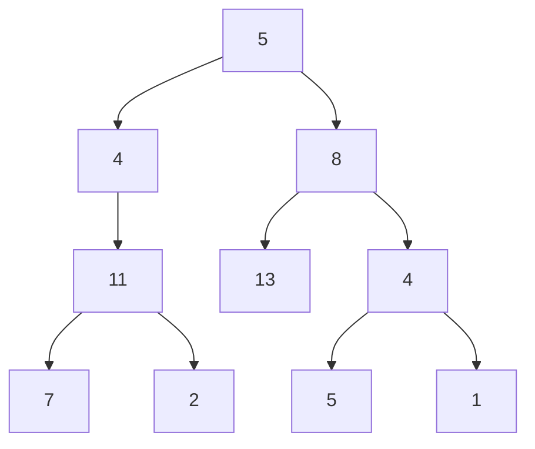

# Path Sum III

## Problem

You are provided with the `root` node of a binary tree and a target integer value `targetSum`. Your task is to count how many paths in the tree have node values that add up to exactly `targetSum`. This problem is trickier than standard tree path problems because paths can begin and end at any nodes in the tree, not necessarily at the root or leaf nodes.

The key constraints are that paths must follow a downward direction (you can only traverse from parent nodes toward their children, never moving upward or sideways), and you need to count all such paths, not just find one or report if any exist. For example, a path could start at any internal node and end at any descendant of that node, giving you many more possibilities than just root-to-leaf paths. Node values can be negative, which means you can't use early termination strategies that work with all-positive trees. Consider edge cases like a single-node tree where the node's value equals the target, or situations where multiple sub-paths along the same branch sum to the target.

**Diagram:**

Example tree with targetSum = 22:


Paths that sum to 22:
- 5 -> 4 -> 11 -> 2 (path sum: 22)
- 5 -> 8 -> 4 -> 5 (path sum: 22)
- 4 -> 11 -> 7 (path sum: 22)


## Why This Matters

This problem appears in financial transaction analysis systems that need to identify sequences of purchases or payments adding up to specific amounts for fraud detection or accounting reconciliation. When banks analyze transaction trees (where parent transactions trigger child transactions), they need to find all paths summing to target values to detect money laundering patterns or verify complex payment chains. File system analyzers use similar algorithms to find directory paths where cumulative file sizes reach specific thresholds, helping identify storage bottlenecks. The prefix sum optimization technique with hash maps that transforms this from an O(n²) brute force to O(n) solution is the exact same pattern used in "Subarray Sum Equals K" but applied to trees instead of arrays. This generalizes to any scenario where you need to find continuous subsequences (in trees, arrays, or linked lists) matching criteria while allowing negative values. Machine learning decision tree analysis uses this to identify feature paths that contribute specific amounts to predictions, and network packet analysis applies it to find transmission paths with certain cumulative properties.

## Examples

**Example 1:**
- Input: `root = [5,4,8,11,null,13,4,7,2,null,null,5,1], targetSum = 22`
- Output: `3`

## Constraints

- The number of nodes in the tree is in the range [0, 1000].
- -10⁹ <= Node.val <= 10⁹
- -1000 <= targetSum <= 1000

## Think About

1. What's the brute force approach? Why is it inefficient?
2. What property of the input can you exploit?
3. Would sorting or preprocessing help?
4. Can you reduce this to a problem you've seen before?

## Approach Hints

<details>
<summary>💡 Hint 1: Conceptual Understanding</summary>
Since paths can start at any node, you need to consider all possible starting points. The brute force approach is to run a DFS from every node to count paths starting at that node. This gives O(n²) time. Can you do better using prefix sums like in the Subarray Sum problem?
</details>

<details>
<summary>🎯 Hint 2: Prefix Sum Optimization</summary>
Maintain a running prefix sum from root to current node, and use a hash map to store counts of all prefix sums seen so far. If (current_sum - targetSum) exists in the map, those occurrences represent valid path endings. This is analogous to the two-sum pattern but applied to tree paths.
</details>

<details>
<summary>📝 Hint 3: DFS with HashMap</summary>
```
def pathSum(root, targetSum):
    prefix_count = {0: 1}  # Base case: empty path

    def dfs(node, current_sum):
        if not node:
            return 0

        current_sum += node.val
        # Count paths ending at current node
        count = prefix_count.get(current_sum - targetSum, 0)

        # Add current prefix sum to map
        prefix_count[current_sum] = prefix_count.get(current_sum, 0) + 1

        # Recurse on children
        count += dfs(node.left, current_sum)
        count += dfs(node.right, current_sum)

        # Backtrack: remove current prefix sum
        prefix_count[current_sum] -= 1

        return count

    return dfs(root, 0)
```
</details>

## Complexity Analysis

| Approach | Time Complexity | Space Complexity | Notes |
|----------|----------------|------------------|-------|
| Brute force DFS | O(n²) | O(h) | Check all paths from each node |
| Prefix sum with HashMap | O(n) | O(n) | Optimal - single pass with memo |
| DP with memoization | O(n²) | O(n²) | Overkill, harder to implement |

**Recommended approach**: Prefix sum with hash map for O(n) time.

## Common Mistakes

**Mistake 1: Not backtracking prefix sum counts**
```python
# Wrong: Prefix sums from one subtree affect another subtree
def pathSum(root, targetSum):
    prefix_count = {0: 1}

    def dfs(node, current_sum):
        if not node:
            return 0

        current_sum += node.val
        count = prefix_count.get(current_sum - targetSum, 0)
        prefix_count[current_sum] = prefix_count.get(current_sum, 0) + 1

        count += dfs(node.left, current_sum)
        count += dfs(node.right, current_sum)

        # Missing backtrack: prefix_count[current_sum] -= 1
        return count

    return dfs(root, 0)
```

```python
# Correct: Backtrack to maintain correct counts per path
def pathSum(root, targetSum):
    prefix_count = {0: 1}

    def dfs(node, current_sum):
        if not node:
            return 0

        current_sum += node.val
        count = prefix_count.get(current_sum - targetSum, 0)
        prefix_count[current_sum] = prefix_count.get(current_sum, 0) + 1

        count += dfs(node.left, current_sum)
        count += dfs(node.right, current_sum)

        prefix_count[current_sum] -= 1  # Backtrack
        return count

    return dfs(root, 0)
```

**Mistake 2: Forgetting base case in prefix map**
```python
# Wrong: Can't find paths starting from root
def pathSum(root, targetSum):
    prefix_count = {}  # Missing {0: 1} base case

    def dfs(node, current_sum):
        if not node:
            return 0

        current_sum += node.val
        # If targetSum == current_sum, won't be counted
        count = prefix_count.get(current_sum - targetSum, 0)
        prefix_count[current_sum] = prefix_count.get(current_sum, 0) + 1

        count += dfs(node.left, current_sum)
        count += dfs(node.right, current_sum)
        prefix_count[current_sum] -= 1

        return count

    return dfs(root, 0)
```

```python
# Correct: Initialize with {0: 1} for root-starting paths
def pathSum(root, targetSum):
    prefix_count = {0: 1}  # Represents empty path before root

    def dfs(node, current_sum):
        if not node:
            return 0

        current_sum += node.val
        count = prefix_count.get(current_sum - targetSum, 0)
        prefix_count[current_sum] = prefix_count.get(current_sum, 0) + 1

        count += dfs(node.left, current_sum)
        count += dfs(node.right, current_sum)
        prefix_count[current_sum] -= 1

        return count

    return dfs(root, 0)
```

**Mistake 3: Using brute force without optimization**
```python
# Wrong: O(n²) solution when O(n) is possible
def pathSum(root, targetSum):
    def count_paths_from(node, target):
        if not node:
            return 0
        count = 1 if node.val == target else 0
        count += count_paths_from(node.left, target - node.val)
        count += count_paths_from(node.right, target - node.val)
        return count

    if not root:
        return 0

    # Checks paths from every node
    return (count_paths_from(root, targetSum) +
            pathSum(root.left, targetSum) +
            pathSum(root.right, targetSum))
```

```python
# Correct: O(n) with prefix sum optimization
def pathSum(root, targetSum):
    prefix_count = {0: 1}

    def dfs(node, current_sum):
        if not node:
            return 0

        current_sum += node.val
        count = prefix_count.get(current_sum - targetSum, 0)
        prefix_count[current_sum] = prefix_count.get(current_sum, 0) + 1

        count += dfs(node.left, current_sum)
        count += dfs(node.right, current_sum)
        prefix_count[current_sum] -= 1

        return count

    return dfs(root, 0)
```

## Variations

| Variation | Difference | Key Insight |
|-----------|-----------|-------------|
| Path Sum I | Root to leaf only | Simple DFS, no hash map needed |
| Path Sum II | Return all root-to-leaf paths | DFS with path tracking, backtrack list |
| Subarray Sum Equals K | Array instead of tree | Same prefix sum technique |
| Binary Tree Maximum Path Sum | Max sum, any path | Track max globally, handle negative sums |
| Longest Path with Target Sum | Return length not count | Store path length in hash map |

## Practice Checklist

Use spaced repetition to master this problem:

- [ ] Day 1: Solve using prefix sum with hash map
- [ ] Day 2: Solve using brute force, compare performance
- [ ] Day 4: Implement without looking at notes
- [ ] Day 7: Solve and explain prefix sum intuition
- [ ] Day 14: Solve variations (subarray sum)
- [ ] Day 30: Speed test - solve in under 12 minutes

**Strategy**: See [Tree Pattern](../strategies/data-structures/trees.md)
