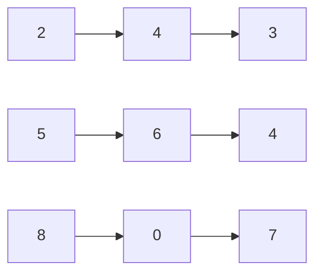

# Add Two Numbers II

## Problem

You receive two non-empty linked lists that each encode a non-negative integer. Unlike the standard version of this problem where digits are stored in reverse order, here the most significant digit (the leftmost digit) appears at the head of the list. Each node holds exactly one digit, and your task is to compute the sum of these two numbers and return the result as a linked list in the same format (most significant digit first).

For example, the number 243 is represented as `2 -> 4 -> 3`, and 564 is represented as `5 -> 6 -> 4`. Adding them gives 807, which should be returned as `8 -> 0 -> 7`. The tricky part is that addition works right-to-left (you start adding from the least significant digit to handle carries), but you can only traverse linked lists left-to-right. You need to find a way to process digits in reverse order without modifying the input lists. Assume neither number has leading zeros, except for the number 0 itself (represented as a single node with value 0). Edge cases include lists of different lengths and carries that create an extra digit at the front.

**Diagram:**

Example: Adding 243 + 564 = 807
```
l1:  2 -> 4 -> 3  (represents 243)
l2:  5 -> 6 -> 4  (represents 564)
              +
result: 8 -> 0 -> 7  (represents 807)
```

Visual representation:



## Why This Matters

This problem models arbitrary-precision arithmetic libraries used in cryptography, scientific computing, and financial systems where numbers exceed native integer sizes. When implementing RSA encryption or blockchain hashing, numbers can be thousands of digits long, far exceeding what standard 32-bit or 64-bit integers can hold. These systems represent large numbers as linked lists or arrays and implement addition, multiplication, and modular arithmetic from scratch. The stack-based reversal technique you'll develop is fundamental to any LIFO (Last-In-First-Out) processing scenario, appearing in calculator implementations that evaluate expressions, undo/redo systems in text editors, and browser history navigation. The pattern of using auxiliary data structures to transform traversal order (stacks for reverse, queues for reorder) is a core technique in compiler design for AST traversal and in serialization systems that need to process hierarchical data in different orders. Understanding pointer manipulation for result construction teaches you how to build data structures incrementally without knowing the final size upfront, a skill essential for stream processing and dynamic memory management.

## Examples

**Example 1:**
- Input: `l1 = [2,4,3], l2 = [5,6,4]`
- Output: `[8,0,7]`
- Note: 243 + 564 = 807

**Example 2:**
- Input: `l1 = [0], l2 = [0]`
- Output: `[0]`
- Note: 0 + 0 = 0

## Constraints

- The number of nodes in each linked list is in the range [1, 100].
- 0 <= Node.val <= 9
- It is guaranteed that the list represents a number that does not have leading zeros.

## Think About

1. What's the brute force approach? Why is it inefficient?
2. What property of the input can you exploit?
3. Would sorting or preprocessing help?
4. Can you reduce this to a problem you've seen before?

## Approach Hints

<details>
<summary>💡 Hint 1: Conceptual Understanding</summary>
Unlike "Add Two Numbers I" where digits are reversed, here the most significant digit comes first. Addition starts from the least significant digit (rightmost), but you can only traverse forward. You need a way to process digits in reverse order without reversing the lists. Stacks are perfect for this - push all digits onto stacks, then pop to get reverse order.
</details>

<details>
<summary>🎯 Hint 2: Stack-based Approach</summary>
Push all nodes from both lists onto two stacks. Then pop from both stacks simultaneously, adding values plus any carry from the previous step. Build the result list by inserting nodes at the head (to maintain most-significant-first order). This gives O(n) time and O(n) space.
</details>

<details>
<summary>📝 Hint 3: Algorithm Steps</summary>
```
1. Push all l1 nodes onto stack1
2. Push all l2 nodes onto stack2
3. Initialize carry = 0, result_head = None
4. While stack1 or stack2 or carry > 0:
   - val1 = stack1.pop() if stack1 else 0
   - val2 = stack2.pop() if stack2 else 0
   - total = val1 + val2 + carry
   - carry = total // 10
   - digit = total % 10
   - Create new node with digit
   - Insert new node at head of result
5. Return result_head

Alternative: Recursion with auxiliary info about list lengths
```
</details>

## Complexity Analysis

| Approach | Time Complexity | Space Complexity | Notes |
|----------|----------------|------------------|-------|
| Stack-based | O(n + m) | O(n + m) | n, m = list lengths, uses stacks |
| Reverse lists | O(n + m) | O(1) | Modifies input, reuses Add Two Numbers I |
| Recursion with lengths | O(n + m) | O(max(n, m)) | Elegant but recursion stack overhead |
| Convert to int | O(n + m) | O(max(n, m)) | Fails for very large numbers (overflow) |

**Recommended approach**: Stack-based for clarity and no input modification.

## Common Mistakes

**Mistake 1: Building result in wrong order**
```python
# Wrong: Appends to tail, giving reversed result
def addTwoNumbers(l1, l2):
    stack1, stack2 = [], []

    while l1:
        stack1.append(l1.val)
        l1 = l1.next
    while l2:
        stack2.append(l2.val)
        l2 = l2.next

    carry = 0
    head = None
    tail = None

    while stack1 or stack2 or carry:
        val1 = stack1.pop() if stack1 else 0
        val2 = stack2.pop() if stack2 else 0
        total = val1 + val2 + carry
        carry = total // 10

        new_node = ListNode(total % 10)
        if not head:
            head = tail = new_node
        else:
            tail.next = new_node  # Wrong: gives 7->0->8
            tail = new_node

    return head
```

```python
# Correct: Inserts at head for correct order
def addTwoNumbers(l1, l2):
    stack1, stack2 = [], []

    while l1:
        stack1.append(l1.val)
        l1 = l1.next
    while l2:
        stack2.append(l2.val)
        l2 = l2.next

    carry = 0
    head = None

    while stack1 or stack2 or carry:
        val1 = stack1.pop() if stack1 else 0
        val2 = stack2.pop() if stack2 else 0
        total = val1 + val2 + carry
        carry = total // 10

        new_node = ListNode(total % 10)
        new_node.next = head  # Insert at head
        head = new_node

    return head
```

**Mistake 2: Not handling different list lengths**
```python
# Wrong: Crashes when one list is shorter
def addTwoNumbers(l1, l2):
    stack1, stack2 = [], []

    while l1:
        stack1.append(l1.val)
        l1 = l1.next
    while l2:
        stack2.append(l2.val)
        l2 = l2.next

    carry = 0
    head = None

    while stack1 and stack2:  # Wrong: stops early
        total = stack1.pop() + stack2.pop() + carry
        carry = total // 10

        new_node = ListNode(total % 10)
        new_node.next = head
        head = new_node

    return head
```

```python
# Correct: Handles different lengths and final carry
def addTwoNumbers(l1, l2):
    stack1, stack2 = [], []

    while l1:
        stack1.append(l1.val)
        l1 = l1.next
    while l2:
        stack2.append(l2.val)
        l2 = l2.next

    carry = 0
    head = None

    while stack1 or stack2 or carry:  # Continue until all processed
        val1 = stack1.pop() if stack1 else 0
        val2 = stack2.pop() if stack2 else 0
        total = val1 + val2 + carry
        carry = total // 10

        new_node = ListNode(total % 10)
        new_node.next = head
        head = new_node

    return head
```

**Mistake 3: Converting to integer (overflow risk)**
```python
# Wrong: Integer overflow for very large numbers
def addTwoNumbers(l1, l2):
    def list_to_int(node):
        num = 0
        while node:
            num = num * 10 + node.val  # Overflow for 100+ digits
            node = node.next
        return num

    def int_to_list(num):
        if num == 0:
            return ListNode(0)
        head = None
        while num > 0:
            new_node = ListNode(num % 10)
            new_node.next = head
            head = new_node
            num //= 10
        return head

    sum_val = list_to_int(l1) + list_to_int(l2)
    return int_to_list(sum_val)
```

```python
# Correct: Digit-by-digit processing, no overflow
def addTwoNumbers(l1, l2):
    stack1, stack2 = [], []

    while l1:
        stack1.append(l1.val)
        l1 = l1.next
    while l2:
        stack2.append(l2.val)
        l2 = l2.next

    carry = 0
    head = None

    while stack1 or stack2 or carry:
        val1 = stack1.pop() if stack1 else 0
        val2 = stack2.pop() if stack2 else 0
        total = val1 + val2 + carry
        carry = total // 10

        new_node = ListNode(total % 10)
        new_node.next = head
        head = new_node

    return head
```

## Variations

| Variation | Difference | Key Insight |
|-----------|-----------|-------------|
| Add Two Numbers I | Digits in reverse order | Direct iteration, no stack needed |
| Multiply Two Numbers | Multiplication instead of addition | Use similar digit-by-digit with shifting |
| Subtract Two Numbers | Subtraction with borrow | Handle negative results, borrowing logic |
| Add Binary Strings | Binary instead of decimal | Same logic, use base 2 |
| Add K Linked Lists | More than 2 lists | Use priority queue or merge pairs |

## Practice Checklist

Use spaced repetition to master this problem:

- [ ] Day 1: Solve using stack-based approach
- [ ] Day 2: Solve using recursion with length tracking
- [ ] Day 4: Implement without looking at notes
- [ ] Day 7: Solve and trace through pointer updates
- [ ] Day 14: Solve variations (Add Two Numbers I, multiply)
- [ ] Day 30: Speed test - solve in under 10 minutes

**Strategy**: See [Linked List Pattern](../strategies/data-structures/linked-lists.md)
