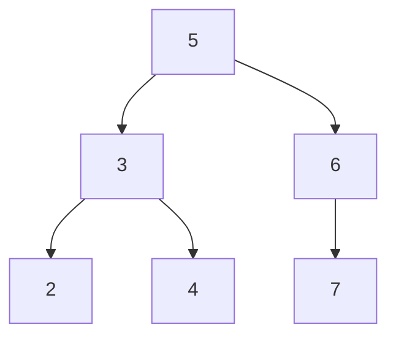
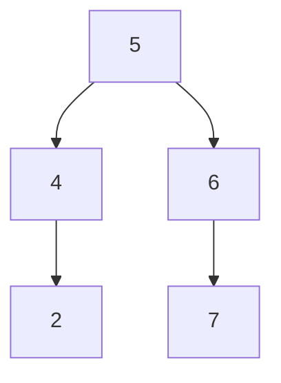

# Delete Node in a BST

## Problem

Given the root of a binary search tree (BST) and a target key value, delete the node containing that key while maintaining the BST property. A BST is a tree where for every node, all values in its left subtree are smaller and all values in its right subtree are larger. Return the root of the modified tree.

The challenge lies in handling three distinct deletion scenarios. When deleting a leaf node (no children), simply remove it. When deleting a node with one child, replace it with that child. The complex case involves deleting a node with two children: you must find either its inorder successor (the smallest value in its right subtree) or inorder predecessor (the largest value in its left subtree), swap values, then delete the successor or predecessor instead.

Note that the root itself might be deleted, meaning your function should return a potentially new root. Multiple valid BSTs can result from the same deletion, as you can choose between using the successor or predecessor strategy.


**Diagram:**

Original BST:


After deleting node with key = 3:


Alternative valid result (using different deletion strategy):


## Why This Matters

BST deletion appears in database indexing systems, file system management, and priority queue implementations where efficient insertion and removal are critical. Understanding this operation builds the foundation for self-balancing trees like AVL and Red-Black trees, which power everything from database indexes to memory allocators. The three-case analysis pattern used here transfers directly to more complex tree modifications, making this a cornerstone skill for systems programming and data structure design. This problem is frequently tested in technical interviews as it combines recursion, pointer manipulation, and edge case handling.

## Examples

**Example 1:**
- Input: `root = [5,3,6,2,4,null,7], key = 0`
- Output: `[5,3,6,2,4,null,7]`
- Explanation: Since no node has the value 0, the tree remains unchanged.

**Example 2:**
- Input: `root = [], key = 0`
- Output: `[]`

## Constraints

- The number of nodes in the tree is in the range [0, 10⁴].
- -10⁵ <= Node.val <= 10⁵
- Each node has a **unique** value.
- root is a valid binary search tree.
- -10⁵ <= key <= 10⁵

## Think About

1. What's the brute force approach? Why is it inefficient?
2. What property of the input can you exploit?
3. Would sorting or preprocessing help?
4. Can you reduce this to a problem you've seen before?

## Approach Hints

<details>
<summary>💡 Hint 1: Three Cases for Deletion</summary>

When deleting a node from a BST, there are three distinct cases to handle:
1. Node has no children (leaf) - simply remove it
2. Node has one child - replace the node with its child
3. Node has two children - find the inorder successor (smallest node in right subtree) or predecessor (largest in left subtree), replace the value, then delete the successor/predecessor

</details>

<details>
<summary>🎯 Hint 2: Recursive Approach</summary>

Use recursion to navigate the tree. If key < node.val, recursively delete from left subtree. If key > node.val, recursively delete from right subtree. If key == node.val, handle one of the three deletion cases. Always return the new subtree root after deletion, as the structure may change.

</details>

<details>
<summary>📝 Hint 3: Implementation Strategy</summary>

```
def deleteNode(root, key):
    if not root:
        return None

    if key < root.val:
        root.left = deleteNode(root.left, key)
    elif key > root.val:
        root.right = deleteNode(root.right, key)
    else:
        # Found the node to delete
        if not root.left:
            return root.right
        if not root.right:
            return root.left

        # Two children: find inorder successor
        successor = find_min(root.right)
        root.val = successor.val
        root.right = deleteNode(root.right, successor.val)

    return root
```

</details>

## Complexity Analysis

| Approach | Time Complexity | Space Complexity | Notes |
|----------|----------------|------------------|-------|
| Recursive Search + Delete | O(h) | O(h) | h = tree height, O(log n) balanced, O(n) skewed |
| Iterative Search + Delete | O(h) | O(1) | More complex but no recursion stack |
| Rebuild Tree | O(n) | O(n) | Inefficient: convert to array, delete, rebuild |

**Recommended approach:** Recursive deletion (O(h) time, O(h) space for call stack)

## Common Mistakes

### Mistake 1: Not handling the two-children case properly
**Wrong:**
```python
def deleteNode(root, key):
    if root.val == key:
        if root.left and root.right:
            # Wrong: directly replacing with right child loses left subtree
            return root.right
```

**Correct:**
```python
def deleteNode(root, key):
    if not root:
        return None

    if key < root.val:
        root.left = deleteNode(root.left, key)
    elif key > root.val:
        root.right = deleteNode(root.right, key)
    else:
        # One or no children
        if not root.left:
            return root.right
        if not root.right:
            return root.left

        # Two children: find successor
        successor = root.right
        while successor.left:
            successor = successor.left

        root.val = successor.val
        root.right = deleteNode(root.right, successor.val)

    return root
```

### Mistake 2: Forgetting to return the new root
**Wrong:**
```python
def deleteNode(root, key):
    if key < root.val:
        deleteNode(root.left, key)  # Wrong: not updating root.left
    elif key > root.val:
        deleteNode(root.right, key)  # Wrong: not updating root.right
```

**Correct:**
```python
def deleteNode(root, key):
    if not root:
        return None

    if key < root.val:
        root.left = deleteNode(root.left, key)  # Update pointer
    elif key > root.val:
        root.right = deleteNode(root.right, key)  # Update pointer
    # ... handle deletion case

    return root  # Always return root
```

### Mistake 3: Not handling edge case when root is deleted
**Wrong:**
```python
def deleteNode(root, key):
    # Assumes root is never deleted
    if root.val == key:
        # ... delete logic
        # Doesn't properly return new root
```

**Correct:**
```python
def deleteNode(root, key):
    if not root:
        return None

    if root.val == key:
        if not root.left:
            return root.right  # New root could be right child
        if not root.right:
            return root.left   # Or left child
        # ... handle two children

    # ... continue recursion
    return root
```

## Variations

| Variation | Difficulty | Key Difference |
|-----------|-----------|----------------|
| Insert into BST | Easy | Add node instead of delete |
| Search in BST | Easy | Just find, don't modify |
| Delete and Return Deleted Node | Medium | Return both modified tree and deleted node |
| Delete All Nodes with Value | Medium | Delete multiple occurrences |

## Practice Checklist

- [ ] First attempt (after reading problem)
- [ ] Understood three deletion cases
- [ ] Implemented recursive solution
- [ ] Handled edge cases (empty tree, root deletion)
- [ ] Tested with all three cases (leaf, one child, two children)
- [ ] Verified BST property maintained
- [ ] Reviewed after 1 day
- [ ] Reviewed after 1 week
- [ ] Could explain solution to others
- [ ] Comfortable with variations

**Strategy**: See [Tree Pattern](../strategies/data-structures/trees.md)
