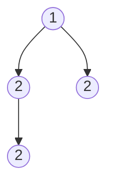

# Find Mode in Binary Search Tree

## Problem

You're given the root of a binary search tree that may contain duplicate values. Your task is to find all mode values—the values that appear most frequently in the tree. A mode is the value with the highest frequency count. If multiple values tie for the highest frequency, return all of them in any order.

In statistics, the mode represents the most common value in a dataset. For example, in the dataset [1, 2, 2, 3, 3, 3], the mode is 3 because it appears three times, more than any other value.

Here's what makes this problem interesting: BSTs have a special property that inorder traversal visits nodes in sorted order. This means duplicate values appear consecutively during traversal, allowing you to count frequencies efficiently in a single pass without using extra memory for a hash map.

For this problem, assume the BST follows these properties:
- Every node's left subtree contains only values less than or equal to the node's value
- Every node's right subtree contains only values greater than or equal to the node's value
- Both subtrees are valid BSTs

The challenge is leveraging the BST's sorted property to solve this with O(1) extra space (excluding recursion stack), rather than the naive O(n) space approach using a hash map.


**Diagram:**




## Why This Matters

This problem teaches you to exploit data structure properties for optimization. In a general binary tree, you'd need a hash map (O(n) space) to count frequencies. But BSTs give you sorted order through inorder traversal, enabling O(1) space solutions. This pattern of "leveraging inherent structure" appears throughout algorithm design: using sorted arrays for binary search, using heaps for priority operations, using tries for prefix matching. The problem also builds proficiency with tree traversal and state management across recursive calls, skills essential for more complex tree algorithms like serialization, path finding, and tree reconstruction. Understanding when to use structure-aware algorithms versus generic approaches is a hallmark of experienced developers.

## Examples

**Example 1:**
- Input: `root = [0]`
- Output: `[0]`

## Constraints

- The number of nodes in the tree is in the range [1, 10⁴].
- -10⁵ <= Node.val <= 10⁵

## Think About

1. What makes this problem challenging? What's the core difficulty?
2. Can you identify subproblems? Do they overlap?
3. What invariants must be maintained?
4. Is there a mathematical relationship to exploit?

## Approach Hints

<details>
<summary>💡 Hint 1: Conceptual Understanding</summary>

In a BST, an inorder traversal visits nodes in sorted order. This means all duplicate values will appear consecutively. You can leverage this to count frequencies efficiently in a single pass, tracking the current value, its count, and the maximum frequency seen so far.

</details>

<details>
<summary>🎯 Hint 2: Optimal Approach</summary>

Perform an inorder traversal while maintaining: current value, current count, max count, and result list. When you encounter the same value, increment count. When value changes, reset count to 1. If current count equals max count, add to result. If current count exceeds max count, clear result and start new list. This gives O(n) time with O(h) space for recursion.

</details>

<details>
<summary>📝 Hint 3: Algorithm Steps</summary>

1. Initialize: prev_val, current_count, max_count, result list
2. Perform inorder traversal (left, root, right):
   - If current value equals prev_val, increment current_count
   - Else, reset current_count to 1 and update prev_val
   - If current_count > max_count: clear result, add current value, update max_count
   - If current_count == max_count: add current value to result
3. Return result array

</details>

## Complexity Analysis

| Approach | Time Complexity | Space Complexity | Notes |
|----------|----------------|------------------|-------|
| Inorder Traversal (Optimal) | O(n) | O(h) | h = tree height for recursion stack |
| HashMap Approach | O(n) | O(n) | Count all values, then find max frequency |
| Two-Pass Inorder | O(n) | O(h) | First pass finds max frequency, second collects modes |

## Common Mistakes

### Mistake 1: Using HashMap when BST property allows better
```python
# Wrong: Doesn't leverage BST inorder property
def findMode(root):
    if not root:
        return []

    freq_map = {}

    def traverse(node):
        if not node:
            return
        traverse(node.left)
        freq_map[node.val] = freq_map.get(node.val, 0) + 1
        traverse(node.right)

    traverse(root)
    max_freq = max(freq_map.values())
    return [k for k, v in freq_map.items() if v == max_freq]
    # Works but uses O(n) space unnecessarily
```

```python
# Correct: Leverage BST inorder gives sorted values
def findMode(root):
    result = []
    max_count = 0
    current_count = 0
    prev_val = None

    def inorder(node):
        nonlocal max_count, current_count, prev_val

        if not node:
            return

        inorder(node.left)

        # Process current node
        if node.val == prev_val:
            current_count += 1
        else:
            current_count = 1
            prev_val = node.val

        if current_count > max_count:
            result.clear()
            result.append(node.val)
            max_count = current_count
        elif current_count == max_count:
            result.append(node.val)

        inorder(node.right)

    inorder(root)
    return result
```

### Mistake 2: Not handling duplicate modes correctly
```python
# Wrong: Only keeps last value with max frequency
def findMode(root):
    result = []
    max_count = 0
    current_count = 0
    prev_val = None

    def inorder(node):
        nonlocal max_count, current_count, prev_val
        if not node:
            return

        inorder(node.left)

        current_count = current_count + 1 if node.val == prev_val else 1
        prev_val = node.val

        if current_count > max_count:
            result.clear()
            result.append(node.val)  # Correct
            max_count = current_count
        # Missing: should append when current_count == max_count

        inorder(node.right)

    inorder(root)
    return result
```

```python
# Correct: Append all values with max frequency
def findMode(root):
    result = []
    max_count = 0
    current_count = 0
    prev_val = None

    def inorder(node):
        nonlocal max_count, current_count, prev_val
        if not node:
            return

        inorder(node.left)

        current_count = current_count + 1 if node.val == prev_val else 1
        prev_val = node.val

        if current_count > max_count:
            result.clear()
            result.append(node.val)
            max_count = current_count
        elif current_count == max_count:  # Include all modes
            result.append(node.val)

        inorder(node.right)

    inorder(root)
    return result
```

### Mistake 3: Not initializing prev_val properly
```python
# Wrong: prev_val starts as None, causes issues
def findMode(root):
    max_count = 0
    current_count = 0
    prev_val = None  # Problem: None != any node value initially

    def inorder(node):
        nonlocal max_count, current_count, prev_val
        if not node:
            return

        inorder(node.left)

        # This always triggers else branch on first node
        if node.val == prev_val:
            current_count += 1
        else:
            current_count = 1
            prev_val = node.val
```

```python
# Correct: Handle None case explicitly or use sentinel
def findMode(root):
    result = []
    max_count = 0
    current_count = 0
    prev_val = float('-inf')  # Sentinel value

    def inorder(node):
        nonlocal max_count, current_count, prev_val
        if not node:
            return

        inorder(node.left)

        if node.val == prev_val:
            current_count += 1
        else:
            current_count = 1
            prev_val = node.val

        if current_count > max_count:
            result.clear()
            result.append(node.val)
            max_count = current_count
        elif current_count == max_count:
            result.append(node.val)

        inorder(node.right)

    inorder(root)
    return result
```

## Variations

| Variation | Difficulty | Description |
|-----------|-----------|-------------|
| Validate BST | Medium | Check if tree is valid BST using inorder |
| Kth Smallest Element in BST | Medium | Find kth smallest using inorder traversal |
| Binary Tree Inorder Traversal | Easy | Basic inorder traversal implementation |
| Recover BST | Medium | Fix two swapped nodes in BST |

## Practice Checklist

- [ ] First attempt (after reading problem)
- [ ] After 1 day (spaced repetition)
- [ ] After 3 days (spaced repetition)
- [ ] After 1 week (spaced repetition)
- [ ] Before interview (final review)

**Completion Status**: ⬜ Not Started | 🟨 In Progress | ✅ Mastered

**Strategy**: See [Binary Search Tree Pattern](../prerequisites/trees.md)
