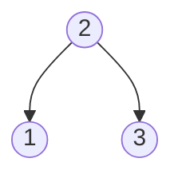

# Inorder Successor in BST II

## Problem

Given a specific node in a binary search tree, find its inorder successor without having access to the tree's root. The successor is the node with the smallest value greater than the given node's value. If no successor exists (the node is the rightmost in the tree), return null.

What makes this problem unique is that each node has a parent pointer, but you don't have access to the root. This means you can't do a traditional inorder traversal starting from the top. Instead, you must navigate using the parent pointers and BST properties.

The node structure includes:
```
class Node {
    public int val;
    public Node left;
    public Node right;
    public Node parent;
}
```

In an inorder traversal, nodes are visited in sorted ascending order: left subtree, current node, right subtree. So the successor is simply the next node that would be visited. There are two cases to consider:

1. If the node has a right child, the successor is the leftmost node in the right subtree (go right once, then keep going left)
2. If the node has no right child, go up via parent pointers until you find an ancestor where you came from its left subtree (that ancestor is the successor)

For example, in the tree [2,1,3], the successor of node 1 is node 2 (go up to parent). The successor of node 2 is node 3 (go right, no left children).


**Diagram:**



Example 1: Given node = 1
- Inorder traversal: [1, 2, 3]
- Successor of node 1 is node 2

Example 2: Given node = 2
- Inorder traversal: [1, 2, 3]
- Successor of node 2 is node 3


## Why This Matters

This problem teaches navigation in tree structures with parent pointers, a pattern common in real-world data structures like threading in binary trees, filesystem hierarchies where directories know their parent, and DOM traversal in web browsers. Understanding BST properties deeply enough to navigate without the root is crucial for implementing efficient tree operations in constrained environments, like embedded systems with limited memory where you can't afford to store the root reference everywhere. The two-case pattern (right subtree vs. going up) appears in many tree navigation problems and builds intuition about tree structure relationships. This skill transfers to more complex scenarios like finding successors in threaded trees, implementing iterators over tree structures, and optimizing database index navigation.

## Constraints

- The number of nodes in the tree is in the range [1, 10⁴].
- -10⁵ <= Node.val <= 10⁵
- All Nodes will have unique values.

## Think About

1. What makes this problem challenging? What's the core difficulty?
2. Can you identify subproblems? Do they overlap?
3. What invariants must be maintained?
4. Is there a mathematical relationship to exploit?

## Approach Hints

<details>
<summary>💡 Hint 1: Conceptual Understanding</summary>

Without access to the root, you can't do a traditional inorder traversal. Instead, think about the BST property: the inorder successor is either (1) the leftmost node in the right subtree if it exists, or (2) the first ancestor where the given node is in its left subtree. Use parent pointers to navigate upward.

</details>

<details>
<summary>🎯 Hint 2: Optimal Approach</summary>

Two cases: If node has a right child, successor is the leftmost node in the right subtree. Otherwise, move up using parent pointers until you find an ancestor where you came from its left subtree (meaning current node was smaller than ancestor). This ancestor is the successor.

</details>

<details>
<summary>📝 Hint 3: Algorithm Steps</summary>

1. If node has right child:
   - Go to right child
   - Keep going left until you reach leftmost node
   - Return that node
2. Else (no right child):
   - current = node, parent = node.parent
   - While parent exists and current is parent's right child:
     - Move up: current = parent, parent = parent.parent
   - Return parent (could be null if node is rightmost)

</details>

## Complexity Analysis

| Approach | Time Complexity | Space Complexity | Notes |
|----------|----------------|------------------|-------|
| BST Property | O(h) | O(1) | h = tree height, worst case O(n) for skewed tree |
| Morris Traversal | O(n) | O(1) | Full inorder without recursion/stack |
| Parent Pointer Navigation | O(h) | O(1) | Optimal using BST structure |

## Common Mistakes

### Mistake 1: Not considering both cases
```python
# Wrong: Only handles right subtree case
def inorderSuccessor(node):
    if node.right:
        current = node.right
        while current.left:
            current = current.left
        return current
    # Missing: case when no right child
    return None
```

```python
# Correct: Handle both cases
def inorderSuccessor(node):
    # Case 1: Node has right subtree
    if node.right:
        current = node.right
        while current.left:
            current = current.left
        return current

    # Case 2: No right subtree, go up via parent
    current = node
    parent = node.parent
    while parent and current == parent.right:
        current = parent
        parent = parent.parent

    return parent
```

### Mistake 2: Wrong direction when going up the tree
```python
# Wrong: Stops at first parent (incorrect logic)
def inorderSuccessor(node):
    if node.right:
        current = node.right
        while current.left:
            current = current.left
        return current

    # Wrong: should check if current is right child
    if node.parent:
        return node.parent
    return None
```

```python
# Correct: Keep going up until finding ancestor from left subtree
def inorderSuccessor(node):
    if node.right:
        current = node.right
        while current.left:
            current = current.left
        return current

    current = node
    parent = node.parent
    # Correct: continue while current is right child
    while parent and current == parent.right:
        current = parent
        parent = parent.parent

    return parent
```

### Mistake 3: Not handling rightmost node
```python
# Wrong: Doesn't properly return None for rightmost node
def inorderSuccessor(node):
    if node.right:
        current = node.right
        while current.left:
            current = current.left
        return current

    parent = node.parent
    while parent and node == parent.right:  # Bug: should update 'node'
        parent = parent.parent

    return parent  # May not reach None correctly
```

```python
# Correct: Properly handle rightmost node (no successor)
def inorderSuccessor(node):
    if node.right:
        current = node.right
        while current.left:
            current = current.left
        return current

    current = node
    parent = node.parent
    while parent and current == parent.right:
        current = parent  # Update current to track position
        parent = parent.parent

    return parent  # Returns None for rightmost node
```

## Variations

| Variation | Difficulty | Description |
|-----------|-----------|-------------|
| Inorder Successor in BST | Medium | Find successor with access to root |
| Inorder Predecessor in BST II | Medium | Find predecessor without root access |
| Kth Smallest Element in BST | Medium | Find kth element in inorder traversal |
| Delete Node in BST | Medium | Remove node maintaining BST property |

## Practice Checklist

- [ ] First attempt (after reading problem)
- [ ] After 1 day (spaced repetition)
- [ ] After 3 days (spaced repetition)
- [ ] After 1 week (spaced repetition)
- [ ] Before interview (final review)

**Completion Status**: ⬜ Not Started | 🟨 In Progress | ✅ Mastered

**Strategy**: See [Binary Search Tree Pattern](../prerequisites/trees.md)
