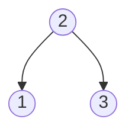
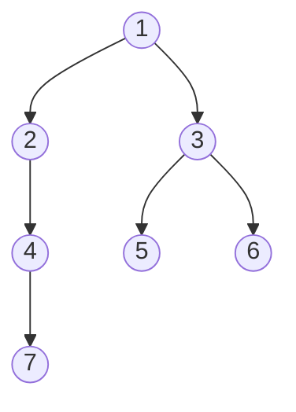

# Find Bottom Left Tree Value

## Problem

Given the root of a binary tree, find the value of the leftmost node in the deepest (bottom) level of the tree. The deepest level is the one furthest from the root.

This problem has an interesting twist: "leftmost" means the first node when reading left to right at the bottom level, not necessarily a left child. For example, in a tree where the root has only a right child which has only a right child, that rightmost node is still the "leftmost" at its level because it's the only node there.

There are multiple approaches to solve this:

1. **BFS (Level-order)**: Traverse level by level and track the first node of each level. The first node of the last level is your answer.

2. **DFS (Depth-first)**: Track the current depth and update your answer whenever you reach a new maximum depth for the first time. Crucially, visit left subtrees before right subtrees to ensure you capture the leftmost node at each depth.

3. **Right-to-left BFS trick**: Process each level from right to left. The very last node you visit in the entire traversal will be the leftmost node of the deepest level.

The key insight is that you need to identify both the maximum depth and the leftmost position at that depth, which can be done in a single traversal with proper state tracking.


**Diagram:**



Example 1: Tree [2,1,3]
- Bottom level has nodes [1,3]
- Leftmost value at bottom: 1



Example 2: Tree [1,2,3,4,null,5,6,null,null,7]
- Bottom level has node [7]
- Leftmost value at bottom: 7


## Why This Matters

This problem teaches fundamental tree traversal techniques that are essential across many domains. Level-order traversal is crucial for network broadcasting algorithms, file system directory scanning (processing files by depth), and rendering UI component hierarchies in web frameworks. The depth-tracking DFS approach builds skills needed for calculating tree metrics like height, balance factors in AVL trees, and determining node levels for range queries. The "leftmost at maximum depth" pattern appears in game tree evaluation (finding leftmost winning moves at deepest search level), debugging call stacks (finding deepest error origin), and database query planning (finding leftmost access path at deepest join level). Mastering both BFS and DFS for the same problem develops intuition about when to use each approach.

## Constraints

- The number of nodes in the tree is in the range [1, 10⁴].
- -2³¹ <= Node.val <= 2³¹ - 1

## Approach Hints

<details>
<summary>Hint 1: Level-by-Level Exploration</summary>

Think about traversing the tree level by level. How can you ensure you're visiting all nodes at each depth? BFS (Breadth-First Search) naturally processes nodes level by level. What data structure supports FIFO ordering?

The key insight: Track the leftmost node at each level, and keep updating it as you go deeper.

</details>

<details>
<summary>Hint 2: Depth-First with Depth Tracking</summary>

You can also use DFS with an extra parameter to track the current depth. Visit the left subtree before the right subtree, and maintain:
- The maximum depth seen so far
- The value at the leftmost position of that maximum depth

Update the result only when you find a deeper level for the first time. Why does visiting left first matter?

</details>

<details>
<summary>Hint 3: Right-to-Left BFS Optimization</summary>

Here's an elegant trick: What if you traverse each level from RIGHT to LEFT? The last node you visit in the entire BFS traversal will be the leftmost node of the deepest level.

This simplifies the logic significantly - no need to track the first node per level, just update the result with every node and return the final value.

</details>

## Complexity Analysis

| Approach | Time Complexity | Space Complexity | Notes |
|----------|----------------|------------------|-------|
| BFS (Level Order) | O(n) | O(w) | w = max width of tree (can be n/2 for complete tree) |
| DFS (Recursive) | O(n) | O(h) | h = height (O(log n) balanced, O(n) skewed) |
| Right-to-Left BFS | O(n) | O(w) | Same as BFS but simpler implementation |

## Common Mistakes

### Mistake 1: Not Handling Single Node Tree
```python
# WRONG: Assumes tree has multiple levels
def findBottomLeftValue(root):
    queue = [root]
    while queue:
        level = []
        for _ in range(len(queue)):
            node = queue.pop(0)
            level.append(node.val)
            if node.left:
                queue.append(node.left)
            if node.right:
                queue.append(node.right)
    return level[0]  # Fails if last level was empty

# CORRECT: Handle edge cases properly
def findBottomLeftValue(root):
    if not root:
        return None
    queue = [root]
    leftmost = root.val
    while queue:
        size = len(queue)
        for i in range(size):
            node = queue.pop(0)
            if i == 0:  # First node of this level
                leftmost = node.val
            if node.left:
                queue.append(node.left)
            if node.right:
                queue.append(node.right)
    return leftmost
```

### Mistake 2: DFS Visiting Right Before Left
```python
# WRONG: Right subtree processed first
def findBottomLeftValue(root):
    self.max_depth = -1
    self.result = 0

    def dfs(node, depth):
        if not node:
            return
        if depth > self.max_depth:
            self.max_depth = depth
            self.result = node.val
        dfs(node.right, depth + 1)  # Wrong order!
        dfs(node.left, depth + 1)

    dfs(root, 0)
    return self.result

# CORRECT: Left subtree first ensures leftmost capture
def findBottomLeftValue(root):
    self.max_depth = -1
    self.result = 0

    def dfs(node, depth):
        if not node:
            return
        if depth > self.max_depth:
            self.max_depth = depth
            self.result = node.val
        dfs(node.left, depth + 1)   # Left first!
        dfs(node.right, depth + 1)

    dfs(root, 0)
    return self.result
```

### Mistake 3: Updating Result on Every Node in DFS
```python
# WRONG: Always updates result even at shallower depths
def findBottomLeftValue(root):
    self.max_depth = -1
    self.result = 0

    def dfs(node, depth):
        if not node:
            return
        self.result = node.val  # Always updates!
        if depth > self.max_depth:
            self.max_depth = depth
        dfs(node.left, depth + 1)
        dfs(node.right, depth + 1)

    dfs(root, 0)
    return self.result

# CORRECT: Only update when finding a deeper level
def findBottomLeftValue(root):
    self.max_depth = -1
    self.result = 0

    def dfs(node, depth):
        if not node:
            return
        if depth > self.max_depth:  # Check first!
            self.max_depth = depth
            self.result = node.val
        dfs(node.left, depth + 1)
        dfs(node.right, depth + 1)

    dfs(root, 0)
    return self.result
```

## Variations

| Variation | Difference | Difficulty |
|-----------|------------|------------|
| Find Bottom Right Value | Return rightmost instead of leftmost at deepest level | Easy |
| Find All Bottom Level Values | Return all values at the deepest level | Easy |
| Find Leftmost at Specific Level k | Return leftmost value at level k | Easy |
| Find Bottom Left in N-ary Tree | Same problem but for trees with multiple children | Medium |
| Find Bottom Left with Path | Return both value and path from root | Medium |

## Think About

1. What makes this problem challenging? What's the core difficulty?
2. Can you identify subproblems? Do they overlap?
3. What invariants must be maintained?
4. Is there a mathematical relationship to exploit?

## Practice Checklist

- [ ] Solve using BFS with level tracking (Day 1)
- [ ] Solve using DFS with depth tracking (Day 1)
- [ ] Implement right-to-left BFS optimization (Day 1)
- [ ] Review and compare all three approaches (Day 3)
- [ ] Solve similar problem: Binary Tree Right Side View (Day 7)
- [ ] Solve without looking at notes (Day 14)
- [ ] Teach the solution to someone else (Day 30)

**Strategy**: See [Tree Pattern](../strategies/data-structures/trees.md)
