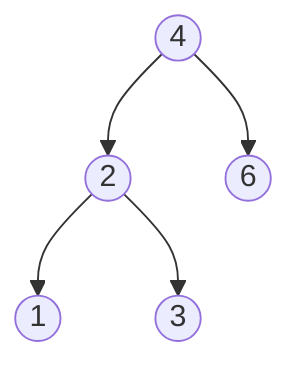
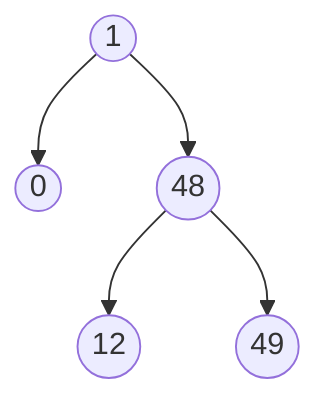

# Minimum Absolute Difference in BST

## Problem

Given the root node of a Binary Search Tree (BST), find the smallest absolute difference between the values of any two distinct nodes. A Binary Search Tree is a tree where each node's left children have smaller values and right children have larger values. The absolute difference is the positive distance between two numbers, for example |5 - 3| = 2.

The key insight here is that a BST has a special property: when you visit nodes in order (left subtree, then root, then right subtree), the values come out sorted. For instance, if your BST contains values [4, 2, 6, 1, 3], an inorder traversal gives you [1, 2, 3, 4, 6] in sorted order. This means the minimum difference must occur between consecutive elements in this sorted sequence, just like finding the closest pair of numbers in a sorted array.

Why consecutive elements? Consider any three values a < b < c. The difference between a and c is always larger than both (b - a) and (c - b), so checking non-consecutive pairs is unnecessary. This observation transforms the problem from checking all pairs (which would take O(n²) time) to checking just adjacent pairs in the sorted order.

**Diagram:**



Example 1: Tree [4,2,6,1,3]
- Inorder: [1,2,3,4,6]
- Min difference: 3-2 = 1



Example 2: Tree [1,0,48,null,null,12,49]
- Inorder: [0,1,12,48,49]
- Min difference: 1-0 = 1


## Why This Matters

This problem demonstrates how data structure properties can dramatically optimize algorithms. Understanding that BST inorder traversal produces sorted values unlocks an O(n) solution instead of the naive O(n²) approach of checking all pairs. This pattern appears frequently in tree problems: exploiting structural invariants to avoid unnecessary comparisons. The technique of tracking the previous value during traversal is a foundational skill used in many tree validation and transformation problems, making it valuable for both interviews and real-world applications like database indexing and range queries.

## Constraints

- The number of nodes in the tree is in the range [2, 10⁴].
- 0 <= Node.val <= 10⁵

## Think About

1. What makes this problem challenging? What's the core difficulty?
2. Can you identify subproblems? Do they overlap?
3. What invariants must be maintained?
4. Is there a mathematical relationship to exploit?

## Approach Hints

<details>
<summary>Hint 1: Leverage the BST property</summary>

In a Binary Search Tree, an inorder traversal (left → root → right) produces values in sorted ascending order.

Key insight: In a sorted array, the minimum absolute difference must occur between consecutive elements. Why? Because for any three values a < b < c, the minimum difference involving b must be either (b-a) or (c-b), never (c-a).

</details>

<details>
<summary>Hint 2: Track previous value during traversal</summary>

During inorder traversal, keep track of the previously visited node's value. At each node:
1. Calculate the difference between current value and previous value
2. Update the minimum difference if this is smaller
3. Update previous value to current value

This avoids storing all values in an array.

</details>

<details>
<summary>Hint 3: Implementation approaches</summary>

Two approaches:
1. **Recursive**: Perform inorder traversal recursively, using a nonlocal variable or class member to track the previous value and minimum difference.

2. **Iterative**: Use a stack to simulate inorder traversal, which may be clearer for tracking the previous value.

Both approaches achieve O(n) time and O(h) space where h is tree height.

</details>

## Complexity Analysis

| Approach | Time Complexity | Space Complexity | Notes |
|----------|----------------|------------------|-------|
| Inorder + array | O(n) | O(n) | Store all values, then find min consecutive difference |
| Inorder tracking | O(n) | O(h) | Track previous value during traversal; h = tree height |
| Morris traversal | O(n) | O(1) | Inorder without stack/recursion using threading |

## Common Mistakes

1. Comparing non-consecutive elements

```python
# Wrong: Checking all pairs
def getMinimumDifference(root):
    values = inorder_traversal(root)
    min_diff = float('inf')
    for i in range(len(values)):
        for j in range(i+1, len(values)):  # O(n²)
            min_diff = min(min_diff, abs(values[i] - values[j]))
    return min_diff

# Correct: Only check consecutive elements
def getMinimumDifference(root):
    values = inorder_traversal(root)
    min_diff = float('inf')
    for i in range(1, len(values)):
        min_diff = min(min_diff, values[i] - values[i-1])  # O(n)
    return min_diff
```

2. Not handling the first node properly

```python
# Wrong: Accessing undefined previous value
def inorder(node):
    if not node:
        return
    inorder(node.left)
    min_diff = min(min_diff, node.val - prev)  # prev undefined for first node!
    prev = node.val
    inorder(node.right)

# Correct: Initialize previous to None and check
def inorder(node):
    nonlocal prev, min_diff
    if not node:
        return
    inorder(node.left)
    if prev is not None:
        min_diff = min(min_diff, node.val - prev)
    prev = node.val
    inorder(node.right)
```

3. Forgetting BST values are already sorted

```python
# Wrong: Using absolute value (unnecessary for BST)
min_diff = min(min_diff, abs(values[i] - values[i-1]))

# Correct: Values are sorted, so always subtract smaller from larger
min_diff = min(min_diff, values[i] - values[i-1])
```

## Variations

| Variation | Difference | Strategy |
|-----------|-----------|----------|
| K-th smallest difference | Find k-th smallest instead of minimum | Use heap to track k smallest differences |
| Maximum difference | Find maximum instead of minimum | Compare first and last elements in inorder |
| Between levels | Min difference between nodes at same level | Level-order traversal with level tracking |
| Not a BST | Tree is just binary tree, not BST | Must check all pairs or sort values first |

## Practice Checklist

- [ ] Implement recursive inorder solution (20 min)
- [ ] Implement iterative with stack (15 min)
- [ ] Test edge cases (2 nodes, all same values except one)
- [ ] Review after 1 day - solve from scratch
- [ ] Review after 1 week - implement Morris traversal
- [ ] Review after 1 month - solve for general binary tree

**Strategy**: See [Binary Search Tree Pattern](../strategies/data-structures/trees.md)
