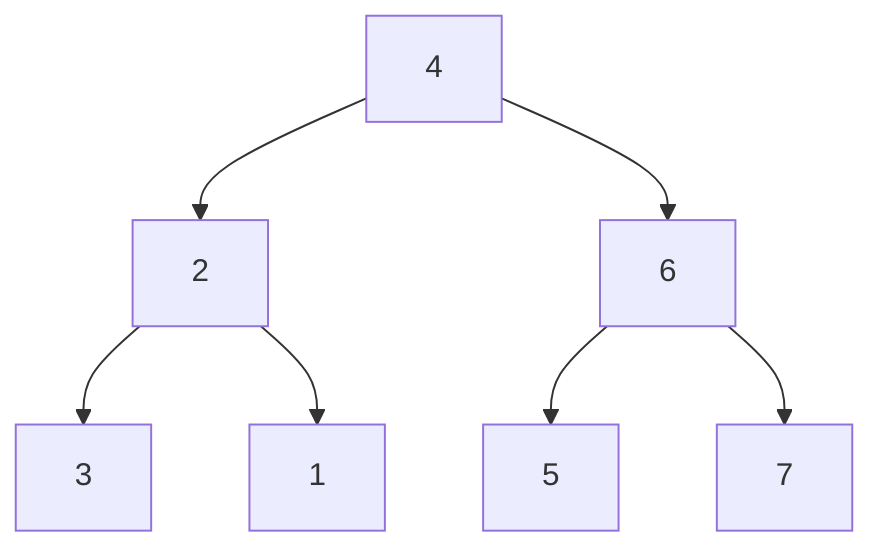

# Construct Binary Tree from String

## Problem

Given a string representation of a binary tree, reconstruct the actual tree structure. The encoding format uses integers for node values and parentheses to denote subtrees. A standalone number like "4" represents a single node with no children. If parentheses follow a number, they enclose child subtrees: the first pair of parentheses contains the left child, and the second pair (if present) contains the right child.

For example, "4(2)(3)" creates a tree with root 4, left child 2, and right child 3. Nested parentheses represent deeper levels: "4(2(3)(1))(6(5))" means root 4 has left subtree rooted at 2 (which has children 3 and 1) and right subtree rooted at 6 (which has only left child 5). The key rule is that left children always come before right children in the encoding.

An important edge case is negative numbers: "-4(2)(3)" has root value -4 (negative four), not 4. You'll need to parse multi-digit numbers and handle the negative sign properly. Empty parentheses like "()(3)" are not used in this format - if a parent has only a right child, you'd still represent it with an empty left subtree using "4()(3)", though this problem typically avoids that pattern.


**Diagram:**



```
String representation: "4(2(3)(1))(6(5)(7))"

Tree structure:
       4
      / \
     2   6
    / \ / \
   3  1 5  7

Parsing breakdown:
- 4: root node
- (2(3)(1)): left subtree with root 2
  - (3): left child of 2
  - (1): right child of 2
- (6(5)(7)): right subtree with root 6
  - (5): left child of 6
  - (7): right child of 6
```


## Why This Matters

This problem teaches the fundamental skill of parsing recursive data structures, a pattern essential for compilers, configuration file readers (JSON, XML), expression evaluators, and serialization libraries. Understanding how to match parentheses, track parsing state, and recursively build nested structures is foundational for working with abstract syntax trees in programming language tools. The technique of maintaining an index pointer that advances through the string as you parse appears in many string processing algorithms, from URL parsing to protocol message decoding. It's also a common interview question because it tests multiple skills simultaneously: recursion, string manipulation, tree construction, and edge case handling.

## Examples

**Example 1:**
- Input: `s = "4(2(3)(1))(6(5)(7))"`
- Output: `[4,2,6,3,1,5,7]`

**Example 2:**
- Input: `s = "-4(2(3)(1))(6(5)(7))"`
- Output: `[-4,2,6,3,1,5,7]`

## Constraints

- 0 <= s.length <= 3 * 10⁴
- s consists of digits, '(', ')', and '-' only.

## Think About

1. What makes this problem challenging? What's the core difficulty?
2. Can you identify subproblems? Do they overlap?
3. What invariants must be maintained?
4. Is there a mathematical relationship to exploit?

## Approach Hints

<details>
<summary>Hint 1: Recursive parsing strategy</summary>

The structure is inherently recursive:
1. Parse the current node's value (may be negative: "-4")
2. If '(' follows, recursively parse the left subtree
3. If another '(' follows after the left subtree, recursively parse the right subtree
4. Each recursive call returns when it encounters the matching ')'

Key: Maintain an index/pointer that advances through the string as you parse.

</details>

<details>
<summary>Hint 2: Identifying subtree boundaries</summary>

To find where a subtree ends, track parentheses depth:
- Opening '(' increments depth
- Closing ')' decrements depth
- When depth returns to 0, the subtree is complete

Example: "4(2(3)(1))(6(5)(7))"
         └────────┘  After parsing this left subtree, move to right

</details>

<details>
<summary>Hint 3: Stack-based iterative approach</summary>

Alternative to recursion:
1. Use a stack to track parent nodes
2. When you see a number, create a node
3. When you see '(', the last created node becomes the parent (push to stack)
4. When you see ')', pop from stack (leaving that subtree)
5. Track whether we're building left or right child

This avoids recursion but requires careful state management.

</details>

## Complexity Analysis

| Approach | Time Complexity | Space Complexity | Notes |
|----------|----------------|------------------|-------|
| Recursive parsing | O(n) | O(h) | n = string length, h = tree height (recursion stack) |
| Stack-based iterative | O(n) | O(h) | Explicit stack instead of call stack |
| Index-based recursive | O(n) | O(h) | Pass index by reference to avoid substring creation |

## Common Mistakes

1. Not handling negative numbers

```python
# Wrong: Only parsing single digits
def parse_value(s, idx):
    return int(s[idx]), idx + 1

# Correct: Parse complete number including negative sign
def parse_value(s, idx):
    start = idx
    if s[idx] == '-':
        idx += 1
    while idx < len(s) and s[idx].isdigit():
        idx += 1
    return int(s[start:idx]), idx
```

2. Confusing left and right child attachment

```python
# Wrong: Not tracking which child to attach
if s[idx] == '(':
    child = parse_tree(s, idx+1)
    node.left = child  # Always left? What about right?

# Correct: Track whether left child exists
if s[idx] == '(':
    node.left = parse_tree(s, idx+1)
    if s[idx] == '(':  # Second parenthesis = right child
        node.right = parse_tree(s, idx+1)
```

3. Not advancing the index correctly

```python
# Wrong: Losing track of position in string
def parse(s):
    val = int(s[0])
    node = TreeNode(val)
    if len(s) > 1 and s[1] == '(':
        node.left = parse(s[1:])  # Creates substring - inefficient!

# Correct: Pass and return index
def parse(s, idx):
    val, idx = parse_value(s, idx)
    node = TreeNode(val)
    if idx < len(s) and s[idx] == '(':
        node.left, idx = parse(s, idx+1)
    return node, idx
```

## Variations

| Variation | Difference | Strategy |
|-----------|-----------|----------|
| Preorder with nulls | Use "null" for missing children | Parse sequentially, track position |
| Nested parentheses | Different notation: ((L)V(R)) | Adjust parsing rules for structure |
| N-ary tree | More than 2 children per node | Parse all children in parentheses |
| With node names | Nodes have string labels, not integers | Parse strings instead of integers |

## Practice Checklist

- [ ] Implement recursive solution (30 min)
- [ ] Handle negative numbers correctly
- [ ] Test edge cases (empty string, single node, deep tree)
- [ ] Review after 1 day - implement stack-based solution
- [ ] Review after 1 week - solve serialize/deserialize tree
- [ ] Review after 1 month - implement for n-ary tree

**Strategy**: See [Tree Pattern](../prerequisites/trees.md)
