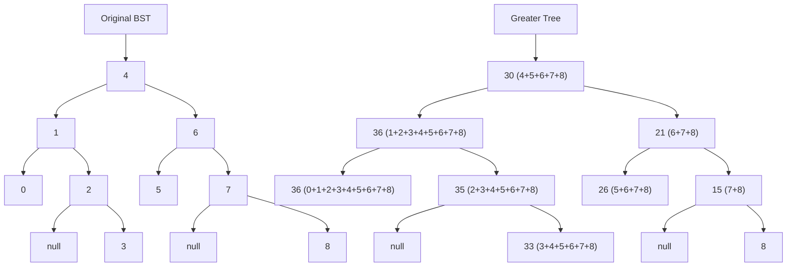

# Convert BST to Greater Tree

## Problem

Given a Binary Search Tree (BST), transform it into a "Greater Tree" where each node's new value equals its original value plus the sum of all values greater than it in the original tree. A BST has the property that all left children are smaller than their parent and all right children are larger, forming a sorted structure.

For example, consider a node with value 4 in a BST containing [1, 2, 3, 4, 5, 6, 7]. The values greater than 4 are [5, 6, 7], which sum to 18. So node 4 becomes 4 + 18 = 22 in the Greater Tree. Similarly, node 7 (the largest) has no greater values, so it stays 7. Node 1 has all other values greater than it, so it becomes 1 + (2+3+4+5+6+7) = 28.

The key insight is leveraging the BST's ordered structure: if you visit nodes from largest to smallest (reverse inorder traversal: right → root → left), you can maintain a running sum of all values seen so far. When you reach each node, that running sum is exactly the sum of all greater values, which you add to the current node's value. This transforms an O(n²) problem (finding greater values for each node) into an elegant O(n) solution by processing nodes in the optimal order.


**Diagram:**



```
Original BST:           Greater Tree:
       4                    30
      / \                  /  \
     1   6                36   21
    / \ / \              / \   / \
   0  2 5  7            36 35 26 15
       \    \                \    \
        3    8                33   8

Transformation explanation:
- Node 0: 0 + (1+2+3+4+5+6+7+8) = 36
- Node 1: 1 + (2+3+4+5+6+7+8) = 36
- Node 2: 2 + (3+4+5+6+7+8) = 35
- Node 3: 3 + (4+5+6+7+8) = 33
- Node 4: 4 + (5+6+7+8) = 30
- Node 5: 5 + (6+7+8) = 26
- Node 6: 6 + (7+8) = 21
- Node 7: 7 + 8 = 15
- Node 8: 8 (no greater values)
```


## Why This Matters

This problem showcases a powerful algorithmic principle: choosing the right traversal order can transform complexity. The BST structure provides sorted order through inorder traversal (left-root-right), but this problem requires processing in descending order, achieved by reverse inorder (right-root-left). This pattern of "traversal direction determines algorithm efficiency" appears in many contexts: computing running totals in streams, validating sorted properties, implementing iterator patterns, and optimizing range queries in databases. Understanding that tree structure encodes ordering relationships is fundamental to working with self-balancing trees (AVL, Red-Black) and B-trees in database indexes, where maintaining sorted order enables logarithmic search while supporting efficient updates.

## Examples

**Example 1:**
- Input: `root = [0,null,1]`
- Output: `[1,null,1]`

## Constraints

- The number of nodes in the tree is in the range [0, 10⁴].
- -10⁴ <= Node.val <= 10⁴
- All the values in the tree are **unique**.
- root is guaranteed to be a valid binary search tree.

## Think About

1. What makes this problem challenging? What's the core difficulty?
2. Can you identify subproblems? Do they overlap?
3. What invariants must be maintained?
4. Is there a mathematical relationship to exploit?

## Approach Hints

<details>
<summary>Hint 1: Reverse inorder traversal insight</summary>

Normal inorder traversal (left → root → right) visits BST nodes in ascending order: [0, 1, 2, 3, 4, 5, 6, 7, 8]

Reverse inorder (right → root → left) visits nodes in descending order: [8, 7, 6, 5, 4, 3, 2, 1, 0]

Key insight: When visiting nodes from largest to smallest, we can maintain a running sum of all values seen so far. This running sum is exactly what we need to add to each node!

</details>

<details>
<summary>Hint 2: Accumulating the sum during traversal</summary>

During reverse inorder traversal, maintain a variable `accumulated_sum`:
1. Visit right subtree (larger values) first
2. Add current node's value to `accumulated_sum`
3. Update current node's value to `accumulated_sum`
4. Visit left subtree (smaller values)

Example walkthrough for tree [4,1,6]:
- Visit 6: accumulated_sum = 6, node becomes 6
- Visit 4: accumulated_sum = 10, node becomes 10
- Visit 1: accumulated_sum = 11, node becomes 11

</details>

<details>
<summary>Hint 3: Implementation details</summary>

Recursive approach:
```python
def convertBST(root):
    accumulated = [0]  # Use list to allow modification in nested function

    def reverse_inorder(node):
        if not node:
            return
        reverse_inorder(node.right)  # Visit larger values first
        accumulated[0] += node.val
        node.val = accumulated[0]
        reverse_inorder(node.left)   # Visit smaller values last

    reverse_inorder(root)
    return root
```

</details>

## Complexity Analysis

| Approach | Time Complexity | Space Complexity | Notes |
|----------|----------------|------------------|-------|
| Reverse inorder (recursive) | O(n) | O(h) | h = tree height; recursion stack depth |
| Reverse inorder (iterative) | O(n) | O(h) | Explicit stack instead of call stack |
| Morris traversal | O(n) | O(1) | Reverse inorder without stack using threading |

## Common Mistakes

1. Using regular inorder instead of reverse inorder

```python
# Wrong: Regular inorder (ascending order)
def inorder(node):
    if not node:
        return
    inorder(node.left)   # Visits smaller values first
    accumulated += node.val
    node.val = accumulated  # Wrong! Needs sum of GREATER values
    inorder(node.right)

# Correct: Reverse inorder (descending order)
def reverse_inorder(node):
    if not node:
        return
    reverse_inorder(node.right)  # Visit larger values first
    accumulated += node.val
    node.val = accumulated
    reverse_inorder(node.left)
```

2. Not maintaining state across recursive calls

```python
# Wrong: Local variable resets each call
def convert(node):
    if not node:
        return
    accumulated = 0  # Resets to 0 every call!
    convert(node.right)
    accumulated += node.val  # Always just node.val
    node.val = accumulated

# Correct: Use nonlocal or pass by reference
accumulated = 0
def convert(node):
    nonlocal accumulated
    if not node:
        return
    convert(node.right)
    accumulated += node.val
    node.val = accumulated
    convert(node.left)
```

3. Modifying value before accumulating

```python
# Wrong: Order of operations matters
node.val = accumulated  # Updates before adding original value
accumulated += node.val  # Adds the NEW value, not original!

# Correct: Accumulate first, then update
accumulated += node.val  # Add original value
node.val = accumulated   # Then update node
```

## Variations

| Variation | Difference | Strategy |
|-----------|-----------|----------|
| Sum of smaller values | Add sum of smaller values instead | Use regular inorder (left → root → right) |
| Difference from average | Update to difference from tree average | Two passes: calculate average, then update |
| K-th transformation | Add sum of k largest values | Track count, stop after k nodes in reverse inorder |
| Non-BST tree | Tree is not a BST | Must sort values first, then apply transformation |

## Practice Checklist

- [ ] Implement recursive reverse inorder solution (20 min)
- [ ] Test with edge cases (single node, skewed tree)
- [ ] Verify transformation correctness
- [ ] Review after 1 day - implement iterative version
- [ ] Review after 1 week - solve "sum of smaller" variant
- [ ] Review after 1 month - implement Morris traversal

**Strategy**: See [Binary Search Tree Pattern](../strategies/data-structures/trees.md)
