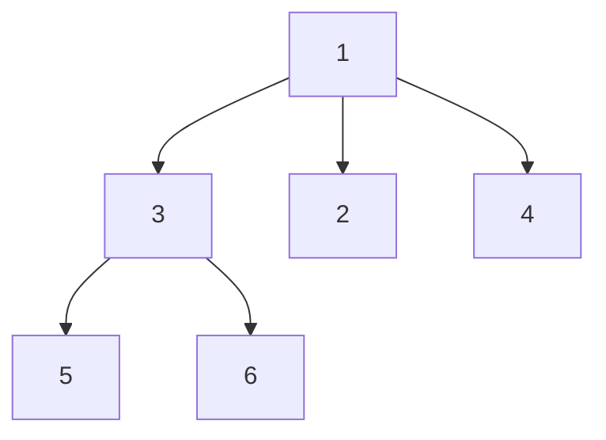

# N-ary Tree Preorder Traversal

## Problem

Given the root of an n-ary tree, return the values of its nodes in preorder traversal sequence. An n-ary tree is a tree where each node can have any number of children (not just two like a binary tree). Preorder traversal means visiting each node before visiting any of its children, processing children from left to right.

For a tree where the root has value 1 with three children [3, 2, 4], and node 3 has two children [5, 6], the preorder traversal visits them as: 1 (root first), then 3 (first child), then 3's children 5 and 6, then back to root's remaining children 2 and 4. The final sequence is [1, 3, 5, 6, 2, 4].

The key difference from binary trees is that each node has a list of children rather than just left and right pointers. You need to process all children in order from the first to the last. The input format represents the tree using level-order notation with null values separating different levels, but you're returning a simple list of values in preorder.

Think of this like exploring a directory structure: you process the current folder name, then recursively explore each subfolder in order before moving to the next folder at the current level. The preorder pattern naturally matches depth-first exploration.


**Diagram:**



**N-ary Tree Example:**
- Node 1 (root) has 3 children: [3, 2, 4]
- Node 3 has 2 children: [5, 6]
- Preorder traversal visits: root first, then children left-to-right
- Result: [1, 3, 5, 6, 2, 4]


## Why This Matters

Tree traversals are fundamental to working with hierarchical data structures. Preorder traversal specifically appears when you need to process a parent before its children, like creating a copy of a directory structure, serializing a tree for storage, evaluating prefix expressions, or building dependency graphs where you must resolve a task before its subtasks.

Understanding the relationship between recursive and iterative implementations deepens your grasp of how function call stacks work. The iterative version with an explicit stack mirrors what happens behind the scenes in recursion, helping you recognize when to convert between approaches based on constraints (some languages have limited stack depth).

This pattern extends beyond trees to any hierarchical structure: DOM traversal in web development, file systems, organizational charts, and nested data formats like JSON or XML. Mastering n-ary tree traversal prepares you for the more complex patterns used in compilers, parsers, and syntax tree manipulation.

## Constraints

- The number of nodes in the tree is in the range [0, 10⁴].
- 0 <= Node.val <= 10⁴
- The height of the n-ary tree is less than or equal to 1000.

## Think About

1. What makes this problem challenging? What's the core difficulty?
2. Can you identify subproblems? Do they overlap?
3. What invariants must be maintained?
4. Is there a mathematical relationship to exploit?

## Approach Hints

<details>
<summary>Hint 1: Understanding Preorder Traversal</summary>

Preorder traversal means visiting nodes in this order:
1. **Process the current node** (add its value to result)
2. **Recursively visit each child** from left to right

For the example tree:
```
    1
   /|\
  3 2 4
 /|
5 6
```

Visit order: 1 → 3 → 5 → 6 → 2 → 4

Compare this to postorder (children first, then root): 5 → 6 → 3 → 2 → 4 → 1

The key: Process root BEFORE processing children.
</details>

<details>
<summary>Hint 2: Recursive vs Iterative Approaches</summary>

**Recursive approach** (simplest):
```python
def preorder(root):
    if not root:
        return []

    result = [root.val]  # Process root first
    for child in root.children:
        result.extend(preorder(child))  # Process each child subtree

    return result
```

**Iterative approach** (using stack):
- Use a stack to simulate recursion
- Push children in REVERSE order so left children are processed first
- This mimics the recursive call stack behavior
</details>

<details>
<summary>Hint 3: Complete Solution Strategy</summary>

**Approach 1: Recursive (Clean and Simple)**
```python
def preorder(root):
    result = []

    def traverse(node):
        if not node:
            return

        result.append(node.val)  # Process current node
        for child in node.children:
            traverse(child)  # Recursively process children

    traverse(root)
    return result
```

**Approach 2: Iterative with Stack**
```python
def preorder(root):
    if not root:
        return []

    result = []
    stack = [root]

    while stack:
        node = stack.pop()
        result.append(node.val)

        # Add children in REVERSE order
        # (rightmost first, so leftmost is processed first)
        for child in reversed(node.children):
            stack.append(child)

    return result
```

**Why reverse?** The stack is LIFO (Last In, First Out). If we push children left-to-right, the rightmost child would be processed first. Reversing ensures left-to-right processing.

Both solutions are O(n) time and O(n) space (for result + stack/recursion).
</details>

## Complexity Analysis

| Approach | Time Complexity | Space Complexity | Notes |
|----------|----------------|------------------|-------|
| Recursive | O(n) | O(h) | h = height for call stack; O(n) worst case if skewed |
| Iterative (Stack) | O(n) | O(n) | Explicit stack can hold all nodes in worst case |
| Morris Traversal | O(n) | O(1) | Complex; not typically needed for n-ary trees |

## Common Mistakes

### Mistake 1: Confusing preorder with postorder
```python
# WRONG: Processing children before root (this is postorder!)
def preorder(root):
    if not root:
        return []

    result = []
    for child in root.children:
        result.extend(preorder(child))  # Children first

    result.append(root.val)  # Root last - WRONG for preorder!
    return result

# CORRECT: Root first, then children
result = [root.val]
for child in root.children:
    result.extend(preorder(child))
```
**Why it's wrong:** Preorder means "root before children." Postorder means "root after children." Don't confuse the two.

### Mistake 2: Not reversing children in iterative approach
```python
# WRONG: Adding children in natural order
def preorder(root):
    if not root:
        return []

    result = []
    stack = [root]

    while stack:
        node = stack.pop()
        result.append(node.val)

        # BUG: This processes children RIGHT-TO-LEFT!
        for child in node.children:
            stack.append(child)

    return result

# CORRECT: Reverse the children
for child in reversed(node.children):
    stack.append(child)
```
**Why it's wrong:** Stack is LIFO. Without reversing, children are processed in reverse order (right-to-left instead of left-to-right).

### Mistake 3: Modifying result list incorrectly
```python
# INEFFICIENT: Using list concatenation repeatedly
def preorder(root):
    if not root:
        return []

    result = [root.val]
    for child in root.children:
        result = result + preorder(child)  # Creates new list each time!

    return result

# BETTER: Use extend (modifies in-place)
result.extend(preorder(child))

# BEST: Use single result list with helper function
result = []
def traverse(node):
    if not node:
        return
    result.append(node.val)
    for child in node.children:
        traverse(child)
```
**Why it's wrong:** Creating new lists with `+` is O(n) per operation, making overall complexity O(n²). Use `extend()` or a shared result list.

## Variations

| Variation | Difficulty | Key Difference |
|-----------|-----------|----------------|
| Binary Tree Preorder | Easy | Only 2 children per node instead of n |
| N-ary Tree Postorder | Medium | Visit children before root |
| N-ary Tree Level Order | Medium | BFS instead of DFS |
| Serialize/Deserialize N-ary Tree | Hard | Convert tree to/from string representation |

## Practice Checklist

- [ ] Solve using recursive approach (Day 1)
- [ ] Implement iterative solution with stack (Day 2)
- [ ] Handle edge cases: empty tree, single node (Day 2)
- [ ] Compare with postorder traversal (Day 3)
- [ ] Review after 1 week (Day 8)
- [ ] Review after 2 weeks (Day 15)
- [ ] Solve without looking at hints (Day 30)

**Strategy**: See [Bfs Pattern](../strategies/patterns/graph-traversal.md)
