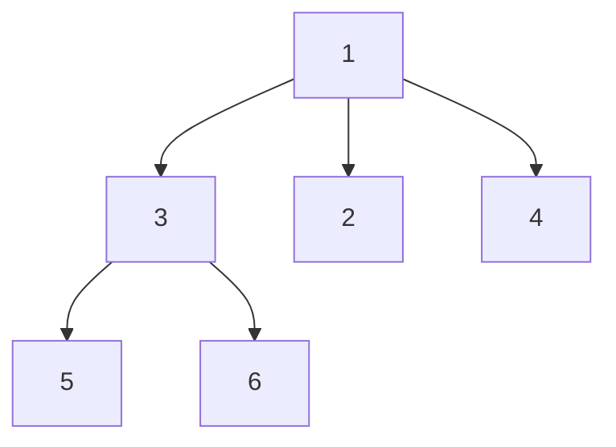

# N-ary Tree Postorder Traversal

## Problem

Given the root of an n-ary tree, return the values of its nodes in postorder traversal sequence. An n-ary tree is a tree where each node can have any number of children. Postorder traversal means visiting all of a node's children (from left to right) before visiting the node itself.

For a tree where the root has value 1 with three children [3, 2, 4], and node 3 has two children [5, 6], the postorder traversal visits them as: first 5 and 6 (children of 3), then 3 itself, then 2 (no children), then 4 (no children), finally 1 (the root). The sequence is [5, 6, 3, 2, 4, 1].

This is the opposite order from preorder traversal. While preorder processes parents before children (useful for copying structures), postorder processes children before parents. This order is essential when you need to process dependencies before the thing that depends on them, like calculating directory sizes (you need child sizes before parent size) or safely deleting a tree (delete children before parent).

The challenge with iterative postorder is that you must visit children before the parent, which is less natural for a stack-based approach. One clever trick is to do a modified preorder (root → right → left) and then reverse the result, which gives you postorder (left → right → root).


**Diagram:**



**N-ary Tree Example:**
- Node 1 (root) has 3 children: [3, 2, 4]
- Node 3 has 2 children: [5, 6]
- Postorder traversal visits: children left-to-right first, then root
- Result: [5, 6, 3, 2, 4, 1]


## Why This Matters

Postorder traversal is fundamental for bottom-up processing of hierarchical structures. It appears in compilers when evaluating expression trees (operands before operators), in file systems when calculating directory sizes or deleting trees (children before parents), and in garbage collection algorithms that free child resources before parent resources.

Understanding postorder deepens your grasp of recursion and stack behavior. The recursive version is elegant, while the iterative version teaches you to think creatively about using auxiliary data structures. The "reverse preorder" trick is a valuable problem-solving technique that shows how understanding traversal relationships can simplify seemingly complex problems.

This pattern extends to dependency resolution systems, where tasks must complete before their dependents, and to any scenario requiring leaf-to-root processing. The contrast between preorder and postorder teaches you to choose the right traversal for your use case, a critical skill when working with tree-structured data.

## Constraints

- The number of nodes in the tree is in the range [0, 10⁴].
- 0 <= Node.val <= 10⁴
- The height of the n-ary tree is less than or equal to 1000.

## Think About

1. What makes this problem challenging? What's the core difficulty?
2. Can you identify subproblems? Do they overlap?
3. What invariants must be maintained?
4. Is there a mathematical relationship to exploit?

## Approach Hints

<details>
<summary>Hint 1: Understanding Postorder Traversal</summary>

Postorder traversal means visiting nodes in this order:
1. **Recursively visit each child** from left to right
2. **Process the current node** (add its value to result)

For the example tree:
```
    1
   /|\
  3 2 4
 /|
5 6
```

Visit order: 5 → 6 → 3 → 2 → 4 → 1

Compare this to preorder (root first, then children): 1 → 3 → 5 → 6 → 2 → 4

The key: Process root AFTER processing all children.

**Use case:** Postorder is used when you need to process children before their parent (e.g., deleting a tree, calculating directory sizes).
</details>

<details>
<summary>Hint 2: Recursive vs Iterative Approaches</summary>

**Recursive approach** (simplest):
```python
def postorder(root):
    if not root:
        return []

    result = []
    for child in root.children:
        result.extend(postorder(child))  # Process children first

    result.append(root.val)  # Process root last
    return result
```

**Iterative approach** (trickier):
- Use a stack to simulate recursion
- One technique: Use reverse preorder
  - Normal preorder: root → left → right
  - Reverse preorder: root → right → left
  - Reversing the result gives postorder!
</details>

<details>
<summary>Hint 3: Complete Solution Strategy</summary>

**Approach 1: Recursive (Clean and Simple)**
```python
def postorder(root):
    result = []

    def traverse(node):
        if not node:
            return

        # Process children first
        for child in node.children:
            traverse(child)

        # Then process current node
        result.append(node.val)

    traverse(root)
    return result
```

**Approach 2: Iterative with Stack (Reverse Preorder)**
```python
def postorder(root):
    if not root:
        return []

    result = []
    stack = [root]

    while stack:
        node = stack.pop()
        result.append(node.val)

        # Add children in NORMAL order (not reversed)
        # This creates reverse preorder
        for child in node.children:
            stack.append(child)

    # Reverse the result to get postorder
    return result[::-1]
```

**Why this works:**
- Preorder: root → children (left to right)
- Reverse preorder: root → children (right to left) → reverse result
- After reversing: children (left to right) → root = Postorder!

**Approach 3: Iterative with Two Stacks**
```python
def postorder(root):
    if not root:
        return []

    stack1 = [root]
    stack2 = []

    while stack1:
        node = stack1.pop()
        stack2.append(node)

        # Push children left-to-right
        for child in node.children:
            stack1.append(child)

    # Pop from stack2 gives postorder
    result = []
    while stack2:
        result.append(stack2.pop().val)

    return result
```

All solutions are O(n) time and O(n) space.
</details>

## Complexity Analysis

| Approach | Time Complexity | Space Complexity | Notes |
|----------|----------------|------------------|-------|
| Recursive | O(n) | O(h) | h = height for call stack; O(n) worst case if skewed |
| Iterative (Reverse Preorder) | O(n) | O(n) | Stack + result array |
| Iterative (Two Stacks) | O(n) | O(n) | Two stacks for processing order |

## Common Mistakes

### Mistake 1: Confusing postorder with preorder
```python
# WRONG: Processing root before children (this is preorder!)
def postorder(root):
    if not root:
        return []

    result = [root.val]  # Root first - WRONG for postorder!
    for child in root.children:
        result.extend(postorder(child))

    return result

# CORRECT: Children first, then root
result = []
for child in root.children:
    result.extend(postorder(child))
result.append(root.val)
```
**Why it's wrong:** Postorder means "root after children." Preorder means "root before children." The order matters!

### Mistake 2: Forgetting to reverse in iterative approach
```python
# WRONG: Using reverse preorder but not reversing result
def postorder(root):
    if not root:
        return []

    result = []
    stack = [root]

    while stack:
        node = stack.pop()
        result.append(node.val)

        for child in node.children:
            stack.append(child)

    return result  # Missing [::-1] to reverse!

# CORRECT:
return result[::-1]  # Reverse to get postorder from reverse preorder
```
**Why it's wrong:** The iterative approach builds reverse preorder. You must reverse the final result to get postorder.

### Mistake 3: Adding children in wrong order for reverse preorder
```python
# WRONG: Reversing children in reverse preorder approach
def postorder(root):
    if not root:
        return []

    result = []
    stack = [root]

    while stack:
        node = stack.pop()
        result.append(node.val)

        # Don't reverse here for reverse preorder!
        for child in reversed(node.children):
            stack.append(child)

    return result[::-1]

# CORRECT for reverse preorder:
for child in node.children:  # NO reversal
    stack.append(child)
```
**Why it's wrong:** In the reverse preorder approach, you want to process children right-to-left, so add them to stack in normal order (stack reverses them). Reversing here would undo that effect.

## Variations

| Variation | Difficulty | Key Difference |
|-----------|-----------|----------------|
| Binary Tree Postorder | Easy | Only 2 children per node instead of n |
| N-ary Tree Preorder | Medium | Visit root before children |
| N-ary Tree Level Order | Medium | BFS instead of DFS |
| Construct Tree from Traversals | Hard | Build tree from preorder/postorder sequences |

## Practice Checklist

- [ ] Solve using recursive approach (Day 1)
- [ ] Implement iterative solution with reverse preorder (Day 2)
- [ ] Try two-stack iterative approach (Day 2)
- [ ] Handle edge cases: empty tree, single node (Day 3)
- [ ] Compare with preorder traversal (Day 3)
- [ ] Review after 1 week (Day 8)
- [ ] Review after 2 weeks (Day 15)
- [ ] Solve without looking at hints (Day 30)

**Strategy**: See [Bfs Pattern](../strategies/patterns/graph-traversal.md)
