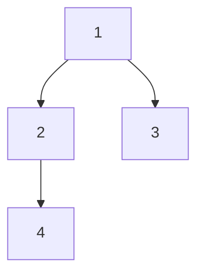
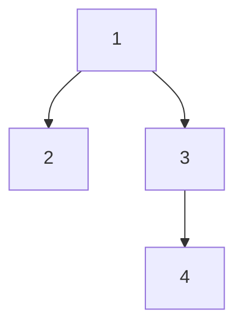

# Construct String from Binary Tree

## Problem

Given the root of a binary tree, create a string representation that captures the complete structure and values of the tree using preorder traversal (visit root, then left subtree, then right subtree). The representation uses parentheses to show parent-child relationships, with each node's value followed by its children enclosed in parentheses.

The key challenge is minimizing the string length while maintaining enough information to uniquely reconstruct the original tree. You must include parentheses only when necessary for disambiguation. Specifically:

- Always include the node's value
- If a node has a left child, wrap it in parentheses: `value(left_subtree)`
- If a node has ONLY a right child (no left), you must include empty parentheses for the left: `value()(right_subtree)`. This distinguishes right children from left children.
- If a node has no right child, omit the right parentheses entirely (even if there's a left child)
- Leaf nodes appear as just their values with no parentheses

**Diagram:**



**Example 1:** Tree above becomes string: "1(2(4))(3)"
- Root 1 with left child 2 and right child 3
- Node 2 has left child 4 (no right child, so no right parentheses)



**Example 2:** Tree above becomes string: "1(2)(3(4))"
- Root 1 with left child 2 and right child 3
- Node 2 is a leaf (no parentheses needed for it)
- Node 3 has left child 4

Consider what happens with a tree that has only right children - you'd see patterns like "1()(2)()" where the empty parentheses mark missing left children.

## Why This Matters

Tree serialization is fundamental to data persistence, network transmission, and distributed systems. When you save a tree to disk or send it over a network, you need a string representation that preserves structure. This problem teaches preorder traversal, one of the three classic depth-first traversal patterns that form the foundation for more complex tree algorithms. The parenthesis-balancing aspect connects to compiler design (parsing expressions) and validates your understanding of recursive tree structures. Many interview questions involve tree traversals with custom logic at each node - mastering this pattern prepares you for serialize/deserialize problems, expression tree evaluation, and abstract syntax tree processing in compilers.

## Constraints

- The number of nodes in the tree is in the range [1, 10⁴].
- -1000 <= Node.val <= 1000

## Think About

1. What makes this problem challenging? What's the core difficulty?
2. Can you identify subproblems? Do they overlap?
3. What invariants must be maintained?
4. Is there a mathematical relationship to exploit?

## Approach Hints

<details>
<summary>Hint 1: Understanding Parenthesis Rules</summary>

The key challenge is determining when to include or omit empty parentheses:

**Rules:**
1. Always include the root value
2. If left child exists: add `(left_subtree_string)`
3. If left is null but right exists: add `()` to mark empty left
4. If right child exists: add `(right_subtree_string)`
5. If right is null: omit empty parentheses

**Examples:**
- Node with both children: `1(2)(3)`
- Node with only left: `1(2)` (omit right)
- Node with only right: `1()(3)` (must show empty left)
- Leaf node: `1` (no parentheses)

```python
# Pseudo-logic
if left exists:
    result += "(" + stringify(left) + ")"
elif right exists:
    result += "()"  # Empty left marker

if right exists:
    result += "(" + stringify(right) + ")"
```
</details>

<details>
<summary>Hint 2: Recursive Preorder Traversal</summary>

Use preorder traversal (root → left → right) with recursion:

```python
def tree2str(root):
    if not root:
        return ""

    # Start with root value
    result = str(root.val)

    # Process left subtree
    if root.left or root.right:  # Need parens if either child exists
        result += "(" + tree2str(root.left) + ")"

    # Process right subtree
    if root.right:
        result += "(" + tree2str(root.right) + ")"

    return result
```

**Key Insight**: We add left parentheses even for null left child if right child exists, but we never add right parentheses for null right child.
</details>

<details>
<summary>Hint 3: Iterative Approach with Stack</summary>

Alternative iterative solution using stack for preorder traversal:

```python
def tree2str(root):
    if not root:
        return ""

    stack = [root]
    visited = set()
    result = []

    while stack:
        node = stack[-1]

        if node in visited:
            stack.pop()
            result.append(")")
        else:
            visited.add(node)
            result.append("(" + str(node.val))

            # Push right first (so left is processed first)
            if not node.left and node.right:
                result.append("()")
            if node.right:
                stack.append(node.right)
            if node.left:
                stack.append(node.left)

    # Remove outer parentheses and join
    return "".join(result)[1:-1]
```
</details>

## Complexity Analysis

| Approach | Time Complexity | Space Complexity | Notes |
|----------|----------------|------------------|-------|
| Recursive | O(n) | O(h) | h = tree height, recursion stack |
| Iterative with Stack | O(n) | O(n) | Explicit stack + visited set |
| Optimal Recursive | O(n) | O(h) | Best for balanced trees |

**Detailed Analysis:**
- **Time**: O(n) - Visit each node exactly once
- **Space**: O(h) for recursion stack where h is tree height
  - Best case (balanced): O(log n)
  - Worst case (skewed): O(n)
- **Key Insight**: Recursive solution is cleaner and more space-efficient

## Common Mistakes

### Mistake 1: Always adding parentheses for both children
```python
# Wrong: Always adding right parentheses even when null
result = str(root.val)
result += "(" + tree2str(root.left) + ")"
result += "(" + tree2str(root.right) + ")"  # Wrong for null right

# Correct: Conditional right parentheses
if root.right:
    result += "(" + tree2str(root.right) + ")"
```

### Mistake 2: Not handling empty left when right exists
```python
# Wrong: Skipping empty left marker
if root.left:
    result += "(" + tree2str(root.left) + ")"
if root.right:
    result += "(" + tree2str(root.right) + ")"
# Missing: "()" when left is null but right exists

# Correct: Add "()" placeholder
if root.left or root.right:
    result += "(" + tree2str(root.left) + ")"
if root.right:
    result += "(" + tree2str(root.right) + ")"
```

### Mistake 3: Incorrect base case for null nodes
```python
# Wrong: Returning "()" for null
def tree2str(root):
    if not root:
        return "()"

# Correct: Return empty string
def tree2str(root):
    if not root:
        return ""
```

## Variations

| Variation | Description | Difficulty |
|-----------|-------------|------------|
| Parse String to Tree | Reconstruct tree from string representation | Medium |
| Inorder String Representation | Use inorder instead of preorder | Medium |
| Minimal Parentheses | Minimize total parentheses while maintaining uniqueness | Hard |
| N-ary Tree to String | Extend to trees with arbitrary children | Medium |

## Practice Checklist

Track your progress on mastering this problem:

- [ ] **Initial Attempt** - Solve independently (30 min limit)
- [ ] **Solution Study** - If stuck, study one approach deeply
- [ ] **Implementation** - Code solution from scratch without reference
- [ ] **Optimization** - Achieve O(n) time, O(h) space
- [ ] **Edge Cases** - Test: single node, only left children, only right children
- [ ] **Variations** - Solve at least 2 related problems
- [ ] **Spaced Repetition** - Re-solve after: 1 day, 1 week, 1 month

**Mastery Goal**: Solve in < 15 minutes with clean recursive solution.

**Strategy**: See [Tree Pattern](../strategies/data-structures/trees.md)
