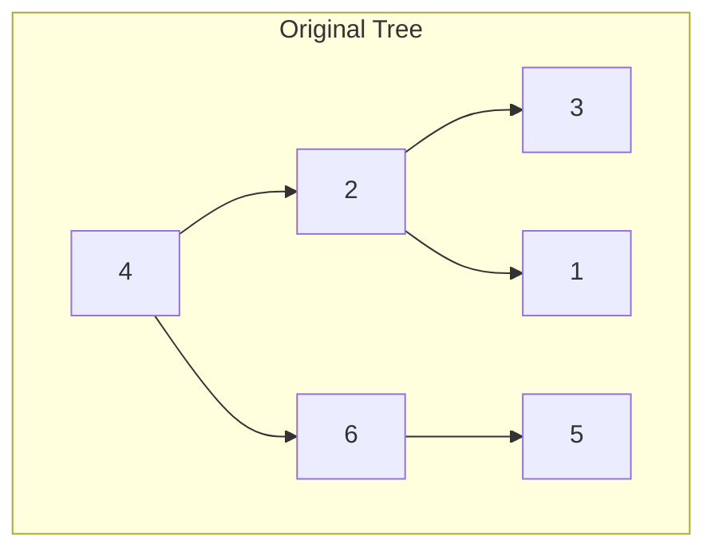
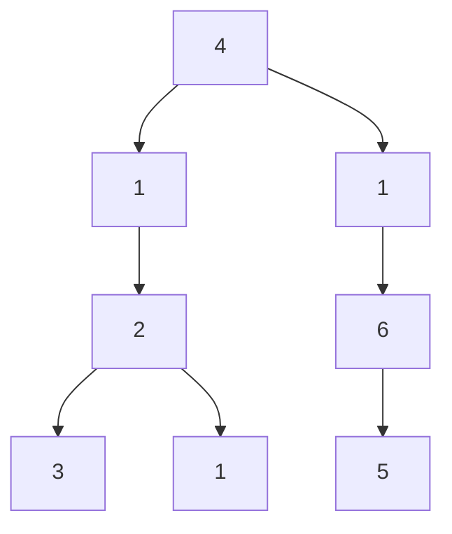
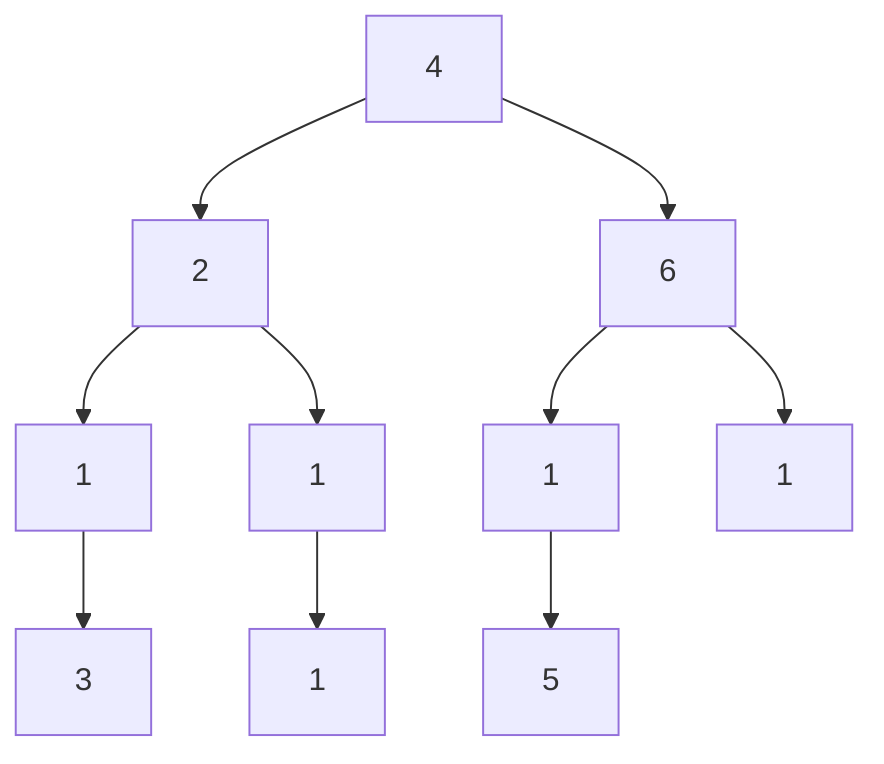

# Add One Row to Tree

## Problem

Given a binary tree, insert an entire row of new nodes at a specified depth, pushing down all existing nodes at that level and below. Each new node has the same value `val`, and you need to carefully rewire parent-child connections to preserve the original tree structure beneath the new row.

The root is defined as level 1. To insert at depth `d`:

1. **For depth > 1**: Find all nodes at level `d - 1` (the parent level). For each parent node:
   - Create two new nodes with value `val` to become its new left and right children
   - Connect the parent's original left child as the left child of the new left node
   - Connect the parent's original right child as the right child of the new right node
   - This effectively "pushes down" the existing subtrees by one level

2. **For depth == 1** (special case): Since there's no parent level, create a new root with value `val` and make the entire original tree its left child (the right child is null).

Let's visualize this with an example:

**Diagram:**



**Example 1:** Add row with value 1 at depth 2

Notice how the original children of node 4 (which were 2 and 6) are now grandchildren, connected through the new layer of nodes with value 1.

**Example 2:** Add row with value 1 at depth 3


The challenge is reaching the correct level efficiently (using BFS or DFS with level tracking) and correctly rewiring pointers without losing references to existing subtrees.

## Why This Matters

Tree manipulation problems are central to understanding hierarchical data structures, which appear everywhere in computer science: file systems, organizational charts, DOM trees in web browsers, and abstract syntax trees in compilers. This problem specifically teaches level-order operations and careful pointer management - skills essential for implementing tree balancing operations (like AVL rotations), tree transformations, and even neural network architecture modifications. The pattern of "find nodes at depth d, modify connections" appears in practical scenarios like batch updates to organizational hierarchies or inserting middleware layers in software architecture trees. Mastering this prepares you for more complex tree restructuring problems.

## Constraints

- The number of nodes in the tree is in the range [1, 10⁴].
- The depth of the tree is in the range [1, 10⁴].
- -100 <= Node.val <= 100
- -10⁵ <= val <= 10⁵
- 1 <= depth <= the depth of tree + 1

## Think About

1. What makes this problem challenging? What's the core difficulty?
2. Can you identify subproblems? Do they overlap?
3. What invariants must be maintained?
4. Is there a mathematical relationship to exploit?

## Approach Hints

<details>
<summary>Hint 1: Level Traversal Strategy</summary>

The key insight is that you need to reach level `depth - 1` to insert the new row. Consider using either BFS (breadth-first search) or DFS (depth-first search) to track the current level. BFS naturally processes nodes level by level, while DFS can track depth through a parameter. Handle the special case where `depth == 1` separately by creating a new root.

</details>

<details>
<summary>Hint 2: Node Connection Pattern</summary>

For each node at level `depth - 1`, you need to create exactly two new nodes. The critical part is rewiring the connections: the new left node should point to the old left child, and the new right node should point to the old right child. This preserves the original tree structure beneath the newly inserted row.

</details>

<details>
<summary>Hint 3: Recursive DFS Implementation</summary>

A clean recursive approach tracks the current level and makes insertions when `current_level == depth - 1`. At each node, create two new nodes with value `val`, assign the existing children to these new nodes, then update the current node's children to point to the new nodes. The base case is when you've gone past the target depth.

</details>

## Complexity Analysis

| Approach | Time Complexity | Space Complexity | Notes |
|----------|----------------|------------------|-------|
| BFS (Queue) | O(n) | O(w) | w is max width of tree; processes all nodes up to target depth |
| DFS (Recursive) | O(n) | O(h) | h is tree height; stack space for recursion |
| DFS (Iterative) | O(n) | O(h) | Stack space for explicit stack with level tracking |

## Common Mistakes

1. **Forgetting the depth == 1 special case**
```python
# Wrong: doesn't handle new root case
def addOneRow(root, val, depth):
    # Missing check for depth == 1
    # This would fail when inserting at the root level
    pass

# Correct: handle special case first
def addOneRow(root, val, depth):
    if depth == 1:
        new_root = TreeNode(val)
        new_root.left = root
        return new_root
    # Continue with normal insertion
```

2. **Losing references to original children**
```python
# Wrong: overwrites children before saving them
def insert_at_level(node, val, current, target):
    if current == target - 1:
        node.left = TreeNode(val)  # Lost original left!
        node.right = TreeNode(val)  # Lost original right!

# Correct: save references first
def insert_at_level(node, val, current, target):
    if current == target - 1:
        old_left, old_right = node.left, node.right
        node.left = TreeNode(val)
        node.right = TreeNode(val)
        node.left.left = old_left
        node.right.right = old_right
```

3. **Off-by-one errors in level tracking**
```python
# Wrong: inserts at wrong level
def dfs(node, val, current_depth, target_depth):
    if current_depth == target_depth:  # Should be target_depth - 1
        # This would try to modify nodes at target level, not their parents
        pass

# Correct: insert at parent level
def dfs(node, val, current_depth, target_depth):
    if current_depth == target_depth - 1:
        # Now we're at the right level to insert
        pass
```

## Variations

| Variation | Description | Difficulty |
|-----------|-------------|------------|
| Add Row with Multiple Values | Insert a row where each node has a different value from an array | Medium |
| Add Row at Multiple Depths | Insert rows at several specified depths in one operation | Medium |
| Delete Row from Tree | Remove all nodes at a specific depth and reconnect remaining nodes | Medium |
| Insert Column in Binary Tree | Add nodes vertically instead of horizontally (left or right) | Hard |

## Practice Checklist

- [ ] Implement BFS solution with queue
- [ ] Implement recursive DFS solution
- [ ] Implement iterative DFS solution with explicit stack
- [ ] Handle edge case: depth == 1 (new root)
- [ ] Handle edge case: single node tree
- [ ] Handle edge case: depth equals tree height + 1
- [ ] **Review in 24 hours**: Re-implement from memory
- [ ] **Review in 1 week**: Solve without hints
- [ ] **Review in 2 weeks**: Implement all three approaches

**Strategy**: See [Tree Pattern](../prerequisites/trees.md)
