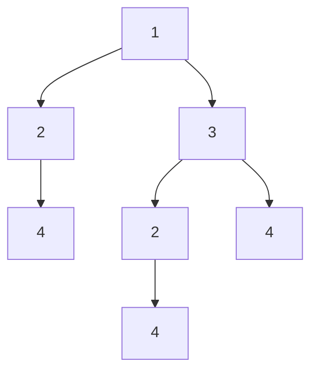
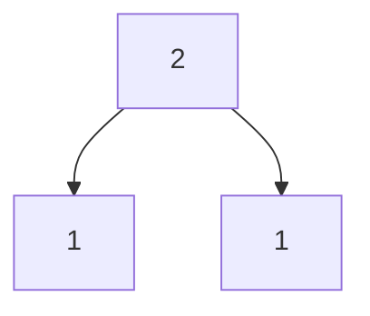
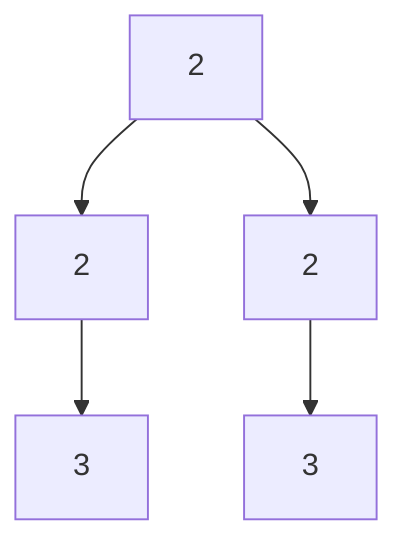

# Find Duplicate Subtrees

## Problem

Given the root of a binary tree, find all duplicate subtrees. A subtree is considered duplicate if there exists another subtree elsewhere in the tree with identical structure and matching node values.

Two subtrees are identical when they have the same structure (same arrangement of nodes) and every corresponding node has the same value. For example, two subtrees where both have a root with value 2, a left child with value 4, and no right child are duplicates.

Return a list containing one representative root node from each group of duplicates. If the same subtree pattern appears 3 times, you only need to return it once in your result. The order of returned subtrees doesn't matter.

Important clarification: this problem asks you to detect structurally identical subtrees anywhere in the tree, not just subtrees that appear at the same level or position. A small subtree on the left side could have a duplicate deep in the right subtree.

For example, in a tree where the structure `[2,4]` (a node with value 2 and a left child 4) appears twice at different locations, that's one duplicate pattern you should report. If single-node subtrees with value 4 appear three times, that's another duplicate pattern.

## Why This Matters

This problem teaches tree serialization, a fundamental technique for converting hierarchical structures into comparable linear representations. This skill is essential for tree comparison, caching tree computations, network transmission of tree data, and database indexing of hierarchical records. The post-order traversal pattern (process children before parent) appears throughout tree algorithms and teaches you to build solutions bottom-up. Understanding how to hash complex structures efficiently applies to deduplication systems, version control (detecting identical file trees), and structural pattern matching in compilers or abstract syntax trees. The hash map technique for duplicate detection generalizes to finding repeated patterns in any structured data.

## Examples

**Diagram:**



**Example 1:** Input: [1,2,3,4,null,2,4,null,null,4]
- Duplicate subtree 1: [2,4] (appears at positions under root's left and right)
- Duplicate subtree 2: [4] (appears 3 times as leaf nodes)
- Output: [[2,4], [4]]



**Example 2:** Input: [2,1,1]
- Duplicate subtree: [1] (appears twice as leaves)
- Output: [[1]]



**Example 3:** Input: [2,2,2,3,null,3,null]
- Duplicate subtrees: [2,3] appears twice
- Output: [[2,3]]


## Why This Matters

Tree problems develop recursive thinking and hierarchical data navigation. Mastering tree traversals unlocks graph algorithms.

## Constraints

- The number of the nodes in the tree will be in the range [1, 5000]
- -200 <= Node.val <= 200

## Think About

1. What makes this problem challenging? What's the core difficulty?
2. Can you identify subproblems? Do they overlap?
3. What invariants must be maintained?
4. Is there a mathematical relationship to exploit?

## Approach Hints

<details>
<summary>Hint 1: Tree Serialization Strategy</summary>

To detect duplicate subtrees, you need a way to compare subtree structures. The key insight is to serialize each subtree into a unique string representation. Use post-order traversal (left-right-root) to build a string for each subtree. For example, a tree with root 2 and left child 4 might serialize to "4,#,#,2" where # represents null. This allows you to use a hash map to track which serializations you've seen.

</details>

<details>
<summary>Hint 2: Hash Map for Duplicate Detection</summary>

Create a hash map that maps serialized subtree strings to their frequency count. As you traverse the tree recursively (post-order):
1. Serialize the current subtree
2. Check if this serialization has been seen before
3. If seen exactly once before, add the current node to results (to avoid duplicates in output)
4. Increment the count for this serialization

This way, you identify duplicates without adding the same pattern multiple times to your result.

</details>

<details>
<summary>Hint 3: Post-Order Traversal Implementation</summary>

Post-order traversal is crucial because you need to know the serialization of child subtrees before processing the parent. The pattern is:
```
def serialize(node):
    if not node: return "#"
    left_str = serialize(node.left)
    right_str = serialize(node.right)
    current = f"{left_str},{right_str},{node.val}"
    # Update hash map and check for duplicates
    return current
```
This ensures each subtree is fully processed before its parent.

</details>

## Complexity Analysis

| Approach | Time Complexity | Space Complexity | Notes |
|----------|----------------|------------------|-------|
| Post-Order + Serialization | O(n²) | O(n²) | Each node visited once, but string operations are O(height) |
| Hash Map with Tuple IDs | O(n) | O(n) | Use tuple/hash instead of string concatenation |
| Post-Order with Integer IDs | O(n) | O(n) | Assign unique IDs to avoid string operations |

## Common Mistakes

**Mistake 1: Not Handling Null Nodes in Serialization**
```python
# WRONG: Missing null markers leads to ambiguous serializations
def serialize(node):
    if not node:
        return ""
    left = serialize(node.left)
    right = serialize(node.right)
    return f"{left},{node.val},{right}"
    # Problem: [1,2] and [1,null,2] both serialize to ",1,2"

# CORRECT: Include null markers for unambiguous representation
def serialize(node):
    if not node:
        return "#"
    left = serialize(node.left)
    right = serialize(node.right)
    return f"{left},{right},{node.val}"
```

**Mistake 2: Adding Duplicates to Result Multiple Times**
```python
# WRONG: Adding to result every time we see a duplicate
def findDuplicateSubtrees(root):
    count = {}
    result = []

    def serialize(node):
        if not node: return "#"
        s = f"{serialize(node.left)},{serialize(node.right)},{node.val}"
        count[s] = count.get(s, 0) + 1
        if count[s] > 1:  # Wrong: adds multiple times
            result.append(node)
        return s

    serialize(root)
    return result

# CORRECT: Only add when count becomes exactly 2
def findDuplicateSubtrees(root):
    count = {}
    result = []

    def serialize(node):
        if not node: return "#"
        s = f"{serialize(node.left)},{serialize(node.right)},{node.val}"
        count[s] = count.get(s, 0) + 1
        if count[s] == 2:  # Only first duplicate occurrence
            result.append(node)
        return s

    serialize(root)
    return result
```

**Mistake 3: Using Pre-Order Instead of Post-Order**
```python
# WRONG: Pre-order doesn't correctly identify subtree structure
def serialize(node):
    if not node: return "#"
    # Process root first - doesn't capture subtree uniquely
    result = str(node.val)
    result += "," + serialize(node.left)
    result += "," + serialize(node.right)
    return result

# CORRECT: Post-order processes children first
def serialize(node):
    if not node: return "#"
    left = serialize(node.left)
    right = serialize(node.right)
    # Process root last, after knowing children
    return f"{left},{right},{node.val}"
```

## Variations

| Variation | Description | Difficulty |
|-----------|-------------|------------|
| Find All Duplicate Occurrences | Return all nodes, not just one per group | Easy |
| Count Duplicate Subtrees | Return only the count of duplicate patterns | Easy |
| Largest Duplicate Subtree | Find the duplicate subtree with maximum nodes | Medium |
| K-Duplicate Subtrees | Find subtrees appearing at least k times | Medium |
| Isomorphic Duplicate Subtrees | Consider mirror images as duplicates | Hard |

## Practice Checklist

- [ ] First attempt (30 min)
- [ ] Understand post-order traversal importance
- [ ] Implement serialization with null markers
- [ ] Handle duplicate counting correctly
- [ ] Test with edge cases: single node, all unique, all identical leaves
- [ ] Review after 1 day
- [ ] Review after 3 days
- [ ] Review after 1 week
- [ ] Attempt variation: largest duplicate subtree

**Strategy**: See [Tree Pattern](../strategies/data-structures/trees.md)
