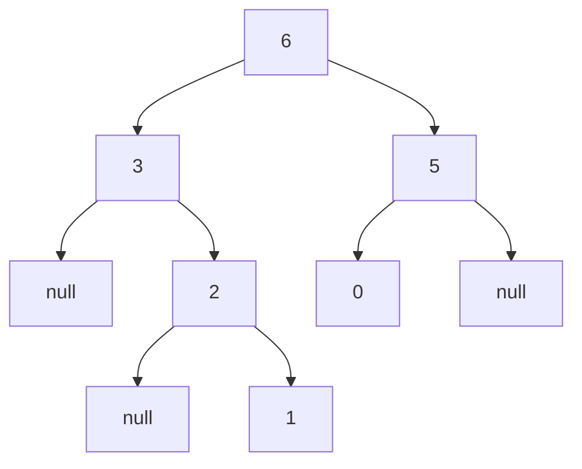

# Maximum Binary Tree

## Problem

Given an integer array `nums` with unique values, construct a special binary tree using this recursive algorithm:

1. Find the maximum element in the array - this becomes the root node
2. Everything to the left of the maximum (all elements appearing before it in the array) forms the left subtree
3. Everything to the right of the maximum (all elements appearing after it) forms the right subtree
4. Recursively apply this same process to build the left and right subtrees

Return the root of this constructed tree.

For example, with `nums = [3,2,1,6,0,5]`:
- Maximum is 6 at index 3, so root = 6
- Left elements [3,2,1] form the left subtree: max is 3, so left child = 3, with [2,1] as its right subtree
- Right elements [0,5] form the right subtree: max is 5, so right child = 5, with [0] as its left child

Important: "left" and "right" refer to array position, not value. Elements appearing before the maximum in the array go to the left subtree regardless of their numeric value. The construction is completely determined by array order and maximum finding.

Note that this is a divide-and-conquer problem: you split the array at each maximum and recursively solve smaller subproblems. The base case is when the subarray is empty (return null).

## Why This Matters

This problem teaches the divide-and-conquer paradigm on trees, a pattern fundamental to quicksort, mergesort, and binary search tree operations. The technique of "find pivot, split, recurse" appears throughout algorithm design when you can break a problem into independent subproblems. Learning to pass array indices (start, end) instead of creating new array slices is a critical optimization that reduces space complexity and improves cache performance - a pattern used in production code for efficiency. Tree construction from arrays appears in heap building, expression parsing, and segment tree implementation. Understanding the recursive structure here builds intuition for more complex tree construction problems where you need to infer structure from traversals.

## Examples

**Example:**

Input: nums = [3,2,1,6,0,5]
Output: [6,3,5,null,2,0,null,null,1]

```
Tree Structure:
      6
     / \
    3   5
     \   \
      2   0
       \
        1
```



Explanation: The maximum element is 6 at index 3. Elements before it [3,2,1] form the left subtree, and elements after it [0,5] form the right subtree. This process continues recursively for each subtree.


## Why This Matters

This problem combines array manipulation with tree construction, teaching you how to transform linear data into hierarchical structures. The divide-and-conquer approach mirrors techniques used in sorting algorithms and data structure design.

## Constraints

- 1 <= nums.length <= 1000
- 0 <= nums[i] <= 1000
- All integers in nums are **unique**.

## Think About

1. What makes this problem challenging? What's the core difficulty?
2. Can you identify subproblems? Do they overlap?
3. What invariants must be maintained?
4. Is there a mathematical relationship to exploit?

## Approach Hints

<details>
<summary>Hint 1: Divide and Conquer Pattern</summary>

This problem follows the classic divide-and-conquer paradigm. For any subarray:
1. Find the maximum element (this becomes the root)
2. Split the array at the maximum into left and right subarrays
3. Recursively build left and right subtrees

The base case is when the subarray is empty (return null) or has one element (return a leaf node). Think about how to efficiently find the maximum in each recursive call.

</details>

<details>
<summary>Hint 2: Recursive Implementation with Indices</summary>

Instead of creating new array slices (which costs O(n) per call), pass the original array with start and end indices:
```
def construct(nums, left, right):
    if left > right: return None
    max_idx = find_max_index(nums, left, right)
    root = TreeNode(nums[max_idx])
    root.left = construct(nums, left, max_idx - 1)
    root.right = construct(nums, max_idx + 1, right)
    return root
```
This avoids unnecessary array copying while maintaining clarity.

</details>

<details>
<summary>Hint 3: Optimization with Monotonic Stack</summary>

While the recursive approach works, there's an O(n) solution using a monotonic decreasing stack. The insight: as you scan left to right, maintain a stack where each element can potentially be a root. When you encounter a larger element, it becomes the root of previous smaller elements. This builds the tree in a single pass, but the recursive solution is more intuitive and sufficient for interview settings.

</details>

## Complexity Analysis

| Approach | Time Complexity | Space Complexity | Notes |
|----------|----------------|------------------|-------|
| Recursive (Naive) | O(n²) | O(n) | Finding max takes O(n) at each level, n levels worst case |
| Recursive (Optimized) | O(n log n) | O(n) | Average case when tree is balanced |
| Monotonic Stack | O(n) | O(n) | Single pass solution, more complex to understand |

## Common Mistakes

**Mistake 1: Creating New Array Slices**
```python
# WRONG: Inefficient array slicing in each recursive call
def constructMaximumBinaryTree(nums):
    if not nums:
        return None
    max_val = max(nums)
    max_idx = nums.index(max_val)

    root = TreeNode(max_val)
    # Costly: creates new arrays each time
    root.left = constructMaximumBinaryTree(nums[:max_idx])
    root.right = constructMaximumBinaryTree(nums[max_idx+1:])
    return root

# CORRECT: Use indices to avoid array copying
def constructMaximumBinaryTree(nums):
    def build(left, right):
        if left > right:
            return None
        max_idx = left
        for i in range(left, right + 1):
            if nums[i] > nums[max_idx]:
                max_idx = i

        root = TreeNode(nums[max_idx])
        root.left = build(left, max_idx - 1)
        root.right = build(max_idx + 1, right)
        return root

    return build(0, len(nums) - 1)
```

**Mistake 2: Incorrect Index Boundaries**
```python
# WRONG: Off-by-one errors in recursive calls
def build(nums, left, right):
    if left >= right:  # Wrong: should be left > right
        return None
    max_idx = find_max(nums, left, right)
    root = TreeNode(nums[max_idx])
    root.left = build(nums, left, max_idx)      # Wrong: includes max_idx
    root.right = build(nums, max_idx, right)    # Wrong: includes max_idx
    return root

# CORRECT: Proper boundary handling
def build(nums, left, right):
    if left > right:  # Correct base case
        return None
    max_idx = find_max(nums, left, right)
    root = TreeNode(nums[max_idx])
    root.left = build(nums, left, max_idx - 1)   # Exclude max_idx
    root.right = build(nums, max_idx + 1, right) # Exclude max_idx
    return root
```

**Mistake 3: Not Handling Empty Input**
```python
# WRONG: Missing null check
def constructMaximumBinaryTree(nums):
    max_idx = nums.index(max(nums))  # Fails on empty array
    root = TreeNode(nums[max_idx])
    # ... rest of code

# CORRECT: Handle edge cases
def constructMaximumBinaryTree(nums):
    if not nums:
        return None
    return build(nums, 0, len(nums) - 1)

def build(nums, left, right):
    if left > right:
        return None
    # ... rest of code
```

## Variations

| Variation | Description | Difficulty |
|-----------|-------------|------------|
| Minimum Binary Tree | Use minimum elements as roots instead | Easy |
| Maximum Binary Tree II | Build tree with additional insertion operations | Medium |
| Balanced Maximum Tree | Ensure the tree remains balanced | Hard |
| Range Maximum Tree | Support range queries on the constructed tree | Hard |
| K-Maximum Tree | Use k-th largest element at each level | Medium |

## Practice Checklist

- [ ] First attempt (30 min)
- [ ] Understand divide-and-conquer approach
- [ ] Implement with index-based recursion
- [ ] Trace through example: [3,2,1,6,0,5]
- [ ] Handle edge cases: single element, sorted arrays
- [ ] Review after 1 day
- [ ] Review after 3 days
- [ ] Review after 1 week
- [ ] Attempt optimization: monotonic stack solution

**Strategy**: See [Array Pattern](../prerequisites/trees.md)
