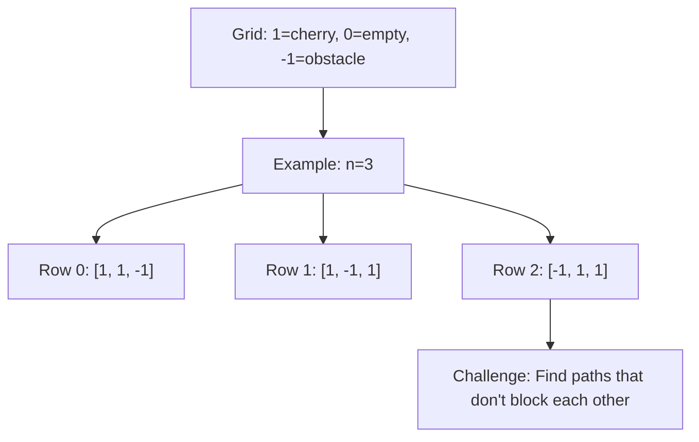

# Cherry Pickup

## Problem

You're navigating an `n x n` grid to collect cherries. The grid contains three types of cells:
- `0` - Empty cell (can walk through)
- `1` - Cherry (collect it when you walk through, then it becomes empty)
- `-1` - Thorn/obstacle (can't walk through)

The challenge is to make a round trip that maximizes cherry collection:

1. **Forward journey**: Start at the top-left corner `(0, 0)` and reach the bottom-right corner `(n-1, n-1)` using only right and down moves
2. **Return journey**: Go back from `(n-1, n-1)` to `(0, 0)` using only left and up moves
3. When you pass through a cell with a cherry, you collect it and it disappears (becomes 0)
4. If there's no valid path connecting the corners (blocked by obstacles), return 0

Here's the crucial insight that makes this problem tricky: the two journeys interact. Cherries you collect on the way down aren't available on the way back. A greedy approach of maximizing each journey independently fails because the paths influence each other.

**Diagram:**



The naive approach of "optimize forward path, then optimize return path" doesn't work. If you greedily take all cherries going down, you might block yourself from a better overall solution that leaves some cherries for the return trip.

## Why This Matters

This problem teaches a powerful reframing technique: instead of modeling it as one person making two trips, think of it as **two people walking simultaneously** from top-left to bottom-right. When both people land on the same cell, they share the cherry (count it once). This transformation eliminates the dependency between trips and makes the problem solvable with dynamic programming.

The skill of reframing a problem into an equivalent but more tractable form is crucial in algorithm design. This same "simultaneous paths" technique appears in multi-agent pathfinding, parallel resource allocation, and game theory problems.

This problem also introduces 3D dynamic programming where you track the state of multiple actors simultaneously. The state space is `(steps_taken, person1_row, person2_row)`, teaching you to handle higher-dimensional DP states that arise in complex optimization problems.

## Examples

**Example 1:**
- Input: `grid = [[1,1,-1],[1,-1,1],[-1,1,1]]`
- Output: `0`

## Constraints

- n == grid.length
- n == grid[i].length
- 1 <= n <= 50
- grid[i][j] is -1, 0, or 1.
- grid[0][0] != -1
- grid[n - 1][n - 1] != -1

## Think About

1. What makes this problem challenging? What's the core difficulty?
2. Can you identify subproblems? Do they overlap?
3. What invariants must be maintained?
4. Is there a mathematical relationship to exploit?

## Approach Hints

<details>
<summary>Hint 1: Reframe as Two Simultaneous Paths</summary>

Instead of thinking about going to the end and then returning, consider this key insight: a round trip is equivalent to two people starting at `(0,0)` and both walking to `(n-1, n-1)` simultaneously, each taking different paths.

When both people land on the same cell at the same time, they share that cherry (count it only once). This transformation eliminates the complexity of "cherry already picked" tracking.

The number of moves for each person is the same: `(2n - 2)` moves total (since you need `n-1` moves right and `n-1` moves down).

</details>

<details>
<summary>Hint 2: 3D DP State Design</summary>

Define your DP state as `dp[k][i1][i2]` where:
- `k` is the number of steps taken (both people take the same number of steps)
- `i1` is the row position of person 1
- `i2` is the row position of person 2
- The columns can be derived: `j1 = k - i1` and `j2 = k - i2`

At each step, both people can move either down or right, giving us 4 possible transitions:
1. Both move down: `(i1+1, i2+1)`
2. Person 1 down, Person 2 right: `(i1+1, i2)`
3. Person 1 right, Person 2 down: `(i1, i2+1)`
4. Both move right: `(i1, i2)`

</details>

<details>
<summary>Hint 3: Cherry Collection Logic</summary>

For each state `dp[k][i1][i2]`, the cherries collected are:
- If `(i1, j1) == (i2, j2)`: collect `grid[i1][j1]` (same cell, count once)
- Otherwise: collect `grid[i1][j1] + grid[i2][j2]` (different cells, count both)

Handle obstacles by marking states as invalid (`-1` or negative infinity) if either position lands on an obstacle.

Base case: `dp[0][0][0] = grid[0][0]` (both start at origin)

Final answer: `dp[2n-2][n-1][n-1]` (both at bottom-right corner)

</details>

## Complexity Analysis

| Approach | Time Complexity | Space Complexity | Notes |
|----------|----------------|------------------|-------|
| Brute Force (try all paths) | O(4^n) | O(n) | Exponential - not feasible |
| Naive DP (separate trips) | O(n^4) | O(n^2) | Incorrect - doesn't handle shared cherries |
| 3D DP (simultaneous paths) | O(n^3) | O(n^3) | Correct approach with k, i1, i2 states |
| Optimized 3D DP | O(n^3) | O(n^2) | Space-optimized by only keeping current k layer |

## Common Mistakes

### Mistake 1: Treating as Two Independent Problems
```python
# Wrong: Computing forward and backward paths separately
def cherryPickup(grid):
    # Find max cherries from (0,0) to (n-1,n-1)
    forward_max = maxPathSum(grid, 0, 0, n-1, n-1)
    # Mark collected cherries as 0
    # Find max cherries from (n-1,n-1) to (0,0)
    backward_max = maxPathSum(grid, n-1, n-1, 0, 0)
    # This is incorrect - paths interact!
    return forward_max + backward_max
```

**Fix:** Model as two simultaneous paths:
```python
# Correct: Two people walking simultaneously
def cherryPickup(grid):
    n = len(grid)
    dp = [[[float('-inf')] * n for _ in range(n)] for _ in range(2*n-1)]
    dp[0][0][0] = grid[0][0]
    # Process both paths together...
```

### Mistake 2: Not Handling Shared Cells
```python
# Wrong: Always counting cherries twice
cherries = grid[i1][j1] + grid[i2][j2]  # Always adds both
```

**Fix:** Check if positions are the same:
```python
# Correct: Count shared cell only once
if i1 == i2 and j1 == j2:
    cherries = grid[i1][j1]  # Same cell, count once
else:
    cherries = grid[i1][j1] + grid[i2][j2]  # Different cells
```

### Mistake 3: Incorrect Obstacle Handling
```python
# Wrong: Not checking obstacles before transition
dp[k][i1][i2] = max(all_previous_states) + cherries
```

**Fix:** Validate positions before transitions:
```python
# Correct: Check for obstacles
if grid[i1][j1] == -1 or grid[i2][j2] == -1:
    dp[k][i1][i2] = float('-inf')  # Invalid state
else:
    # Compute valid transitions...
```

## Variations

| Variation | Difference | Difficulty |
|-----------|-----------|------------|
| Cherry Pickup II | Two people start at top, move to bottom in single pass | Hard |
| Maximum Gold Collection | Can move in all 4 directions with backtracking | Medium |
| Robot Path with Obstacles | Single robot, count unique paths | Medium |
| Multi-Agent Path Finding | More than 2 agents with different goals | Hard |
| Treasure Collection with Time Limit | Limited moves constraint | Hard |

## Practice Checklist

- [ ] First attempt (within 30 minutes)
- [ ] Understand why two separate trips don't work
- [ ] Implement 3D DP solution
- [ ] Handle edge cases (obstacles, no valid path)
- [ ] Review after 1 day
- [ ] Review after 3 days
- [ ] Review after 1 week
- [ ] Can explain simultaneous path reframing
- [ ] Attempted Cherry Pickup II variation

**Strategy**: See [Dynamic Programming Pattern](../strategies/patterns/dynamic-programming.md)
