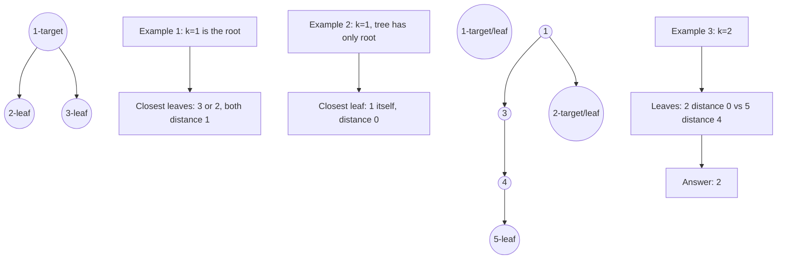

# Closest Leaf in a Binary Tree

## Problem

Given a binary tree with unique node values and a target value `k`, find the leaf node that's closest to the node containing value `k`. Return that leaf's value.

**Distance** is measured by counting edges in the shortest path between two nodes. A **leaf** is any node with no children (both left and right are null).

Here's what makes this problem interesting: in a tree, you normally traverse downward from parent to children, but the closest leaf might be in a completely different subtree, requiring you to go **up** to an ancestor and then down a different branch.

**Diagram:**



Consider this example where upward traversal matters:
```
        1
       / \
      2   3
     /
    4 (target k=4)
   / \
  5   6
```
If the target is node 4, the leaves in its subtree are 5 and 6 (both distance 1). But if you go up to node 2, then to node 1, then down to node 3 (if 3 were a leaf), that might also be close. The challenge is efficiently exploring in all directions, not just downward.

The key insight is to transform the tree into a bidirectional graph by adding parent pointers, then use breadth-first search from the target node. BFS guarantees you find the closest leaf because it explores nodes in order of increasing distance.

## Why This Matters

This problem teaches a fundamental technique: converting a tree into an undirected graph to enable bidirectional traversal. In tree problems, you're often limited to moving parent-to-child, but many questions require exploring in all directions. Adding parent pointers transforms the tree into a graph where you can move freely.

This pattern appears in many tree problems: finding all nodes at distance K from a target, computing distances between arbitrary nodes, or finding paths that don't follow the parent-child hierarchy. It's also foundational for understanding tree-to-graph transformations in network routing and filesystem traversal.

The BFS technique you'll use here (starting from an arbitrary node and finding the nearest node with a property) is widely applicable: finding the nearest exit in a maze, computing shortest paths in unweighted graphs, and level-order processing in any tree-like structure. Recognizing when BFS is appropriate versus DFS is a crucial algorithmic skill.

## Constraints

- The number of nodes in the tree is in the range [1, 1000].
- 1 <= Node.val <= 1000
- All the values of the tree are **unique**.
- There exist some node in the tree where Node.val == k.

## Think About

1. What makes this problem challenging? What's the core difficulty?
2. Can you identify subproblems? Do they overlap?
3. What invariants must be maintained?
4. Is there a mathematical relationship to exploit?

## Approach Hints

<details>
<summary>Hint 1: Convert Tree to Undirected Graph</summary>

The key insight is that in a tree, you can only traverse downward (to children), but to find the closest leaf, you might need to go UP to the parent and then down a different subtree.

Transform the tree into an undirected graph by storing parent pointers. For each node, track:
- Its left child (if exists)
- Its right child (if exists)
- Its parent (if exists)

This allows bidirectional traversal. Use a DFS/BFS pass to build an adjacency list or parent map.

</details>

<details>
<summary>Hint 2: BFS from Target Node</summary>

Once you have the graph representation with parent connections, perform a BFS starting from the node with value `k`. This ensures you explore nodes level by level in order of increasing distance.

During BFS:
1. Start from the target node
2. Explore all neighbors (left child, right child, parent)
3. Mark visited nodes to avoid cycles
4. The first leaf node you encounter is guaranteed to be the closest

Remember to check if the target node itself is a leaf (distance 0).

</details>

<details>
<summary>Hint 3: Identifying Leaf Nodes</summary>

In the original tree structure, a leaf has no left and right children. However, after converting to a graph, you need to identify leaves differently.

A node is a leaf if:
- In the original tree, it has `node.left == None` and `node.right == None`
- Store this information during the initial tree traversal

Alternatively, during BFS, you can check if a node has only one neighbor (its parent) and no children in the original tree structure.

</details>

## Complexity Analysis

| Approach | Time Complexity | Space Complexity | Notes |
|----------|----------------|------------------|-------|
| Naive DFS from Target | O(n^2) | O(h) | Check every leaf, compute distance each time |
| Two-Pass DFS | O(n) | O(n) | Find target, then search for closest leaf |
| Tree to Graph + BFS | O(n) | O(n) | Build graph, then BFS from target |
| Optimized Single Pass | O(n) | O(h) | Clever recursion tracking distances |

## Common Mistakes

### Mistake 1: Only Searching Downward from Target
```python
# Wrong: Only searching in the subtree rooted at target
def findClosestLeaf(root, k):
    target = findNode(root, k)
    # Only searches target's subtree - misses leaves in other parts
    return findClosestLeafInSubtree(target)
```

**Fix:** Allow upward traversal through parent pointers:
```python
# Correct: Build parent map for bidirectional search
def findClosestLeaf(root, k):
    parent_map = {}
    buildParentMap(root, None, parent_map)
    target = findNode(root, k)
    # BFS can now go up and down
    return bfs(target, parent_map)
```

### Mistake 2: Not Handling Target Being a Leaf
```python
# Wrong: Assuming target is never a leaf
def findClosestLeaf(root, k):
    target = findNode(root, k)
    # Starts BFS without checking if target itself is a leaf
    return bfs(target)  # Will skip target
```

**Fix:** Check target first:
```python
# Correct: Check if target is a leaf
def findClosestLeaf(root, k):
    target = findNode(root, k)
    if not target.left and not target.right:
        return target.val  # Target itself is closest leaf
    return bfs(target)
```

### Mistake 3: Forgetting to Track Visited Nodes in Graph BFS
```python
# Wrong: Not marking visited in undirected graph
def bfs(start, graph):
    queue = [start]
    while queue:
        node = queue.pop(0)
        # Without visited set, will revisit nodes infinitely
        for neighbor in graph[node]:
            queue.append(neighbor)
```

**Fix:** Use visited set to avoid cycles:
```python
# Correct: Track visited nodes
def bfs(start, graph):
    queue = [start]
    visited = {start}
    while queue:
        node = queue.pop(0)
        if is_leaf(node):
            return node.val
        for neighbor in graph[node]:
            if neighbor not in visited:
                visited.add(neighbor)
                queue.append(neighbor)
```

## Variations

| Variation | Difference | Difficulty |
|-----------|-----------|------------|
| All Nodes Distance K | Find all nodes at distance K from target | Medium |
| Closest Leaf in N-ary Tree | Tree with variable children per node | Medium |
| Kth Closest Leaf | Find the Kth nearest leaf instead of closest | Medium |
| Closest Leaf with Constraint | Leaves must satisfy additional property | Hard |
| Bidirectional Search to Leaf | Optimize with BFS from both target and all leaves | Hard |

## Practice Checklist

- [ ] First attempt (within 30 minutes)
- [ ] Build parent pointer/adjacency list correctly
- [ ] Implement BFS with visited tracking
- [ ] Handle edge case where target is a leaf
- [ ] Review after 1 day
- [ ] Review after 3 days
- [ ] Review after 1 week
- [ ] Can explain tree-to-graph transformation
- [ ] Attempted "All Nodes Distance K" variation

**Strategy**: See [Tree Pattern](../strategies/data-structures/trees.md)
