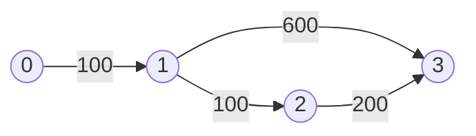
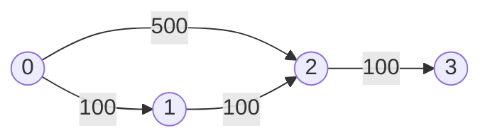

# Cheapest Flights Within K Stops

## Problem

You're planning a trip in a flight network connecting `n` cities (numbered `0` through `n-1`). The available flights are given as an array where each element `flights[i] = [from, to, price]` represents a direct flight from city `from` to city `to` costing `price` dollars.

Given a starting city `src`, destination city `dst`, and maximum number of intermediate stops `k`, find the cheapest total price to travel from source to destination. If no valid route exists within the stop limit, return `-1`.

This is a constrained shortest path problem. Unlike standard shortest path algorithms that simply find the cheapest route, you must also respect the stop limit. The globally cheapest path might use too many stops and be invalid, while a more expensive direct route might be the answer.

For example, if there's a cheap path with 3 stops but k=1 (at most 1 stop allowed), you need to find a different, possibly more expensive path that uses 1 or fewer stops.

The key challenge is tracking both cost and number of stops simultaneously. Traditional Dijkstra's algorithm tracks only cost, so you'll need to modify it or use dynamic programming to handle this dual constraint.


**Diagram:**



Example 1: Find cheapest flight from city 0 to city 3 with at most 1 stop
- Flight path: 0 → 1 → 3 costs 700
- Flight path: 0 → 1 → 2 → 3 costs 400 (cheapest, but requires 2 stops)
- With k=1: Answer is 700



Example 2: Find cheapest flight from city 0 to city 3 with at most 0 stops
- Direct flight doesn't exist
- Answer is -1


## Why This Matters

This problem extends classical shortest path algorithms (Dijkstra, Bellman-Ford) to handle additional constraints beyond simple cost minimization. Real-world optimization problems often have multiple competing objectives and hard constraints - finding feasible solutions within budget, time, or resource limits.

The modified Bellman-Ford approach teaches you dynamic programming on graphs, where you build solutions incrementally by considering one more step at a time. This pattern appears in many network optimization problems.

Understanding when the "cheapest" path isn't actually optimal (due to constraints) is crucial in systems design, logistics, and resource allocation. Flight routing, network packet routing, and delivery planning all face similar tradeoffs between cost and path length.

## Constraints

- 1 <= n <= 100
- 0 <= flights.length <= (n * (n - 1) / 2)
- flights[i].length == 3
- 0 <= fromi, toi < n
- fromi != toi
- 1 <= pricei <= 10⁴
- There will not be any multiple flights between two cities.
- 0 <= src, dst, k < n
- src != dst

## Think About

1. What makes this problem challenging? What's the core difficulty?
2. Can you identify subproblems? Do they overlap?
3. What invariants must be maintained?
4. Is there a mathematical relationship to exploit?

## Approach Hints

<details>
<summary>🔑 Key Insight</summary>
This is a shortest path problem with constraints. Unlike standard shortest path algorithms, you need to track both the cost AND the number of stops. The cheapest path overall might not be the cheapest path within k stops. Think about how Dijkstra's algorithm or BFS could be modified to handle this additional constraint.
</details>

<details>
<summary>🎯 Main Approach</summary>
Use a modified Bellman-Ford algorithm or BFS with a priority queue (Dijkstra-like approach). For each city, track the minimum cost to reach it with a specific number of stops. Process nodes level by level (representing stops), updating costs when you find a cheaper route. Alternatively, use dynamic programming where dp[stops][city] represents the minimum cost to reach the city with at most 'stops' intermediate stops.
</details>

<details>
<summary>⚡ Optimization Tip</summary>
Avoid revisiting states unnecessarily. Use a priority queue to process cheaper routes first, but remember that a more expensive route with fewer stops might lead to the optimal solution. Consider pruning: if you've already reached the destination with fewer stops at a lower cost, you can skip exploring more expensive paths. Also, since k is at most n-1, you can limit iterations to k+1 levels.
</details>

## Complexity Analysis

| Approach | Time | Space | Notes |
|----------|------|-------|-------|
| BFS with Queue | O(k * E) | O(n) | E is number of flights, processes each edge up to k+1 times |
| Bellman-Ford DP | O(k * E) | O(n) | k+1 iterations, relaxing all edges each time |
| Dijkstra with PQ | O(E * log(n * k)) | O(n * k) | Optimal for sparse graphs, may visit states multiple times |

## Common Mistakes

1. **Using standard Dijkstra's without tracking stops**
   ```python
   # Wrong: Only tracking minimum cost ignores stop constraint
   while pq:
       cost, city = heappop(pq)
       if city == dst:
           return cost

   # Correct: Track both cost and stops
   while pq:
       cost, city, stops = heappop(pq)
       if city == dst:
           return cost
       if stops <= k:
           # explore neighbors
   ```

2. **Not handling the case where direct flight is cheaper**
   ```python
   # Wrong: Assuming more stops always means checking more paths
   # May miss that a direct flight (0 stops) is optimal

   # Correct: Initialize with all direct flights from source
   for dest, price in flights_from[src]:
       heappush(pq, (price, dest, 0))
   ```

3. **Revisiting states inefficiently**
   ```python
   # Wrong: Visiting same city multiple times without bounds
   visited = set()
   if city in visited:
       continue

   # Correct: Track best cost for each (city, stops) combination
   if (city, stops) in visited and visited[(city, stops)] <= cost:
       continue
   visited[(city, stops)] = cost
   ```

## Variations

| Variation | Difficulty | Key Difference |
|-----------|------------|----------------|
| Network Delay Time | Medium | Find time for signal to reach all nodes (no stop constraint) |
| Path With Maximum Probability | Medium | Maximize probability instead of minimizing cost |
| Minimum Cost to Reach Destination in Time | Hard | Add time constraints in addition to cost |
| Cheapest Flights with Layover Costs | Hard | Each intermediate stop incurs additional cost |

## Practice Checklist

- [ ] Solved without hints
- [ ] Optimal time complexity achieved
- [ ] Clean, readable code
- [ ] Handled all edge cases
- [ ] Can explain approach clearly

**Spaced Repetition:** Review in 1 day → 3 days → 7 days → 14 days → 30 days

---
**Strategy Reference:** [Dynamic Programming](../../strategies/patterns/dynamic-programming.md)
