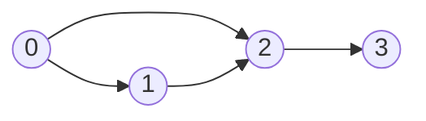

# All Paths From Source to Target

## Problem

You are given a directed acyclic graph (DAG) with `n` nodes labeled from `0` to `n-1`. Your goal is to find all possible paths that start at node `0` and end at node `n-1`.

The graph is represented as an adjacency list where `graph[i]` is an array containing all nodes you can reach directly from node `i`. For example, if `graph[2] = [3, 4]`, there are directed edges from node 2 to nodes 3 and 4.

A directed acyclic graph (DAG) is a directed graph with no cycles - you can never follow edges and return to a node you've already visited. This property is crucial because it guarantees that your path enumeration will terminate without needing cycle detection.

For instance, consider this graph:


From node 0 to node 3, there are two paths: `[0→1→2→3]` and `[0→2→3]`.

Return all paths in any order. Each path should be represented as a list of node numbers, and different paths are independent - finding one doesn't affect finding others.

## Why This Matters

Path enumeration in graphs is fundamental to many real-world applications: finding all possible routes in a network, enumerating dependency chains in build systems, discovering execution paths in program control flow analysis, and planning alternative strategies in decision trees. The DAG property makes this tractable - in graphs with cycles, path enumeration could be infinite. This problem teaches the backtracking pattern, where you explore all possibilities by making choices, exploring their consequences, and then undoing choices to try alternatives. This pattern extends beyond graphs to constraint satisfaction problems, combinatorial generation, and search problems.

## Constraints

- n == graph.length
- 2 <= n <= 15
- 0 <= graph[i][j] < n
- graph[i][j] != i (i.e., there will be no self-loops).
- All the elements of graph[i] are **unique**.
- The input graph is **guaranteed** to be a **DAG**.

## Think About

1. What makes this problem challenging? What's the core difficulty?
2. Can you identify subproblems? Do they overlap?
3. What invariants must be maintained?
4. Is there a mathematical relationship to exploit?

## Approach Hints

<details>
<summary>🔑 Key Insight</summary>
This is a path enumeration problem in a DAG (Directed Acyclic Graph). Since it's a DAG, there are no cycles, so you don't need a visited set to avoid infinite loops. Use backtracking or DFS to explore all paths from source to target. Each path is independent.
</details>

<details>
<summary>🎯 Main Approach</summary>
Use depth-first search (DFS) with backtracking. Start from node 0 with an empty path. At each node, add it to the current path. If you reach node n-1, add a copy of the current path to results. Otherwise, recursively explore all neighbors. After exploring, backtrack by removing the current node from the path. Since it's a DAG, no visited tracking needed.
</details>

<details>
<summary>⚡ Optimization Tip</summary>
You can optimize by building paths during recursion without explicit backtracking. Pass path + [node] as a new list in each recursive call instead of modifying a shared path list. This is cleaner but uses slightly more space. For this problem size (n <= 15), both approaches work well.
</details>

## Complexity Analysis

| Approach | Time | Space | Notes |
|----------|------|-------|-------|
| DFS Backtracking | O(2^n * n) | O(n) | In worst case (complete graph), exponential paths |
| DFS with Path Copying | O(2^n * n) | O(2^n * n) | Each path stored separately |
| BFS with Paths | O(2^n * n) | O(2^n * n) | Store paths in queue |
| Optimal | O(2^n * n) | O(n) | DFS with backtracking minimizes space |

## Common Mistakes

1. **Using visited set in a DAG**
   ```python
   # Wrong: Visited set prevents finding all paths
   def all_paths(graph):
       visited = set()
       def dfs(node, path):
           if node in visited:
               return
           visited.add(node)
           # ... will miss paths that reuse nodes

   # Correct: No visited set needed in DAG
   def all_paths(graph):
       result = []
       def dfs(node, path):
           path.append(node)
           if node == len(graph) - 1:
               result.append(path[:])
           else:
               for neighbor in graph[node]:
                   dfs(neighbor, path)
           path.pop()
       dfs(0, [])
       return result
   ```

2. **Not making a copy of path when adding to results**
   ```python
   # Wrong: Appending reference to mutable path
   if node == n - 1:
       result.append(path)  # path will be modified later

   # Correct: Append a copy
   if node == n - 1:
       result.append(path[:])  # or list(path)
   ```

3. **Forgetting to backtrack**
   ```python
   # Wrong: Not removing node after exploring
   def dfs(node, path):
       path.append(node)
       if node == n - 1:
           result.append(path[:])
       for neighbor in graph[node]:
           dfs(neighbor, path)
       # Missing: path.pop()

   # Correct: Backtrack by removing node
   def dfs(node, path):
       path.append(node)
       if node == n - 1:
           result.append(path[:])
       for neighbor in graph[node]:
           dfs(neighbor, path)
       path.pop()  # Backtrack
   ```

## Variations

| Variation | Difficulty | Key Difference |
|-----------|------------|----------------|
| Path Sum II | Medium | Tree paths with sum constraint |
| Binary Tree Paths | Easy | All root-to-leaf paths in binary tree |
| Unique Paths III | Hard | Grid-based path finding with obstacles |
| All Paths from Source Lead to Destination | Medium | Verify all paths lead to specific destination |

## Practice Checklist

- [ ] Solved without hints
- [ ] Optimal time complexity achieved
- [ ] Clean, readable code
- [ ] Handled all edge cases
- [ ] Can explain approach clearly

**Spaced Repetition:** Review in 1 day → 3 days → 7 days → 14 days → 30 days

---
**Strategy Reference:** [Backtracking](../../strategies/patterns/backtracking.md)
