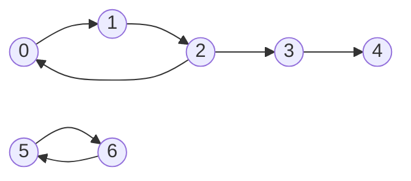

# Find Eventual Safe States

## Problem

Given a directed graph with `n` nodes numbered `0` to `n - 1`, you need to identify which nodes are "eventually safe." The graph is represented as a 2D integer array `graph`, where `graph[i]` lists all nodes directly reachable from node `i`.

Let's define the key concepts. A **terminal node** is a node with no outgoing edges (an empty list in the graph). A **safe node** is one where every possible path starting from it eventually reaches a terminal node. Think of it like exploring paths in a maze: a node is safe if all routes from that node eventually lead you to an exit, rather than trapping you in a cycle.

The challenge here is detecting cycles. If a node is part of a cycle or can reach a cycle, it's unsafe because you could walk forever without reaching a terminal node. For example, if nodes 0, 1, and 2 form a cycle (0→1→2→0), then all three are unsafe. However, if node 3 only connects to node 4, and node 4 is terminal, then both 3 and 4 are safe.

You need to return an array containing all safe nodes, sorted in ascending order. Note that terminal nodes are always safe by definition since they have no outgoing edges.


**Diagram:**



Example: Identifying safe and unsafe nodes
- Node 4: Terminal node (no outgoing edges) - SAFE
- Node 3: Only path goes to node 4 (terminal) - SAFE
- Nodes 0, 1, 2: Form a cycle (0→1→2→0) - UNSAFE
- Nodes 5, 6: Form a cycle (5→6→5) - UNSAFE

Safe nodes: [4, 3] (or any node that eventually reaches a terminal)


## Why This Matters

Cycle detection in directed graphs is fundamental to many real-world applications. This concept appears in dependency resolution (package managers checking for circular dependencies), deadlock detection in operating systems, course prerequisite validation at universities, and build systems determining compilation order. The pattern of exploring paths and tracking visited states using graph coloring is a cornerstone technique in graph algorithms. Mastering this problem strengthens your ability to reason about state transitions and develop recursive solutions with memoization, which are critical skills for system design interviews.

## Examples

**Example 1:**
- Input: `graph = [[1,2,3,4],[1,2],[3,4],[0,4],[]]`
- Output: `[4]`
- Explanation: Node 4 is the sole terminal node since it has no outgoing edges, making it the only safe node.

## Constraints

- n == graph.length
- 1 <= n <= 10⁴
- 0 <= graph[i].length <= n
- 0 <= graph[i][j] <= n - 1
- graph[i] is sorted in a strictly increasing order.
- The graph may contain self-loops.
- The number of edges in the graph will be in the range [1, 4 * 10⁴].

## Think About

1. What makes this problem challenging? What's the core difficulty?
2. Can you identify subproblems? Do they overlap?
3. What invariants must be maintained?
4. Is there a mathematical relationship to exploit?

**Strategy**: See [Array Pattern](../strategies/data-structures/graphs.md)

## Approach Hints

<details>
<summary>Key Insight</summary>
A node is safe if and only if it doesn't lead to a cycle. Use graph coloring with three states: unvisited (white), visiting (gray), and safe (green/black). During DFS, if you encounter a gray node, you've found a cycle. Terminal nodes (no outgoing edges) are always safe. A node is safe if all nodes it can reach are safe.
</details>

<details>
<summary>Main Approach</summary>
Use DFS with memoization to detect cycles. For each node, perform DFS to explore all reachable nodes. Mark nodes as "visiting" during traversal, and "safe" or "unsafe" after exploring. If during DFS you visit a node that's currently in the "visiting" state, you've detected a cycle, and all nodes in that path are unsafe. Otherwise, if all neighbors are safe, the current node is safe. Use a color array to track states.
</details>

<details>
<summary>Optimization Tip</summary>
Instead of recalculating for each node, use memoization. Once you determine a node is safe or unsafe, cache the result. This prevents redundant DFS traversals. You can also solve this by reversing the graph and using topological sort - terminal nodes become sources in the reversed graph, and safe nodes are those reachable from terminal nodes.
</details>

## Complexity Analysis

| Approach | Time | Space | Notes |
|----------|------|-------|-------|
| DFS with Memoization | O(V + E) | O(V) | V = nodes, E = edges, visit each node/edge once |
| Topological Sort (Reverse Graph) | O(V + E) | O(V + E) | Build reverse graph, use Kahn's algorithm |

## Common Mistakes

1. **Not handling cycles correctly**
   ```python
   # Wrong: Not detecting cycles during DFS
   def dfs(node):
       if node in visited:
           return True
       visited.add(node)
       for neighbor in graph[node]:
           if not dfs(neighbor):
               return False
       return True

   # Correct: Use three states to detect cycles
   def dfs(node):
       if color[node] != WHITE:
           return color[node] == GREEN
       color[node] = GRAY  # Currently visiting
       for neighbor in graph[node]:
           if color[neighbor] == GRAY or not dfs(neighbor):
               return False
       color[node] = GREEN  # Safe
       return True
   ```

2. **Forgetting to mark terminal nodes**
   ```python
   # Wrong: Not recognizing terminal nodes as safe
   if len(graph[node]) > 0:
       # Only process non-terminal nodes

   # Correct: Terminal nodes are automatically safe
   if not graph[node]:  # Terminal node
       return True
   ```

3. **Not sorting the result**
   ```python
   # Wrong: Returning unsorted list
   return [i for i in range(n) if is_safe(i)]

   # Correct: Result must be in ascending order (but iteration already gives this)
   # The list comprehension naturally produces sorted order
   return [i for i in range(n) if is_safe(i)]
   ```

## Variations

| Variation | Difficulty | Key Difference |
|-----------|------------|----------------|
| Course Schedule II | Medium | Find topological ordering of courses |
| Detect Cycle in Directed Graph | Medium | Simply detect if any cycle exists |
| Critical Connections in Network | Hard | Find bridges in undirected graph |

## Practice Checklist

- [ ] Solved without hints
- [ ] Optimal time complexity achieved
- [ ] Clean, readable code
- [ ] Handled all edge cases
- [ ] Can explain approach clearly

**Spaced Repetition:** Review in 1 day → 3 days → 7 days → 14 days → 30 days

---
**Strategy Reference:** [Graph Traversal - DFS](../../strategies/data-structures/graphs.md)
