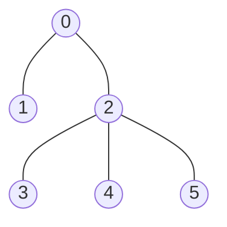

# Sum of Distances in Tree

## Problem

You're given an undirected tree with `n` nodes numbered from `0` to `n-1`. A tree is a connected graph with exactly `n-1` edges connecting all nodes without forming any cycles.

The tree structure is represented by:
- An integer `n` (the number of nodes)
- An array `edges` where each element `edges[i] = [ai, bi]` represents a bidirectional edge connecting node `ai` to node `bi`

Your task is to compute, for **each node**, the total distance to **all other nodes** in the tree. Distance is measured as the number of edges in the shortest path between two nodes.

Return an array `answer` of length `n`, where `answer[i]` represents the sum of distances from node `i` to every other node in the tree.

**Visual Example:**

Consider this tree with n=6 nodes:



For node 0: distances are [0→1: 1, 0→2: 1, 0→3: 2, 0→4: 2, 0→5: 2], sum = 8

For node 2: distances are [2→0: 1, 2→1: 2, 2→3: 1, 2→4: 1, 2→5: 1], sum = 6

For node 1: distances are [1→0: 1, 1→2: 2, 1→3: 3, 1→4: 3, 1→5: 3], sum = 12

The answer array would be `[8, 12, 6, 10, 10, 10]`.

## Why This Matters

This problem introduces the **tree re-rooting technique**, an advanced dynamic programming pattern for efficiently computing tree metrics from different perspectives. Instead of recalculating from scratch for each node (O(n²)), re-rooting uses the relationship between parent and child answers to compute all values in O(n). This technique appears in network optimization problems (finding optimal server locations), social network analysis (computing influence metrics), and distributed systems (calculating communication costs). Mastering this pattern will help you recognize when incremental updates can replace full recomputation.

## Constraints

- 1 <= n <= 3 * 10⁴
- edges.length == n - 1
- edges[i].length == 2
- 0 <= ai, bi < n
- ai != bi
- The given input represents a valid tree.

## Think About

1. What makes this problem challenging? What's the core difficulty?
2. Can you identify subproblems? Do they overlap?
3. What invariants must be maintained?
4. Is there a mathematical relationship to exploit?

## Approach Hints

<details>
<summary>🔑 Key Insight</summary>
Computing distances from each node independently would be O(n²). Instead, use dynamic programming on trees: compute the answer for one root, then use the relationship between parent and child answers to compute all others in one additional pass. When moving from parent to child, some nodes get closer and some get farther.
</details>

<details>
<summary>🎯 Main Approach</summary>
Two DFS passes: (1) First DFS computes for each node the count of nodes in its subtree and the sum of distances to all nodes in its subtree when treating that node as root of the subtree. (2) Second DFS uses re-rooting technique: when moving from node u to child v, the answer changes by (total_nodes - subtree_size[v]) - subtree_size[v] because nodes not in v's subtree move 1 step farther, while nodes in v's subtree move 1 step closer.
</details>

<details>
<summary>⚡ Optimization Tip</summary>
The re-rooting formula is key: answer[child] = answer[parent] - count[child] + (n - count[child]). This means when we move root from parent to child, we subtract count[child] (nodes in child's subtree get 1 closer, reducing total by their count) and add (n - count[child]) (nodes outside child's subtree get 1 farther, increasing total by their count).
</details>

## Complexity Analysis

| Approach | Time | Space | Notes |
|----------|------|-------|-------|
| Brute Force | O(n²) | O(n) | BFS/DFS from each node |
| Optimal (Re-rooting) | O(n) | O(n) | Two DFS passes |

## Common Mistakes

1. **Not understanding the re-rooting technique**
   ```python
   # Wrong: Computing from scratch for each node
   def compute_distances(node):
       # BFS from this node to all others
       total = 0
       for other in range(n):
           total += distance(node, other)
       return total

   # Correct: Use relationship between parent and child
   def dfs2(node, parent):
       for child in graph[node]:
           if child != parent:
               # Re-root from node to child
               ans[child] = ans[node] - count[child] + (n - count[child])
               dfs2(child, node)
   ```

2. **Incorrect subtree size calculation**
   ```python
   # Wrong: Not including the node itself
   def dfs1(node, parent):
       count[node] = 0
       for child in graph[node]:
           if child != parent:
               dfs1(child, node)
               count[node] += count[child]

   # Correct: Include current node
   def dfs1(node, parent):
       count[node] = 1  # Count the node itself
       for child in graph[node]:
           if child != parent:
               dfs1(child, node)
               count[node] += count[child]
   ```

3. **Forgetting to track parent to avoid cycles**
   ```python
   # Wrong: Revisiting parent in tree traversal
   def dfs(node):
       for neighbor in graph[node]:
           dfs(neighbor)  # May create infinite loop

   # Correct: Track parent to avoid going back
   def dfs(node, parent):
       for child in graph[node]:
           if child != parent:  # Don't revisit parent
               dfs(child, node)
   ```

## Variations

| Variation | Difficulty | Key Difference |
|-----------|------------|----------------|
| Sum of distances in weighted tree | Hard | Edge weights affect distance calculations |
| Diameter of tree | Medium | Find maximum distance between any two nodes |
| Center of tree | Medium | Find node(s) minimizing maximum distance |

## Practice Checklist

- [ ] Solved without hints
- [ ] Optimal time complexity achieved
- [ ] Clean, readable code
- [ ] Handled all edge cases
- [ ] Can explain approach clearly

**Spaced Repetition:** Review in 1 day → 3 days → 7 days → 14 days → 30 days

---
**Strategy Reference:** [Tree DP and Re-rooting](../../strategies/patterns/tree-dp.md) | [DFS Traversal](../../prerequisites/trees.md)
