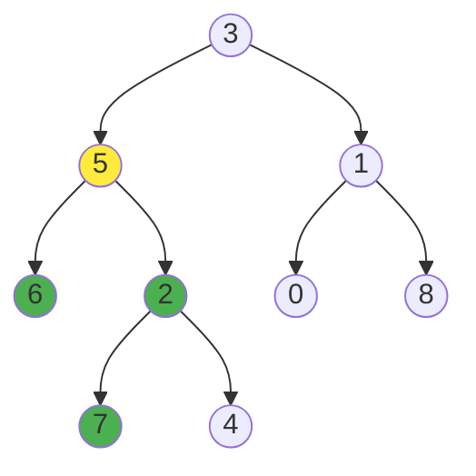

# All Nodes Distance K in Binary Tree

## Problem

Imagine you're working with a binary tree where you need to find all nodes that are exactly `k` steps away from a specific target node. The distance is measured by counting edges - each parent-child connection counts as one step.

You're given:
- `root`: The root node of a binary tree
- `target`: A reference to a specific node within that tree (not just its value - the actual node object)
- `k`: The distance you're looking for

Your task is to return a list of values for all nodes that are exactly `k` edges away from the target node. The challenge is that you need to search in all directions - down toward descendants, up toward ancestors, and even to the other side of the tree through common ancestors.

For example, if the target is node 5 and k=2:
- You might find nodes 2 steps down in its subtree
- You might find its grandparent 2 steps up
- You might find its sibling's children by going 1 step up to the parent, then 1 step down to a sibling

The output can be in any order.


**Diagram:**



Example: If target = 5 and k = 2, nodes at distance 2 from node 5 are: 7, 4, 1


## Why This Matters

This problem teaches you to work with tree structures bidirectionally, which is crucial for many real-world applications. Think about social network analysis where you want to find all friends exactly 2 connections away ("friends of friends"), or organizational hierarchies where you need to find all employees at a specific reporting distance. It appears in network routing protocols that need to find all servers within a certain hop count, file system navigation to find files at a specific directory depth relative to a point, and recommendation systems that traverse relationship graphs. The key technique of building parent pointers to enable upward traversal is fundamental to many tree algorithms.

## Examples

**Example 1:**
- Input: `root = [1], target = 1, k = 3`
- Output: `[]`

## Constraints

- The number of nodes in the tree is in the range [1, 500].
- 0 <= Node.val <= 500
- All the values Node.val are **unique**.
- target is the value of one of the nodes in the tree.
- 0 <= k <= 1000

## Think About

1. What makes this problem challenging? What's the core difficulty?
2. Can you identify subproblems? Do they overlap?
3. What invariants must be maintained?
4. Is there a mathematical relationship to exploit?

## Approach Hints

<details>
<summary>🔑 Key Insight</summary>
Trees don't have parent pointers by default, but you need to traverse upward from the target. Build a parent map first using DFS/BFS from root. Then treat the tree as an undirected graph and perform BFS from the target node, tracking distance. All nodes at distance k form the answer.
</details>

<details>
<summary>🎯 Main Approach</summary>
Two-phase approach: (1) Build a parent dictionary by traversing from root: parent[node] = node.parent. (2) Perform BFS from the target node, treating the tree as an undirected graph (visit children and parent). Track visited nodes to avoid cycles. Collect all nodes at distance exactly k.
</details>

<details>
<summary>⚡ Optimization Tip</summary>
Use a set to track visited nodes during BFS to prevent revisiting. The parent map can be built in O(n) time with a single traversal. BFS from target is also O(n) worst case. Total time: O(n), space: O(n) for parent map and visited set.
</details>

## Complexity Analysis

| Approach | Time | Space | Notes |
|----------|------|-------|-------|
| DFS from target only | O(n^2) | O(n) | Need to find parent at each level - inefficient |
| Build parent map + BFS | O(n) | O(n) | One pass to build map, one BFS from target |
| Recursive with subtree distance | O(n) | O(h) | Track distance in subtrees, more complex |

## Common Mistakes

1. **Not building parent pointers**
   ```python
   # Wrong: Can't traverse upward without parent pointers
   def bfs(node, k):
       queue = [(node, 0)]
       while queue:
           curr, dist = queue.pop(0)
           if dist == k:
               result.append(curr.val)
           # Can only go to children, missing upward paths
           if curr.left: queue.append((curr.left, dist + 1))
           if curr.right: queue.append((curr.right, dist + 1))

   # Correct: Build parent map first
   parent = {}
   def build_parent(node, par=None):
       if node:
           parent[node] = par
           build_parent(node.left, node)
           build_parent(node.right, node)
   ```

2. **Not tracking visited nodes**
   ```python
   # Wrong: Will revisit nodes and create infinite loop
   queue = [(target, 0)]
   while queue:
       node, dist = queue.pop(0)
       if dist == k:
           result.append(node.val)
       for neighbor in [node.left, node.right, parent[node]]:
           if neighbor:
               queue.append((neighbor, dist + 1))  # Cycles!

   # Correct: Track visited
   visited = {target}
   queue = [(target, 0)]
   while queue:
       node, dist = queue.pop(0)
       if dist == k:
           result.append(node.val)
       for neighbor in [node.left, node.right, parent[node]]:
           if neighbor and neighbor not in visited:
               visited.add(neighbor)
               queue.append((neighbor, dist + 1))
   ```

3. **Finding target inefficiently**
   ```python
   # Wrong: Searching for target every time
   def find_target(node, target_val):
       if not node: return None
       if node.val == target_val: return node
       return find_target(node.left, target_val) or find_target(node.right, target_val)

   # Correct: Target is given as parameter (not value)
   # If given as value, find once and store reference
   target_node = find_target(root, target)  # Do once
   # Then use target_node for BFS
   ```

## Variations

| Variation | Difficulty | Key Difference |
|-----------|------------|----------------|
| Binary Tree Right Side View | Medium | Find nodes at each level, different traversal |
| Lowest Common Ancestor | Medium | Find relationship between nodes |
| Amount of Time for Binary Tree to be Infected | Medium | Similar BFS but count maximum distance |
| Distribute Coins in Binary Tree | Medium | Tree traversal with different objective |

## Practice Checklist

- [ ] Solved without hints
- [ ] Optimal time complexity achieved
- [ ] Clean, readable code
- [ ] Handled all edge cases
- [ ] Can explain approach clearly

**Spaced Repetition:** Review in 1 day → 3 days → 7 days → 14 days → 30 days

---
**Strategy Reference:** [Tree BFS with Parent Tracking](../../strategies/patterns/breadth-first-search.md)
