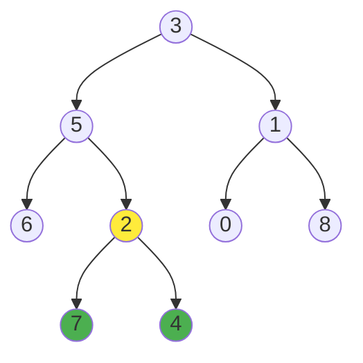

# Smallest Subtree with all the Deepest Nodes

## Problem

Given the `root` of a binary tree, you need to find the smallest subtree that contains all the deepest nodes in the tree.

First, let's clarify the terms:
- **Depth** of a node: The number of edges from the root to that node. The root has depth 0, its children have depth 1, and so on.
- **Deepest nodes**: The nodes with the maximum depth in the tree (the ones farthest from the root).
- **Subtree**: A node together with all of its descendants.

Your task is to return the root of the smallest subtree that contains all deepest nodes.

For example, consider this tree:
```
        3
       / \
      5   1
     / \ / \
    6  2 0  8
      / \
     7   4
```

The deepest nodes are 7 and 4 (both at depth 3). The smallest subtree containing both is rooted at node 2, because node 2 is the lowest common ancestor of nodes 7 and 4.

If there's only one deepest node, that node itself is the answer.


**Diagram:**



The deepest nodes are 7 and 4 (both at depth 3).
The smallest subtree containing both is rooted at node 2 (highlighted in yellow).


## Why This Matters

This problem combines depth calculation with finding the lowest common ancestor (LCA), two fundamental tree operations that appear constantly in real-world applications. Think about file system operations where you need to find the smallest directory containing all your deepest nested files, organizational charts where you want to find the lowest-level manager overseeing all the most junior employees in a department, or version control systems finding the common base commit for the most recent changes. The single-pass solution technique teaches you to combine multiple tree properties in one traversal, an optimization pattern that's crucial when working with large hierarchical datasets like DOM trees in web browsers or scene graphs in 3D graphics.

## Examples

**Example 1:**
- Input: `root = [1]`
- Output: `[1]`
- Explanation: When the tree has only one node, that node is both the root and the deepest, so it's returned.

**Example 2:**
- Input: `root = [0,1,3,null,2]`
- Output: `[2]`
- Explanation: Node 2 sits at the greatest depth. While subtrees rooted at nodes 2, 1, and 0 all contain this deepest node, the subtree at node 2 is the most compact.

## Constraints

- The number of nodes in the tree will be in the range [1, 500].
- 0 <= Node.val <= 500
- The values of the nodes in the tree are **unique**.

## Think About

1. What makes this problem challenging? What's the core difficulty?
2. Can you identify subproblems? Do they overlap?
3. What invariants must be maintained?
4. Is there a mathematical relationship to exploit?

## Approach Hints

<details>
<summary>🔑 Key Insight</summary>
The smallest subtree containing all deepest nodes is the Lowest Common Ancestor (LCA) of all deepest nodes. If there's only one deepest node, return that node. The key is to find depths and track which nodes are ancestors of deepest nodes.
</details>

<details>
<summary>🎯 Main Approach</summary>
Use a post-order traversal (DFS) that returns both the depth and the subtree root. For each node, recursively get (depth, node) from left and right children. If both children have the same depth, the current node is the LCA of deepest nodes in both subtrees. If one child is deeper, propagate that child's result upward. Base case: a null node has depth -1.
</details>

<details>
<summary>⚡ Optimization Tip</summary>
Solve in a single DFS pass by returning a tuple (depth, lca_node) from each recursive call. Compare left and right depths: if equal, current node is the answer for this subtree; otherwise, return the result from the deeper side. This avoids separate passes for finding depth and finding LCA.
</details>

## Complexity Analysis

| Approach | Time | Space | Notes |
|----------|------|-------|-------|
| Two-pass (depth + LCA) | O(n) | O(h) | h = height for recursion stack |
| One-pass DFS | O(n) | O(h) | Optimal, single traversal |

## Common Mistakes

1. **Returning wrong node when depths differ**
   ```python
   # Wrong: Returning current node when children have different depths
   def dfs(node):
       left_depth, left_node = dfs(node.left)
       right_depth, right_node = dfs(node.right)
       return (max(left_depth, right_depth) + 1, node)

   # Correct: Return the deeper subtree's result
   def dfs(node):
       left_depth, left_node = dfs(node.left)
       right_depth, right_node = dfs(node.right)
       if left_depth > right_depth:
           return (left_depth + 1, left_node)
       elif right_depth > left_depth:
           return (right_depth + 1, right_node)
       else:
           return (left_depth + 1, node)
   ```

2. **Not handling null nodes properly**
   ```python
   # Wrong: Not checking for null
   def dfs(node):
       left = dfs(node.left)

   # Correct: Base case for null nodes
   def dfs(node):
       if not node:
           return (-1, None)
       left = dfs(node.left)
   ```

## Variations

| Variation | Difficulty | Key Difference |
|-----------|------------|----------------|
| Lowest Common Ancestor of a Binary Tree | Medium | Find LCA of two specific nodes |
| Maximum Depth of Binary Tree | Easy | Only need to find maximum depth |
| All Nodes Distance K in Binary Tree | Medium | Distance-based tree traversal |

## Practice Checklist

- [ ] Solved without hints
- [ ] Optimal time complexity achieved
- [ ] Clean, readable code
- [ ] Handled all edge cases
- [ ] Can explain approach clearly

**Spaced Repetition:** Review in 1 day → 3 days → 7 days → 14 days → 30 days

---
**Strategy Reference:** [Tree Pattern](../../strategies/data-structures/trees.md)
