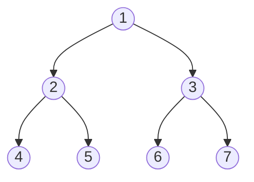

# Construct Binary Tree from Preorder and Postorder Traversal

## Problem

You're working with serialized tree data and need to reconstruct the original tree structure. You have two arrays representing different traversals of the same binary tree: `preorder` contains nodes visited in preorder sequence (root, then left subtree, then right subtree), and `postorder` contains nodes visited in postorder sequence (left subtree, then right subtree, then root). All node values in the tree are unique.

Your goal is to rebuild the original binary tree structure from these two traversal arrays and return the root node of the reconstructed tree.

Here's an important note: unlike the combination of inorder with preorder/postorder (which uniquely determines a tree), preorder and postorder alone don't always uniquely determine the tree structure. When a node has only one child, you can't tell whether it's a left child or right child from these two traversals alone. You may return any valid tree that matches both traversals.

**Diagram:**



```
Given:
Preorder:  [1, 2, 4, 5, 3, 6, 7]  (root → left → right)
Postorder: [4, 5, 2, 6, 7, 3, 1]  (left → right → root)

Reconstruction logic:
- Preorder[0] = 1 is root
- Preorder[1] = 2 is left subtree root
- Find 2 in postorder to determine left subtree size
- Recursively build left and right subtrees
```


## Why This Matters

Tree reconstruction from traversals is fundamental to understanding how compilers parse and reconstruct abstract syntax trees, how databases restore index structures from serialized data, and how distributed systems rebuild tree-based data structures from network transmissions. This problem teaches you to think recursively about divide-and-conquer strategies while managing array indices carefully. Understanding the relationship between different traversal orders is crucial for tree serialization/deserialization, which appears in file systems, compiler design, XML/JSON parsing, and any system that needs to save and restore hierarchical data. The ambiguity when using only preorder and postorder (without inorder) also teaches you important lessons about data sufficiency and the minimal information needed to uniquely reconstruct structures.

## Examples

**Example 1:**
- Input: `preorder = [1], postorder = [1]`
- Output: `[1]`
- Explanation: A tree with a single node contains only the root.

## Constraints

- 1 <= preorder.length <= 30
- 1 <= preorder[i] <= preorder.length
- All the values of preorder are **unique**.
- postorder.length == preorder.length
- 1 <= postorder[i] <= postorder.length
- All the values of postorder are **unique**.
- It is guaranteed that preorder and postorder are the preorder traversal and postorder traversal of the same binary tree.

## Think About

1. What makes this problem challenging? What's the core difficulty?
2. Can you identify subproblems? Do they overlap?
3. What invariants must be maintained?
4. Is there a mathematical relationship to exploit?

**Strategy**: See [Array Pattern](../strategies/data-structures/trees.md)

## Approach Hints

<details>
<summary>🔑 Key Insight</summary>
In preorder, the first element is the root, and the second element (if it exists) is the root of the left subtree. In postorder, the last element is the root, and the second-to-last is the root of the right subtree. Use these properties to recursively divide the arrays. The key challenge: preorder + postorder doesn't uniquely determine the tree when a node has only one child.
</details>

<details>
<summary>🎯 Main Approach</summary>
Recursive approach: preorder[0] is root. If tree has more nodes, preorder[1] is left subtree root. Find preorder[1] in postorder to determine left subtree size. Recursively build left subtree from preorder[1:1+L] and postorder[0:L], and right subtree from preorder[1+L:] and postorder[L:-1]. Use a hashmap to find indices in postorder quickly.
</details>

<details>
<summary>⚡ Optimization Tip</summary>
Create a hash map of postorder values to indices for O(1) lookup instead of O(n) search. Handle the base case when the arrays are empty or have one element. Be careful with index boundaries - when there's no left subtree (preorder[1] not in postorder or arrays too small), handle it gracefully.
</details>

## Complexity Analysis

| Approach | Time | Space | Notes |
|----------|------|-------|-------|
| Brute Force | O(n²) | O(n) | Linear search in postorder for each recursive call |
| Optimal (With HashMap) | O(n) | O(n) | Hash map for O(1) lookups, n recursive calls |

## Common Mistakes

1. **Not handling single-child ambiguity**
   ```python
   # Wrong: Assuming preorder[1] is always left child
   left_root = preorder[1]
   # When node has only right child, this fails

   # Correct: Handle edge case where subtree is empty
   if len(preorder) == 1:
       return TreeNode(preorder[0])
   left_root = preorder[1]
   ```

2. **Incorrect array slicing**
   ```python
   # Wrong: Off-by-one errors in index calculation
   left_size = postorder_map[preorder[1]]
   left_pre = preorder[1:left_size]

   # Correct: Calculate size correctly
   left_root_idx = postorder_map[preorder[1]]
   left_size = left_root_idx + 1
   left_pre = preorder[1:1+left_size]
   left_post = postorder[0:left_size]
   ```

3. **Not creating index map**
   ```python
   # Wrong: Linear search in every recursive call
   def build(preorder, postorder):
       left_idx = postorder.index(preorder[1])  # O(n)

   # Correct: Build index map once at start
   postorder_map = {val: i for i, val in enumerate(postorder)}
   def build(pre_l, pre_r, post_l, post_r):
       left_idx = postorder_map[preorder[pre_l + 1]]
   ```

## Variations

| Variation | Difficulty | Key Difference |
|-----------|------------|----------------|
| Construct Binary Tree from Inorder and Postorder | Medium | Inorder + postorder uniquely determines tree |
| Construct Binary Tree from Inorder and Preorder | Medium | Inorder + preorder uniquely determines tree |
| Construct BST from Preorder | Medium | BST property gives extra constraint |
| Verify Preorder Sequence in BST | Medium | Validation instead of construction |

## Practice Checklist

- [ ] Solved without hints
- [ ] Optimal time complexity achieved
- [ ] Clean, readable code
- [ ] Handled all edge cases
- [ ] Can explain approach clearly

**Spaced Repetition:** Review in 1 day → 3 days → 7 days → 14 days → 30 days

---
**Strategy Reference:** [Tree Construction](../../strategies/data-structures/trees.md)
