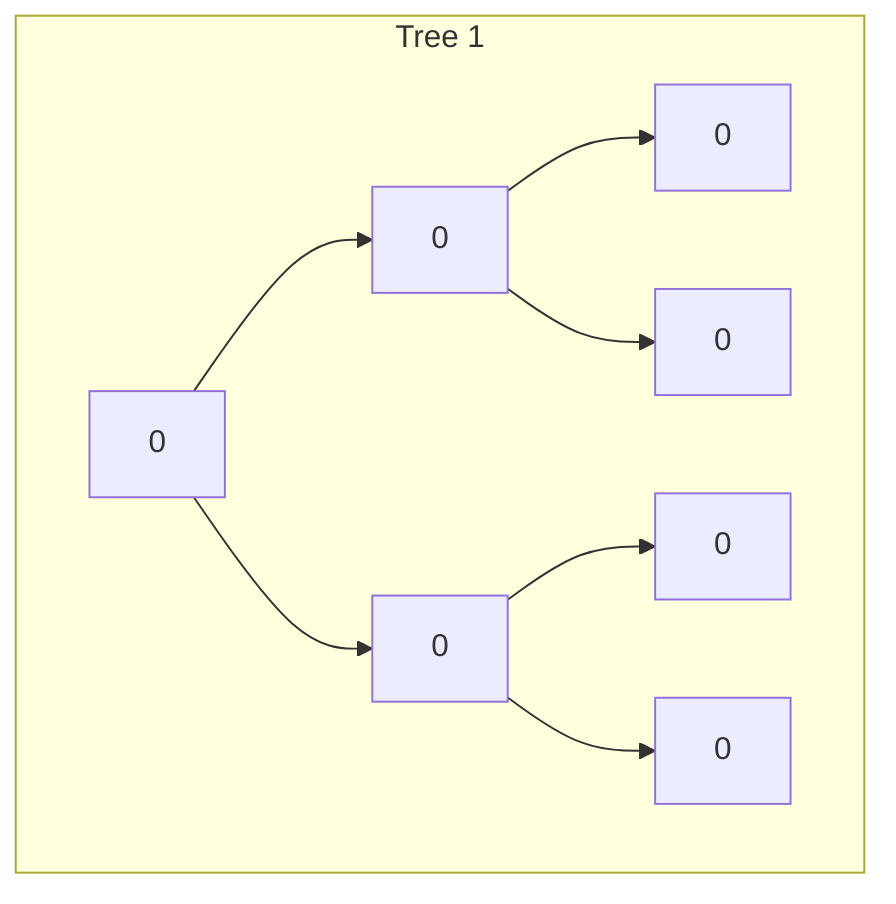

# All Possible Full Binary Trees

## Problem

Imagine you're building a tree structure generator for a computer science educational tool. Your task is to construct every structurally distinct full binary tree that contains exactly `n` nodes, where all nodes have a value of `0`.

A full binary tree follows a strict rule: every node must have either exactly zero children (making it a leaf) or exactly two children. You cannot have nodes with just one child in a full binary tree.

For example, with 3 nodes, there's only one possible full binary tree: a root with two leaf children. With 5 nodes, there are two distinct structures. As the number of nodes increases, the number of valid tree structures grows rapidly.

Return a collection containing the root node of each unique tree configuration. The order of trees in your result doesn't matter.

**Diagram:**

For n = 7, there are 5 possible full binary trees:



```
Tree 1:        Tree 2:        Tree 3:        Tree 4:        Tree 5:
    0              0              0              0              0
   / \            / \            / \            / \            / \
  0   0          0   0          0   0          0   0          0   0
 / \            / \   \        /   / \            /   \      / \
0   0          0   0   0      0   0   0          0     0    0   0
                   / \            / \                  / \      / \
                  0   0          0   0                0   0    0   0
```

Note: Each tree has exactly 7 nodes, and every non-leaf node has exactly 2 children.


## Why This Matters

Generating all valid tree structures is fundamental to understanding recursive tree construction, which appears in compiler design (expression tree generation), decision tree algorithms, game tree exploration, and parsing systems. This problem teaches you about structural recursion, memoization for avoiding redundant computation, and working with Catalan numbers (which count the number of full binary trees). The techniques here apply directly to generating all valid binary search trees, parsing ambiguous grammars, exploring game state trees in AI, and understanding the space of possible tree structures in machine learning decision trees. You'll develop skills in breaking down complex structural problems into recursive subproblems and efficiently managing the exponential search space through memoization. This is also excellent practice for interview questions involving tree generation and structural enumeration.

## Examples

**Example 1:**
- Input: `n = 3`
- Output: `[[0,0,0]]`

## Constraints

- 1 <= n <= 20

## Think About

1. What makes this problem challenging? What's the core difficulty?
2. Can you identify subproblems? Do they overlap?
3. What invariants must be maintained?
4. Is there a mathematical relationship to exploit?

**Strategy**: See [Tree Pattern](../strategies/data-structures/trees.md)

## Approach Hints

<details>
<summary>🔑 Key Insight</summary>
A full binary tree with n nodes must have an odd number of nodes (why?). For each tree, you need to split n-1 remaining nodes (after the root) between left and right subtrees, where both subtrees must also be full binary trees. This suggests a recursive structure.
</details>

<details>
<summary>🎯 Main Approach</summary>
Use recursion with memoization. For n nodes, try all ways to distribute nodes between left and right subtrees (both must get odd numbers). For each valid split (i nodes left, n-1-i nodes right), combine all possible left subtrees with all possible right subtrees. Base case: n=1 returns a single leaf node.
</details>

<details>
<summary>⚡ Optimization Tip</summary>
Memoize results to avoid recalculating the same subtree structures. Only consider odd values when splitting nodes. Skip even n values entirely as they cannot form full binary trees.
</details>

## Complexity Analysis

| Approach | Time | Space | Notes |
|----------|------|-------|-------|
| Brute Force Recursion | O(2^n) | O(2^n) | Recalculates same subtrees |
| Optimal (Memoized) | O(C_n) | O(C_n) | C_n is nth Catalan number |

Where C_n ≈ 4^n / (n^(3/2) * sqrt(π)) - exponential but with memoization reuse

## Common Mistakes

1. **Forgetting that n must be odd**
   ```python
   # Wrong: Try to build trees with even n
   def allPossibleFBT(n):
       if n == 1:
           return [TreeNode(0)]
       result = []
       for i in range(1, n):  # Includes even splits

   # Correct: Only odd n can form full binary trees
   def allPossibleFBT(n):
       if n % 2 == 0:
           return []  # Even n is impossible
       if n == 1:
           return [TreeNode(0)]
       result = []
       for i in range(1, n, 2):  # Skip by 2, only odd values
   ```

2. **Not memoizing results**
   ```python
   # Wrong: Recalculate same structures repeatedly
   def allPossibleFBT(n):
       if n == 1:
           return [TreeNode(0)]
       # No caching leads to exponential time

   # Correct: Cache intermediate results
   memo = {}
   def allPossibleFBT(n):
       if n in memo:
           return memo[n]
       # Calculate and store
       memo[n] = result
       return result
   ```

3. **Incorrect node count calculation**
   ```python
   # Wrong: Forgetting to account for root
   for i in range(n):
       left_trees = allPossibleFBT(i)
       right_trees = allPossibleFBT(n - i)

   # Correct: n = 1 (root) + left + right
   for i in range(1, n, 2):
       left_trees = allPossibleFBT(i)
       right_trees = allPossibleFBT(n - 1 - i)  # n-1-i for right
   ```

## Variations

| Variation | Difficulty | Key Difference |
|-----------|------------|----------------|
| Unique Binary Search Trees | Medium | Count BST structures, use Catalan numbers |
| Different Ways to Add Parentheses | Medium | Similar divide-and-conquer structure |
| Generate Parentheses | Medium | Generate valid combinations recursively |

## Practice Checklist

- [ ] Solved without hints
- [ ] Optimal time complexity achieved
- [ ] Clean, readable code
- [ ] Handled all edge cases
- [ ] Can explain approach clearly

**Spaced Repetition:** Review in 1 day → 3 days → 7 days → 14 days → 30 days

---
**Strategy Reference:** [Tree Patterns](../../strategies/data-structures/trees.md)
