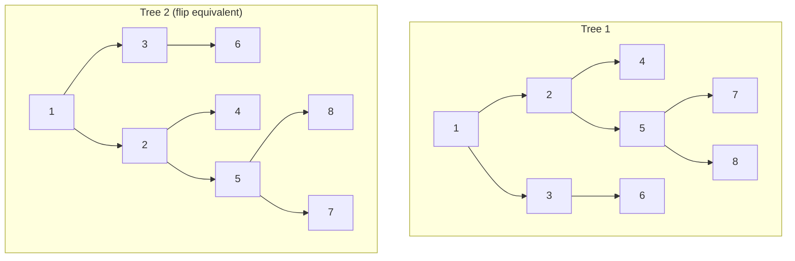

# Flip Equivalent Binary Trees

## Problem

Imagine you have two family trees and want to determine if they represent the same hierarchical relationships, but with some branches swapped. In tree terminology, we call this checking for "flip equivalence."

A **flip operation** on a binary tree involves selecting any node and swapping its left and right child subtrees. You can perform this operation on multiple nodes (or no nodes at all).

Two binary trees are considered **flip equivalent** if you can transform one tree into the other through any number of flip operations (including zero flips). Think of it like having two organizational charts that show the same reporting structure, but with children listed in different orders under their managers.

Given the roots of two binary trees `root1` and `root2`, determine whether they are flip equivalent. Return `true` if they are equivalent, `false` otherwise.

For example, consider a tree where node 1 has children 2 and 3, and node 2 has children 4 and 5. Another tree where node 1 has children 3 and 2 (swapped), and node 2 still has children 4 and 5, would be flip equivalent to the first tree because we simply flipped the children of node 1.


**Diagram:**




## Why This Matters

Flip equivalence checking appears in version control systems when comparing directory structures that may have been reorganized but contain the same content hierarchy. XML/JSON schema validators use similar logic to determine if two documents represent semantically equivalent data despite different child ordering. Compiler optimization passes employ this when comparing abstract syntax trees (ASTs) to detect equivalent code structures that can be optimized similarly. Database query optimizers check for equivalent execution plan trees where the join order differs but produces the same result. The recursive comparison pattern with multiple matching strategies teaches you how to build flexible comparison algorithms, essential for diff tools, data synchronization systems, and automated testing frameworks that need to handle structural variations.

## Examples

**Example 1:**
- Input: `root1 = [], root2 = []`
- Output: `true`

**Example 2:**
- Input: `root1 = [], root2 = [1]`
- Output: `false`

## Constraints

- The number of nodes in each tree is in the range [0, 100].
- Each tree will have **unique node values** in the range [0, 99].

## Think About

1. What makes this problem challenging? What's the core difficulty?
2. Can you identify subproblems? Do they overlap?
3. What invariants must be maintained?
4. Is there a mathematical relationship to exploit?

## Approach Hints

<details>
<summary>Key Insight</summary>
Two trees are flip equivalent if their root values match AND either (1) their children match directly (left with left, right with right) OR (2) their children match when flipped (left with right, right with left). This naturally suggests a recursive solution.
</details>

<details>
<summary>Main Approach</summary>
Use recursive DFS to compare trees. At each node, check if values match. If they do, recursively check two cases: (1) left subtrees match AND right subtrees match, OR (2) left subtree of tree1 matches right subtree of tree2 AND vice versa. Base cases handle null nodes.
</details>

<details>
<summary>Optimization Tip</summary>
You can optimize by checking both trees' structures simultaneously. Early termination when values don't match saves unnecessary recursive calls. Also consider canonical form: normalize each subtree so left child value is always less than right child value before comparison.
</details>

## Complexity Analysis

| Approach | Time | Space | Notes |
|----------|------|-------|-------|
| Recursive DFS | O(min(n1, n2)) | O(min(h1, h2)) | Visit each node once; space for recursion stack |
| Canonical Form | O(n1 + n2) | O(h1 + h2) | Convert both trees to canonical form, then compare |

## Common Mistakes

1. **Incorrect null handling**
   ```python
   # Wrong: Not handling both null cases
   def flipEquiv(root1, root2):
       if root1.val != root2.val:
           return False
       # Crashes when either root is None

   # Correct: Handle null cases first
   def flipEquiv(root1, root2):
       if not root1 and not root2:
           return True
       if not root1 or not root2:
           return False
       if root1.val != root2.val:
           return False
       # Continue with recursion
   ```

2. **Forgetting one of the two cases**
   ```python
   # Wrong: Only checking non-flipped case
   def flipEquiv(root1, root2):
       return (flipEquiv(root1.left, root2.left) and
               flipEquiv(root1.right, root2.right))

   # Correct: Check both flipped and non-flipped
   def flipEquiv(root1, root2):
       no_flip = (flipEquiv(root1.left, root2.left) and
                  flipEquiv(root1.right, root2.right))
       flipped = (flipEquiv(root1.left, root2.right) and
                  flipEquiv(root1.right, root2.left))
       return no_flip or flipped
   ```

3. **Inefficient repeated comparisons**
   ```python
   # Wrong: Redundant value checks in recursion
   # Checking values multiple times per node

   # Correct: Check value once before recursing
   if root1.val != root2.val:
       return False
   # Then only recurse on structure
   ```

## Variations

| Variation | Difficulty | Key Difference |
|-----------|------------|----------------|
| Same Tree | Easy | No flip allowed, direct comparison only |
| Symmetric Tree | Easy | One tree must be mirror of itself |
| Subtree of Another Tree | Medium | Check if one tree is flip-equivalent subtree |
| Serialize and Deserialize Binary Tree | Hard | Canonical representation useful for comparison |

## Practice Checklist

- [ ] Solved without hints
- [ ] Optimal time complexity achieved
- [ ] Clean, readable code
- [ ] Handled all edge cases
- [ ] Can explain approach clearly

**Spaced Repetition:** Review in 1 day → 3 days → 7 days → 14 days → 30 days

---
**Strategy Reference:** [Tree Patterns](../../prerequisites/trees.md)
