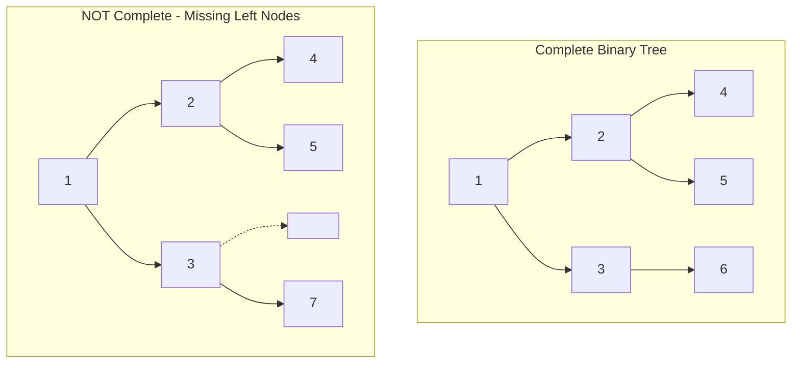

# Check Completeness of a Binary Tree

## Problem

Imagine building a family tree where you fill in people level by level, left to right, with no gaps. A complete binary tree follows this exact pattern - all levels are completely filled except possibly the last one, and the last level's nodes are pushed as far left as possible.

Given the `root` of a binary tree, determine whether it satisfies the definition of a *complete binary tree*.

A **complete binary tree** has all levels fully populated except possibly the final level. On the final level, all nodes must be positioned as far left as possible. The last level at height `h` can contain between `1` and `2^h` nodes.

For example:
```
    1
   / \
  2   3
 / \  /
4  5 6
```
This is complete - levels 0 and 1 are full, and level 2 fills from left to right.

But this is NOT complete:
```
    1
   / \
  2   3
 / \    \
4  5     7
```
There's a gap at position 6, violating the "left-to-right" requirement.


**Diagram:**



```
Complete:        Not Complete:
    1                1
   / \              / \
  2   3            2   3
 / \  /           / \    \
4  5 6           4  5     7  (gap at position 6)
```


## Why This Matters

Complete binary trees are the foundation of heap data structures, which power priority queues used in task scheduling, Dijkstra's shortest path algorithm, and event-driven simulations. They're also used in binary heap implementations for efficient sorting and in tournament brackets. Understanding tree completeness helps you recognize whether a tree can be efficiently stored in an array (complete trees map perfectly to array indices). This validation technique is crucial when implementing heaps, checking data structure invariants, and ensuring optimal space utilization in tree-based systems.

## Constraints

- The number of nodes in the tree is in the range [1, 100].
- 1 <= Node.val <= 1000

## Think About

1. What makes this problem challenging? What's the core difficulty?
2. Can you identify subproblems? Do they overlap?
3. What invariants must be maintained?
4. Is there a mathematical relationship to exploit?

## Approach Hints

<details>
<summary>Key Insight</summary>
In a complete binary tree, level-order traversal should have all nodes before encountering any null. Once you see the first null, all remaining positions must be null. Use BFS and check for this property.
</details>

<details>
<summary>Main Approach</summary>
Perform level-order traversal (BFS) using a queue. Include null nodes in the queue. Once you encounter the first null, set a flag. If you encounter any non-null node after the flag is set, the tree is not complete. If traversal completes without this violation, it's complete.
</details>

<details>
<summary>Optimization Tip</summary>
Alternative approach: assign indices to nodes as if it were a complete binary tree (root = 1, left child of i = 2i, right child = 2i+1). Count total nodes n. A tree is complete if and only if the maximum index equals n. This works because gaps would create indices larger than n.
</details>

## Complexity Analysis

| Approach | Time | Space | Notes |
|----------|------|-------|-------|
| BFS with Null Detection | O(n) | O(n) | Visit all nodes, queue holds one level at most |
| Index Assignment | O(n) | O(h) | DFS with index tracking, recursion stack |

## Common Mistakes

1. **Not including null nodes in BFS**
   ```python
   # Wrong: Only enqueueing non-null nodes
   queue = [root]
   while queue:
       node = queue.pop(0)
       if node.left:
           queue.append(node.left)
       if node.right:
           queue.append(node.right)
   # Can't detect gaps this way

   # Correct: Include nulls and check for gaps
   queue = [root]
   found_null = False
   while queue:
       node = queue.pop(0)
       if node is None:
           found_null = True
       else:
           if found_null:
               return False  # Non-null after null = incomplete
           queue.append(node.left)
           queue.append(node.right)
   ```

2. **Incorrect index calculation**
   ```python
   # Wrong: 0-based indexing for complete tree formula
   left_child = 2 * i  # Should be 2*i for 1-based

   # Correct: Use 1-based indexing
   def dfs(node, index, count):
       if not node:
           return True
       if index > count:
           return False  # Gap detected
       return (dfs(node.left, 2*index, count) and
               dfs(node.right, 2*index+1, count))
   ```

3. **Forgetting to count nodes first (index approach)**
   ```python
   # Wrong: Not knowing total count before checking indices
   def isComplete(root):
       return dfs(root, 1)  # What is max allowed index?

   # Correct: Count nodes first
   def count_nodes(node):
       if not node:
           return 0
       return 1 + count_nodes(node.left) + count_nodes(node.right)

   n = count_nodes(root)
   return dfs(root, 1, n)
   ```

## Variations

| Variation | Difficulty | Key Difference |
|-----------|------------|----------------|
| Count Complete Tree Nodes | Medium | Count nodes efficiently using completeness property |
| Maximum Depth of Binary Tree | Easy | Simpler tree property check |
| Balanced Binary Tree | Easy | Different tree structure validation |
| Verify Binary Tree | Medium | Check BST property instead of completeness |

## Practice Checklist

- [ ] Solved without hints
- [ ] Optimal time complexity achieved
- [ ] Clean, readable code
- [ ] Handled all edge cases
- [ ] Can explain approach clearly

**Spaced Repetition:** Review in 1 day → 3 days → 7 days → 14 days → 30 days

---
**Strategy Reference:** [Tree Patterns](../../strategies/data-structures/trees.md)
