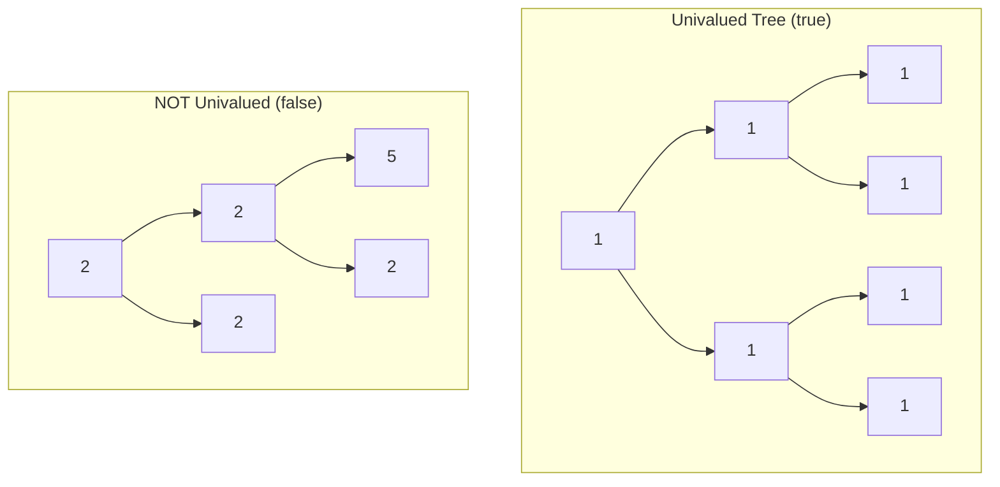

# Univalued Binary Tree

## Problem

Imagine a tree where every single node contains the exact same value—like a family tree where everyone has the same birthday, or an organizational chart where every position has the same salary. This is called a univalued (or uniform) tree.

Given the `root` of a binary tree, your task is to determine whether the entire tree is univalued. Return `true` if every node contains identical values, otherwise return `false`.

Think of it as checking whether a tree is "monotone"—completely uniform from top to bottom, left to right. Even a single different value anywhere in the tree breaks this uniformity.


**Diagram:**



```
Univalued:       Not Univalued:
    1                2
   / \              / \
  1   1            2   2
 / \ / \          /\
1  1 1  1        5  2

All same value   Different values
```


## Why This Matters

Univalued tree detection is fundamental in data validation and quality assurance systems. In database indexing, detecting whether a subtree contains uniform values helps optimize query planning—if all nodes have the same value, certain comparisons can be short-circuited. File system integrity checkers use similar logic to verify that directory structures maintain consistent permissions or ownership throughout a hierarchy. In machine learning decision trees, identifying uniform leaf nodes helps in pruning and model simplification. This problem strengthens your understanding of tree traversal patterns, which form the foundation for more complex graph algorithms used in network analysis, compiler design (abstract syntax trees), and hierarchical data processing.

## Constraints

- The number of nodes in the tree is in the range [1, 100].
- 0 <= Node.val < 100

## Think About

1. What makes this problem challenging? What's the core difficulty?
2. Can you identify subproblems? Do they overlap?
3. What invariants must be maintained?
4. Is there a mathematical relationship to exploit?

## Approach Hints

<details>
<summary>🔑 Key Insight</summary>
A tree is univalued if and only if every node has the same value as the root. This means you need to verify that all nodes match a single reference value. The recursive structure of trees makes this a natural candidate for recursion or tree traversal.
</details>

<details>
<summary>🎯 Main Approach</summary>
Use depth-first search (DFS) with recursion. Check if the current node's value matches the root value. Recursively verify that both left and right subtrees are also univalued with the same value. A node is univalued if: (1) it matches the expected value, (2) its left subtree is univalued (or null), and (3) its right subtree is univalued (or null).
</details>

<details>
<summary>⚡ Optimization Tip</summary>
Early termination: as soon as you find any node with a different value, return false immediately without checking the rest of the tree. You can also use iterative traversal (BFS or DFS with a stack) if you want to avoid recursion, but recursion is cleaner for this problem.
</details>

## Complexity Analysis

| Approach | Time | Space | Notes |
|----------|------|-------|-------|
| DFS Recursive | O(n) | O(h) | Visit each node once, h = height for call stack |
| BFS Iterative | O(n) | O(w) | Queue-based, w = max width of tree |
| Optimal | O(n) | O(h) | Recursive DFS with early termination |

## Common Mistakes

1. **Not handling null nodes correctly**
   ```python
   # Wrong: Treating null as a different value
   def is_unival(node, val):
       if node.val != val:
           return False
       return is_unival(node.left, val) and is_unival(node.right, val)
   # Fails on null nodes

   # Correct: Null nodes are considered valid
   def is_unival(node, val):
       if not node:
           return True
       if node.val != val:
           return False
       return is_unival(node.left, val) and is_unival(node.right, val)
   ```

2. **Comparing nodes instead of values**
   ```python
   # Wrong: Comparing node objects
   if node.left == node.right:
       return True

   # Correct: Compare node values
   if node.left and node.left.val != node.val:
       return False
   if node.right and node.right.val != node.val:
       return False
   ```

3. **Not propagating false values correctly**
   ```python
   # Wrong: Not using short-circuit evaluation
   left_result = is_unival(node.left, val)
   right_result = is_unival(node.right, val)
   # Still traverses right even if left is false

   # Correct: Use and operator for short-circuit
   return is_unival(node.left, val) and is_unival(node.right, val)
   # Stops early if left subtree fails
   ```

## Variations

| Variation | Difficulty | Key Difference |
|-----------|------------|----------------|
| Same Tree | Easy | Compare two trees instead of checking single value |
| Symmetric Tree | Easy | Check mirror symmetry instead of uniform value |
| Count Univalue Subtrees | Medium | Count all univalued subtrees, not just whole tree |

## Practice Checklist

- [ ] Solved without hints
- [ ] Optimal time complexity achieved
- [ ] Clean, readable code
- [ ] Handled all edge cases
- [ ] Can explain approach clearly

**Spaced Repetition:** Review in 1 day → 3 days → 7 days → 14 days → 30 days

---
**Strategy Reference:** [Tree Traversal](../../prerequisites/trees.md)
