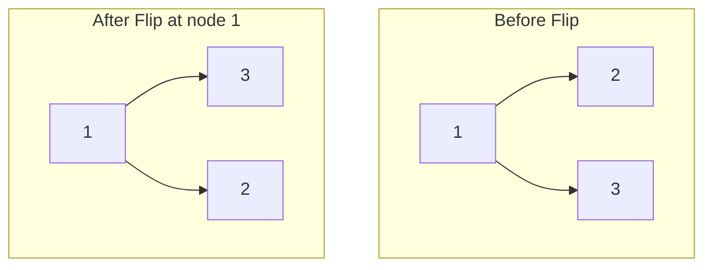

# Flip Binary Tree To Match Preorder Traversal

## Problem

Imagine you have a binary tree and a target arrangement you want to achieve, represented as a preorder traversal sequence. You have one tool at your disposal: the ability to swap the left and right children of any node, like flipping a mirror image.

Given:
- The `root` of a binary tree with `n` nodes (each labeled uniquely from `1` to `n`)
- A `voyage` array representing your desired preorder traversal sequence

Your challenge is to determine the minimum set of swaps needed to make the tree's preorder traversal match the `voyage` sequence.

**Swap operation visualization:**



```
Before:      After flipping at node 1:
   1              1
  / \            / \
 2   3          3   2

Swap left and right children
```

Return a list of node values where you performed swaps. If it's impossible to match the voyage through any sequence of swaps, return `[-1]`. The order of values in your result doesn't matter.

## Why This Matters

Tree manipulation with structural constraints appears throughout software engineering. Syntax tree transformations in compilers often need to reorganize code structures while maintaining semantic equivalence—similar to how you maintain node relationships while swapping children. Database query optimizers rearrange query execution trees (swapping join orders) to match optimal execution plans. In game development, decision trees for AI agents get restructured based on learned patterns while preserving logical flow. Version control systems use tree diff algorithms that identify minimal transformations between directory structures. Understanding when tree transformations are possible versus impossible is crucial for XML/HTML DOM manipulation, file system synchronization algorithms, and Abstract Syntax Tree (AST) refactoring tools used in IDEs.

## Constraints

- The number of nodes in the tree is n.
- n == voyage.length
- 1 <= n <= 100
- 1 <= Node.val, voyage[i] <= n
- All the values in the tree are **unique**.
- All the values in voyage are **unique**.

## Think About

1. What makes this problem challenging? What's the core difficulty?
2. Can you identify subproblems? Do they overlap?
3. What invariants must be maintained?
4. Is there a mathematical relationship to exploit?

**Strategy**: See [Tree Pattern](../strategies/data-structures/trees.md)

## Approach Hints

<details>
<summary>Key Insight</summary>
Perform a preorder traversal while maintaining an index pointer into the voyage array. At each node, the current node's value must match voyage[index]. If the left child doesn't match the next expected value in voyage but the right child does, we need to flip. If neither child matches when expected, it's impossible.
</details>

<details>
<summary>Main Approach</summary>
Use DFS with preorder traversal. Keep a global index tracking position in voyage array. For each node: (1) Check if current node matches voyage[index], if not return impossible. (2) Increment index. (3) If left child exists but doesn't match voyage[index], check if right child matches - if yes, flip and record the flip. (4) Recursively process children in the appropriate order based on whether we flipped.
</details>

<details>
<summary>Optimization Tip</summary>
Use a list to store flipped nodes and a global/nonlocal index variable to track position in voyage. Return early with [-1] as soon as you detect impossibility rather than continuing traversal. The index must be shared across all recursive calls to maintain correct position in voyage array.
</details>

## Complexity Analysis

| Approach | Time | Space | Notes |
|----------|------|-------|-------|
| DFS Preorder | O(n) | O(n) | Visit each node once; recursion stack depth up to n |
| Optimal | O(n) | O(h) | Same time; space can be O(h) for balanced trees where h=log(n) |

## Common Mistakes

1. **Using local index instead of shared reference**
   ```python
   # Wrong: Each recursive call has its own index
   def dfs(node, index):
       if not node:
           return index
       index += 1
       left_idx = dfs(node.left, index)
       # index is not updated from left subtree

   # Correct: Use nonlocal or class variable
   index = 0
   def dfs(node):
       nonlocal index
       if not node:
           return True
       if node.val != voyage[index]:
           return False
       index += 1
   ```

2. **Not checking impossibility before recursing**
   ```python
   # Wrong: Continue even when current node doesn't match
   def dfs(node):
       if node.left and node.left.val != voyage[index]:
           flip.append(node.val)
           # But what if right also doesn't match?

   # Correct: Verify current node first
   if not node or node.val != voyage[index]:
       return False
   index += 1
   # Then check children
   ```

3. **Flipping when not necessary**
   ```python
   # Wrong: Flip whenever left doesn't match
   if node.left and node.left.val != voyage[index]:
       flip.append(node.val)
       return dfs(node.right) and dfs(node.left)

   # Correct: Only flip if right child matches
   if node.left and node.left.val != voyage[index]:
       if node.right and node.right.val == voyage[index]:
           flip.append(node.val)
           return dfs(node.right) and dfs(node.left)
       return False
   ```

## Variations

| Variation | Difficulty | Key Difference |
|-----------|------------|----------------|
| Binary Tree Preorder Traversal | Easy | Just traverse, no flipping |
| Verify Preorder Serialization | Medium | Check if sequence represents valid tree |
| Serialize/Deserialize Binary Tree | Hard | Convert tree to/from string |
| Path Sum II | Medium | Find all root-to-leaf paths with target sum |

## Practice Checklist

- [ ] Solved without hints
- [ ] Optimal time complexity achieved
- [ ] Clean, readable code
- [ ] Handled all edge cases (empty tree, single node, impossible cases)
- [ ] Can explain approach clearly

**Spaced Repetition:** Review in 1 day → 3 days → 7 days → 14 days → 30 days

---
**Strategy Reference:** [Trees](../../strategies/data-structures/trees.md)
