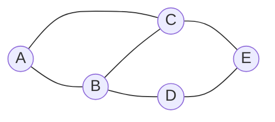
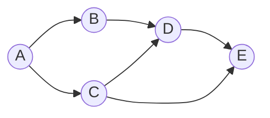
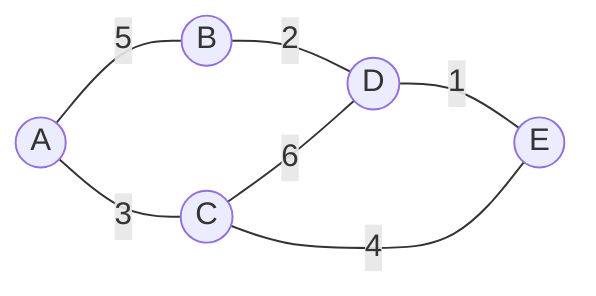
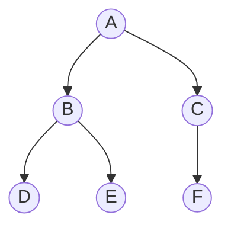
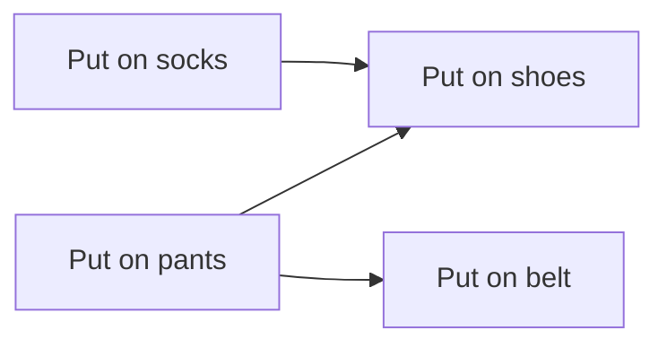

# Graph Data Structures and Algorithms

## What is a Graph?

A **graph** is a data structure consisting of **vertices** (nodes) and **edges** (connections between nodes). Graphs model relationships and networks, making them fundamental to solving problems involving connections, paths, and relationships.

## Graph Terminology

### Basic Concepts

- **Vertex (Node)**: A fundamental unit representing an entity
- **Edge**: A connection between two vertices
- **Directed Graph (Digraph)**: Edges have direction (A → B is different from B → A)
- **Undirected Graph**: Edges have no direction (A — B is same as B — A)
- **Weighted Graph**: Edges have associated weights/costs
- **Unweighted Graph**: All edges are equal (or have weight 1)

### Advanced Concepts

- **Degree**: Number of edges connected to a vertex
  - **In-degree**: Number of incoming edges (directed graphs)
  - **Out-degree**: Number of outgoing edges (directed graphs)
- **Path**: Sequence of vertices where each adjacent pair is connected by an edge
- **Cycle**: Path that starts and ends at the same vertex
- **Connected Graph**: Path exists between any two vertices
- **Strongly Connected**: In directed graphs, path exists in both directions between any two vertices
- **DAG (Directed Acyclic Graph)**: Directed graph with no cycles

## Graph Types Visualization

### Undirected Graph



**Use cases**: Social networks (friendship), road networks (bidirectional roads)

### Directed Graph



**Use cases**: Web page links, task dependencies, Twitter follows

### Weighted Graph



**Use cases**: Road networks with distances, network latency, flight costs

### Tree (Special Graph)



**Properties**: Connected, acyclic, N vertices and N-1 edges

## Graph Representations

There are two primary ways to represent graphs in code:

### 1. Adjacency List

Stores for each vertex a list of its neighbors.

```python
# Undirected graph
graph = {
    'A': ['B', 'C'],
    'B': ['A', 'C', 'D'],
    'C': ['A', 'B', 'E'],
    'D': ['B', 'E'],
    'E': ['C', 'D']
}

# Directed graph
graph = {
    'A': ['B', 'C'],
    'B': ['D'],
    'C': ['D', 'E'],
    'D': ['E'],
    'E': []
}

# Weighted graph
graph = {
    'A': [('B', 5), ('C', 3)],
    'B': [('D', 2)],
    'C': [('D', 6), ('E', 4)],
    'D': [('E', 1)],
    'E': []
}

# Using list of lists (vertex IDs are 0 to n-1)
n = 5
graph = [[] for _ in range(n)]
graph[0] = [1, 2]  # Node 0 connects to nodes 1 and 2
graph[1] = [0, 2, 3]
```

### 2. Adjacency Matrix

2D array where `matrix[i][j]` indicates if there's an edge from vertex i to vertex j.

```python
# Unweighted graph (0 = no edge, 1 = edge)
n = 5
matrix = [[0] * n for _ in range(n)]
matrix[0][1] = 1  # Edge from 0 to 1
matrix[1][0] = 1  # For undirected, add both directions

# Weighted graph (0 or inf = no edge, number = weight)
import math
matrix = [[math.inf] * n for _ in range(n)]
for i in range(n):
    matrix[i][i] = 0  # Distance to self is 0
matrix[0][1] = 5  # Edge from 0 to 1 with weight 5
```

### Adjacency List vs Adjacency Matrix Trade-offs

| Aspect | Adjacency List | Adjacency Matrix |
|--------|---------------|------------------|
| **Space Complexity** | O(V + E) | O(V²) |
| **Check if edge exists** | O(degree) or O(V) worst case | O(1) |
| **Get all neighbors** | O(degree) - optimal | O(V) - must scan row |
| **Add vertex** | O(1) | O(V²) - rebuild matrix |
| **Add edge** | O(1) | O(1) |
| **Remove edge** | O(degree) | O(1) |
| **Best for** | Sparse graphs (few edges) | Dense graphs (many edges) |
| **Best for** | Most real-world graphs | Checking edge existence frequently |
| **Memory usage** | Efficient for sparse graphs | Wasteful for sparse graphs |

## When to Use Which Representation

### Use Adjacency List when:
- Graph is sparse (E << V²)
- You need to iterate over neighbors frequently
- Graph structure changes often
- Memory is a concern
- **This is the default choice for most problems**

### Use Adjacency Matrix when:
- Graph is dense (E ≈ V²)
- You need to quickly check if specific edge exists
- Running algorithms like Floyd-Warshall (all-pairs shortest path)
- Graph has fixed size and structure

### Building from Edge List

Many problems give you an edge list. Here's how to convert:

```python
# Given: edges = [[0,1], [0,2], [1,3], [2,3]]
# Build adjacency list for undirected graph
n = 4  # number of vertices
graph = [[] for _ in range(n)]
for u, v in edges:
    graph[u].append(v)
    graph[v].append(u)  # Remove this line for directed graph

# With weights: edges = [[0,1,5], [0,2,3], [1,3,2]]
graph = [[] for _ in range(n)]
for u, v, weight in edges:
    graph[u].append((v, weight))
    graph[v].append((u, weight))  # Remove for directed
```

## Common Graph Problems Overview

### 1. Traversal Problems
- **BFS (Breadth-First Search)**: Explore level by level, shortest path in unweighted graphs
- **DFS (Depth-First Search)**: Explore as deep as possible, cycle detection, path finding

### 2. Shortest Path Problems
- **Dijkstra's Algorithm**: Shortest path from source to all vertices (non-negative weights)
- **Bellman-Ford**: Handles negative weights, detects negative cycles
- **Floyd-Warshall**: All-pairs shortest paths
- **BFS**: Shortest path in unweighted graphs

### 3. Connectivity Problems
- **Connected Components**: Find isolated subgraphs
- **Strongly Connected Components**: Directed graph equivalence classes
- **Bridges and Articulation Points**: Critical edges/vertices

### 4. Cycle Detection
- **Undirected**: DFS with parent tracking
- **Directed**: DFS with recursion stack (three colors)

### 5. Minimum Spanning Tree
- **Kruskal's Algorithm**: Sort edges, use Union-Find
- **Prim's Algorithm**: Grow tree from starting vertex

## Topological Sort

**Definition**: Linear ordering of vertices in a DAG such that for every directed edge (u, v), vertex u comes before v.

**Use Cases**:
- Task scheduling with dependencies
- Build systems (compile order)
- Course prerequisites
- Installation dependencies



**Valid orderings**:
- [Put on pants, Put on socks, Put on belt, Put on shoes]
- [Put on socks, Put on pants, Put on belt, Put on shoes]

### Topological Sort Algorithms

**Method 1: DFS-based (Reverse Post-order)**
```python
def topological_sort_dfs(graph):
    visited = set()
    result = []

    def dfs(node):
        visited.add(node)
        for neighbor in graph[node]:
            if neighbor not in visited:
                dfs(neighbor)
        result.append(node)  # Add after processing children

    for node in graph:
        if node not in visited:
            dfs(node)

    return result[::-1]  # Reverse to get correct order
```

**Method 2: Kahn's Algorithm (BFS-based)**
```python
from collections import deque

def topological_sort_bfs(graph, n):
    in_degree = [0] * n

    # Calculate in-degrees
    for node in range(n):
        for neighbor in graph[node]:
            in_degree[neighbor] += 1

    # Start with nodes having no dependencies
    queue = deque([i for i in range(n) if in_degree[i] == 0])
    result = []

    while queue:
        node = queue.popleft()
        result.append(node)

        for neighbor in graph[node]:
            in_degree[neighbor] -= 1
            if in_degree[neighbor] == 0:
                queue.append(neighbor)

    # If result doesn't contain all nodes, there's a cycle
    return result if len(result) == n else []
```

## Connected Components

**Problem**: Find groups of vertices where each group is internally connected but isolated from other groups.

### For Undirected Graphs

```python
def count_components(n, edges):
    graph = [[] for _ in range(n)]
    for u, v in edges:
        graph[u].append(v)
        graph[v].append(u)

    visited = [False] * n
    count = 0

    def dfs(node):
        visited[node] = True
        for neighbor in graph[node]:
            if not visited[neighbor]:
                dfs(neighbor)

    for i in range(n):
        if not visited[i]:
            dfs(i)
            count += 1

    return count
```

### For Directed Graphs (Strongly Connected Components)

Use **Kosaraju's Algorithm** or **Tarjan's Algorithm**.

## Key Insights

1. **Choose the right representation**: Adjacency list for most problems, matrix for dense graphs or quick edge lookups.

2. **Graph problems often reduce to traversal**: Many complex problems are solved by clever DFS or BFS with additional bookkeeping.

3. **Think about direction**: Is the relationship symmetric? This determines directed vs undirected.

4. **State tracking matters**: Use colors (white/gray/black), visited sets, or distances to track exploration state.

5. **DAGs are special**: No cycles means topological sort exists and many problems become easier.

6. **Union-Find for connectivity**: For problems about merging components or checking connectivity, Union-Find (Disjoint Set Union) is often more efficient than repeated graph traversals.

## Common Patterns

- **Shortest path in unweighted graph** → BFS
- **Cycle detection** → DFS with state tracking
- **All paths from source** → DFS with backtracking
- **Minimum edges to traverse all** → BFS/DFS counting components
- **Task scheduling with dependencies** → Topological sort
- **Minimum cost to connect all** → Minimum spanning tree
- **Shortest path with weights** → Dijkstra's or Bellman-Ford

## Practice Problems

Master graphs with these qb5 problems:
- Number of Islands (connected components)
- Clone Graph (traversal + hash map)
- Course Schedule (topological sort, cycle detection)
- Network Delay Time (Dijkstra's algorithm)
- Number of Provinces (connected components)
- Graph Valid Tree (cycle detection + connectivity)
- Cheapest Flights Within K Stops (modified Dijkstra's/BFS)
- Accounts Merge (connected components with Union-Find)
