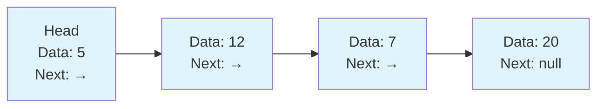
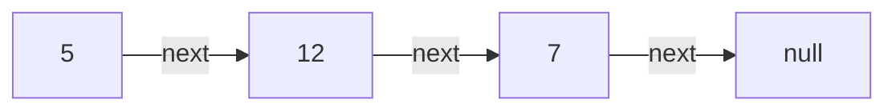
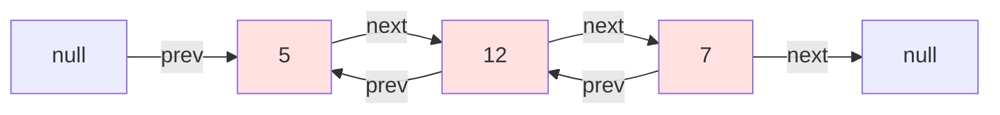
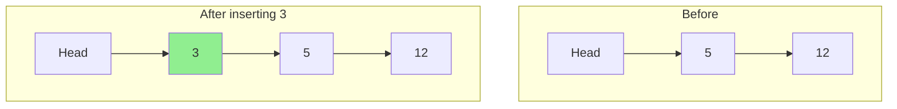
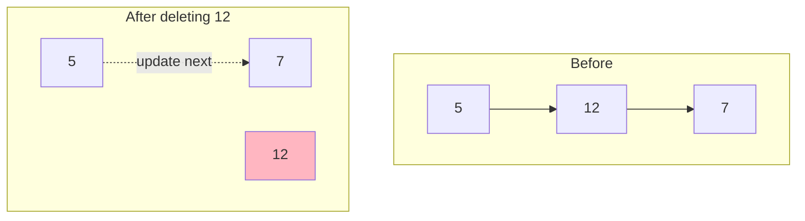
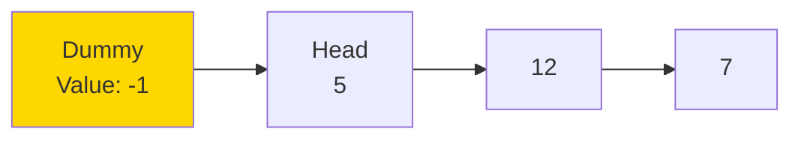
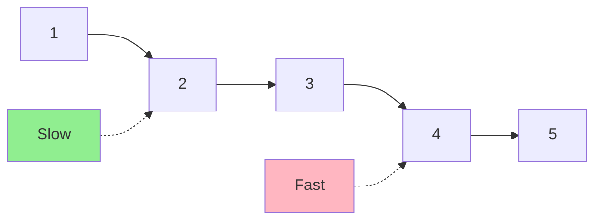
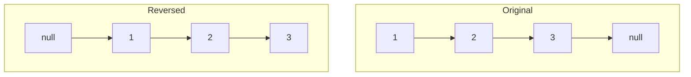
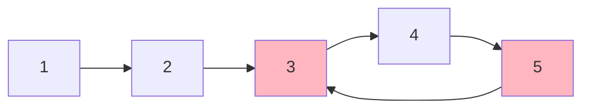

# Linked Lists

## What is a Linked List?

A **linked list** is a linear data structure where elements (called **nodes**) are stored in non-contiguous memory locations. Each node contains:
1. **Data**: The actual value
2. **Pointer/Reference**: Address of the next node

Think of a linked list like a scavenger hunt - each clue (node) contains information and tells you where to find the next clue.

## Singly Linked List Structure



**Key Point**: Unlike arrays, nodes are scattered in memory. The `next` pointer connects them logically.

## Singly vs Doubly Linked Lists

### Singly Linked List
Each node points to the next node only.



**Pros:**
- Less memory per node (one pointer)
- Simpler implementation

**Cons:**
- Can only traverse forward
- No direct access to previous node

### Doubly Linked List
Each node points to both next and previous nodes.



**Pros:**
- Bidirectional traversal
- Easier deletion (no need to track previous node)

**Cons:**
- Extra memory for `prev` pointer
- More complex insertion/deletion logic

## Basic Operations

| Operation | Time Complexity | Notes |
|-----------|----------------|-------|
| Access by index | O(n) | Must traverse from head |
| Search | O(n) | Linear search required |
| Insert at head | O(1) | Just update head pointer |
| Insert at tail | O(n)* | *O(1) if tail pointer maintained |
| Insert at position | O(n) | O(n) to find position + O(1) to insert |
| Delete at head | O(1) | Update head to next node |
| Delete at tail | O(n) | Must traverse to find second-to-last |
| Delete at position | O(n) | O(n) to find + O(1) to delete |

### Insert at Head (O(1))


### Delete a Node (O(1) once found)


## Common Linked List Patterns

### 1. Dummy Head Node
Create a fake node before the actual head to simplify edge cases.



**Why it helps:**
- Eliminates special cases for inserting/deleting at head
- Consistent logic for all positions

### 2. Two Pointers (Runner Technique)

#### Fast and Slow Pointers
- **Slow**: Moves one step at a time
- **Fast**: Moves two steps at a time



**Uses:**
- Find middle of list
- Detect cycles
- Find kth from end

#### Two Pointers with Gap
Keep pointers k nodes apart to find kth from end.

### 3. Reversal
Reverse pointers one by one:



Need three pointers: `prev`, `current`, `next`

### 4. Merge Two Lists
Combine two sorted linked lists:
- Compare heads
- Advance pointer in list with smaller value
- Use dummy head for simplicity

## When Linked Lists Beat Arrays

### Linked Lists Win When:
- ✅ Frequent insertions/deletions at beginning
- ✅ Frequent insertions/deletions in middle (if you have the position)
- ✅ Unknown size that grows/shrinks frequently
- ✅ Need to efficiently split/merge sequences

### Arrays Win When:
- ✅ Need random access by index
- ✅ Memory locality matters (cache performance)
- ✅ Size is fixed or predictable
- ✅ Searching is the primary operation

## Cycle Detection (Floyd's Algorithm)

Detect if linked list has a cycle using fast and slow pointers:



**Algorithm:**
1. Use fast and slow pointers
2. If fast catches up to slow, there's a cycle
3. If fast reaches null, no cycle

**Why it works:** In a cycle, the fast pointer will eventually "lap" the slow pointer.

## Memory Comparison

### Array Memory Layout
```
Contiguous: [5][12][7][20][3]
Total: n × element_size
```

### Linked List Memory Layout
```
Scattered:
  [5|→] at address 1000
       [12|→] at address 2050
            [7|→] at address 1500
                [20|null] at address 3000

Total: n × (element_size + pointer_size)
```

**Memory Overhead:**
- Singly: 1 pointer per node (4-8 bytes)
- Doubly: 2 pointers per node (8-16 bytes)

## Common Pitfalls

1. **Null pointer errors**: Always check if node is null before accessing
2. **Losing references**: Keep temp pointer before changing `next`
3. **Infinite loops**: In cycle problems or incorrect pointer updates
4. **Off-by-one**: Especially in finding middle or kth from end
5. **Not handling single node**: Edge case when list has one element

## Typical Problem Patterns

### Pattern 1: Traversal
Visit each node once - O(n)

### Pattern 2: Two-pointer
- Find middle
- Detect cycle
- Remove nth from end

### Pattern 3: Reversal
- Reverse entire list
- Reverse in groups
- Palindrome check

### Pattern 4: Merge/Split
- Merge sorted lists
- Partition list
- Split into parts

### Pattern 5: Reordering
- Odd-even reorder
- Rotate list
- Swap nodes

## Complexity Summary

| Aspect | Array | Singly Linked List | Doubly Linked List |
|--------|-------|-------------------|-------------------|
| Access | O(1) | O(n) | O(n) |
| Search | O(n) | O(n) | O(n) |
| Insert at head | O(n) | O(1) | O(1) |
| Insert at tail | O(1) | O(n)* | O(1)** |
| Delete at head | O(n) | O(1) | O(1) |
| Memory per element | x | x + p | x + 2p |

*O(1) if tail pointer maintained
**Requires tail pointer
p = pointer size

## Practice Strategy

Master these problems in order:
1. Reverse Linked List (fundamental operation)
2. Merge Two Sorted Lists (merging pattern)
3. Linked List Cycle (Floyd's algorithm)
4. Middle of Linked List (two pointers)
5. Remove Nth From End (two pointers with gap)
6. Palindrome Linked List (combine multiple techniques)

Understanding linked list pointer manipulation is crucial for many interview problems and real-world applications like implementing LRU cache, browser history, and undo functionality!
