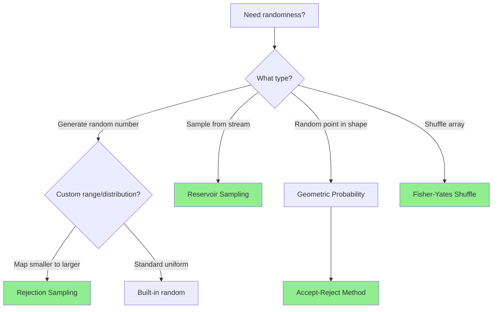
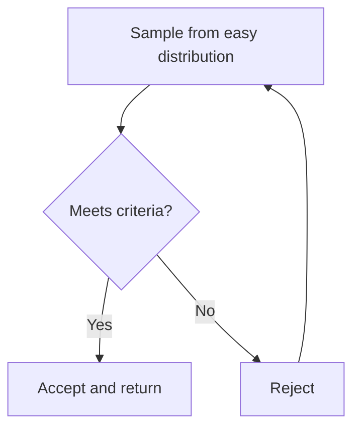

# Probability and Random Sampling

## Quick Reference Card

| Aspect | Details |
|--------|---------|
| **Key Signal** | Random generation, sampling, expected value, fair distribution |
| **Time Complexity** | Varies: O(1) for simple random, O(n) for reservoir sampling |
| **Space Complexity** | O(1) to O(k) depending on sample size |
| **Common Variants** | Uniform random, rejection sampling, reservoir sampling |

## Mental Model

**Analogy:** Think of probability in algorithms like shuffling a deck of cards. Each card must have equal chance of being in any position. If you could only shuffle the top half, or if some cards were "sticky," the deck wouldn't be truly random. Similarly, random algorithms must ensure every outcome has the correct probability.

**First Principle:** True randomness requires that every valid outcome has equal probability. If we have n items and want to pick k randomly, each subset of size k should have probability 1/C(n,k) of being selected. This invariant guides all random sampling algorithms.

## Pattern Decision Tree



## Overview

Probability problems in algorithms typically involve:
1. **Random generation**: Creating random numbers with specific distributions
2. **Sampling**: Selecting random elements from a collection
3. **Expected value**: Analyzing average-case behavior
4. **Geometric probability**: Random points in continuous spaces

These problems test understanding of probability theory and ability to implement mathematically correct random algorithms.

## Key Concepts

### 1. Uniform Distribution

Every outcome has equal probability.

```python
import random

# Uniform random integer in [a, b]
random.randint(a, b)  # includes both endpoints

# Uniform random float in [0.0, 1.0)
random.random()

# Uniform choice from list
random.choice([1, 2, 3, 4, 5])
```

**Key property**: P(x) = 1/n for each of n possible outcomes

### 2. Rejection Sampling

Generate random values from difficult distribution by:
1. Sample from easier distribution
2. Accept/reject based on criteria
3. Repeat until accepted

**Use when**: Need distribution A but only have distribution B



### 3. Reservoir Sampling

Select k random items from stream of unknown length with equal probability.

**Key insight**: Each item should have probability k/n of being in final sample.

**Algorithm**:
- Keep first k items in reservoir
- For item i (where i > k): include it with probability k/i, replacing random item in reservoir

### 4. Expected Value

Average outcome over many trials.

```
E[X] = sum(probability(outcome) × value(outcome))
```

**Example**: Expected number of coin flips to get heads = 1×(1/2) + 2×(1/4) + 3×(1/8) + ... = 2

## Template Code

### Rejection Sampling Template

```python
def rejection_sampling(target_generator, easy_generator, accept_condition):
    """
    Generate random value from target distribution using rejection method.

    Args:
        target_generator: The distribution we want
        easy_generator: Simple distribution we can sample from
        accept_condition: Function that returns True to accept sample

    Time: O(1) expected (depends on acceptance rate)
    Space: O(1)
    """
    while True:
        # Sample from easy distribution
        sample = easy_generator()

        # Accept or reject based on condition
        if accept_condition(sample):
            return sample
        # Otherwise loop and try again

# Example: Rand10() using Rand7()
def rand10():
    """
    Generate uniform random integer from 1 to 10
    using rand7() which generates 1 to 7
    """
    while True:
        # Generate number from 1 to 49
        num = (rand7() - 1) * 7 + rand7()

        # Accept if in range [1, 40] (divisible by 10)
        if num <= 40:
            return (num - 1) % 10 + 1
        # Reject 41-49, try again
```

### Reservoir Sampling Template

```python
def reservoir_sample(stream, k):
    """
    Select k random items from stream of unknown length.
    Each item has equal probability k/n of being selected.

    Time: O(n) where n is stream length
    Space: O(k) for reservoir
    """
    reservoir = []

    for i, item in enumerate(stream):
        if i < k:
            # Fill reservoir with first k items
            reservoir.append(item)
        else:
            # Replace with probability k/(i+1)
            j = random.randint(0, i)
            if j < k:
                reservoir[j] = item

    return reservoir

# Single item variant (k=1)
def reservoir_sample_one(stream):
    """
    Select one random item from stream.

    Time: O(n)
    Space: O(1)
    """
    result = None

    for i, item in enumerate(stream):
        # Replace with probability 1/(i+1)
        if random.randint(0, i) == 0:
            result = item

    return result
```

### Random Point in Circle

```python
def random_point_in_circle(radius, center_x, center_y):
    """
    Generate uniform random point inside circle.

    WRONG approach: Random radius and angle creates clustering at center
    CORRECT approach: Use rejection sampling or transform radius

    Time: O(1) expected
    Space: O(1)
    """
    # Method 1: Rejection sampling (cleaner)
    while True:
        x = random.uniform(-radius, radius)
        y = random.uniform(-radius, radius)

        if x*x + y*y <= radius*radius:
            return [center_x + x, center_y + y]

    # Method 2: Transform radius (more efficient)
    # r = radius * sqrt(random.random())  # sqrt makes uniform
    # theta = 2 * pi * random.random()
    # x = r * cos(theta)
    # y = r * sin(theta)
    # return [center_x + x, center_y + y]
```

### Fisher-Yates Shuffle

```python
def shuffle_array(nums):
    """
    Randomly shuffle array in-place with uniform distribution.
    Each permutation has equal probability 1/n!

    Time: O(n)
    Space: O(1)
    """
    n = len(nums)

    for i in range(n - 1, 0, -1):
        # Pick random index from 0 to i (inclusive)
        j = random.randint(0, i)

        # Swap elements
        nums[i], nums[j] = nums[j], nums[i]

    return nums
```

## Worked Examples

### Example 1: Random Pick with Weight

**Problem**: Given array of weights, randomly pick index with probability proportional to weight.

**Input**: `weights = [1, 3, 2]`
**Output**: Index 0 with probability 1/6, index 1 with probability 3/6, index 2 with probability 2/6

**Solution**:
```python
class RandomPickWithWeight:
    def __init__(self, weights):
        """
        Build cumulative sum array for binary search.
        weights = [1, 3, 2]
        prefix = [1, 4, 6]

        Time: O(n), Space: O(n)
        """
        self.prefix_sums = []
        total = 0

        for w in weights:
            total += w
            self.prefix_sums.append(total)

        self.total = total

    def pick_index(self):
        """
        Generate random number in [1, total]
        Find which bucket it falls into using binary search.

        Time: O(log n)
        """
        target = random.randint(1, self.total)

        # Binary search for target in prefix_sums
        left, right = 0, len(self.prefix_sums) - 1

        while left < right:
            mid = (left + right) // 2
            if self.prefix_sums[mid] < target:
                left = mid + 1
            else:
                right = mid

        return left
```

**Visualization**:
```
weights:     [1,    3,    2]
prefix_sums: [1,    4,    6]
ranges:      1      2-4   5-6

Random 1-6:
1 → index 0
2,3,4 → index 1
5,6 → index 2
```

### Example 2: Linked List Random Node

**Problem**: Select random node from linked list with equal probability.

**Approach**: Use reservoir sampling since we don't know length in advance.

```python
class LinkedListRandom:
    def __init__(self, head):
        self.head = head

    def get_random(self):
        """
        Reservoir sampling for linked list.
        Each node has probability 1/n of being selected.

        Time: O(n)
        Space: O(1)
        """
        result = None
        current = self.head
        i = 0

        while current:
            # Replace with probability 1/(i+1)
            if random.randint(0, i) == 0:
                result = current.val

            current = current.next
            i += 1

        return result
```

**Why it works**:
- Node 1: selected with probability 1/1 × (not replaced) = 1/1 × 1/2 × 2/3 × ... = 1/n
- Node 2: selected with probability 1/2 × (not replaced) = 1/2 × 2/3 × 3/4 × ... = 1/n
- Node i: probability = (1/i) × (i/(i+1)) × ((i+1)/(i+2)) × ... × ((n-1)/n) = 1/n

### Example 3: Generate Random from Rand7 to Rand10

**Problem**: Implement `rand10()` using only `rand7()`.

**Analysis**:
- Need uniform distribution over [1, 10]
- Can't simply do `rand7() + rand3()` - not uniform!
- Need to generate larger uniform range, then map to [1, 10]

```python
def rand10():
    """
    Generate uniform [1, 10] from uniform [1, 7].

    Strategy:
    1. Generate uniform [1, 49] using two rand7() calls
    2. Accept [1, 40] and map to [1, 10]
    3. Reject [41, 49] and retry

    Time: O(1) expected
    - Acceptance rate = 40/49 ≈ 82%
    - Expected calls = 49/40 ≈ 1.225 iterations
    """
    while True:
        # Generate [1, 49] uniformly
        row = rand7()
        col = rand7()
        num = (row - 1) * 7 + col

        # Accept [1, 40], map to [1, 10]
        if num <= 40:
            return (num - 1) % 10 + 1

        # Reject [41, 49], retry
```

**Visualization of 7×7 grid**:
```
    1  2  3  4  5  6  7
1:  1  2  3  4  5  6  7
2:  8  9 10  1  2  3  4
3:  5  6  7  8  9 10  1
4:  2  3  4  5  6  7  8
5:  9 10  1  2  3  4  5
6:  6  7  8  9 10 X  X    (X = reject)
7:  X  X  X  X  X  X  X    (X = reject)

Each digit 1-10 appears exactly 4 times in accepted range
```

### Example 4: Random Point in Rectangle

**Problem**: Generate random point in non-axis-aligned rectangle.

```python
class RandomPointInRectangle:
    def __init__(self, rects):
        """
        rects[i] = [x1, y1, x2, y2] (bottom-left, top-right)

        Build cumulative areas for weighted sampling.
        """
        self.rects = rects
        self.areas = []
        total = 0

        for x1, y1, x2, y2 in rects:
            area = (x2 - x1) * (y2 - y1)
            total += area
            self.areas.append(total)

        self.total_area = total

    def pick(self):
        """
        1. Pick rectangle with probability proportional to area
        2. Pick uniform random point in that rectangle

        Time: O(log n) for binary search
        """
        # Pick rectangle
        target = random.uniform(0, self.total_area)
        left, right = 0, len(self.areas) - 1

        while left < right:
            mid = (left + right) // 2
            if self.areas[mid] < target:
                left = mid + 1
            else:
                right = mid

        # Pick point in selected rectangle
        x1, y1, x2, y2 = self.rects[left]
        x = random.uniform(x1, x2)
        y = random.uniform(y1, y2)

        return [x, y]
```

## Common Mistakes

### 1. Non-Uniform Random Point in Circle

```python
# WRONG: Creates clustering at center
def wrong_random_circle(radius):
    r = random.uniform(0, radius)  # ← Problem here!
    theta = random.uniform(0, 2 * math.pi)
    x = r * math.cos(theta)
    y = r * math.sin(theta)
    return [x, y]

# CORRECT: Transform radius or use rejection
def correct_random_circle(radius):
    r = radius * math.sqrt(random.random())  # ← sqrt makes uniform
    theta = random.uniform(0, 2 * math.pi)
    x = r * math.cos(theta)
    y = r * math.sin(theta)
    return [x, y]
```

**Why**: Area increases with r². Probability density must decrease as 1/r² to compensate.

### 2. Incorrect Reservoir Sampling Probability

```python
# WRONG: Probability k/n not maintained
def wrong_reservoir(stream, k):
    reservoir = stream[:k]
    for i in range(k, len(stream)):
        if random.random() < 0.5:  # ← Wrong probability!
            j = random.randint(0, k-1)
            reservoir[j] = stream[i]

# CORRECT: Use k/(i+1)
def correct_reservoir(stream, k):
    reservoir = list(stream[:k])
    for i in range(k, len(stream)):
        j = random.randint(0, i)  # ← Correct: generates 0 to i
        if j < k:
            reservoir[j] = stream[i]
```

### 3. Inefficient Rejection Sampling

```python
# WRONG: Low acceptance rate (10/100 = 10%)
def inefficient_rand10():
    while True:
        num = rand7() + rand7() + rand7()  # Range [3, 21]
        if 3 <= num <= 12:  # Only 10 values accepted
            return num - 2

# CORRECT: Higher acceptance rate (40/49 = 82%)
def efficient_rand10():
    while True:
        num = (rand7() - 1) * 7 + rand7()  # Range [1, 49]
        if num <= 40:  # 40 values accepted
            return (num - 1) % 10 + 1
```

**Rule**: Maximize acceptance rate to minimize expected iterations.

### 4. Biased Shuffle

```python
# WRONG: Biased shuffle
def wrong_shuffle(nums):
    for i in range(len(nums)):
        j = random.randint(0, len(nums) - 1)  # ← Can swap with self multiple times
        nums[i], nums[j] = nums[j], nums[i]

# CORRECT: Fisher-Yates
def correct_shuffle(nums):
    for i in range(len(nums) - 1, 0, -1):
        j = random.randint(0, i)  # ← Only swap with earlier elements
        nums[i], nums[j] = nums[j], nums[i]
```

### 5. Forgetting Edge Cases

```python
# Check for empty input
if not stream:
    return None

# Check for k > n in reservoir sampling
k = min(k, len(stream))

# Check for division by zero in expected value
if total_weight == 0:
    return None
```

## Complexity Analysis

| Algorithm | Time | Space | Notes |
|-----------|------|-------|-------|
| Simple random | O(1) | O(1) | Built-in random functions |
| Rejection sampling | O(1) expected | O(1) | Depends on acceptance rate |
| Reservoir sampling | O(n) | O(k) | Single pass through stream |
| Weighted random | O(log n) | O(n) | Binary search on prefix sums |
| Fisher-Yates shuffle | O(n) | O(1) | In-place shuffle |

## Practice Progression

**Day 1 (Learn)**:
- Read this guide thoroughly
- Implement Fisher-Yates shuffle from memory
- Solve: Random Pick with Weight

**Day 3 (Reinforce)**:
- Review rejection sampling template
- Solve: Implement Rand10 from Rand7
- Understand why sqrt is needed for circle

**Day 7 (Master)**:
- Solve: Linked List Random Node (reservoir sampling)
- Solve: Random Point in Non-overlapping Rectangles
- Can you explain probability of reservoir sampling?

**Day 14 (Maintain)**:
- Solve: Random Pick Index (multiple indices with target value)
- Practice explaining acceptance rate calculation
- Implement reservoir sampling for k items

## Related Topics

| Topic | Relationship |
|-------|--------------|
| **Hash Tables** | Used for counting in probability problems |
| **Binary Search** | Finding bucket in weighted random selection |
| **Expected Value** | Analyzing time complexity of randomized algorithms |
| **Combinatorics** | Computing number of possible outcomes |
| **Geometry** | Random points in shapes, area calculations |

## Summary

Probability and random sampling algorithms require:
- **Mathematical correctness**: Every outcome must have correct probability
- **Efficiency**: Minimize expected time through high acceptance rates
- **Understanding distributions**: Uniform, weighted, geometric
- **Key techniques**: Rejection sampling, reservoir sampling, prefix sums

Common patterns:
1. **Rejection sampling**: Generate from easy distribution, accept/reject to get target distribution
2. **Reservoir sampling**: Maintain k random items from stream of unknown length
3. **Weighted selection**: Use prefix sums + binary search for proportional probabilities
4. **Geometric probability**: Use acceptance-rejection or coordinate transformation

Master these templates and understand the mathematics behind them for robust random algorithms!
