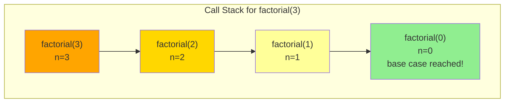
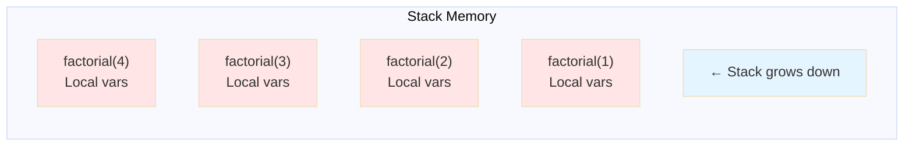

# Understanding Space Complexity

## What is Space Complexity?

Imagine packing for a trip. You have a limited suitcase size:

- **Scenario 1**: You need just your toothbrush → Takes almost no space
- **Scenario 2**: You need a change of clothes for each day → Space grows with trip length
- **Scenario 3**: You pack your entire wardrobe → Takes lots of space!

**Space complexity** measures how much memory an algorithm needs as the input size grows. Just like time complexity uses Big O notation, so does space complexity.

## The Two Types of Space

### 1. Input Space
Memory used to store the input data itself.

```python
def process(arr):
    # 'arr' takes up space, but we don't count this
    # because it's the input - it already exists!
    pass
```

### 2. Auxiliary Space (What We Actually Measure!)
**Extra** memory your algorithm uses beyond the input.

```python
def copy_array(arr):
    new_arr = arr.copy()  # ← THIS is auxiliary space
    return new_arr        # We created extra memory!

# Space Complexity: O(n) - we made a copy of size n
```

**Important**: When people say "space complexity", they usually mean **auxiliary space** - the extra memory you create.

---

## Common Space Complexities

### O(1) - Constant Space
**"The Minimalist"** - Uses the same amount of extra memory regardless of input size.

```python
def find_sum(arr):
    total = 0        # Just one variable - O(1) space
    for num in arr:
        total += num
    return total

# No matter if arr has 10 or 10,000 elements,
# we only use one variable 'total'
```

**Real-world analogy**: Using a single notepad to tally items, no matter how many items there are.

---

### O(log n) - Logarithmic Space
**"The Divide-and-Conquer Space Saver"** - Common in recursive algorithms that split the problem.

```python
def binary_search_recursive(arr, target, left, right):
    if left > right:
        return -1

    mid = (left + right) // 2
    if arr[mid] == target:
        return mid
    elif arr[mid] < target:
        return binary_search_recursive(arr, target, mid + 1, right)
    else:
        return binary_search_recursive(arr, target, left, mid - 1)

# Each recursive call adds to the call stack
# But we only go log(n) levels deep
# Space: O(log n)
```

**Real-world analogy**: A manager delegating to one person, who delegates to one person, etc., but the chain is short.

---

### O(n) - Linear Space
**"The Collector"** - Stores something for each input element.

```python
def remove_duplicates(arr):
    seen = set()           # Can grow to size n
    result = []            # Can grow to size n

    for num in arr:
        if num not in seen:
            seen.add(num)
            result.append(num)

    return result

# Both 'seen' and 'result' can grow to size n
# Space: O(n) + O(n) = O(n)
```

**Real-world analogy**: Making a guest list where you write down each unique person's name.

---

### O(n²) - Quadratic Space
**"The Matrix Builder"** - Creates a 2D structure.

```python
def create_multiplication_table(n):
    table = []
    for i in range(n):
        row = []
        for j in range(n):
            row.append(i * j)
        table.append(row)
    return table

# Creates an n × n table
# Space: O(n²)
```

**Real-world analogy**: Creating a seating chart for a wedding where you need a table cell for every pair of people.

---

## Auxiliary Space vs Total Space

```python
def example(arr):  # arr takes O(n) space - INPUT space
    x = 5          # x takes O(1) space - AUXILIARY space
    y = arr.copy() # y takes O(n) space - AUXILIARY space
    return x + y[0]

# Total Space: O(n) input + O(n) auxiliary = O(n)
# Auxiliary Space: O(n) - what we usually care about
# Space Complexity: O(n) - the answer we give
```

**Key Point**: We typically report **auxiliary space** when discussing space complexity, because the input space is already "spent" before our algorithm runs.

---

## Recursion and the Call Stack

Every recursive call takes up space on the **call stack** - a special memory area that tracks function calls.

### Visual: How the Call Stack Works



### Example: Factorial

```python
def factorial(n):
    if n <= 1:
        return 1
    return n * factorial(n - 1)

# Call sequence for factorial(4):
# factorial(4)
#   → factorial(3)
#       → factorial(2)
#           → factorial(1)  ← Stack depth = 4
#           ← returns 1
#       ← returns 2
#   ← returns 6
# ← returns 24

# Space Complexity: O(n) - stack depth equals n
```

### Stack Depth Visualization



### Iterative vs Recursive Space

```python
# Recursive: O(n) space due to call stack
def sum_recursive(arr, index=0):
    if index >= len(arr):
        return 0
    return arr[index] + sum_recursive(arr, index + 1)

# Iterative: O(1) space - just one variable
def sum_iterative(arr):
    total = 0
    for num in arr:
        total += num
    return total

# Both have same time complexity O(n)
# But different space complexity!
```

---

## Time vs Space Trade-offs

Often you can trade space for time, or time for space. Neither is always better - it depends on your constraints!

### Example 1: Fibonacci

#### Time-Optimized (Uses More Space)
```python
def fib_memoized(n, memo={}):
    if n in memo:
        return memo[n]
    if n <= 1:
        return n

    memo[n] = fib_memoized(n-1, memo) + fib_memoized(n-2, memo)
    return memo[n]

# Time: O(n) - each number calculated once
# Space: O(n) - stores all results in memo
```

#### Space-Optimized (Takes More Time)
```python
def fib_recursive(n):
    if n <= 1:
        return n
    return fib_recursive(n-1) + fib_recursive(n-2)

# Time: O(2^n) - exponential, very slow!
# Space: O(n) - call stack depth
```

#### Balanced Approach
```python
def fib_iterative(n):
    if n <= 1:
        return n

    prev, curr = 0, 1
    for _ in range(2, n + 1):
        prev, curr = curr, prev + curr

    return curr

# Time: O(n) - single loop
# Space: O(1) - only two variables!
# Winner! ✅
```

### Example 2: Finding Duplicates

#### Space-Heavy Approach (Fast)
```python
def has_duplicates_hash(arr):
    seen = set()  # O(n) space
    for num in arr:
        if num in seen:
            return True
        seen.add(num)
    return False

# Time: O(n)
# Space: O(n)
```

#### Space-Light Approach (Slow)
```python
def has_duplicates_nested(arr):
    for i in range(len(arr)):
        for j in range(i + 1, len(arr)):
            if arr[i] == arr[j]:
                return True
    return False

# Time: O(n²)
# Space: O(1)
```

---

## In-Place Algorithms

**In-place** means the algorithm modifies the input directly without creating a copy, using only O(1) extra space.

### Example: Reverse Array

#### NOT In-Place
```python
def reverse_not_inplace(arr):
    return arr[::-1]  # Creates a new reversed array

# Space: O(n) - creates new array
```

#### In-Place
```python
def reverse_inplace(arr):
    left, right = 0, len(arr) - 1

    while left < right:
        # Swap elements
        arr[left], arr[right] = arr[right], arr[left]
        left += 1
        right -= 1

    return arr

# Space: O(1) - only two variables
# Modifies original array!
```

### When to Use In-Place Algorithms

**Pros:**
- Saves memory
- Faster (no copying)
- Required when memory is limited

**Cons:**
- Destroys original data
- Can be harder to understand
- Can't undo changes easily

```python
# If you need the original data, make a copy first!
def safe_reverse(arr):
    arr_copy = arr.copy()  # Preserve original
    return reverse_inplace(arr_copy)
```

---

## Common Data Structures and Their Space

### Arrays/Lists
```python
arr = [1, 2, 3, 4, 5]
# Space: O(n) - stores n elements
```

### Hash Tables/Dictionaries
```python
hash_map = {'a': 1, 'b': 2, 'c': 3}
# Space: O(n) - stores n key-value pairs
# (technically O(n) on average, can be more due to hash table internals)
```

### Sets
```python
unique = {1, 2, 3, 4, 5}
# Space: O(n) - stores n unique elements
```

### 2D Arrays/Matrices
```python
matrix = [[1, 2, 3],
          [4, 5, 6],
          [7, 8, 9]]
# Space: O(n²) or O(rows × cols)
```

### Trees (Balanced)
```python
# Binary tree with n nodes
# Space: O(n) - n nodes stored
# Recursive traversal also uses O(h) stack space where h = height
# For balanced tree: h = log(n), so O(log n) stack space
```

### Graphs (Adjacency List)
```python
graph = {
    'A': ['B', 'C'],
    'B': ['A', 'D'],
    'C': ['A', 'D'],
    'D': ['B', 'C']
}
# Space: O(V + E) where V = vertices, E = edges
```

---

## How to Analyze Space Complexity Step by Step

### Step 1: Identify Variables
```python
def example1(arr):
    x = 5              # O(1) - one variable
    y = 10             # O(1) - one variable
    return x + y

# Total: O(1)
```

### Step 2: Identify Data Structures
```python
def example2(arr):
    result = []        # Can grow to O(n)
    for num in arr:
        result.append(num * 2)
    return result

# Total: O(n)
```

### Step 3: Count Recursion Depth
```python
def example3(n):
    if n <= 0:
        return 0
    return n + example3(n - 1)

# Call stack goes n levels deep
# Total: O(n)
```

### Step 4: Add Everything Up
```python
def example4(arr):
    # Variables: O(1)
    count = 0

    # Data structure: O(n)
    temp = arr.copy()

    # Another data structure: O(n)
    seen = set()

    for num in temp:
        seen.add(num)

    return len(seen)

# Total: O(1) + O(n) + O(n) = O(n)
```

---

## Common Patterns and Their Space Complexity

### Pattern 1: Single Loop with Constants
```python
def pattern1(arr):
    max_val = arr[0]      # O(1)
    for num in arr:       # Loop doesn't create new space
        if num > max_val:
            max_val = num
    return max_val

# Space: O(1)
```

### Pattern 2: Building a Result List
```python
def pattern2(arr):
    result = []           # O(n) worst case
    for num in arr:
        if num % 2 == 0:
            result.append(num)
    return result

# Space: O(n)
```

### Pattern 3: Using a Hash Map
```python
def pattern3(arr):
    freq_map = {}         # O(n) worst case
    for num in arr:
        freq_map[num] = freq_map.get(num, 0) + 1
    return freq_map

# Space: O(n)
```

### Pattern 4: Recursive Divide and Conquer
```python
def merge_sort(arr):
    if len(arr) <= 1:
        return arr

    mid = len(arr) // 2
    left = merge_sort(arr[:mid])    # New array created
    right = merge_sort(arr[mid:])   # New array created

    return merge(left, right)

# Space: O(n log n) total due to array slicing
# OR O(n) if implemented with indices instead of slicing
# Plus O(log n) for call stack
```

### Pattern 5: Nested Data Structures
```python
def pattern5(n):
    matrix = []
    for i in range(n):
        row = [0] * n
        matrix.append(row)
    return matrix

# Space: O(n²)
```

---

## Visual: Space Complexity Decision Tree

```mermaid
graph TD
    Start[Analyzing Space Complexity]
    Start --> Q1{Using recursion?}

    Q1 -->|Yes| Q2{What's the<br/>recursion depth?}
    Q2 -->|n levels| R1[Add O&#40;n&#41; for stack]
    Q2 -->|log n levels| R2[Add O&#40;log n&#41; for stack]

    Q1 -->|No| Q3{Creating new<br/>data structures?}

    Q3 -->|No, just variables| R3[O&#40;1&#41;]
    Q3 -->|Yes| Q4{What size?}

    Q4 -->|Same as input size| R4[O&#40;n&#41;]
    Q4 -->|2D structure| R5[O&#40;n²&#41;]
    Q4 -->|Fixed size| R6[O&#40;1&#41;]

    style Start fill:#E5F5FF
    style R1 fill:#FFE5E5
    style R2 fill:#FFF4E1
    style R3 fill:#90EE90
    style R4 fill:#FFE5E5
    style R5 fill:#FF6347
    style R6 fill:#90EE90
```



---

## Common Mistakes to Avoid

### Mistake 1: Forgetting About the Call Stack
```python
def sum_recursive(arr, index=0):
    if index >= len(arr):
        return 0
    return arr[index] + sum_recursive(arr, index + 1)

# ❌ Wrong: "Space is O(1) - no data structures"
# ✅ Right: "Space is O(n) - call stack grows to depth n"
```

### Mistake 2: Thinking Loops Always Use O(1) Space
```python
def collect_evens(arr):
    result = []
    for num in arr:          # Loop itself: O(1)
        if num % 2 == 0:
            result.append(num)  # But result grows!
    return result

# ❌ Wrong: "Space is O(1) - just a loop"
# ✅ Right: "Space is O(n) - result can hold n elements"
```

### Mistake 3: Not Counting All Data Structures
```python
def process(arr):
    set1 = set(arr)     # O(n)
    set2 = set(arr)     # O(n)
    dict1 = {}          # O(n)

    for num in arr:
        dict1[num] = num * 2

    return len(set1 & set2)

# ❌ Wrong: "Space is O(n) - just some data structures"
# ✅ Right: "Space is O(n) + O(n) + O(n) = O(n)"
# (They all grow with input, but combined it's still O(n))
```

### Mistake 4: Confusing In-Place with No Space
```python
def bubble_sort(arr):
    n = len(arr)        # O(1) variable
    for i in range(n):
        for j in range(n - 1):
            if arr[j] > arr[j + 1]:
                arr[j], arr[j + 1] = arr[j + 1], arr[j]
    return arr

# ✅ This IS O(1) space - modifies array in-place
# "In-place" means O(1) auxiliary space
```

---

## Quick Reference Table

| Space | Name | Description | Example |
|-------|------|-------------|---------|
| O(1) | Constant | Fixed number of variables | Finding max in array |
| O(log n) | Logarithmic | Call stack for divide-and-conquer | Binary search (recursive) |
| O(n) | Linear | One data structure scales with input | Copying array, hash map |
| O(n log n) | Linearithmic | Recursive algorithms creating sub-arrays | Merge sort (with slicing) |
| O(n²) | Quadratic | 2D data structure | Adjacency matrix |

### Space vs Time Comparison

| Algorithm | Time | Space | Notes |
|-----------|------|-------|-------|
| Linear search | O(n) | O(1) | Simple, minimal memory |
| Binary search (iterative) | O(log n) | O(1) | Fast, minimal memory |
| Binary search (recursive) | O(log n) | O(log n) | Fast, uses stack |
| Bubble sort | O(n²) | O(1) | Slow, but in-place |
| Merge sort | O(n log n) | O(n) | Fast, uses extra memory |
| Quick sort | O(n log n) | O(log n) | Fast, in-place-ish |

---

## Practice Exercises

### Exercise 1: Basic Analysis
What is the space complexity?

```python
def mystery1(arr):
    max_num = arr[0]
    min_num = arr[0]

    for num in arr:
        if num > max_num:
            max_num = num
        if num < min_num:
            min_num = num

    return max_num - min_num
```

<details>
<summary>Answer</summary>
O(1) - only two variables (max_num, min_num), regardless of input size
</details>

### Exercise 2: Data Structure Creation
What is the space complexity?

```python
def mystery2(arr):
    unique = set(arr)
    return len(unique)
```

<details>
<summary>Answer</summary>
O(n) - set can contain up to n unique elements
</details>

### Exercise 3: Recursion
What is the space complexity?

```python
def mystery3(n):
    if n <= 0:
        return 1
    return mystery3(n - 1) + mystery3(n - 2)
```

<details>
<summary>Answer</summary>
O(n) - call stack depth reaches n (one branch goes all the way down to 0)
</details>

### Exercise 4: Multiple Structures
What is the space complexity?

```python
def mystery4(arr):
    freq = {}
    result = []

    for num in arr:
        freq[num] = freq.get(num, 0) + 1

    for num, count in freq.items():
        if count > 1:
            result.append(num)

    return result
```

<details>
<summary>Answer</summary>
O(n) - both freq dict and result list can grow to size n, so O(n) + O(n) = O(n)
</details>

### Exercise 5: In-Place Optimization
How can you reduce the space complexity of this function?

```python
def remove_duplicates(arr):
    unique = []
    for num in arr:
        if num not in unique:
            unique.append(num)
    return unique
```

<details>
<summary>Answer</summary>

Current version is O(n) space. If the input array can be modified, you can do it in-place with O(1) space:

```python
def remove_duplicates_inplace(arr):
    if not arr:
        return arr

    # Assumes arr can be sorted (modifies in-place)
    arr.sort()  # O(1) space for most sort implementations

    write_index = 1
    for read_index in range(1, len(arr)):
        if arr[read_index] != arr[read_index - 1]:
            arr[write_index] = arr[read_index]
            write_index += 1

    # Truncate array
    return arr[:write_index]
# Space: O(1) auxiliary
```

Or using a set but returning sorted list:
```python
def remove_duplicates_set(arr):
    return list(set(arr))  # Still O(n) space though
```
</details>

---

## Key Takeaways

1. **Space complexity measures extra memory used**, not including the input
2. **Auxiliary space** is what we typically report (extra memory beyond input)
3. **Recursion uses stack space** - depth of recursion matters!
4. **Creating new data structures** usually means O(n) or more space
5. **In-place algorithms** modify input directly, using O(1) extra space
6. **Time vs space trade-offs** are common - neither is always better
7. **Count all variables, data structures, and call stack depth**

### Decision Guide: When to Optimize Space

**Optimize for space when:**
- Working with large datasets that might not fit in memory
- Memory is limited (embedded systems, mobile devices)
- Processing streaming data
- The time trade-off is acceptable

**Optimize for time when:**
- Memory is plentiful
- Speed is critical (real-time systems)
- The space trade-off is acceptable

Remember: The "best" algorithm depends on your specific constraints and requirements. Understanding both time and space complexity helps you make informed decisions!
