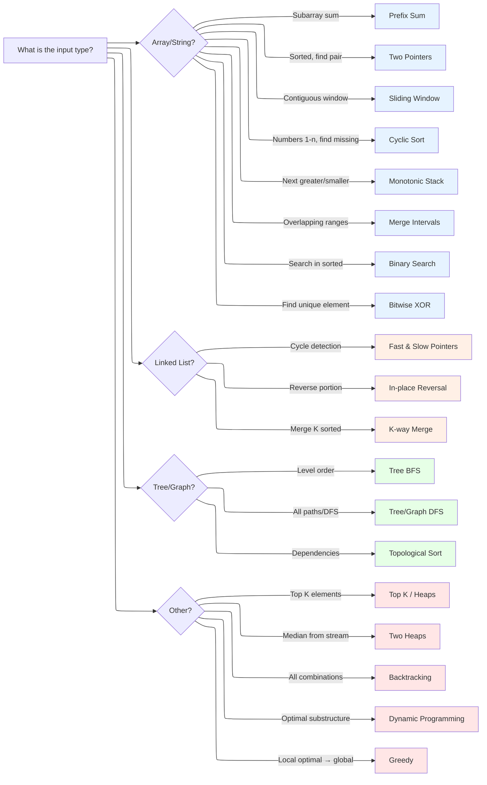

# Algorithm Patterns: Decision Guide

This directory contains comprehensive guides for the 16+ essential coding patterns that form the foundation of technical interview preparation. Each pattern guide includes templates, worked examples, and practice progressions.

## Master Flowchart

Use this flowchart to quickly identify which pattern to apply based on problem characteristics:

---

## Pattern Definitions

Understanding what each pattern is helps you recognize when to apply it:

**Two Pointers Pattern**: An algorithmic technique using two index variables that traverse a data structure from different positions or at different speeds to solve problems in O(n) time with O(1) space.

**Sliding Window Pattern**: A technique for processing contiguous subarrays or substrings by maintaining a "window" that expands and contracts while sliding through the data, typically achieving O(n) time complexity.

**Binary Search Pattern**: A divide-and-conquer search algorithm that repeatedly divides a sorted search space in half, achieving O(log n) time complexity.

**Dynamic Programming Pattern**: An optimization technique that solves complex problems by breaking them into overlapping subproblems, storing results to avoid redundant computation (memoization or tabulation).

**Backtracking Pattern**: A systematic exploration technique that builds solutions incrementally and abandons partial solutions ("backtracks") when they cannot lead to valid complete solutions.

**Greedy Pattern**: An algorithmic approach that makes locally optimal choices at each step with the goal of finding a global optimum, applicable when local choices lead to global optimal solutions.

**Topological Sort Pattern**: An algorithm for linearly ordering vertices of a directed acyclic graph (DAG) such that for every directed edge (u, v), vertex u comes before v.

**BFS (Breadth-First Search) Pattern**: A graph traversal algorithm that explores all vertices at the current depth before moving to vertices at the next depth level, optimal for shortest path in unweighted graphs.

**DFS (Depth-First Search) Pattern**: A graph traversal algorithm that explores as far as possible along each branch before backtracking, useful for path finding and connected components.

---

## Quick Pattern Lookup

| If you see... | Consider... | Guide |
|---------------|-------------|-------|
| Subarray sum, cumulative calculation | **Prefix Sum** | [prefix-sum.md](prefix-sum.md) |
| Sorted array, find pair/triplet | **Two Pointers** | [two-pointers.md](two-pointers.md) |
| Contiguous substring/subarray | **Sliding Window** | [sliding-window.md](sliding-window.md) |
| Numbers in range 1-n, missing/duplicate | **Cyclic Sort** | [cyclic-sort.md](cyclic-sort.md) |
| Next greater/smaller element | **Monotonic Stack** | [monotonic-stack.md](monotonic-stack.md) |
| Overlapping intervals, schedules | **Merge Intervals** | [merge-intervals.md](merge-intervals.md) |
| Search in sorted array | **Binary Search** | [binary-search.md](binary-search.md) |
| Find unique, pairs cancel | **Bitwise XOR** | [bitwise-xor.md](bitwise-xor.md) |
| Cycle in linked list | **Fast & Slow Pointers** | [two-pointers.md](two-pointers.md#fast-slow) |
| Merge K sorted lists | **K-way Merge** | [k-way-merge.md](k-way-merge.md) |
| Level-order tree traversal | **BFS** | [graph-traversal.md](graph-traversal.md) |
| All paths, connected components | **DFS** | [graph-traversal.md](graph-traversal.md) |
| Task dependencies, ordering | **Topological Sort** | [topological-sort.md](topological-sort.md) |
| Top K elements, kth largest | **Heaps** | [../data-structures/heaps.md](../data-structures/heaps.md) |
| Median from stream | **Two Heaps** | [two-heaps.md](two-heaps.md) |
| All combinations/permutations | **Backtracking** | [backtracking.md](backtracking.md) |
| Optimal solution, overlapping subproblems | **Dynamic Programming** | [dynamic-programming.md](dynamic-programming.md) |
| Local choice leads to global optimal | **Greedy** | [greedy.md](greedy.md) |
| Divide problem into subproblems | **Divide & Conquer** | [divide-and-conquer.md](divide-and-conquer.md) |

---

## Pattern Categories

### Array & String Patterns

| Pattern | Key Signal | Time | Space |
|---------|------------|------|-------|
| [Prefix Sum](prefix-sum.md) | Range sum queries | O(n) setup, O(1) query | O(n) |
| [Two Pointers](two-pointers.md) | Sorted array, pairs | O(n) | O(1) |
| [Sliding Window](sliding-window.md) | Contiguous subarray | O(n) | O(k) |
| [Cyclic Sort](cyclic-sort.md) | Numbers 1-n | O(n) | O(1) |
| [Monotonic Stack](monotonic-stack.md) | Next greater/smaller | O(n) | O(n) |
| [Merge Intervals](merge-intervals.md) | Overlapping ranges | O(n log n) | O(n) |
| [Binary Search](binary-search.md) | Sorted, search | O(log n) | O(1) |
| [Bitwise XOR](bitwise-xor.md) | Find unique | O(n) | O(1) |

### Linked List Patterns

| Pattern | Key Signal | Time | Space |
|---------|------------|------|-------|
| [Fast & Slow](two-pointers.md#fast-slow) | Cycle detection | O(n) | O(1) |
| [In-place Reversal](../data-structures/linked-lists.md) | Reverse portion | O(n) | O(1) |
| [K-way Merge](k-way-merge.md) | Merge K sorted | O(N log k) | O(k) |

### Tree & Graph Patterns

| Pattern | Key Signal | Time | Space |
|---------|------------|------|-------|
| [BFS](graph-traversal.md) | Level order, shortest path | O(V + E) | O(V) |
| [DFS](graph-traversal.md) | All paths, connected | O(V + E) | O(V) |
| [Topological Sort](topological-sort.md) | Dependencies | O(V + E) | O(V) |
| [Backtracking](backtracking.md) | All combinations | O(k^n) | O(n) |

### Advanced Patterns

| Pattern | Key Signal | Time | Space |
|---------|------------|------|-------|
| [Heaps / Top K](../data-structures/heaps.md) | Kth largest/smallest | O(n log k) | O(k) |
| [Two Heaps](two-heaps.md) | Running median | O(log n) per op | O(n) |
| [Dynamic Programming](dynamic-programming.md) | Optimal substructure | Varies | Varies |
| [Greedy](greedy.md) | Local → global optimal | O(n log n) | O(1) |
| [Divide & Conquer](divide-and-conquer.md) | Break into subproblems | O(n log n) | O(log n) |

---

## Pattern Selection Guide

### By Problem Type

**Finding Elements:**
- One unique → [Bitwise XOR](bitwise-xor.md)
- Missing number in 1-n → [Cyclic Sort](cyclic-sort.md)
- Kth largest → [Heaps](../data-structures/heaps.md)
- Next greater → [Monotonic Stack](monotonic-stack.md)

**Subarray/Substring:**
- Fixed size window → [Sliding Window](sliding-window.md)
- Variable window → [Sliding Window](sliding-window.md) or [Two Pointers](two-pointers.md)
- Sum/product → [Prefix Sum](prefix-sum.md)

**Pairs/Triplets:**
- Sorted array → [Two Pointers](two-pointers.md)
- Unsorted, complement search → Hash Table
- K pairs smallest sum → [K-way Merge](k-way-merge.md)

**Intervals/Ranges:**
- Merge overlapping → [Merge Intervals](merge-intervals.md)
- Meeting rooms → [Merge Intervals](merge-intervals.md) + Heap
- Free time → [Merge Intervals](merge-intervals.md)

**Optimization:**
- Count ways / min/max → [Dynamic Programming](dynamic-programming.md)
- Scheduling → [Greedy](greedy.md)
- Maximize with constraints → [Backtracking](backtracking.md) or DP

**Graph/Tree:**
- Level order → [BFS](graph-traversal.md)
- All paths → [DFS](graph-traversal.md)
- Build order → [Topological Sort](topological-sort.md)
- All subsets → [Backtracking](backtracking.md)

---

## Common Pattern Combinations

Some problems require combining multiple patterns:

| Problem Type | Patterns Used |
|-------------|---------------|
| Meeting Rooms II | Merge Intervals + Min Heap |
| Sliding Window Median | Two Heaps + Sliding Window |
| Course Schedule | Graph + Topological Sort |
| Word Break | BFS/DFS + DP |
| Shortest Path | BFS + Graph |
| LRU Cache | Hash Table + Doubly Linked List |

---

## Learning Progression

### Week 1-2: Foundation Patterns
1. [Two Pointers](two-pointers.md)
2. [Sliding Window](sliding-window.md)
3. [Binary Search](binary-search.md)

### Week 3-4: Array Patterns
4. [Prefix Sum](prefix-sum.md)
5. [Cyclic Sort](cyclic-sort.md)
6. [Monotonic Stack](monotonic-stack.md)

### Week 5-6: Advanced Array & Lists
7. [Merge Intervals](merge-intervals.md)
8. [Bitwise XOR](bitwise-xor.md)
9. [K-way Merge](k-way-merge.md)

### Week 7-8: Trees & Graphs
10. [Graph Traversal (BFS/DFS)](graph-traversal.md)
11. [Topological Sort](topological-sort.md)
12. [Backtracking](backtracking.md)

### Week 9-10: Advanced Patterns
13. [Heaps / Top K](../data-structures/heaps.md)
14. [Two Heaps](two-heaps.md)
15. [Greedy](greedy.md)

### Week 11-12: Dynamic Programming
16. [Dynamic Programming](dynamic-programming.md)
17. [Divide & Conquer](divide-and-conquer.md)

---

## Pattern Guide Template

Each pattern guide follows this structure:

1. **Quick Reference Card** - Key signals, complexity, variants
2. **Mental Model** - Analogy + first principle explanation
3. **Pattern Decision Tree** - When to use this pattern
4. **Overview** - What the pattern is and why it works
5. **When to Use** - Signals and key phrases
6. **Template Code** - Ready-to-use Python templates
7. **Worked Example** - Step-by-step walkthrough
8. **Example Problems** - Classic problems with solutions
9. **Common Pitfalls** - Mistakes and how to avoid them
10. **Complexity Analysis** - Time and space breakdown
11. **Practice Progression** - Spaced repetition schedule
12. **Related Patterns** - When to use alternatives

---

## File Index

| File | Description |
|------|-------------|
| [backtracking.md](backtracking.md) | Generate all combinations, permutations, subsets |
| [binary-search.md](binary-search.md) | Search in sorted arrays, find boundaries |
| [bitwise-xor.md](bitwise-xor.md) | Find unique elements, O(1) space tricks |
| [cyclic-sort.md](cyclic-sort.md) | Numbers in range 1-n, missing/duplicate |
| [divide-and-conquer.md](divide-and-conquer.md) | Break into independent subproblems |
| [dynamic-programming.md](dynamic-programming.md) | Optimal substructure, overlapping subproblems |
| [graph-traversal.md](graph-traversal.md) | BFS/DFS for trees and graphs |
| [greedy.md](greedy.md) | Local optimal choices |
| [k-way-merge.md](k-way-merge.md) | Merge multiple sorted sequences |
| [merge-intervals.md](merge-intervals.md) | Overlapping intervals, scheduling |
| [monotonic-stack.md](monotonic-stack.md) | Next greater/smaller element problems |
| [prefix-sum.md](prefix-sum.md) | Range sum queries, cumulative calculations |
| [sliding-window.md](sliding-window.md) | Contiguous subarray/substring optimization |
| [topological-sort.md](topological-sort.md) | Dependency ordering, DAG processing |
| [two-heaps.md](two-heaps.md) | Running median, balanced partition |
| [two-pointers.md](two-pointers.md) | Sorted arrays, pairs, fast/slow |

---

*"Master the patterns, and you master the interviews."*
