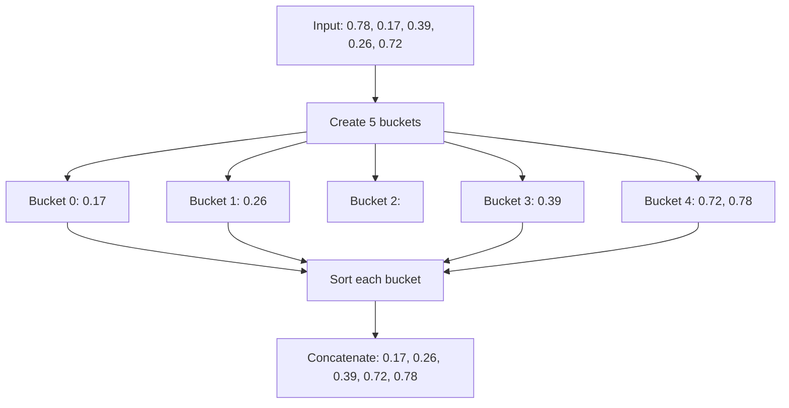
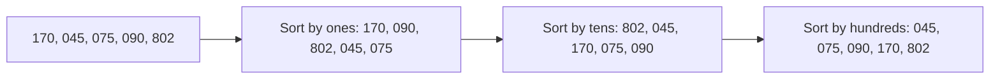
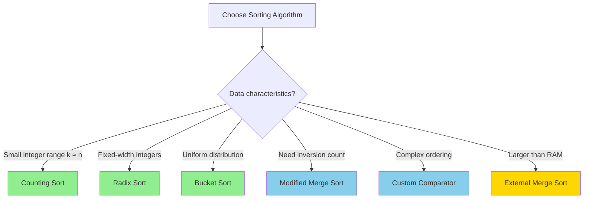

# Advanced Sorting Techniques

## Quick Reference Card

| Algorithm | Time Complexity | Space Complexity | Best For |
|-----------|----------------|------------------|----------|
| **Bucket Sort** | O(n + k) | O(n + k) | Uniformly distributed data |
| **Radix Sort** | O(d * (n + k)) | O(n + k) | Fixed-width integers |
| **Counting Sort** | O(n + k) | O(k) | Small range of integers |
| **External Merge Sort** | O(n log n) | O(n) disk | Large datasets (disk-based) |
| **Custom Comparators** | O(n log n) | O(1) | Multi-key, complex ordering |

**Legend**: n = number of elements, k = range of values, d = number of digits

## Mental Model

**Analogy:** Think of sorting mail at a post office:
- **Bucket Sort**: Create bins for each zip code range, drop mail into bins, sort each bin
- **Radix Sort**: Sort by last digit first, then second-to-last, etc. (like organizing by zip code digits)
- **Counting Sort**: Count how many letters go to each zip code, use counts to place directly

**First Principle:** When comparison-based sorting hits O(n log n) barrier, exploit special properties of data:
- Known range → use counting/buckets
- Fixed-width keys → process digit by digit
- Uniform distribution → divide into equal-sized buckets

## Pattern Decision Tree

```mermaid
flowchart TD
    START[Need to sort?] --> COMPARE{Can use comparisons only?}
    COMPARE -->|Yes| MULTI{Multiple sort keys?}
    COMPARE -->|No| SPECIAL[Exploit data properties]

    MULTI -->|Yes| CUSTOM[Custom Comparator]
    MULTI -->|No| STANDARD[Use standard O(n log n)]

    SPECIAL --> RANGE{Known small range?}
    RANGE -->|Yes| COUNT[Counting Sort]
    RANGE -->|No| DISTRIB{Uniform distribution?}

    DISTRIB -->|Yes| BUCKET[Bucket Sort]
    DISTRIB -->|No| DIGITS{Fixed-width integers?}

    DIGITS -->|Yes| RADIX[Radix Sort]
    DIGITS -->|No| SIZE{Dataset fits in memory?}

    SIZE -->|No| EXTERNAL[External Merge Sort]
    SIZE -->|Yes| OTHER[Consider merge for inversions]

    style COUNT fill:#90EE90
    style BUCKET fill:#90EE90
    style RADIX fill:#90EE90
    style EXTERNAL fill:#FFD700
    style CUSTOM fill:#87CEEB
```

## Overview

Advanced sorting techniques go beyond comparison-based algorithms (quicksort, mergesort) by exploiting specific properties of the data. These algorithms can break the O(n log n) theoretical lower bound for comparison-based sorting when certain conditions are met.

## When to Use Advanced Sorting

Look for these signals:
- **Small integer range**: Counting sort can achieve O(n)
- **Uniformly distributed data**: Bucket sort averages O(n)
- **Fixed-width integers**: Radix sort is O(d*n) where d is digits
- **Multi-dimensional sorting**: Custom comparators for complex objects
- **Large datasets**: External merge sort for disk-based processing
- **Need inversion count**: Modified merge sort tracks inversions

## Key Algorithms

### 1. Bucket Sort

Distribute elements into buckets, sort each bucket, concatenate.



**Best for**: Floating-point numbers in [0, 1), uniformly distributed data

**Time**: O(n + k) average, O(n²) worst if all elements in one bucket
**Space**: O(n + k)

### 2. Radix Sort

Sort by individual digits/characters, from least to most significant.



**Best for**: Fixed-width integers, strings of equal length

**Time**: O(d * (n + k)) where d = digits, k = radix (usually 10)
**Space**: O(n + k)

### 3. Counting Sort

Count occurrences of each value, compute positions, place elements.

**Best for**: Small range of integers (k close to n)

**Time**: O(n + k)
**Space**: O(k)

### 4. External Merge Sort

Divide data into chunks that fit in memory, sort chunks, merge from disk.

**Best for**: Datasets larger than available RAM

**Time**: O(n log n)
**Space**: O(n) on disk, O(m) in memory where m is chunk size

### 5. Custom Comparators

Define custom ordering logic for complex objects or multi-key sorting.

**Best for**: Sorting by multiple criteria, non-standard orderings

**Time**: O(n log n)
**Space**: O(1) to O(log n) depending on sort algorithm

### 6. Counting Inversions with Merge Sort

Modified merge sort that counts inversions while sorting.

**Inversion**: Pair (i, j) where i < j but arr[i] > arr[j]

**Best for**: Measuring "sortedness", collaborative filtering

**Time**: O(n log n)
**Space**: O(n)

## Template Code

### Bucket Sort Template

```python
def bucket_sort(arr):
    """
    Bucket sort for uniformly distributed data
    Time: O(n + k) average, Space: O(n + k)
    """
    if not arr:
        return arr

    # Create buckets
    n = len(arr)
    min_val, max_val = min(arr), max(arr)
    bucket_range = (max_val - min_val) / n
    buckets = [[] for _ in range(n)]

    # Distribute into buckets
    for num in arr:
        if num == max_val:
            index = n - 1
        else:
            index = int((num - min_val) / bucket_range)
        buckets[index].append(num)

    # Sort each bucket and concatenate
    result = []
    for bucket in buckets:
        bucket.sort()  # Or use insertion sort for small buckets
        result.extend(bucket)

    return result

# Example: Sort floats in [0, 1)
def bucket_sort_normalized(arr):
    n = len(arr)
    buckets = [[] for _ in range(n)]

    for num in arr:
        index = int(num * n)
        if index == n:  # Handle edge case of 1.0
            index = n - 1
        buckets[index].append(num)

    result = []
    for bucket in buckets:
        bucket.sort()
        result.extend(bucket)

    return result
```

### Radix Sort Template

```python
def counting_sort_by_digit(arr, exp):
    """
    Helper: stable counting sort by digit at position exp
    """
    n = len(arr)
    output = [0] * n
    count = [0] * 10

    # Count occurrences
    for num in arr:
        digit = (num // exp) % 10
        count[digit] += 1

    # Compute positions
    for i in range(1, 10):
        count[i] += count[i - 1]

    # Build output (reverse to maintain stability)
    for i in range(n - 1, -1, -1):
        digit = (arr[i] // exp) % 10
        output[count[digit] - 1] = arr[i]
        count[digit] -= 1

    return output

def radix_sort(arr):
    """
    Radix sort for non-negative integers
    Time: O(d * (n + k)), Space: O(n + k)
    """
    if not arr:
        return arr

    # Find maximum to know number of digits
    max_val = max(arr)

    # Sort by each digit
    exp = 1
    while max_val // exp > 0:
        arr = counting_sort_by_digit(arr, exp)
        exp *= 10

    return arr

# For negative numbers, sort positive and negative separately
def radix_sort_with_negatives(arr):
    if not arr:
        return arr

    negatives = sorted([abs(x) for x in arr if x < 0], reverse=True)
    negatives = [-x for x in negatives]
    positives = radix_sort([x for x in arr if x >= 0])

    return negatives + positives
```

### Counting Sort Template

```python
def counting_sort(arr):
    """
    Counting sort for small-range integers
    Time: O(n + k), Space: O(k)
    """
    if not arr:
        return arr

    # Find range
    min_val, max_val = min(arr), max(arr)
    range_size = max_val - min_val + 1

    # Count occurrences
    count = [0] * range_size
    for num in arr:
        count[num - min_val] += 1

    # Compute cumulative counts (for stable sort)
    for i in range(1, range_size):
        count[i] += count[i - 1]

    # Build output (reverse for stability)
    output = [0] * len(arr)
    for i in range(len(arr) - 1, -1, -1):
        num = arr[i]
        index = count[num - min_val] - 1
        output[index] = num
        count[num - min_val] -= 1

    return output

# Simpler unstable version
def counting_sort_simple(arr):
    if not arr:
        return arr

    min_val, max_val = min(arr), max(arr)
    count = [0] * (max_val - min_val + 1)

    for num in arr:
        count[num - min_val] += 1

    result = []
    for i, cnt in enumerate(count):
        result.extend([i + min_val] * cnt)

    return result
```

### Counting Inversions Template

```python
def count_inversions(arr):
    """
    Count inversions using modified merge sort
    Time: O(n log n), Space: O(n)
    """
    def merge_count(arr, temp, left, mid, right):
        i = left    # Index for left subarray
        j = mid + 1 # Index for right subarray
        k = left    # Index for temp array
        inv_count = 0

        while i <= mid and j <= right:
            if arr[i] <= arr[j]:
                temp[k] = arr[i]
                i += 1
            else:
                # arr[i] > arr[j], so all remaining elements
                # in left subarray are greater than arr[j]
                temp[k] = arr[j]
                inv_count += (mid - i + 1)
                j += 1
            k += 1

        # Copy remaining elements
        while i <= mid:
            temp[k] = arr[i]
            i += 1
            k += 1

        while j <= right:
            temp[k] = arr[j]
            j += 1
            k += 1

        # Copy back to original array
        for i in range(left, right + 1):
            arr[i] = temp[i]

        return inv_count

    def merge_sort_count(arr, temp, left, right):
        inv_count = 0
        if left < right:
            mid = (left + right) // 2

            inv_count += merge_sort_count(arr, temp, left, mid)
            inv_count += merge_sort_count(arr, temp, mid + 1, right)
            inv_count += merge_count(arr, temp, left, mid, right)

        return inv_count

    n = len(arr)
    temp = [0] * n
    return merge_sort_count(arr, temp, 0, n - 1)
```

### Custom Comparator Template

```python
from functools import cmp_to_key

# Example: Sort by multiple keys
def multi_key_sort(arr):
    """
    Sort with custom comparator
    Example: Sort students by grade (desc), then name (asc)
    """
    students = [
        {"name": "Alice", "grade": 85},
        {"name": "Bob", "grade": 92},
        {"name": "Charlie", "grade": 85}
    ]

    # Method 1: Using key function (preferred)
    sorted_students = sorted(students, key=lambda x: (-x["grade"], x["name"]))

    # Method 2: Using custom comparator
    def compare(s1, s2):
        # First by grade (descending)
        if s1["grade"] != s2["grade"]:
            return s2["grade"] - s1["grade"]
        # Then by name (ascending)
        if s1["name"] < s2["name"]:
            return -1
        elif s1["name"] > s2["name"]:
            return 1
        return 0

    sorted_students = sorted(students, key=cmp_to_key(compare))
    return sorted_students

# Example: Custom ordering for specific problem
def sort_custom_order(arr, order):
    """
    Sort array based on custom order string
    Example: order="cba", arr=["a","b","c","b","a"] -> ["c","b","b","a","a"]
    """
    order_map = {char: i for i, char in enumerate(order)}
    return sorted(arr, key=lambda x: order_map.get(x, len(order)))
```

## Worked Example: Maximum Gap Problem

**Problem**: Given unsorted array, find maximum difference between successive elements in sorted form. Do it in linear time if possible.

**Naive Approach**: Sort in O(n log n), scan for max gap
```python
def maximum_gap_naive(nums):
    if len(nums) < 2:
        return 0

    nums.sort()
    max_gap = 0
    for i in range(1, len(nums)):
        max_gap = max(max_gap, nums[i] - nums[i-1])
    return max_gap
```

**Optimized Approach**: Use bucket sort idea for O(n)

**Key Insight**:
1. If n numbers span range [min, max], average gap is (max-min)/(n-1)
2. Maximum gap must be >= average gap
3. Create buckets of size = average gap
4. Maximum gap won't be within a bucket, only between buckets

```python
def maximum_gap(nums):
    """
    Find maximum gap using bucket sort principle
    Time: O(n), Space: O(n)
    """
    if len(nums) < 2:
        return 0

    n = len(nums)
    min_val, max_val = min(nums), max(nums)

    if min_val == max_val:
        return 0

    # Bucket size (ceiling of average gap)
    bucket_size = max(1, (max_val - min_val) // (n - 1))
    bucket_count = (max_val - min_val) // bucket_size + 1

    # Track min and max in each bucket
    buckets = [[float('inf'), float('-inf')] for _ in range(bucket_count)]

    # Place numbers into buckets
    for num in nums:
        idx = (num - min_val) // bucket_size
        buckets[idx][0] = min(buckets[idx][0], num)  # min
        buckets[idx][1] = max(buckets[idx][1], num)  # max

    # Find maximum gap between buckets
    max_gap = 0
    prev_max = min_val

    for bucket_min, bucket_max in buckets:
        if bucket_min == float('inf'):  # Empty bucket
            continue

        # Gap is between previous bucket's max and current bucket's min
        max_gap = max(max_gap, bucket_min - prev_max)
        prev_max = bucket_max

    return max_gap
```

**Visualization**:
```
Array: [3, 6, 9, 1]
Range: 1 to 9, n=4
Average gap: (9-1)/(4-1) = 8/3 ≈ 2.67
Bucket size: 3

Buckets:
[1-3]: min=1, max=3
[4-6]: min=6, max=6
[7-9]: min=9, max=9

Gaps between buckets:
6-3 = 3
9-6 = 3

Maximum gap: 3
```

## Common Mistakes

### 1. Using Radix Sort on Variable-Length Data

```python
# WRONG: Radix sort on variable-length strings
arr = ["apple", "a", "application"]
# Radix sort assumes fixed width!

# CORRECT: Pad to same length or use comparison-based sort
arr = ["apple  ", "a      ", "application"]
# Or just use: arr.sort()
```

### 2. Bucket Sort with Poor Distribution

```python
# WRONG: Using too few buckets for skewed data
# If data is clustered, all goes into one bucket -> O(n²)
arr = [1, 2, 2, 2, 2, 2, 100]
bucket_sort(arr, num_buckets=2)  # Most go into bucket 0

# CORRECT: Choose bucket count based on data distribution
# Or use adaptive bucketing
```

### 3. Forgetting Stability in Radix Sort

```python
# WRONG: Using unstable sort for digit sorting
def radix_sort_wrong(arr):
    for exp in [1, 10, 100]:
        # Don't use quicksort here - not stable!
        arr.sort(key=lambda x: (x // exp) % 10)

# CORRECT: Use stable counting sort for each digit
# Or ensure stable sort at each step
```

### 4. Counting Sort Range Issues

```python
# WRONG: Large range wastes memory
arr = [1, 1000000]
count = [0] * (1000000 + 1)  # Massive array for 2 elements!

# CORRECT: Check if range is reasonable
if max_val - min_val > 10 * len(arr):
    # Use comparison-based sort instead
    arr.sort()
```

### 5. Not Handling Negative Numbers

```python
# WRONG: Radix sort directly on negative numbers
arr = [-5, 3, -2, 8]
radix_sort(arr)  # Fails!

# CORRECT: Separate positive/negative or offset
negatives = radix_sort([abs(x) for x in arr if x < 0])
positives = radix_sort([x for x in arr if x >= 0])
result = [-x for x in reversed(negatives)] + positives
```

## Complexity Analysis

| Algorithm | Best | Average | Worst | Space | Stable |
|-----------|------|---------|-------|-------|--------|
| Bucket Sort | O(n+k) | O(n+k) | O(n²) | O(n+k) | Yes |
| Radix Sort | O(d(n+k)) | O(d(n+k)) | O(d(n+k)) | O(n+k) | Yes |
| Counting Sort | O(n+k) | O(n+k) | O(n+k) | O(k) | Yes |
| Merge Sort (inversions) | O(n log n) | O(n log n) | O(n log n) | O(n) | Yes |
| Custom Comparator | O(n log n) | O(n log n) | O(n log n) | O(log n) | Depends |

## When to Use Each Algorithm



## Related Patterns

| Pattern | When to Use Instead |
|---------|---------------------|
| **Quick Select** | Finding kth element without full sort |
| **Heap Sort** | In-place O(n log n) without recursion |
| **Merge Intervals** | Sorting + merging overlapping ranges |
| **Top K Elements** | Partial sorting with heaps |

## Practice Problems

### Easy
- Sort an array of 0s, 1s, and 2s (counting sort)
- Maximum gap (bucket sort concept)
- Sort characters by frequency

### Medium
- Sort array by increasing frequency
- Largest number (custom comparator)
- H-Index (counting sort application)
- Sort list of strings by custom alphabet

### Hard
- Count of smaller numbers after self (modified merge sort)
- Count of range sum (merge sort with prefix sums)
- Reverse pairs (inversion counting variant)

## Practice Progression (Spaced Repetition)

**Day 1 (Learn):**
- Read this guide thoroughly
- Implement counting sort and bucket sort
- Solve: Sort array of 0s, 1s, 2s

**Day 3 (Reinforce):**
- Review radix sort template
- Solve: Maximum gap problem
- Can you explain when each algorithm is optimal?

**Day 7 (Master):**
- Solve: Largest number (custom comparator)
- Implement counting inversions
- Practice explaining tradeoffs out loud

**Day 14 (Maintain):**
- Solve: Count of smaller numbers after self
- Review all templates without notes
- Can you derive bucket sort complexity?

## Summary

Advanced sorting techniques excel when:
- Data has exploitable properties (range, distribution, structure)
- Breaking the O(n log n) barrier is possible
- Custom ordering logic is needed
- Working with massive datasets

**Key takeaways**:
1. **Counting sort**: O(n+k) for small ranges
2. **Radix sort**: O(d(n+k)) for fixed-width data
3. **Bucket sort**: O(n+k) average for uniform distributions
4. **Modified merge sort**: Elegant for counting inversions
5. **Custom comparators**: Flexible for complex orderings

Choose the right tool based on data characteristics, not just problem type!
