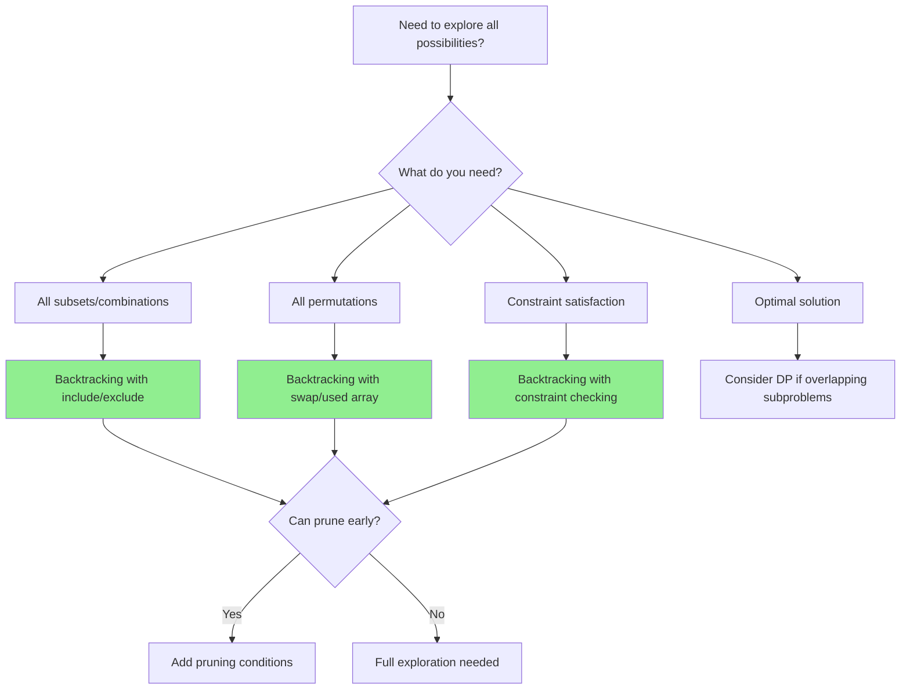
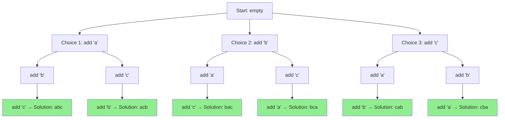
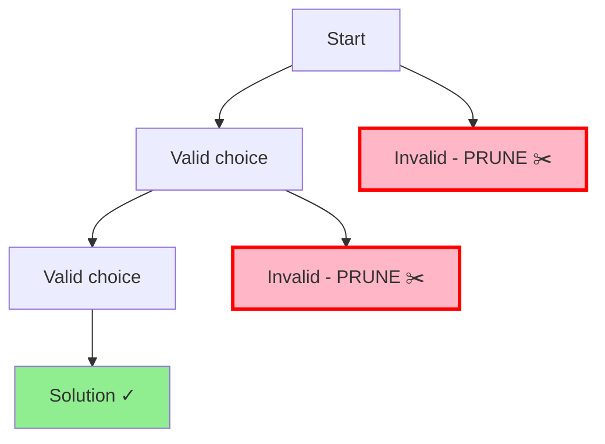

# Backtracking: Systematically Trying All Possibilities

## Quick Reference Card

| Aspect | Details |
|--------|---------|
| **Key Signal** | Generate all combinations/permutations/subsets, constraint satisfaction |
| **Time Complexity** | O(k^n) or O(n!) - exponential by nature |
| **Space Complexity** | O(n) for recursion depth |
| **Common Variants** | Subsets, permutations, combinations, N-Queens, Sudoku |

## Mental Model

**Analogy:** Exploring a maze. At each junction, pick a path. If you hit a dead end, backtrack to the last junction and try a different path. You're systematically exploring all possibilities while abandoning paths that can't lead to solutions.

**First Principle:** Backtracking builds solutions incrementally, one piece at a time. After adding each piece, we check if constraints are satisfied. If not, we remove that piece (backtrack) and try the next option. This prunes the search space significantly.

## Pattern Decision Tree



## What is Backtracking?

Backtracking is a problem-solving technique that **systematically explores all possible solutions** by building candidates incrementally and abandoning ("backtracking" from) candidates as soon as it determines they cannot lead to a valid solution.

Think of it as exploring a maze: you walk down a path, and if you hit a dead end, you **backtrack** to the last decision point and try a different path.

## The Decision Tree Concept

Backtracking problems can be visualized as a decision tree where:
- Each node represents a partial solution
- Each edge represents a choice/decision
- Leaf nodes are complete solutions (valid or invalid)



## The Backtracking Template

The classic backtracking pattern follows three steps:

1. **Choose**: Make a choice and add it to the current path
2. **Explore**: Recursively explore further choices
3. **Unchoose**: Remove the choice (backtrack) to try other options

```python
def backtrack(path, choices):
    # Base case: found a valid solution
    if is_valid_solution(path):
        result.append(path.copy())  # Save a copy!
        return

    # Try each possible choice
    for choice in choices:
        # 1. CHOOSE: make a choice
        if is_valid_choice(path, choice):
            path.append(choice)

            # 2. EXPLORE: recurse with this choice
            backtrack(path, remaining_choices(choices, choice))

            # 3. UNCHOOSE: undo the choice (backtrack)
            path.pop()
```

### Key Points:
- **Save a copy** of the solution (not a reference)
- **Always undo** your choice after exploring (this is the "backtracking" step)
- **Check validity** before making a choice (this is pruning)

## Pruning to Optimize

**Pruning** means cutting off branches of the decision tree early when we know they won't lead to valid solutions. This dramatically improves performance.



Without pruning, we'd waste time exploring invalid paths. With pruning, we check constraints **before** recursing.

## Example Problems

### 1. Generate All Permutations

**Problem**: Given `[1, 2, 3]`, generate all permutations: `[[1,2,3], [1,3,2], [2,1,3], [2,3,1], [3,1,2], [3,2,1]]`

```python
def permute(nums):
    result = []

    def backtrack(path, remaining):
        # Base case: no more numbers to add
        if not remaining:
            result.append(path.copy())
            return

        # Try each remaining number
        for i in range(len(remaining)):
            # CHOOSE: pick nums[i]
            path.append(remaining[i])

            # EXPLORE: recurse with remaining numbers
            backtrack(path, remaining[:i] + remaining[i+1:])

            # UNCHOOSE: remove nums[i]
            path.pop()

    backtrack([], nums)
    return result
```

### 2. Generate Combinations

**Problem**: Given `n = 4, k = 2`, return all combinations of k numbers from 1 to n: `[[1,2], [1,3], [1,4], [2,3], [2,4], [3,4]]`

```python
def combine(n, k):
    result = []

    def backtrack(start, path):
        # Base case: found k numbers
        if len(path) == k:
            result.append(path.copy())
            return

        # Try numbers from start to n
        for i in range(start, n + 1):
            # CHOOSE: add number i
            path.append(i)

            # EXPLORE: continue from i+1 (avoid duplicates)
            backtrack(i + 1, path)

            # UNCHOOSE: remove i
            path.pop()

    backtrack(1, [])
    return result
```

### 3. N-Queens Problem

**Problem**: Place N queens on an N×N chessboard so no two queens attack each other.

```python
def solveNQueens(n):
    result = []
    board = [['.'] * n for _ in range(n)]

    def is_valid(row, col):
        # Check column
        for i in range(row):
            if board[i][col] == 'Q':
                return False

        # Check diagonal (top-left)
        i, j = row - 1, col - 1
        while i >= 0 and j >= 0:
            if board[i][j] == 'Q':
                return False
            i, j = i - 1, j - 1

        # Check diagonal (top-right)
        i, j = row - 1, col + 1
        while i >= 0 and j < n:
            if board[i][j] == 'Q':
                return False
            i, j = i - 1, j + 1

        return True

    def backtrack(row):
        # Base case: placed all queens
        if row == n:
            result.append([''.join(row) for row in board])
            return

        # Try placing queen in each column
        for col in range(n):
            # PRUNING: skip invalid positions
            if not is_valid(row, col):
                continue

            # CHOOSE: place queen
            board[row][col] = 'Q'

            # EXPLORE: move to next row
            backtrack(row + 1)

            # UNCHOOSE: remove queen
            board[row][col] = '.'

    backtrack(0)
    return result
```

## When to Use Backtracking

Use backtracking when:

- ✅ You need to **find all solutions** (not just one)
- ✅ The problem involves **making a sequence of choices**
- ✅ Each choice **constrains future choices**
- ✅ You can **validate partial solutions** early
- ✅ The solution space is **too large for brute force** but pruning helps

Common problem types:
- Generating permutations, combinations, subsets
- Constraint satisfaction (N-Queens, Sudoku)
- Path finding with constraints
- Partition problems
- String generation with rules

## When NOT to Use Backtracking

Avoid backtracking when:

- ❌ You only need **one solution** (use greedy or other methods)
- ❌ The problem has **overlapping subproblems** → Use Dynamic Programming instead
- ❌ No good way to **prune invalid paths** → Backtracking will be too slow
- ❌ The search space is **too large** even with pruning

Example: Finding the shortest path in a weighted graph is better solved with Dijkstra's algorithm, not backtracking.

## Time Complexity

Backtracking typically has **exponential time complexity** because we explore many branches:

- **Permutations**: O(n! × n) - n! permutations, each takes O(n) to construct
- **Combinations**: O(2^n × n) - up to 2^n subsets
- **N-Queens**: O(n!) - but pruning reduces this significantly

The key to efficiency is **aggressive pruning** to eliminate invalid branches early.

## Practice Progression (Spaced Repetition)

**Day 1 (Learn):**
- Understand the backtracking template
- Solve: Subsets, Permutations

**Day 3 (Reinforce):**
- Solve: Combination Sum, Letter Combinations of Phone
- Practice drawing the decision tree

**Day 7 (Master):**
- Solve: N-Queens, Sudoku Solver
- Understand pruning strategies

**Day 14 (Maintain):**
- Solve: Word Search, Palindrome Partitioning
- Practice explaining the state space

## Related Patterns

| Pattern | When to Use Instead |
|---------|---------------------|
| **Dynamic Programming** | Need count or optimal, not all solutions |
| **BFS** | Need shortest path in unweighted graph |
| **Greedy** | Local optimal leads to global optimal |
| **Bit Manipulation** | Subsets can be represented as bitmasks |

## Summary

| Aspect | Description |
|--------|-------------|
| **Core Idea** | Try all possibilities systematically with backtracking |
| **Pattern** | Choose → Explore → Unchoose |
| **Visualization** | Decision tree with pruning |
| **Key Optimization** | Early pruning of invalid branches |
| **Time Complexity** | Usually exponential (O(2^n), O(n!)) |
| **Space Complexity** | O(depth of recursion tree) |
| **Common Uses** | Permutations, combinations, constraint satisfaction |

Backtracking is your go-to tool when you need to **explore all possibilities** but can **prune aggressively** to avoid wasting time on invalid paths.
