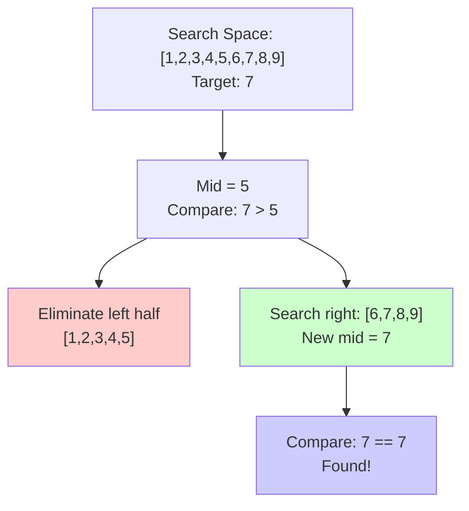
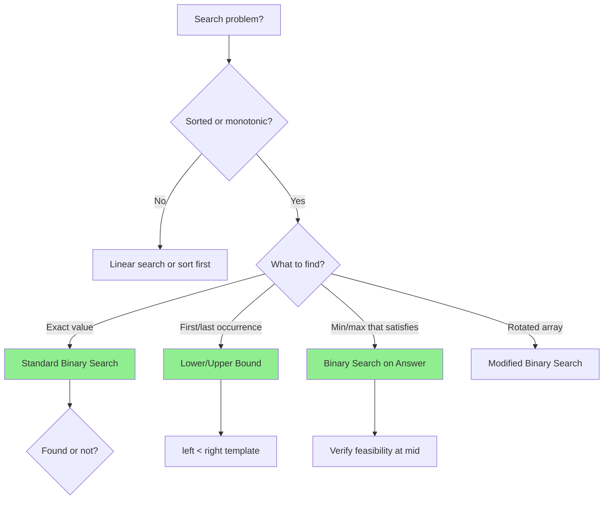
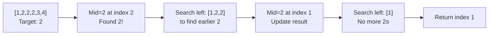
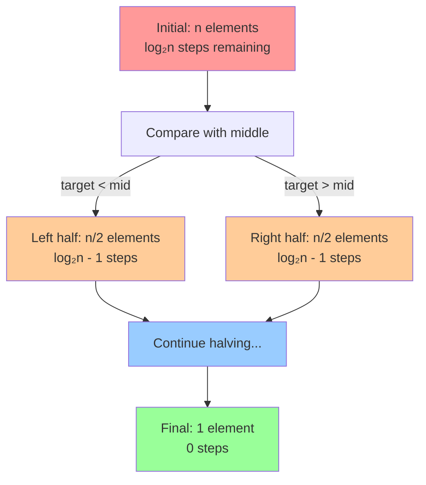

# Binary Search Pattern

## Quick Reference Card

| Aspect | Details |
|--------|---------|
| **Key Signal** | Sorted array, search space can be halved, monotonic property |
| **Time Complexity** | O(log n) - halving search space each step |
| **Space Complexity** | O(1) iterative, O(log n) recursive |
| **Common Variants** | Exact match, lower/upper bound, search on answer |

## Mental Model

**Analogy:** Finding a word in a dictionary. You don't start from page 1 - you open to the middle, see if your word comes before or after, then repeat in the relevant half. Each guess eliminates half the remaining pages.

**First Principle:** Binary search works when the search space has a monotonic property - all elements before a point satisfy a condition, all after don't (or vice versa). We find this transition point by repeatedly halving the search space.

## Overview

Binary search is a divide-and-conquer algorithm that eliminates half of the search space in each iteration. This powerful technique reduces time complexity from O(n) to O(log n) by exploiting sorted or monotonic properties.

**Core Insight**: If you can eliminate half the possibilities based on a single comparison, you can use binary search.

## The Fundamental Principle



Each comparison reduces search space by half:
- n → n/2 → n/4 → n/8 → ... → 1
- Takes log₂(n) steps to reach 1

## When to Use Binary Search

Look for these signals:

### Direct Indicators
- **Sorted array**: Classic binary search applies
- **Rotated sorted array**: Modified binary search works
- **"Find in O(log n)"**: Almost certainly binary search

### Hidden Indicators
- **Monotonic property**: Some function increases/decreases consistently
- **"Find minimum/maximum value satisfying condition"**: Binary search on answer
- **"Search in range [min, max]"**: Consider binary search on values
- **Matrix sorted by row and column**: Treat as search space

**Key Question**: Can I eliminate half the search space with one comparison?

## Pattern Decision Tree



## Classic Binary Search Template

```python
def binary_search(arr, target):
    """
    Standard binary search for exact match
    Time: O(log n), Space: O(1)

    Returns: index of target, or -1 if not found
    """
    left, right = 0, len(arr) - 1

    while left <= right:
        # Prevent overflow: mid = (left + right) // 2 can overflow
        mid = left + (right - left) // 2

        if arr[mid] == target:
            return mid
        elif arr[mid] < target:
            left = mid + 1  # Search right half
        else:
            right = mid - 1  # Search left half

    return -1  # Target not found
```

### Why `left + (right - left) // 2`?

```python
# In languages with fixed integer size:
# (left + right) // 2  # Can overflow if left + right > MAX_INT

# This is safer:
# left + (right - left) // 2  # No overflow possible

# In Python, integers have arbitrary precision, so both work
# But it's good practice for interviews
```

## Binary Search Variations

### 1. Find First Occurrence

```python
def find_first(arr, target):
    """
    Find leftmost (first) occurrence of target
    """
    left, right = 0, len(arr) - 1
    result = -1

    while left <= right:
        mid = left + (right - left) // 2

        if arr[mid] == target:
            result = mid      # Record potential answer
            right = mid - 1   # Continue searching left for earlier occurrence
        elif arr[mid] < target:
            left = mid + 1
        else:
            right = mid - 1

    return result
```



### 2. Find Last Occurrence

```python
def find_last(arr, target):
    """
    Find rightmost (last) occurrence of target
    """
    left, right = 0, len(arr) - 1
    result = -1

    while left <= right:
        mid = left + (right - left) // 2

        if arr[mid] == target:
            result = mid      # Record potential answer
            left = mid + 1    # Continue searching right for later occurrence
        elif arr[mid] < target:
            left = mid + 1
        else:
            right = mid - 1

    return result
```

### 3. Search in Rotated Sorted Array

```python
def search_rotated(arr, target):
    """
    Search in rotated sorted array: [4,5,6,7,0,1,2]
    One half is always sorted!
    """
    left, right = 0, len(arr) - 1

    while left <= right:
        mid = left + (right - left) // 2

        if arr[mid] == target:
            return mid

        # Determine which half is sorted
        if arr[left] <= arr[mid]:  # Left half is sorted
            # Check if target is in sorted left half
            if arr[left] <= target < arr[mid]:
                right = mid - 1
            else:
                left = mid + 1
        else:  # Right half is sorted
            # Check if target is in sorted right half
            if arr[mid] < target <= arr[right]:
                left = mid + 1
            else:
                right = mid - 1

    return -1
```

**Key insight**: In a rotated sorted array, at least one half is always sorted. Use the sorted half to decide which direction to search.

### 4. Find Minimum in Rotated Sorted Array

```python
def find_min_rotated(arr):
    """
    Find minimum in rotated sorted array
    Minimum is at rotation point!
    """
    left, right = 0, len(arr) - 1

    # If not rotated
    if arr[left] <= arr[right]:
        return arr[left]

    while left < right:
        mid = left + (right - left) // 2

        # Minimum is in right half
        if arr[mid] > arr[right]:
            left = mid + 1
        else:
            # Minimum is in left half (including mid)
            right = mid

    return arr[left]
```

### 5. Binary Search on Answer Space

**Problem**: Find minimum capacity to ship packages in D days.

```python
def ship_within_days(weights, days):
    """
    Binary search on the answer (capacity)
    Range: [max(weights), sum(weights)]
    """
    def can_ship(capacity):
        """Check if we can ship with this capacity"""
        days_needed = 1
        current_load = 0

        for weight in weights:
            if current_load + weight > capacity:
                days_needed += 1
                current_load = weight
            else:
                current_load += weight

        return days_needed <= days

    # Binary search on capacity
    left = max(weights)      # Minimum possible capacity
    right = sum(weights)     # Maximum possible capacity

    while left < right:
        mid = left + (right - left) // 2

        if can_ship(mid):
            right = mid  # Try smaller capacity
        else:
            left = mid + 1  # Need larger capacity

    return left
```

**Key insight**: When answer is a value in a range, binary search on that range. Use a helper function to check if a value works.

## Search Space Reduction Visualization



## Example Problems with Approaches

### Problem 1: Search Insert Position
**Problem**: Find index where target would be inserted in sorted array.

```python
def search_insert(nums, target):
    """
    Return index of target or where it would be inserted
    Time: O(log n), Space: O(1)
    """
    left, right = 0, len(nums) - 1

    while left <= right:
        mid = left + (right - left) // 2

        if nums[mid] == target:
            return mid
        elif nums[mid] < target:
            left = mid + 1
        else:
            right = mid - 1

    # When not found, left is the insertion position
    return left
```

**Key insight**: After loop, `left` points to insertion position.

### Problem 2: Find Peak Element
**Problem**: Find any peak element (greater than neighbors) in array.

```python
def find_peak_element(nums):
    """
    Find any peak in O(log n)
    Peak: nums[i] > nums[i-1] and nums[i] > nums[i+1]
    """
    left, right = 0, len(nums) - 1

    while left < right:
        mid = left + (right - left) // 2

        # If descending, peak is on left
        if nums[mid] > nums[mid + 1]:
            right = mid
        else:
            # If ascending, peak is on right
            left = mid + 1

    return left
```

**Key insight**: Always move toward the higher neighbor. A peak must exist in that direction.

### Problem 3: Sqrt(x)
**Problem**: Compute integer square root without using built-in sqrt.

```python
def my_sqrt(x):
    """
    Binary search on answer range [0, x]
    """
    if x < 2:
        return x

    left, right = 1, x // 2

    while left <= right:
        mid = left + (right - left) // 2
        square = mid * mid

        if square == x:
            return mid
        elif square < x:
            left = mid + 1
        else:
            right = mid - 1

    # Return floor of sqrt
    return right
```

**Key insight**: Search for largest integer whose square doesn't exceed x.

### Problem 4: Koko Eating Bananas
**Problem**: Find minimum eating speed to finish all bananas in h hours.

```python
def min_eating_speed(piles, h):
    """
    Binary search on eating speed
    Range: [1, max(piles)]
    """
    def can_finish(speed):
        """Check if can finish with this speed"""
        hours = 0
        for pile in piles:
            hours += (pile + speed - 1) // speed  # Ceiling division
        return hours <= h

    left, right = 1, max(piles)

    while left < right:
        mid = left + (right - left) // 2

        if can_finish(mid):
            right = mid  # Try slower speed
        else:
            left = mid + 1  # Need faster speed

    return left
```

**Key insight**: Binary search on speed. Use helper to verify if speed works.

## Common Pitfalls

### 1. Infinite Loop with `left < right`
```python
# WRONG: Can cause infinite loop
while left < right:
    mid = left + (right - left) // 2
    if arr[mid] < target:
        left = mid  # BUG: left might never move!
    else:
        right = mid - 1

# CORRECT: Ensure progress
while left < right:
    mid = left + (right - left) // 2
    if arr[mid] < target:
        left = mid + 1  # Always move forward
    else:
        right = mid
```

### 2. Wrong Loop Condition
```python
# Use left <= right when returning mid
while left <= right:
    ...
    return mid

# Use left < right when returning left/right
while left < right:
    ...
return left  # or right
```

### 3. Off-by-One Errors
```python
# Finding first occurrence
if arr[mid] == target:
    result = mid
    right = mid - 1  # Not mid! Continue searching left

# Finding last occurrence
if arr[mid] == target:
    result = mid
    left = mid + 1  # Not mid! Continue searching right
```

### 4. Integer Overflow (Other Languages)
```python
# In Java/C++, this can overflow:
mid = (left + right) / 2

# Safe version:
mid = left + (right - left) / 2
```

### 5. Incorrect Boundary for Binary Search on Answer
```python
# WRONG: Arbitrary boundaries
left, right = 0, 1000000

# CORRECT: Logical boundaries based on problem
left = max(weights)      # Minimum possible
right = sum(weights)     # Maximum possible
```

## Complexity Analysis

- **Time Complexity**: O(log n) for search
  - Each iteration halves the search space
  - log₂(1000000) ≈ 20 iterations max
- **Space Complexity**:
  - O(1) for iterative implementation
  - O(log n) for recursive (call stack)

## Types of Binary Search Problems

1. **Search for exact value**: Classic binary search
2. **Search for boundary**: First/last occurrence
3. **Search in modified array**: Rotated, peak finding
4. **Binary search on answer**: Capacity, speed, threshold
5. **2D matrix search**: Treat as 1D array or use properties

## Practice Problems

1. **Easy**:
   - Binary Search
   - Search Insert Position
   - First Bad Version

2. **Medium**:
   - Search in Rotated Sorted Array
   - Find Peak Element
   - Koko Eating Bananas
   - Capacity To Ship Packages

3. **Hard**:
   - Median of Two Sorted Arrays
   - Split Array Largest Sum
   - Find Minimum in Rotated Sorted Array II

## Practice Progression (Spaced Repetition)

**Day 1 (Learn):**
- Understand the three templates (exact, lower bound, upper bound)
- Solve: Binary Search, First Bad Version

**Day 3 (Reinforce):**
- Write templates without looking
- Solve: Search Insert Position, Find First and Last Position

**Day 7 (Master):**
- Solve: Search in Rotated Sorted Array
- Solve: Find Minimum in Rotated Sorted Array

**Day 14 (Maintain):**
- Solve: Median of Two Sorted Arrays (hard)
- Practice "binary search on answer" problems

## Related Patterns

| Pattern | When to Use Instead |
|---------|---------------------|
| **Two Pointers** | Finding pairs in sorted array |
| **Linear Search** | Unsorted, small input, or need all matches |
| **Ternary Search** | Finding peak in unimodal function |
| **Exponential Search** | Unknown/infinite search space |

## Summary

Binary search is more than finding a target in a sorted array:
- **Core principle**: Eliminate half the search space each iteration
- **Key skill**: Recognizing when monotonic properties exist
- **Three main types**: Classic search, boundary search, answer search
- **Critical details**: Loop conditions, boundary updates, avoiding infinite loops

The pattern extends beyond sorted arrays to any problem where you can efficiently eliminate half the possibilities. Master this, and O(log n) becomes your superpower!
