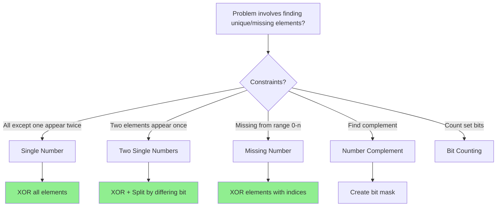

# Bitwise XOR Pattern

## Quick Reference Card

| Aspect | Details |
|--------|---------|
| **Key Signal** | Find unique element, pairs cancel out, O(1) space requirement |
| **Time Complexity** | O(n) - single pass through array |
| **Space Complexity** | O(1) - constant extra space |
| **Common Variants** | Single number, two unique, missing number, complement |

## Mental Model

**Analogy:** XOR is like a "toggle switch" for bits. If you flip a switch twice, it returns to its original state. Similarly, XORing a number with itself gives 0, and any number XORed with 0 stays the same. Paired numbers cancel out, leaving only unpaired ones.

**First Principle:** XOR has three crucial properties:
1. `a ^ a = 0` (self-inverse)
2. `a ^ 0 = a` (identity)
3. `a ^ b ^ a = b` (pairs cancel)

When all elements except one appear in pairs, XORing everything leaves only the unpaired element.

## Pattern Decision Tree



## Overview

The Bitwise XOR pattern leverages XOR's unique properties to solve problems involving:
- Finding elements that appear an odd number of times
- Detecting missing or duplicate numbers
- Bit manipulation without extra space

**Core XOR Properties:**

```
1. a ^ a = 0         (self-cancellation)
2. a ^ 0 = a         (identity)
3. a ^ b = b ^ a     (commutative)
4. (a ^ b) ^ c = a ^ (b ^ c)  (associative)
5. a ^ b ^ a = b     (pairs cancel)
```

**Key Insight:** In a collection where most elements appear twice, XORing all elements leaves only the element(s) that appear once.

## When to Use

Look for these signals:

1. **"Find the unique element"**: All but one element appears twice
2. **"Find missing number"**: Array of 0 to n with one missing
3. **"O(1) space required"**: Hash table would use O(n)
4. **"Appears once/twice"**: Pair cancellation opportunity
5. **"Bit manipulation"**: Problems involving binary representation

**Key phrases:**
- "Every element appears twice except one"
- "Find the missing number"
- "Without using extra space"
- "Non-empty array of integers"

## Template Code

### Single Number (One Unique)

```python
def single_number(nums):
    """
    Find element that appears once (others appear twice).
    Time: O(n), Space: O(1)
    """
    result = 0
    for num in nums:
        result ^= num
    return result

# Example: [4, 1, 2, 1, 2]
# 0 ^ 4 = 4
# 4 ^ 1 = 5
# 5 ^ 2 = 7
# 7 ^ 1 = 6
# 6 ^ 2 = 4
# Result: 4
```

### Two Single Numbers

```python
def single_number_two_unique(nums):
    """
    Find two elements that appear once (others appear twice).
    Time: O(n), Space: O(1)
    """
    # Step 1: XOR all to get xor of the two unique numbers
    xor_all = 0
    for num in nums:
        xor_all ^= num

    # Step 2: Find any bit that differs between the two numbers
    # (rightmost set bit)
    diff_bit = xor_all & (-xor_all)

    # Step 3: Partition and XOR separately
    num1 = num2 = 0
    for num in nums:
        if num & diff_bit:
            num1 ^= num
        else:
            num2 ^= num

    return [num1, num2]

# Example: [1, 2, 1, 3, 2, 5]
# xor_all = 3 ^ 5 = 6 (binary: 110)
# diff_bit = 2 (binary: 010)
# Group with bit set: [2, 3, 2] → XOR = 3
# Group without bit: [1, 1, 5] → XOR = 5
# Result: [3, 5]
```

### Missing Number (Range 0 to n)

```python
def missing_number(nums):
    """
    Find missing number in range [0, n].
    Time: O(n), Space: O(1)
    """
    n = len(nums)
    result = n  # Start with n (the last index + 1)

    for i, num in enumerate(nums):
        result ^= i ^ num

    return result

# Example: [3, 0, 1] (n=3, missing 2)
# result = 3
# i=0: 3 ^ 0 ^ 3 = 0
# i=1: 0 ^ 1 ^ 0 = 1
# i=2: 1 ^ 2 ^ 1 = 2
# Result: 2
```

## Worked Example

### Problem: Single Number

**Given:** `nums = [2, 3, 2, 4, 4]`
**Find:** The element appearing once (others appear twice)

```
Step-by-step XOR:

Initialize: result = 0

Process 2:  result = 0 ^ 2 = 2
            Binary: 00 ^ 10 = 10

Process 3:  result = 2 ^ 3 = 1
            Binary: 10 ^ 11 = 01

Process 2:  result = 1 ^ 2 = 3
            Binary: 01 ^ 10 = 11

Process 4:  result = 3 ^ 4 = 7
            Binary: 011 ^ 100 = 111

Process 4:  result = 7 ^ 4 = 3
            Binary: 111 ^ 100 = 011

Final: result = 3

Verification:
2 ^ 2 = 0  (cancels)
4 ^ 4 = 0  (cancels)
0 ^ 0 ^ 3 = 3 ✓
```

**Visual representation:**

```
Elements: [2, 3, 2, 4, 4]

After XOR:
  2 ^ 2 = 0 (paired, cancel)
  4 ^ 4 = 0 (paired, cancel)
  3 = 3     (unpaired, remains)

Result: 3
```

## Example Problems with Approaches

### Problem 1: Single Number
**Problem:** Array where every element appears twice except one. Find that one.

```python
def single_number(nums):
    result = 0
    for num in nums:
        result ^= num
    return result

# One-liner
def single_number_oneliner(nums):
    from functools import reduce
    return reduce(lambda x, y: x ^ y, nums)
```

**Key insight:** Pairs cancel; only unique remains.

### Problem 2: Single Number II (Elements Appear Thrice)
**Problem:** Every element appears three times except one (appears once).

```python
def single_number_II(nums):
    """
    Find element appearing once (others appear thrice).
    Time: O(n), Space: O(1)
    """
    # Count bits at each position modulo 3
    result = 0

    for i in range(32):
        bit_sum = 0
        for num in nums:
            # Count 1s at position i
            bit_sum += (num >> i) & 1

        # If not divisible by 3, single number has 1 here
        if bit_sum % 3:
            result |= (1 << i)

    # Handle negative numbers (Python-specific)
    if result >= 2**31:
        result -= 2**32

    return result
```

**Alternative using state machine:**

```python
def single_number_II_state(nums):
    """
    Using two variables to track state.
    ones: bits that appeared 1 mod 3 times
    twos: bits that appeared 2 mod 3 times
    """
    ones = twos = 0

    for num in nums:
        ones = (ones ^ num) & ~twos
        twos = (twos ^ num) & ~ones

    return ones
```

**Key insight:** Count bits modulo 3; non-divisible positions belong to single number.

### Problem 3: Single Number III (Two Unique)
**Problem:** Two elements appear once; all others appear twice.

```python
def single_number_III(nums):
    # Step 1: Get XOR of the two unique numbers
    xor_all = 0
    for num in nums:
        xor_all ^= num

    # Step 2: Find rightmost set bit (differs between two numbers)
    diff_bit = xor_all & (-xor_all)

    # Step 3: Separate into two groups and XOR each
    a = b = 0
    for num in nums:
        if num & diff_bit:
            a ^= num
        else:
            b ^= num

    return [a, b]
```

**Key insight:** The two unique numbers differ in at least one bit. Use that bit to partition.

### Problem 4: Missing Number
**Problem:** Array of n numbers from 0 to n, one is missing.

```python
def missing_number(nums):
    result = len(nums)  # Start with n

    for i, num in enumerate(nums):
        result ^= i ^ num

    return result

# Alternative: XOR with full range
def missing_number_v2(nums):
    n = len(nums)
    expected_xor = 0
    actual_xor = 0

    for i in range(n + 1):
        expected_xor ^= i

    for num in nums:
        actual_xor ^= num

    return expected_xor ^ actual_xor
```

**Key insight:** XOR of [0..n] XOR'd with array elements leaves missing number.

### Problem 5: Find the Duplicate Number
**Problem:** Array of n+1 numbers from 1 to n, one duplicate.

```python
def find_duplicate_xor(nums):
    """
    Note: This works only if exactly one number is duplicated once.
    For the general problem, use Floyd's cycle detection.
    """
    n = len(nums) - 1
    result = 0

    # XOR all array elements
    for num in nums:
        result ^= num

    # XOR with 1 to n
    for i in range(1, n + 1):
        result ^= i

    return result
```

**Key insight:** If one number appears twice and one is missing, XOR reveals the duplicate.

### Problem 6: Complement of Base 10 Integer
**Problem:** Find the complement (flip all bits in binary representation).

```python
def bitwiseComplement(n):
    """
    Flip all bits in n's binary representation.
    """
    if n == 0:
        return 1

    # Create mask with all 1s of same length as n
    mask = 1
    while mask <= n:
        mask <<= 1
    mask -= 1  # e.g., 5 (101) → mask = 7 (111)

    return n ^ mask

# Example: n = 5 (101)
# mask = 7 (111)
# 5 ^ 7 = 2 (010)
```

**Key insight:** XOR with all-1s mask flips all bits.

### Problem 7: Sum of Two Integers Without + or -
**Problem:** Add two integers using only bitwise operations.

```python
def getSum(a, b):
    """
    Add without + or - operators.
    Uses XOR for addition without carry,
    AND + shift for carry.
    """
    # Python handles arbitrary precision, need masking
    MASK = 0xFFFFFFFF
    MAX_INT = 0x7FFFFFFF

    while b != 0:
        carry = (a & b) << 1
        a = (a ^ b) & MASK
        b = carry & MASK

    # Handle negative numbers
    return a if a <= MAX_INT else ~(a ^ MASK)
```

**Key insight:**
- `a ^ b` gives sum without carries
- `(a & b) << 1` gives the carries
- Repeat until no carries

## XOR Properties Deep Dive

### Property 1: Self-Inverse (a ^ a = 0)

```python
# Any number XORed with itself is 0
5 ^ 5 = 0
# Binary: 101 ^ 101 = 000
```

### Property 2: Identity (a ^ 0 = a)

```python
# XOR with 0 preserves the number
5 ^ 0 = 5
# Binary: 101 ^ 000 = 101
```

### Property 3: Commutativity (a ^ b = b ^ a)

```python
# Order doesn't matter
3 ^ 5 == 5 ^ 3  # Both equal 6
```

### Property 4: Associativity ((a ^ b) ^ c = a ^ (b ^ c))

```python
# Grouping doesn't matter
(2 ^ 3) ^ 4 == 2 ^ (3 ^ 4)  # Both equal 5
```

### Property 5: Finding Rightmost Set Bit

```python
def rightmost_set_bit(n):
    return n & (-n)

# Example: n = 12 (1100)
# -n = -12 (two's complement: ...11110100)
# n & (-n) = 4 (0100) - rightmost set bit
```

### Property 6: Swapping Without Temp Variable

```python
def swap(a, b):
    a = a ^ b
    b = a ^ b  # b = (a^b) ^ b = a
    a = a ^ b  # a = (a^b) ^ a = b
    return a, b
```

## Common Pitfalls

### 1. Forgetting Edge Cases

```python
# WRONG: Empty array
def single_number(nums):
    result = 0
    for num in nums:
        result ^= num
    return result  # Returns 0 for empty array

# CORRECT: Check for empty
def single_number(nums):
    if not nums:
        return None  # or raise exception
    result = 0
    for num in nums:
        result ^= num
    return result
```

### 2. Confusing XOR with OR/AND

```python
# XOR: 1 ^ 1 = 0, 0 ^ 0 = 0, 1 ^ 0 = 1
# OR:  1 | 1 = 1, 0 | 0 = 0, 1 | 0 = 1
# AND: 1 & 1 = 1, 0 & 0 = 0, 1 & 0 = 0

# XOR is "exclusive or" - true only if inputs differ
```

### 3. Not Handling Negative Numbers (Language-Specific)

```python
# Python has arbitrary precision integers
# May need masking for consistent behavior

MASK = 0xFFFFFFFF  # 32-bit mask
result = result & MASK
```

### 4. Applying to Wrong Problem Type

```python
# XOR only works when:
# - Elements appear EVEN number of times (cancel)
# - Looking for elements appearing ODD number of times

# WRONG: Elements appear 3 times - use bit counting instead
# WRONG: Finding kth largest - use heap instead
```

### 5. Forgetting Operator Precedence

```python
# WRONG: & has lower precedence than ==
if num & diff_bit == 0:  # Evaluates as: num & (diff_bit == 0)

# CORRECT: Use parentheses
if (num & diff_bit) == 0:
```

## Complexity Analysis

| Problem Type | Time | Space | Notes |
|-------------|------|-------|-------|
| Single Number | O(n) | O(1) | One pass |
| Two Singles | O(n) | O(1) | Two passes |
| Missing Number | O(n) | O(1) | One pass |
| Three Times (bit count) | O(32n) | O(1) | 32 bit positions |

## Practice Progression (Spaced Repetition)

**Day 1 (Learn):**
- Memorize XOR properties
- Solve: Single Number, Missing Number

**Day 3 (Reinforce):**
- Implement without looking at code
- Solve: Single Number III (two unique)

**Day 7 (Master):**
- Solve: Single Number II (appears thrice)
- Can you explain how bit counting works?

**Day 14 (Maintain):**
- Solve: Complement of Base 10 Integer
- Practice: Add without + operator

## Related Patterns

| Pattern | When to Use Instead |
|---------|---------------------|
| **Hash Table** | Need O(1) lookup, O(n) space acceptable |
| **Cyclic Sort** | Array has range [1, n] constraint |
| **Bit Counting** | Elements appear k times (k > 2) |
| **Two Pointers** | Sorted array, finding pairs |

## Practice Problems

| Problem | Difficulty | Key Insight |
|---------|------------|-------------|
| Single Number | Easy | XOR all elements |
| Missing Number | Easy | XOR with indices |
| Single Number II | Medium | Bit counting mod 3 |
| Single Number III | Medium | Split by differing bit |
| Complement of Base 10 | Easy | XOR with all-1s mask |
| Sum of Two Integers | Medium | XOR + carry |

## Summary

The Bitwise XOR pattern provides O(1) space solutions for:
- **Finding unique elements**: Pairs cancel, unique remains
- **Missing numbers**: XOR with expected range
- **Bit manipulation**: Complement, addition, swapping

**Core Properties:**
1. `a ^ a = 0` - self-cancellation
2. `a ^ 0 = a` - identity
3. Commutative and associative - order doesn't matter

**When to recognize:**
- "Every element appears twice except..."
- "Find missing number"
- "O(1) space constraint"
- "Without using extra memory"

**Key insight:** XOR is a reversible operation. When pairs cancel out, only unpaired elements remain. This transforms O(n) space hash table solutions into O(1) space XOR solutions.

Master this pattern to elegantly solve problems that seem to require extra space!
