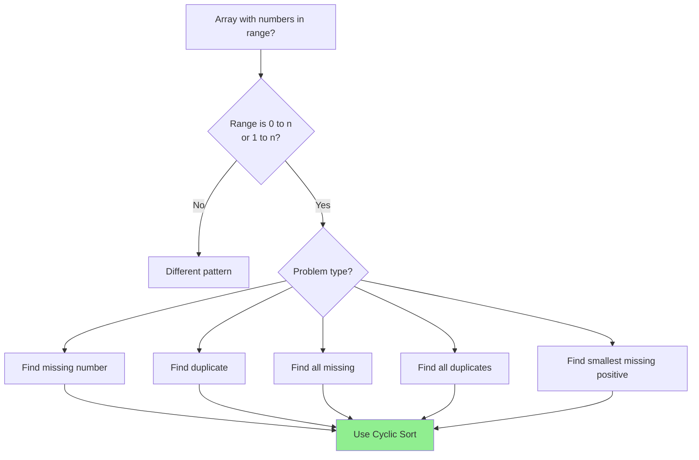

# Cyclic Sort Pattern

## Quick Reference Card

| Aspect | Details |
|--------|---------|
| **Key Signal** | Array contains numbers in range [0, n] or [1, n] |
| **Time Complexity** | O(n) - each element moved at most once |
| **Space Complexity** | O(1) - in-place sorting |
| **Common Variants** | Find missing, find duplicate, find all missing |

## Mental Model

**Analogy:** Imagine numbered chairs (1-n) and n people holding number cards. Each person should sit in their matching chair. You go through each chair, and if the wrong person is sitting there, swap them to their correct chair. Keep swapping until the right person sits down.

**First Principle:** When elements are in a known continuous range [0, n] or [1, n], each element has exactly one "correct" position. By placing each element at its correct index, we can solve missing/duplicate problems in O(n) time with O(1) space.

## Pattern Decision Tree



## Overview

Cyclic Sort is an in-place sorting algorithm designed specifically for arrays containing elements in a continuous range. Instead of comparing elements, we place each element at its "correct" position based on its value.

**Core Insight:** If an array contains numbers from 1 to n, then number `i` should be at index `i-1`. If it contains 0 to n-1, then number `i` should be at index `i`.

This pattern shines when:
- The problem involves a continuous range of integers
- You need O(1) space complexity
- Finding missing or duplicate numbers is the goal

## When to Use

Look for these signals:

1. **Range constraint**: Numbers are in range [1, n] or [0, n-1]
2. **Missing/duplicate**: Find what's missing or repeated
3. **In-place requirement**: Must use O(1) extra space
4. **Array length matches range**: n elements with values 1-n (or similar)

**Key phrases in problems:**
- "Array of n integers where each integer is in the range [1, n]"
- "Find the missing number"
- "Find the duplicate"
- "Numbers appear once or twice"

## Template Code

### Basic Cyclic Sort (1 to n)

```python
def cyclic_sort(nums):
    """
    Sort array where elements are 1 to n.
    Each element i should be at index i-1.

    Time: O(n), Space: O(1)
    """
    i = 0
    while i < len(nums):
        # Correct position for nums[i] is nums[i] - 1
        correct_pos = nums[i] - 1

        # If element is not at correct position, swap
        if nums[i] != nums[correct_pos]:
            nums[i], nums[correct_pos] = nums[correct_pos], nums[i]
            # Don't increment i - check swapped element
        else:
            i += 1

    return nums
```

### Cyclic Sort (0 to n-1)

```python
def cyclic_sort_zero_indexed(nums):
    """
    Sort array where elements are 0 to n-1.
    Each element i should be at index i.

    Time: O(n), Space: O(1)
    """
    i = 0
    while i < len(nums):
        correct_pos = nums[i]

        if nums[i] < len(nums) and nums[i] != nums[correct_pos]:
            nums[i], nums[correct_pos] = nums[correct_pos], nums[i]
        else:
            i += 1

    return nums
```

## Worked Example

### Problem: Find the Missing Number

**Given:** Array of n numbers from 0 to n (one is missing)
**Find:** The missing number

**Example:** `nums = [3, 0, 1]` → Missing: `2`

**Step-by-step:**

```
Initial: [3, 0, 1]

i=0: nums[0]=3, correct_pos=3 (out of bounds for length 3)
     Skip, i=1

i=1: nums[1]=0, correct_pos=0
     nums[1] != nums[0] (0 != 3), SWAP
     [0, 3, 1]

i=1: nums[1]=3, correct_pos=3 (out of bounds)
     Skip, i=2

i=2: nums[2]=1, correct_pos=1
     nums[2] != nums[1] (1 != 3), SWAP
     [0, 1, 3]

i=2: nums[2]=3, correct_pos=3 (out of bounds)
     Skip, i=3

Done! Array: [0, 1, 3]
Missing number: index 2 (value 3 is there instead of 2)
```

**Implementation:**

```python
def find_missing_number(nums):
    """
    Find missing number in array of 0 to n.
    Time: O(n), Space: O(1)
    """
    n = len(nums)
    i = 0

    # Cyclic sort
    while i < n:
        correct_pos = nums[i]

        # Skip if out of range or already correct
        if nums[i] < n and nums[i] != nums[correct_pos]:
            nums[i], nums[correct_pos] = nums[correct_pos], nums[i]
        else:
            i += 1

    # Find first index where value != index
    for i in range(n):
        if nums[i] != i:
            return i

    return n  # All 0 to n-1 present, n is missing

# Example trace:
# [3, 0, 1] → [0, 1, 3] → return 2 (index where value != index)
```

## Example Problems with Approaches

### Problem 1: Find Missing Number
**Problem:** Array of n numbers containing 0 to n with one missing.

```python
def missing_number(nums):
    n = len(nums)
    i = 0

    while i < n:
        j = nums[i]
        if j < n and nums[i] != nums[j]:
            nums[i], nums[j] = nums[j], nums[i]
        else:
            i += 1

    for i in range(n):
        if nums[i] != i:
            return i
    return n
```

**Key insight:** After sorting, the index that doesn't match its value is the answer.

### Problem 2: Find All Duplicates
**Problem:** Array of n numbers (1 to n), some appear twice, some once. Find all duplicates.

```python
def find_duplicates(nums):
    """
    Find all duplicates in O(n) time, O(1) space.
    """
    i = 0
    while i < len(nums):
        correct_pos = nums[i] - 1  # 1-indexed

        if nums[i] != nums[correct_pos]:
            nums[i], nums[correct_pos] = nums[correct_pos], nums[i]
        else:
            i += 1

    duplicates = []
    for i in range(len(nums)):
        if nums[i] != i + 1:
            duplicates.append(nums[i])

    return duplicates

# [4,3,2,7,8,2,3,1] → [1,2,3,4,3,2,7,8]
# Positions 4,5 have wrong values: 3,2 are duplicates
```

**Key insight:** After sorting, any position where `nums[i] != i+1` contains a duplicate.

### Problem 3: Find All Missing Numbers
**Problem:** Array of n numbers (1 to n), some appear twice, find all missing.

```python
def find_disappeared_numbers(nums):
    """
    Find all missing numbers in O(n) time, O(1) space.
    """
    i = 0
    while i < len(nums):
        correct_pos = nums[i] - 1

        if nums[i] != nums[correct_pos]:
            nums[i], nums[correct_pos] = nums[correct_pos], nums[i]
        else:
            i += 1

    missing = []
    for i in range(len(nums)):
        if nums[i] != i + 1:
            missing.append(i + 1)

    return missing
```

**Key insight:** After sorting, positions with wrong values indicate missing numbers.

### Problem 4: Find the Duplicate Number (Single Duplicate)
**Problem:** Array of n+1 numbers (1 to n), exactly one duplicate.

```python
def find_duplicate(nums):
    """
    Find single duplicate. (Can also use Floyd's cycle detection)
    """
    i = 0
    while i < len(nums):
        if nums[i] != i + 1:
            correct_pos = nums[i] - 1
            if nums[i] != nums[correct_pos]:
                nums[i], nums[correct_pos] = nums[correct_pos], nums[i]
            else:
                return nums[i]  # Found duplicate
        else:
            i += 1

    return -1  # Should not reach here
```

**Key insight:** When we try to place a number but that position already has the same number, we found the duplicate.

### Problem 5: First Missing Positive
**Problem:** Find smallest missing positive integer (not limited to n range).

```python
def first_missing_positive(nums):
    """
    Find first missing positive in O(n) time, O(1) space.
    Key insight: Answer must be in range [1, n+1]
    """
    n = len(nums)
    i = 0

    while i < n:
        correct_pos = nums[i] - 1

        # Only process positive numbers in range [1, n]
        if 0 < nums[i] <= n and nums[i] != nums[correct_pos]:
            nums[i], nums[correct_pos] = nums[correct_pos], nums[i]
        else:
            i += 1

    # Find first position where value != index + 1
    for i in range(n):
        if nums[i] != i + 1:
            return i + 1

    return n + 1

# [3, 4, -1, 1] → [1, -1, 3, 4] → return 2
# [1, 2, 0] → [1, 2, 0] → return 3
```

**Key insight:** The first missing positive must be in range [1, n+1]. Ignore negatives and out-of-range values.

## Why O(n) Time Complexity?

It might look like O(n²) due to the nested structure, but consider:

```
Each element is swapped at most once to its final position.
Total swaps ≤ n
Each element is visited at most twice (once as i, once as swap target)
Total operations = O(n)
```

**Proof:** Every swap places at least one element in its correct position. Once in correct position, an element is never moved again. With n elements, we have at most n swaps.

## Common Pitfalls

### 1. Off-by-One Errors

```python
# For 1 to n range:
correct_pos = nums[i] - 1  # CORRECT

# For 0 to n-1 range:
correct_pos = nums[i]      # CORRECT
```

### 2. Infinite Loop (Swapping Same Position)

```python
# WRONG: May infinite loop
if nums[i] != i + 1:
    swap()  # What if swapped value also not in place?

# CORRECT: Check if swap would change anything
if nums[i] != nums[correct_pos]:
    swap()
```

### 3. Forgetting Bounds Check

```python
# WRONG: May access out of bounds
correct_pos = nums[i] - 1
nums[i], nums[correct_pos] = ...

# CORRECT: Check bounds first
if 1 <= nums[i] <= n and nums[i] != nums[correct_pos]:
    swap()
```

### 4. Not Staying at Index After Swap

```python
# WRONG: Moving on after swap
for i in range(n):
    if needs_swap:
        swap()
    # i moves forward, but swapped element not checked

# CORRECT: Use while loop, only increment when done
while i < n:
    if needs_swap:
        swap()
        # Don't increment i
    else:
        i += 1
```

## Complexity Analysis

| Aspect | Complexity | Notes |
|--------|------------|-------|
| **Time** | O(n) | Each element moved at most once |
| **Space** | O(1) | In-place, constant extra space |
| **Swaps** | ≤ n | At most one swap per element |

## Practice Progression (Spaced Repetition)

**Day 1 (Learn):**
- Read this guide thoroughly
- Solve: Missing Number, Find All Missing Numbers

**Day 3 (Reinforce):**
- Review template without notes
- Solve: Find All Duplicates

**Day 7 (Master):**
- Solve: Find the Duplicate Number
- Can you explain cyclic sort in 2 minutes?

**Day 14 (Maintain):**
- Solve: First Missing Positive (hard variant)

## Related Patterns

| Pattern | When to Use Instead |
|---------|---------------------|
| **Binary Search** | Range is not continuous or array is sorted |
| **Hash Set** | When O(n) space is acceptable |
| **Bit Manipulation** | XOR for single missing in 0-n |
| **Two Pointers** | When dealing with pairs or sorted arrays |

## Practice Problems

| Problem | Difficulty | Key Insight |
|---------|------------|-------------|
| Missing Number | Easy | Sort 0 to n, find mismatch |
| Find All Missing Numbers | Easy | After sort, collect mismatches |
| Find the Duplicate Number | Medium | Swap until collision |
| Find All Duplicates | Medium | Mismatched values are duplicates |
| First Missing Positive | Hard | Ignore out-of-range values |
| Set Mismatch | Easy | Find both duplicate and missing |

## Summary

Cyclic Sort is a specialized pattern for problems involving:
- **Continuous integer ranges** [0, n] or [1, n]
- **In-place requirements** with O(1) space
- **Missing or duplicate** detection

**Key technique:** Place each element at its "correct" index, then scan for anomalies.

**When to recognize:** "Array of n integers in range 1 to n" or similar phrasing.

Master this pattern to instantly solve an entire class of problems that would otherwise require O(n) extra space with hash sets!
