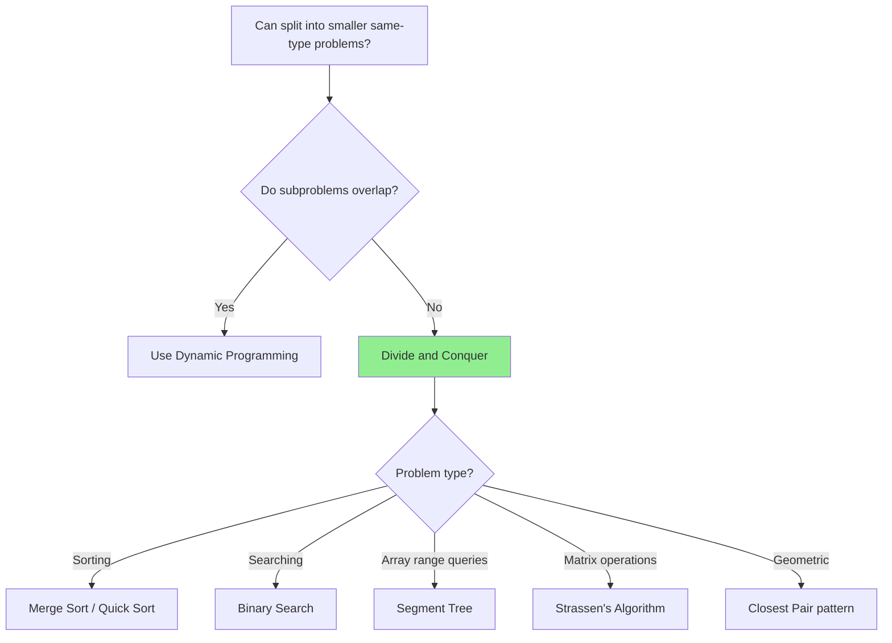
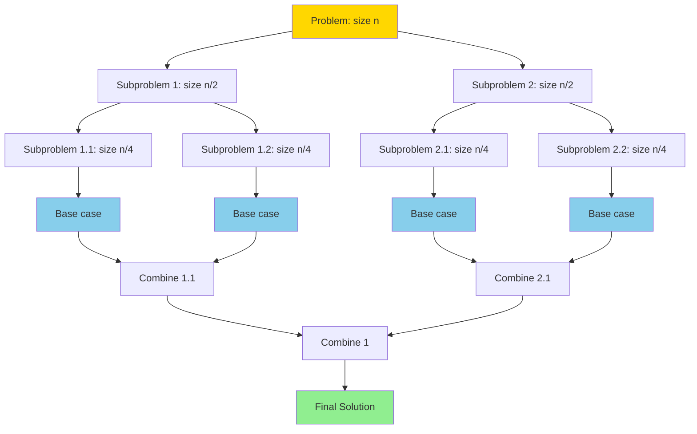
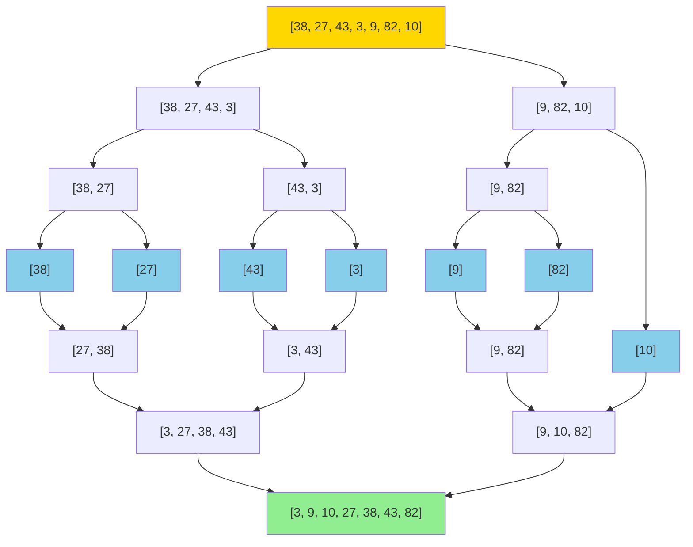

# Divide and Conquer: Split, Solve, Combine

## Quick Reference Card

| Aspect | Details |
|--------|---------|
| **Key Signal** | Problem can be split into independent subproblems of same type |
| **Time Complexity** | O(n log n) typical (merge sort), varies by problem |
| **Space Complexity** | O(log n) for recursion stack |
| **Common Variants** | Merge sort, quick sort, binary search, closest pair |

## Mental Model

**Analogy:** Sorting a deck of cards. Split the deck in half, sort each half (recursively), then merge the sorted halves. Each split creates independent subproblems; combining results gives the final answer.

**First Principle:** Divide and Conquer has three steps: (1) Divide the problem into smaller subproblems, (2) Conquer each subproblem recursively, (3) Combine solutions. Unlike DP, subproblems are independent and don't overlap.

## Pattern Decision Tree



## What is Divide and Conquer?

Divide and Conquer is a problem-solving paradigm that works by recursively breaking down a problem into **smaller subproblems** of the same type, solving them independently, and then **combining** their solutions.

**The three-step pattern:**

1. **Divide**: Break the problem into smaller subproblems
2. **Conquer**: Solve the subproblems recursively (base case: solve directly)
3. **Combine**: Merge the solutions of subproblems to get the final solution

**Analogy**: Think of organizing a large pile of papers. Instead of sorting all at once, you split them into smaller piles, sort each pile, then merge the sorted piles together.

## Visualizing Divide and Conquer



The problem is recursively split until reaching base cases, then solutions are combined back up the tree.

## The Classic Example: Merge Sort

Merge Sort is the quintessential divide-and-conquer algorithm.

### How Merge Sort Works

1. **Divide**: Split array into two halves
2. **Conquer**: Recursively sort each half
3. **Combine**: Merge the two sorted halves



### Implementation

```python
def mergeSort(arr):
    # Base case: array of size 0 or 1 is already sorted
    if len(arr) <= 1:
        return arr

    # DIVIDE: split into two halves
    mid = len(arr) // 2
    left_half = arr[:mid]
    right_half = arr[mid:]

    # CONQUER: recursively sort each half
    left_sorted = mergeSort(left_half)
    right_sorted = mergeSort(right_half)

    # COMBINE: merge the sorted halves
    return merge(left_sorted, right_sorted)

def merge(left, right):
    """Merge two sorted arrays into one sorted array"""
    result = []
    i, j = 0, 0

    # Compare elements from left and right, pick smaller
    while i < len(left) and j < len(right):
        if left[i] <= right[j]:
            result.append(left[i])
            i += 1
        else:
            result.append(right[j])
            j += 1

    # Append remaining elements
    result.extend(left[i:])
    result.extend(right[j:])

    return result
```

**Time Complexity**: O(n log n)
- **Divide**: O(1) to find midpoint
- **Conquer**: 2 recursive calls on n/2 elements
- **Combine**: O(n) to merge

**Space Complexity**: O(n) for temporary arrays during merging

## Quick Sort Overview

Quick Sort is another classic divide-and-conquer sorting algorithm.

### How Quick Sort Works

1. **Divide**: Choose a pivot and partition array so elements < pivot are on left, elements > pivot are on right
2. **Conquer**: Recursively sort the left and right partitions
3. **Combine**: No work needed! (partitioning is done in-place)

```python
def quickSort(arr, low, high):
    if low < high:
        # DIVIDE: partition array and get pivot index
        pivot_index = partition(arr, low, high)

        # CONQUER: recursively sort left and right
        quickSort(arr, low, pivot_index - 1)
        quickSort(arr, pivot_index + 1, high)

def partition(arr, low, high):
    """Partition array around pivot (last element)"""
    pivot = arr[high]
    i = low - 1  # Index of smaller element

    for j in range(low, high):
        if arr[j] <= pivot:
            i += 1
            arr[i], arr[j] = arr[j], arr[i]

    # Place pivot in correct position
    arr[i + 1], arr[high] = arr[high], arr[i + 1]
    return i + 1

# Usage
arr = [10, 7, 8, 9, 1, 5]
quickSort(arr, 0, len(arr) - 1)
```

**Time Complexity**:
- Best/Average: O(n log n)
- Worst: O(n²) if pivot is always smallest/largest

**Space Complexity**: O(log n) for recursion stack

**Key difference from Merge Sort**: Quick Sort does work during partitioning (divide phase), Merge Sort does work during merging (combine phase).

## Binary Search as Divide and Conquer

Binary Search is a simple divide-and-conquer algorithm.

1. **Divide**: Compare target with middle element
2. **Conquer**: Recursively search left or right half
3. **Combine**: No combining needed

```python
def binarySearch(arr, target, low, high):
    # Base case: element not found
    if low > high:
        return -1

    # DIVIDE: find middle
    mid = (low + high) // 2

    # Base case: found target
    if arr[mid] == target:
        return mid

    # CONQUER: search appropriate half
    if arr[mid] > target:
        return binarySearch(arr, target, low, mid - 1)
    else:
        return binarySearch(arr, target, mid + 1, high)

# Iterative version (more efficient)
def binarySearchIterative(arr, target):
    low, high = 0, len(arr) - 1

    while low <= high:
        mid = (low + high) // 2

        if arr[mid] == target:
            return mid
        elif arr[mid] > target:
            high = mid - 1
        else:
            low = mid + 1

    return -1
```

**Time Complexity**: O(log n)
**Space Complexity**: O(log n) for recursive, O(1) for iterative

## Master Theorem (Simplified)

The Master Theorem helps analyze divide-and-conquer time complexity.

For recurrence relations of the form:
```
T(n) = a·T(n/b) + f(n)
```

Where:
- `a` = number of subproblems
- `n/b` = size of each subproblem
- `f(n)` = cost of divide and combine steps

**Common cases:**

| Recurrence | Example | Time Complexity |
|------------|---------|----------------|
| T(n) = T(n/2) + O(1) | Binary Search | O(log n) |
| T(n) = 2T(n/2) + O(n) | Merge Sort | O(n log n) |
| T(n) = 2T(n/2) + O(1) | Tree traversal | O(n) |
| T(n) = T(n-1) + O(1) | Linear recursion | O(n) |

**Intuition**:
- If work at each level is constant and depth is log n → O(log n)
- If work at each level is O(n) and depth is log n → O(n log n)

## More Divide and Conquer Examples

### Example 1: Maximum Subarray (Kadane's Problem)

**Problem**: Find the contiguous subarray with the maximum sum.

**D&C Approach**:
1. **Divide**: Split array into left and right halves
2. **Conquer**: Find max subarray in left half, right half, and crossing middle
3. **Combine**: Return the maximum of the three

```python
def maxSubarrayDC(arr, low, high):
    # Base case: single element
    if low == high:
        return arr[low]

    mid = (low + high) // 2

    # Max subarray in left half
    left_max = maxSubarrayDC(arr, low, mid)

    # Max subarray in right half
    right_max = maxSubarrayDC(arr, mid + 1, high)

    # Max subarray crossing middle
    cross_max = maxCrossingSubarray(arr, low, mid, high)

    return max(left_max, right_max, cross_max)

def maxCrossingSubarray(arr, low, mid, high):
    # Find max sum in left half (including mid)
    left_sum = float('-inf')
    current_sum = 0
    for i in range(mid, low - 1, -1):
        current_sum += arr[i]
        left_sum = max(left_sum, current_sum)

    # Find max sum in right half
    right_sum = float('-inf')
    current_sum = 0
    for i in range(mid + 1, high + 1):
        current_sum += arr[i]
        right_sum = max(right_sum, current_sum)

    return left_sum + right_sum
```

**Note**: While this is a good D&C example, Kadane's algorithm solves this in O(n) time.

### Example 2: Count Inversions

**Problem**: Count pairs (i, j) where i < j but arr[i] > arr[j].

**D&C Approach**: Modify merge sort to count inversions during merging.

```python
def countInversions(arr):
    if len(arr) <= 1:
        return arr, 0

    mid = len(arr) // 2
    left, left_inv = countInversions(arr[:mid])
    right, right_inv = countInversions(arr[mid:])
    merged, split_inv = mergeAndCount(left, right)

    return merged, left_inv + right_inv + split_inv

def mergeAndCount(left, right):
    result = []
    inversions = 0
    i, j = 0, 0

    while i < len(left) and j < len(right):
        if left[i] <= right[j]:
            result.append(left[i])
            i += 1
        else:
            result.append(right[j])
            inversions += len(left) - i  # All remaining left elements are inversions
            j += 1

    result.extend(left[i:])
    result.extend(right[j:])

    return result, inversions
```

## When to Use Divide and Conquer

Use divide-and-conquer when:

- ✅ Problem can be **broken into independent subproblems** of the same type
- ✅ Subproblems are **significantly smaller** (usually half the size)
- ✅ Solutions to subproblems can be **combined efficiently**
- ✅ Base case is **simple to solve**

Common problem types:
- Sorting (merge sort, quick sort)
- Searching (binary search)
- Tree problems (traversal, height, diameter)
- Geometric problems (closest pair of points)
- Array problems (max subarray, count inversions)

## Divide and Conquer vs Dynamic Programming

| Aspect | Divide and Conquer | Dynamic Programming |
|--------|-------------------|---------------------|
| **Subproblems** | Independent | Overlapping |
| **Recomputation** | Each subproblem solved once | Subproblems reused |
| **Combination** | Combine results | Build from smaller solutions |
| **Examples** | Merge sort, binary search | Fibonacci, knapsack |

**Key difference**: If subproblems overlap (same subproblem computed multiple times), use DP with memoization. If subproblems are independent, use divide-and-conquer.

## Related Patterns

| Pattern | When to Use Instead |
|---------|---------------------|
| **Dynamic Programming** | Overlapping subproblems |
| **Binary Search** | Searching in sorted (special case of D&C) |
| **Two Pointers** | Linear traversal sufficient |
| **Recursion** | General recursive problems without divide step |

## Practice Progression (Spaced Repetition)

**Day 1 (Learn):**
- Understand the divide-combine paradigm
- Solve: Merge Sort implementation, Maximum Subarray (D&C approach)

**Day 3 (Reinforce):**
- Solve: Sort an Array (quicksort)
- Practice identifying base cases

**Day 7 (Master):**
- Solve: Construct Binary Tree from Traversals
- Solve: Count of Smaller Numbers After Self

**Day 14 (Maintain):**
- Solve: Median of Two Sorted Arrays
- Compare D&C vs iterative approaches

## Summary

| Aspect | Description |
|--------|-------------|
| **Pattern** | Divide → Conquer → Combine |
| **Divide** | Split problem into smaller subproblems |
| **Conquer** | Solve subproblems recursively |
| **Combine** | Merge subproblem solutions |
| **Base Case** | Smallest problem solved directly |
| **Time Complexity** | Often O(n log n), analyze with Master Theorem |
| **Space Complexity** | O(log n) to O(n) depending on algorithm |
| **Classic Examples** | Merge sort, quick sort, binary search |

Divide and Conquer is a powerful paradigm that transforms complex problems into simpler ones through recursive decomposition. Master this pattern, and you'll unlock elegant solutions to a wide range of algorithmic challenges.
