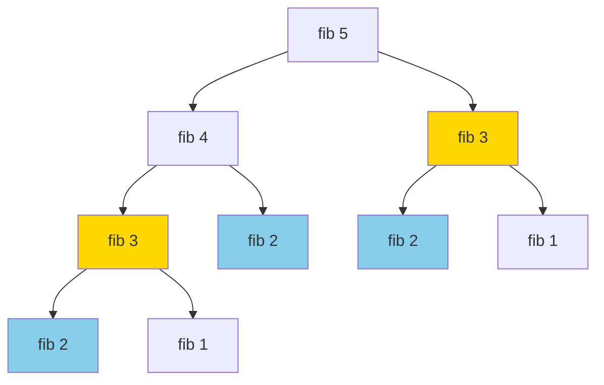
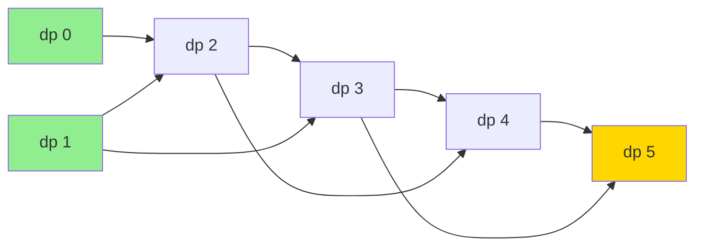
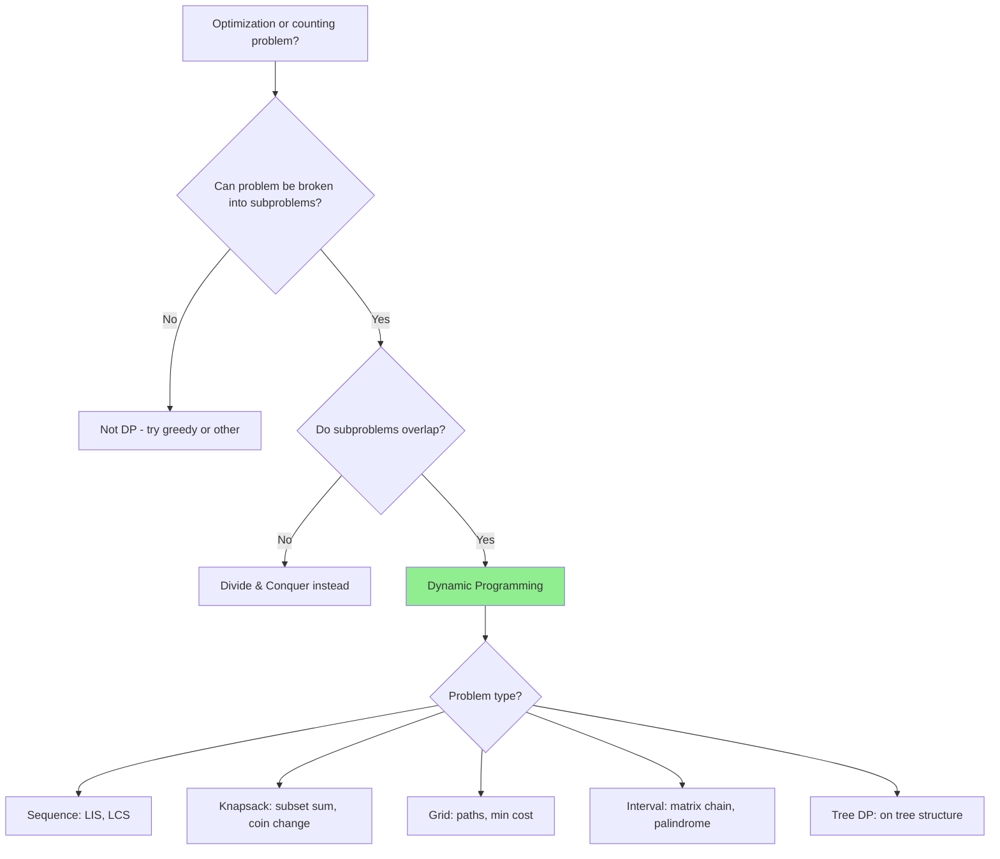

# Dynamic Programming: Remembering Past Work

## Quick Reference Card

| Aspect | Details |
|--------|---------|
| **Key Signal** | Optimal substructure, overlapping subproblems, counting ways |
| **Time Complexity** | O(n), O(n²), O(n×m) depending on state dimensions |
| **Space Complexity** | O(n) to O(n×m), often optimizable |
| **Common Variants** | 1D, 2D, knapsack, LCS, LIS, interval DP |

## Mental Model

**Analogy:** Climbing stairs to the 10th floor. Instead of recalculating how to reach floor 8 every time you consider floor 10, you remember: "I know 5 ways to reach floor 8." Build solutions from the ground up, reusing previous answers.

**First Principle:** If a problem has optimal substructure (optimal solution contains optimal solutions to subproblems) and overlapping subproblems (same subproblems recur), we can solve each subproblem once, store it, and reuse—transforming exponential recursion into polynomial iteration.

## What is Dynamic Programming?

Dynamic Programming (DP) is an optimization technique that solves complex problems by **breaking them down into simpler subproblems** and **storing the results** to avoid redundant calculations.

**Simple analogy**: Imagine climbing stairs and writing down on each step how many ways you can reach it. When you need that information again, you just look at your notes instead of recalculating.

## The Two Key Requirements

For DP to be applicable, a problem must have:

### 1. Overlapping Subproblems

The same subproblems are solved **multiple times** during recursion.



Notice how `fib(3)` and `fib(2)` are computed **multiple times**. This is wasteful!

### 2. Optimal Substructure

The optimal solution can be constructed from **optimal solutions of subproblems**.

Example: The shortest path from A to C through B is the shortest path A→B plus shortest path B→C.

## Top-Down vs Bottom-Up

There are two main approaches to implementing DP:

### Top-Down (Memoization)

Start with the original problem and **recursively** break it down, storing results in a memo.

```python
def fib_memoization(n, memo={}):
    # Base cases
    if n <= 1:
        return n

    # Check if already computed
    if n in memo:
        return memo[n]

    # Compute and store
    memo[n] = fib_memoization(n - 1, memo) + fib_memoization(n - 2, memo)
    return memo[n]
```

**Pros**:
- Natural recursive thinking
- Only computes needed subproblems
- Easy to convert from naive recursion

**Cons**:
- Recursion overhead (stack space)
- Risk of stack overflow for deep recursion

### Bottom-Up (Tabulation)

Start with the smallest subproblems and **iteratively** build up to the solution.

```python
def fib_tabulation(n):
    # Handle base cases
    if n <= 1:
        return n

    # Create table
    dp = [0] * (n + 1)
    dp[0], dp[1] = 0, 1

    # Build up from bottom
    for i in range(2, n + 1):
        dp[i] = dp[i - 1] + dp[i - 2]

    return dp[n]
```

**Pros**:
- No recursion overhead
- Better performance for large inputs
- More space-efficient (can often optimize to O(1))

**Cons**:
- Less intuitive than top-down
- Computes all subproblems (even if not needed)

## Subproblem Dependencies

Understanding how subproblems depend on each other is crucial for DP.



Each `dp[i]` depends on previous values. We must compute dependencies **before** we need them (in bottom-up) or **cache them** (in top-down).

## 1D DP Examples

### Example 1: Climbing Stairs

**Problem**: You can climb 1 or 2 steps at a time. How many ways to reach step `n`?

**Approach**: To reach step `i`, you either came from step `i-1` (1 step) or step `i-2` (2 steps).

**State definition**: `dp[i]` = number of ways to reach step `i`

**Recurrence**: `dp[i] = dp[i-1] + dp[i-2]`

```python
def climbStairs(n):
    if n <= 2:
        return n

    dp = [0] * (n + 1)
    dp[1], dp[2] = 1, 2

    for i in range(3, n + 1):
        dp[i] = dp[i - 1] + dp[i - 2]

    return dp[n]

# Space-optimized version (O(1) space)
def climbStairs_optimized(n):
    if n <= 2:
        return n

    prev2, prev1 = 1, 2

    for i in range(3, n + 1):
        current = prev1 + prev2
        prev2, prev1 = prev1, current

    return prev1
```

### Example 2: House Robber

**Problem**: Houses in a line have money. Can't rob adjacent houses. Maximize money stolen.

**Approach**: For each house, decide to rob it or skip it.

**State definition**: `dp[i]` = max money robbing houses 0 to i

**Recurrence**: `dp[i] = max(dp[i-1], nums[i] + dp[i-2])`
- Either skip house i (take `dp[i-1]`)
- Or rob house i (take `nums[i] + dp[i-2]`, can't use `dp[i-1]`)

```python
def rob(nums):
    if not nums:
        return 0
    if len(nums) == 1:
        return nums[0]

    n = len(nums)
    dp = [0] * n
    dp[0] = nums[0]
    dp[1] = max(nums[0], nums[1])

    for i in range(2, n):
        dp[i] = max(dp[i - 1], nums[i] + dp[i - 2])

    return dp[n - 1]

# Space-optimized version
def rob_optimized(nums):
    if not nums:
        return 0

    prev2, prev1 = 0, 0

    for num in nums:
        current = max(prev1, num + prev2)
        prev2, prev1 = prev1, current

    return prev1
```

## 2D DP (Brief Overview)

Some problems require a 2D table where `dp[i][j]` represents the solution for subproblem defined by two parameters.

**Common examples**:
- **Longest Common Subsequence**: `dp[i][j]` = LCS of first i chars of string1 and first j chars of string2
- **Edit Distance**: `dp[i][j]` = min edits to transform first i chars to first j chars
- **Unique Paths**: `dp[i][j]` = number of paths to reach cell (i, j) in a grid

```python
# Example: Unique Paths in grid (m x n)
def uniquePaths(m, n):
    dp = [[1] * n for _ in range(m)]  # All cells in first row/col have 1 path

    for i in range(1, m):
        for j in range(1, n):
            dp[i][j] = dp[i - 1][j] + dp[i][j - 1]  # From top or left

    return dp[m - 1][n - 1]
```

## How to Identify DP Problems

Look for these signals:

1. **Keywords in problem**:
   - "Find the maximum/minimum..."
   - "Count the number of ways..."
   - "Is it possible to..."
   - "Find the longest/shortest..."

2. **Problem structure**:
   - Making choices at each step
   - Multiple ways to reach the same state
   - Naive recursion has overlapping calls

3. **Constraints**:
   - Input size suggests O(n²) or O(n³) is acceptable
   - Need to explore multiple possibilities

## Pattern Decision Tree



## Common State Definitions

| Problem Type | State Definition | Example |
|--------------|------------------|---------|
| **Sequence** | `dp[i]` = answer for first i elements | House Robber |
| **Two sequences** | `dp[i][j]` = answer for first i of seq1, j of seq2 | LCS, Edit Distance |
| **Knapsack** | `dp[i][w]` = max value with first i items, weight w | 0/1 Knapsack |
| **Grid path** | `dp[i][j]` = answer for reaching cell (i, j) | Unique Paths |
| **Substring** | `dp[i][j]` = answer for substring [i, j] | Palindrome Substrings |

## The DP Problem-Solving Process

1. **Define the state**: What does `dp[i]` (or `dp[i][j]`) represent?
2. **Find the recurrence**: How does `dp[i]` relate to previous states?
3. **Identify base cases**: What are the smallest subproblems?
4. **Determine computation order**: Which subproblems to solve first?
5. **Implement**: Top-down (memoization) or bottom-up (tabulation)
6. **Optimize space**: Can you reduce space from O(n) to O(1)?

## Time and Space Complexity

| Approach | Time Complexity | Space Complexity | Notes |
|----------|----------------|------------------|-------|
| **1D DP** | O(n) | O(n) or O(1) | Can often optimize to constant space |
| **2D DP** | O(n × m) | O(n × m) or O(n) | Can often optimize to O(n) by keeping only previous row |

## Common Pitfalls

1. **Forgetting base cases**: Always handle the smallest subproblems
2. **Wrong computation order**: In bottom-up, compute dependencies first
3. **Modifying input**: Don't reuse input array as DP table unless safe
4. **Not considering edge cases**: Empty arrays, single elements, etc.
5. **Storing too much**: Often you only need the last 1-2 states, not all

## Related Patterns

| Pattern | When to Use Instead |
|---------|---------------------|
| **Greedy** | Local optimal choice leads to global optimal |
| **Divide & Conquer** | Subproblems don't overlap |
| **Memoization** | Top-down DP with recursion |
| **Backtracking** | Need all solutions, not just count/optimal |

## Practice Progression (Spaced Repetition)

**Day 1 (Learn):**
- Understand top-down vs bottom-up
- Solve: Climbing Stairs, Fibonacci

**Day 3 (Reinforce):**
- Solve: House Robber, Coin Change
- Practice identifying state and transitions

**Day 7 (Master):**
- Solve: Longest Common Subsequence, 0/1 Knapsack
- Solve: Edit Distance

**Day 14 (Maintain):**
- Solve: Longest Increasing Subsequence variations
- Practice state space optimization

## Summary

| Aspect | Description |
|--------|-------------|
| **Core Idea** | Break into subproblems, store results to avoid recomputation |
| **Requirements** | Overlapping subproblems + optimal substructure |
| **Approaches** | Top-down (memoization) or bottom-up (tabulation) |
| **State Definition** | Critical step: what does `dp[i]` represent? |
| **Recurrence Relation** | How to compute `dp[i]` from previous states |
| **Time Complexity** | Usually O(n), O(n²), or O(n³) |
| **Space Optimization** | Often can reduce from O(n) to O(1) |

Dynamic Programming transforms exponential-time problems into polynomial-time solutions by **remembering past work**. Master the art of defining states and finding recurrences, and you'll unlock a powerful problem-solving technique.
