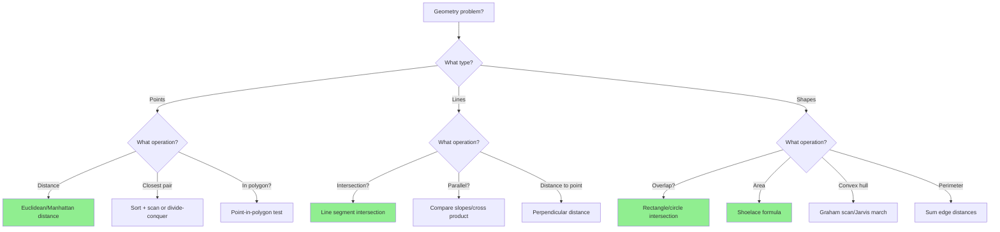
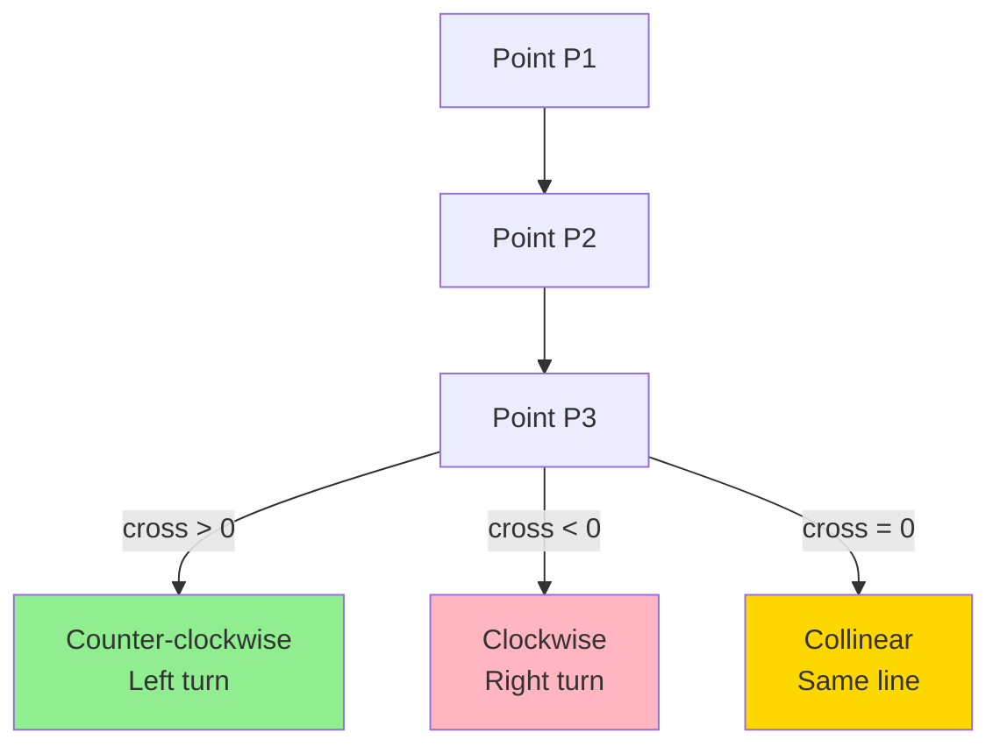

# Computational Geometry Pattern

## Quick Reference Card

| Aspect | Details |
|--------|---------|
| **Key Signal** | Points, lines, shapes, coordinates, spatial relationships |
| **Time Complexity** | O(n) to O(n log n) for most algorithms |
| **Space Complexity** | O(1) to O(n) depending on algorithm |
| **Common Variants** | Distance calculation, intersection, containment, convex hull |

## Mental Model

**Analogy:** Think of geometry problems like a surveyor mapping land. You have tools (formulas) to measure distances, determine if points fall within boundaries, and identify how shapes relate to each other. Each tool has a specific purpose, just like a surveyor's compass, ruler, and level.

**First Principle:** Computational geometry reduces spatial problems to mathematical operations. Points become coordinates, lines become equations, and spatial relationships become algebraic comparisons. The key is translating visual/spatial intuition into precise calculations.

## Pattern Decision Tree



## Overview

Computational geometry deals with algorithms for solving geometric problems. In coding interviews, this typically involves:
- Computing distances and areas
- Determining spatial relationships (intersection, containment)
- Finding optimal configurations (closest pair, convex hull)
- Working with coordinate systems and transformations

These problems appear in graphics, robotics, game development, and geographic information systems.

## Why This Matters

Geometry algorithms power:
- **GPS navigation**: Finding nearest locations, route planning
- **Computer graphics**: Collision detection, rendering
- **Robotics**: Path planning, obstacle avoidance
- **Data visualization**: Plotting, chart rendering
- **Game development**: Physics engines, hit detection

## Core Concepts

### 1. Points and Coordinates

```python
class Point:
    def __init__(self, x, y):
        self.x = x
        self.y = y

    def __repr__(self):
        return f"Point({self.x}, {self.y})"
```

### 2. Distance Formulas

**Euclidean Distance** (straight-line distance):
```
d = sqrt((x2 - x1)² + (y2 - y1)²)
```

**Manhattan Distance** (grid-based distance):
```
d = |x2 - x1| + |y2 - y1|
```

**Squared Distance** (avoid sqrt for comparisons):
```
d² = (x2 - x1)² + (y2 - y1)²
```

### 3. Cross Product (2D)

The cross product determines orientation:
```
cross = (x2 - x1) * (y3 - y1) - (y2 - y1) * (x3 - x1)
```

- `cross > 0`: Counter-clockwise turn (left turn)
- `cross < 0`: Clockwise turn (right turn)
- `cross = 0`: Collinear (points on same line)



### 4. Dot Product (2D)

The dot product measures alignment:
```
dot = (x2 - x1) * (x3 - x1) + (y2 - y1) * (y3 - y1)
```

- `dot > 0`: Acute angle (< 90°)
- `dot = 0`: Perpendicular (90°)
- `dot < 0`: Obtuse angle (> 90°)

### 5. Area Calculations

**Triangle Area** (using cross product):
```
area = |cross_product| / 2
     = |(x1(y2 - y3) + x2(y3 - y1) + x3(y1 - y2))| / 2
```

**Polygon Area** (Shoelace formula):
```
area = |Σ(xi * y(i+1) - x(i+1) * yi)| / 2
```

## Template Code

### Distance Calculations

```python
import math

def euclidean_distance(p1, p2):
    """
    Calculate straight-line distance between two points
    Time: O(1), Space: O(1)
    """
    return math.sqrt((p2[0] - p1[0])**2 + (p2[1] - p1[1])**2)

def manhattan_distance(p1, p2):
    """
    Calculate grid-based distance (L1 norm)
    Time: O(1), Space: O(1)
    """
    return abs(p2[0] - p1[0]) + abs(p2[1] - p1[1])

def squared_distance(p1, p2):
    """
    Calculate squared distance (faster, use for comparisons)
    Time: O(1), Space: O(1)
    """
    return (p2[0] - p1[0])**2 + (p2[1] - p1[1])**2
```

### Cross Product and Orientation

```python
def cross_product(p1, p2, p3):
    """
    Calculate cross product to determine orientation
    Time: O(1), Space: O(1)

    Returns:
        > 0: Counter-clockwise (left turn)
        < 0: Clockwise (right turn)
        = 0: Collinear
    """
    return (p2[0] - p1[0]) * (p3[1] - p1[1]) - \
           (p2[1] - p1[1]) * (p3[0] - p1[0])

def orientation(p1, p2, p3):
    """
    Determine orientation of ordered triplet
    Time: O(1), Space: O(1)
    """
    cross = cross_product(p1, p2, p3)
    if cross > 0:
        return "CCW"  # Counter-clockwise
    elif cross < 0:
        return "CW"   # Clockwise
    else:
        return "COLLINEAR"
```

### Line Segment Intersection

```python
def on_segment(p, q, r):
    """
    Check if point q lies on segment pr (given they're collinear)
    Time: O(1), Space: O(1)
    """
    return (q[0] <= max(p[0], r[0]) and q[0] >= min(p[0], r[0]) and
            q[1] <= max(p[1], r[1]) and q[1] >= min(p[1], r[1]))

def segments_intersect(p1, q1, p2, q2):
    """
    Check if line segments (p1,q1) and (p2,q2) intersect
    Time: O(1), Space: O(1)
    """
    # Find orientations
    o1 = cross_product(p1, q1, p2)
    o2 = cross_product(p1, q1, q2)
    o3 = cross_product(p2, q2, p1)
    o4 = cross_product(p2, q2, q1)

    # General case: different orientations
    if o1 * o2 < 0 and o3 * o4 < 0:
        return True

    # Special cases: collinear points
    if o1 == 0 and on_segment(p1, p2, q1):
        return True
    if o2 == 0 and on_segment(p1, q2, q1):
        return True
    if o3 == 0 and on_segment(p2, p1, q2):
        return True
    if o4 == 0 and on_segment(p2, q1, q2):
        return True

    return False
```

### Triangle Area

```python
def triangle_area(p1, p2, p3):
    """
    Calculate area of triangle using cross product
    Time: O(1), Space: O(1)
    """
    return abs(cross_product(p1, p2, p3)) / 2.0

def triangle_area_shoelace(p1, p2, p3):
    """
    Calculate area using shoelace formula
    Time: O(1), Space: O(1)
    """
    return abs(p1[0] * (p2[1] - p3[1]) +
               p2[0] * (p3[1] - p1[1]) +
               p3[0] * (p1[1] - p2[1])) / 2.0
```

### Polygon Area (Shoelace Formula)

```python
def polygon_area(points):
    """
    Calculate area of polygon using shoelace formula
    Time: O(n), Space: O(1)

    Args:
        points: List of (x, y) tuples in order (clockwise or counter-clockwise)
    """
    n = len(points)
    if n < 3:
        return 0

    area = 0
    for i in range(n):
        j = (i + 1) % n
        area += points[i][0] * points[j][1]
        area -= points[j][0] * points[i][1]

    return abs(area) / 2.0
```

### Point in Polygon (Ray Casting)

```python
def point_in_polygon(point, polygon):
    """
    Check if point is inside polygon using ray casting
    Time: O(n), Space: O(1)

    Casts ray from point to infinity and counts intersections
    Odd count = inside, even count = outside
    """
    x, y = point
    n = len(polygon)
    inside = False

    p1x, p1y = polygon[0]
    for i in range(1, n + 1):
        p2x, p2y = polygon[i % n]

        # Check if ray crosses edge
        if y > min(p1y, p2y):
            if y <= max(p1y, p2y):
                if x <= max(p1x, p2x):
                    if p1y != p2y:
                        xinters = (y - p1y) * (p2x - p1x) / (p2y - p1y) + p1x
                    if p1x == p2x or x <= xinters:
                        inside = not inside

        p1x, p1y = p2x, p2y

    return inside
```

### Rectangle Overlap

```python
def rectangles_overlap(rect1, rect2):
    """
    Check if two axis-aligned rectangles overlap
    Time: O(1), Space: O(1)

    Args:
        rect1, rect2: [x1, y1, x2, y2] where (x1,y1) is bottom-left,
                      (x2,y2) is top-right
    """
    x1, y1, x2, y2 = rect1
    x3, y3, x4, y4 = rect2

    # Check if one rectangle is to the left/right/above/below the other
    if x2 <= x3 or x4 <= x1:  # No horizontal overlap
        return False
    if y2 <= y3 or y4 <= y1:  # No vertical overlap
        return False

    return True

def rectangle_intersection_area(rect1, rect2):
    """
    Calculate area of intersection between two rectangles
    Time: O(1), Space: O(1)
    """
    if not rectangles_overlap(rect1, rect2):
        return 0

    x1, y1, x2, y2 = rect1
    x3, y3, x4, y4 = rect2

    # Find intersection rectangle
    left = max(x1, x3)
    right = min(x2, x4)
    bottom = max(y1, y3)
    top = min(y2, y4)

    width = right - left
    height = top - bottom

    return width * height
```

### Convex Hull (Graham Scan)

```python
def convex_hull(points):
    """
    Find convex hull using Graham Scan
    Time: O(n log n), Space: O(n)

    Returns points on convex hull in counter-clockwise order
    """
    if len(points) < 3:
        return points

    # Find bottommost point (or leftmost if tie)
    start = min(points, key=lambda p: (p[1], p[0]))

    # Sort points by polar angle with respect to start
    def polar_angle_key(p):
        if p == start:
            return -math.pi, 0
        dx = p[0] - start[0]
        dy = p[1] - start[1]
        return math.atan2(dy, dx), dx*dx + dy*dy

    sorted_points = sorted(points, key=polar_angle_key)

    # Build hull
    hull = []
    for p in sorted_points:
        # Remove points that make clockwise turn
        while len(hull) >= 2 and cross_product(hull[-2], hull[-1], p) <= 0:
            hull.pop()
        hull.append(p)

    return hull
```

## Worked Example: Maximum Points on a Line

**Problem**: Given n points on a 2D plane, find the maximum number of points that lie on the same straight line.

**Approach**: For each point, calculate slopes to all other points and count duplicates.

```python
from collections import defaultdict
from math import gcd

def max_points_on_line(points):
    """
    Time: O(n²), Space: O(n)
    """
    if len(points) <= 2:
        return len(points)

    max_points = 0

    for i in range(len(points)):
        slopes = defaultdict(int)
        same_point = 1  # Count point itself
        local_max = 0

        for j in range(i + 1, len(points)):
            dx = points[j][0] - points[i][0]
            dy = points[j][1] - points[i][1]

            if dx == 0 and dy == 0:
                # Same point
                same_point += 1
            else:
                # Calculate slope (reduced fraction to avoid floating point)
                g = gcd(dx, dy)
                slope = (dx // g, dy // g)
                slopes[slope] += 1
                local_max = max(local_max, slopes[slope])

        max_points = max(max_points, local_max + same_point)

    return max_points
```

**Key insights**:
1. Use slope to identify collinear points
2. Store slope as reduced fraction to avoid floating-point errors
3. Handle special cases: same point, vertical lines
4. For each point, count how many other points share the same slope

## Common Mistakes

### 1. Floating-Point Precision Errors

```python
# WRONG: Using floating-point for equality
slope = dy / dx
if slope == other_slope:  # May fail due to precision

# CORRECT: Use reduced fractions or epsilon comparison
g = gcd(dx, dy)
slope = (dx // g, dy // g)  # Exact representation
```

### 2. Not Handling Special Cases

```python
# WRONG: Division by zero for vertical lines
slope = (y2 - y1) / (x2 - x1)  # Crashes if x2 == x1

# CORRECT: Check for vertical lines
if x2 == x1:
    slope = float('inf')  # Or handle separately
else:
    slope = (y2 - y1) / (x2 - x1)
```

### 3. Incorrect Distance Comparison

```python
# WRONG: Using sqrt unnecessarily
if euclidean_distance(p1, p2) < euclidean_distance(p1, p3):
    # Slower due to sqrt

# CORRECT: Compare squared distances
if squared_distance(p1, p2) < squared_distance(p1, p3):
    # Faster, same result for comparisons
```

### 4. Wrong Orientation Test

```python
# WRONG: Using slopes for orientation
slope1 = (p2[1] - p1[1]) / (p2[0] - p1[0])
slope2 = (p3[1] - p1[1]) / (p3[0] - p1[0])
# Fails for vertical lines and has precision issues

# CORRECT: Use cross product
cross = cross_product(p1, p2, p3)
# Exact and handles all cases
```

### 5. Forgetting to Close Polygon

```python
# WRONG: Not wrapping around to first point
for i in range(len(polygon) - 1):
    # Misses edge from last to first point

# CORRECT: Use modulo to wrap
for i in range(len(polygon)):
    j = (i + 1) % len(polygon)
    # Includes all edges
```

## Complexity Analysis

| Operation | Time | Space |
|-----------|------|-------|
| Distance calculation | O(1) | O(1) |
| Cross product | O(1) | O(1) |
| Line intersection | O(1) | O(1) |
| Triangle area | O(1) | O(1) |
| Polygon area | O(n) | O(1) |
| Point in polygon | O(n) | O(1) |
| Rectangle overlap | O(1) | O(1) |
| Convex hull | O(n log n) | O(n) |
| Closest pair | O(n log n) | O(n) |

## Practice Problems

1. **Easy**:
   - Valid Square (distance check)
   - Rectangle Overlap
   - Surface Area of 3D Shapes

2. **Medium**:
   - Maximum Points on a Line
   - Convex Polygon (check if polygon is convex)
   - Minimum Area Rectangle
   - Erect the Fence (convex hull)

3. **Hard**:
   - Rectangle Area II (union of rectangles)
   - Largest Triangle Area
   - Max Points on a Line

## Practice Progression (Spaced Repetition)

**Day 1 (Learn):**
- Read this guide, understand distance and cross product
- Solve: Valid Square, Rectangle Overlap

**Day 3 (Reinforce):**
- Implement cross product and orientation from memory
- Solve: Convex Polygon check

**Day 7 (Master):**
- Solve: Maximum Points on a Line
- Implement shoelace formula for polygon area

**Day 14 (Maintain):**
- Solve: Erect the Fence (convex hull)
- Can you explain when to use cross product vs dot product?

## Related Patterns

| Pattern | When to Use |
|---------|-------------|
| **Divide and Conquer** | Closest pair of points, geometric search |
| **Sorting** | Convex hull, sweepline algorithms |
| **Hash Map** | Group points by slope, count collinear points |
| **Sweep Line** | Line segment intersection, rectangle union |

## Summary

Computational geometry:
- Translates spatial problems into mathematical operations
- Uses fundamental formulas: distance, cross product, area
- Requires careful handling of special cases and precision
- Common operations: distance, intersection, containment, area
- Key technique: cross product for orientation testing
- Watch out for floating-point errors and edge cases

Master the basic formulas and templates, then practice recognizing which geometric operation each problem requires!
