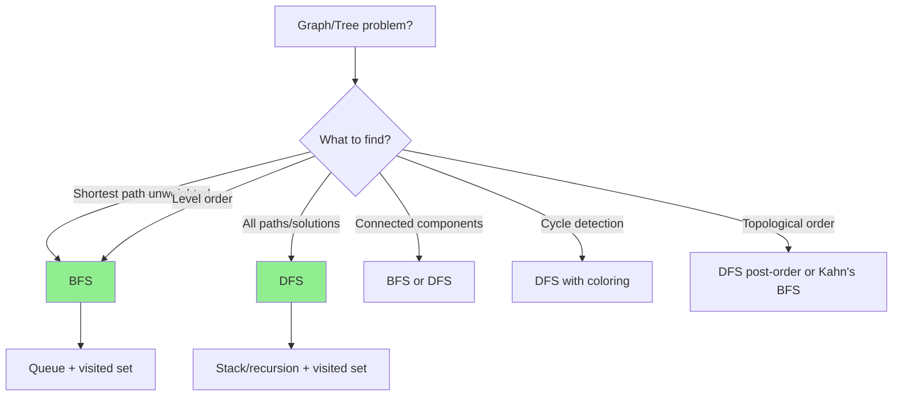
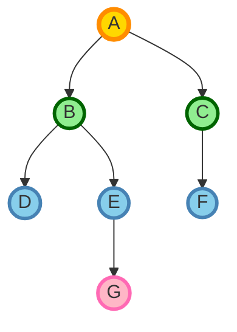
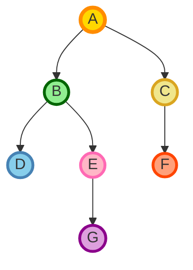
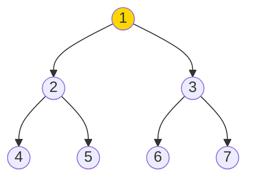

# Graph Traversal: BFS vs DFS

## Quick Reference Card

| Aspect | Details |
|--------|---------|
| **Key Signal** | Trees, graphs, grid traversal, connected components |
| **Time Complexity** | O(V + E) for both BFS and DFS |
| **Space Complexity** | O(V) for visited set and queue/stack |
| **Common Variants** | BFS (level order, shortest path), DFS (paths, cycles, backtracking) |

## Mental Model

**BFS Analogy:** Ripples in a pond. Drop a stone (start node), and waves spread outward level by level. All nodes at distance 1 are visited before any at distance 2. Perfect for shortest path in unweighted graphs.

**DFS Analogy:** Exploring a maze by following one path as deep as possible before backtracking. Go until you hit a dead end, then retrace to the last junction with unexplored paths.

**First Principle:** BFS uses a queue (FIFO) to ensure level-by-level exploration. DFS uses a stack (LIFO) or recursion to dive deep first. Both ensure each node is visited exactly once.

## Pattern Decision Tree



## What is Graph Traversal?

Graph traversal is the process of **visiting all vertices (nodes) in a graph** systematically. The two fundamental approaches are:

- **BFS (Breadth-First Search)**: Explore level by level
- **DFS (Depth-First Search)**: Explore as deep as possible before backtracking

Both traverse the entire graph, but in different orders, making each suited for different problems.

## BFS vs DFS: Quick Comparison

| Aspect | BFS | DFS |
|--------|-----|-----|
| **Order** | Level by level (horizontal) | Deep first (vertical) |
| **Data Structure** | Queue (FIFO) | Stack (LIFO) or recursion |
| **Shortest Path** | ✅ Yes (unweighted graphs) | ❌ No |
| **Space Complexity** | O(w) width of graph | O(h) height of graph |
| **Use Cases** | Shortest path, level-order | Cycle detection, topological sort |
| **Implementation** | Iterative (queue) | Recursive or iterative (stack) |

## Breadth-First Search (BFS)

### How BFS Works

BFS explores the graph **level by level**, visiting all neighbors of a node before moving to the next level.

**Analogy**: Ripples in a pond spreading outward from where a stone was dropped.

### BFS Visualization



**BFS order**: A (level 0) → B, C (level 1) → D, E, F (level 2) → G (level 3)

### BFS Template (Adjacency List)

```python
from collections import deque

def bfs(graph, start):
    """
    BFS traversal of a graph
    graph: adjacency list {node: [neighbors]}
    start: starting node
    """
    visited = set()
    queue = deque([start])
    visited.add(start)

    while queue:
        node = queue.popleft()  # FIFO: first in, first out
        print(node)  # Process node

        # Visit all unvisited neighbors
        for neighbor in graph[node]:
            if neighbor not in visited:
                visited.add(neighbor)
                queue.append(neighbor)

# Example usage
graph = {
    'A': ['B', 'C'],
    'B': ['A', 'D', 'E'],
    'C': ['A', 'F'],
    'D': ['B'],
    'E': ['B', 'G'],
    'F': ['C'],
    'G': ['E']
}

bfs(graph, 'A')
# Output: A B C D E F G
```

### BFS for Shortest Path (Unweighted Graph)

BFS **guarantees** the shortest path in unweighted graphs because it explores level by level.

```python
def shortestPath(graph, start, target):
    """Find shortest path from start to target"""
    visited = set()
    queue = deque([(start, [start])])  # (node, path to reach node)
    visited.add(start)

    while queue:
        node, path = queue.popleft()

        # Found target
        if node == target:
            return path

        # Explore neighbors
        for neighbor in graph[node]:
            if neighbor not in visited:
                visited.add(neighbor)
                queue.append((neighbor, path + [neighbor]))

    return None  # No path found

# Example
path = shortestPath(graph, 'A', 'G')
print(path)  # Output: ['A', 'B', 'E', 'G']
```

### BFS: Time and Space Complexity

- **Time Complexity**: O(V + E)
  - V = number of vertices
  - E = number of edges
  - Visit each vertex once, explore each edge once

- **Space Complexity**: O(V)
  - Queue can hold up to all vertices
  - Visited set holds all vertices

## Depth-First Search (DFS)

### How DFS Works

DFS explores the graph **as deeply as possible** along each branch before backtracking.

**Analogy**: Walking through a maze by always turning left (or right), and only backtracking when you hit a dead end.

### DFS Visualization



**DFS order (recursive)**: A → B → D → E → G → C → F

Notice how DFS goes deep (A → B → D) before exploring other branches.

### DFS Template (Recursive)

```python
def dfs_recursive(graph, node, visited=None):
    """
    DFS traversal (recursive)
    graph: adjacency list {node: [neighbors]}
    node: current node
    visited: set of visited nodes
    """
    if visited is None:
        visited = set()

    visited.add(node)
    print(node)  # Process node

    # Visit all unvisited neighbors
    for neighbor in graph[node]:
        if neighbor not in visited:
            dfs_recursive(graph, neighbor, visited)

    return visited

# Example usage
dfs_recursive(graph, 'A')
# Output: A B D E G C F
```

### DFS Template (Iterative with Stack)

```python
def dfs_iterative(graph, start):
    """DFS traversal (iterative using stack)"""
    visited = set()
    stack = [start]

    while stack:
        node = stack.pop()  # LIFO: last in, first out

        if node not in visited:
            visited.add(node)
            print(node)  # Process node

            # Add unvisited neighbors to stack
            for neighbor in graph[node]:
                if neighbor not in visited:
                    stack.append(neighbor)

# Example usage
dfs_iterative(graph, 'A')
# Output: A C F B E G D (order may vary)
```

**Note**: Iterative DFS order may differ from recursive due to stack order. Both are valid DFS traversals.

### DFS: Time and Space Complexity

- **Time Complexity**: O(V + E)
  - Same as BFS: visit each vertex once, explore each edge once

- **Space Complexity**: O(h)
  - h = height of recursion tree
  - In worst case (linear graph): O(V)
  - In best case (balanced tree): O(log V)

## BFS vs DFS Traversal Comparison

Let's visualize the difference with a tree:



**BFS order**: 1 → 2 → 3 → 4 → 5 → 6 → 7 (level by level)
**DFS order**: 1 → 2 → 4 → 5 → 3 → 6 → 7 (deep first, left to right)

## When to Use Which

### Use BFS When:

- ✅ Finding **shortest path** in unweighted graphs
- ✅ Level-order traversal needed
- ✅ Finding nodes at a specific distance
- ✅ Finding all connected components (either works, but BFS is clearer)
- ✅ Web crawling (process closer pages first)

**Examples**:
- Shortest path in maze
- Social network: find all friends within N degrees
- Shortest transformation sequence (word ladder)

### Use DFS When:

- ✅ **Cycle detection** in graphs
- ✅ **Path finding** (any path, not shortest)
- ✅ **Topological sorting** (ordering tasks with dependencies)
- ✅ Finding **strongly connected components**
- ✅ Solving puzzles (Sudoku, N-Queens) with backtracking
- ✅ Detecting **connected components**

**Examples**:
- Detecting cycles in dependency graphs
- Finding any path from A to B
- Course scheduling (topological sort)
- Maze solving (any solution)

## Common Graph Problem Patterns

### Pattern 1: Check if Path Exists

Use either BFS or DFS to check connectivity.

```python
def hasPath(graph, start, target):
    """Check if path exists from start to target (using DFS)"""
    visited = set()

    def dfs(node):
        if node == target:
            return True

        visited.add(node)

        for neighbor in graph[node]:
            if neighbor not in visited:
                if dfs(neighbor):
                    return True

        return False

    return dfs(start)
```

### Pattern 2: Count Connected Components

Use DFS or BFS to explore each component.

```python
def countComponents(n, edges):
    """Count number of connected components"""
    # Build adjacency list
    graph = {i: [] for i in range(n)}
    for u, v in edges:
        graph[u].append(v)
        graph[v].append(u)

    visited = set()
    count = 0

    def dfs(node):
        visited.add(node)
        for neighbor in graph[node]:
            if neighbor not in visited:
                dfs(neighbor)

    for node in range(n):
        if node not in visited:
            dfs(node)
            count += 1

    return count
```

### Pattern 3: Detect Cycle (Undirected Graph)

Use DFS with parent tracking.

```python
def hasCycle(graph):
    """Detect cycle in undirected graph using DFS"""
    visited = set()

    def dfs(node, parent):
        visited.add(node)

        for neighbor in graph[node]:
            if neighbor not in visited:
                if dfs(neighbor, node):
                    return True
            elif neighbor != parent:
                # Visited neighbor that's not parent = cycle
                return True

        return False

    # Check all components
    for node in graph:
        if node not in visited:
            if dfs(node, None):
                return True

    return False
```

### Pattern 4: Shortest Path in Grid (BFS)

Classic BFS application on 2D grids.

```python
from collections import deque

def shortestPathGrid(grid, start, target):
    """Find shortest path in grid (0 = walkable, 1 = wall)"""
    rows, cols = len(grid), len(grid[0])
    queue = deque([(start, 0)])  # (position, distance)
    visited = {start}
    directions = [(0, 1), (1, 0), (0, -1), (-1, 0)]  # right, down, left, up

    while queue:
        (r, c), dist = queue.popleft()

        if (r, c) == target:
            return dist

        for dr, dc in directions:
            nr, nc = r + dr, c + dc

            # Check bounds and validity
            if (0 <= nr < rows and 0 <= nc < cols and
                grid[nr][nc] == 0 and (nr, nc) not in visited):
                visited.add((nr, nc))
                queue.append(((nr, nc), dist + 1))

    return -1  # No path found
```

### Pattern 5: Topological Sort (DFS)

Order tasks with dependencies using DFS.

```python
def topologicalSort(graph):
    """Topological sort using DFS (for directed acyclic graph)"""
    visited = set()
    stack = []

    def dfs(node):
        visited.add(node)

        for neighbor in graph[node]:
            if neighbor not in visited:
                dfs(neighbor)

        # Add to stack AFTER visiting all neighbors
        stack.append(node)

    for node in graph:
        if node not in visited:
            dfs(node)

    return stack[::-1]  # Reverse to get correct order
```

## Implementation Tips

1. **Choose the right data structure**:
   - BFS: Always use `deque` for O(1) popleft
   - DFS: Use recursion or list as stack

2. **Track visited nodes**: Use a set for O(1) lookup

3. **Handle disconnected graphs**: Iterate through all nodes as starting points

4. **Grid problems**: Treat grid as graph with 4 or 8 directions

5. **Avoid infinite loops**: Always mark visited before/during processing

## Related Patterns

| Pattern | When to Use Instead |
|---------|---------------------|
| **Dijkstra** | Shortest path in weighted graph |
| **Topological Sort** | Dependency ordering |
| **Union-Find** | Dynamic connectivity queries |
| **Backtracking** | Need all solutions with pruning |

## Practice Progression (Spaced Repetition)

**Day 1 (Learn):**
- Understand BFS vs DFS tradeoffs
- Solve: Binary Tree Level Order Traversal, Number of Islands

**Day 3 (Reinforce):**
- Solve: Clone Graph, Pacific Atlantic Water Flow
- Practice both iterative and recursive DFS

**Day 7 (Master):**
- Solve: Word Ladder (BFS shortest path)
- Solve: Course Schedule (cycle detection)

**Day 14 (Maintain):**
- Solve: Serialize and Deserialize Binary Tree
- Practice multi-source BFS (rotten oranges)

## Summary

| Aspect | BFS | DFS |
|--------|-----|-----|
| **Data Structure** | Queue (FIFO) | Stack/Recursion (LIFO) |
| **Order** | Level by level | Deep first |
| **Shortest Path** | ✅ Yes (unweighted) | ❌ No |
| **Space** | O(width of graph) | O(height of graph) |
| **Use Cases** | Shortest path, level order | Cycle detection, topological sort |
| **Implementation** | Iterative | Recursive or iterative |

Both BFS and DFS are fundamental graph algorithms with O(V + E) time complexity. Choose based on your problem requirements: BFS for shortest paths, DFS for deep exploration and cycle detection. Master both patterns to tackle any graph problem efficiently.
