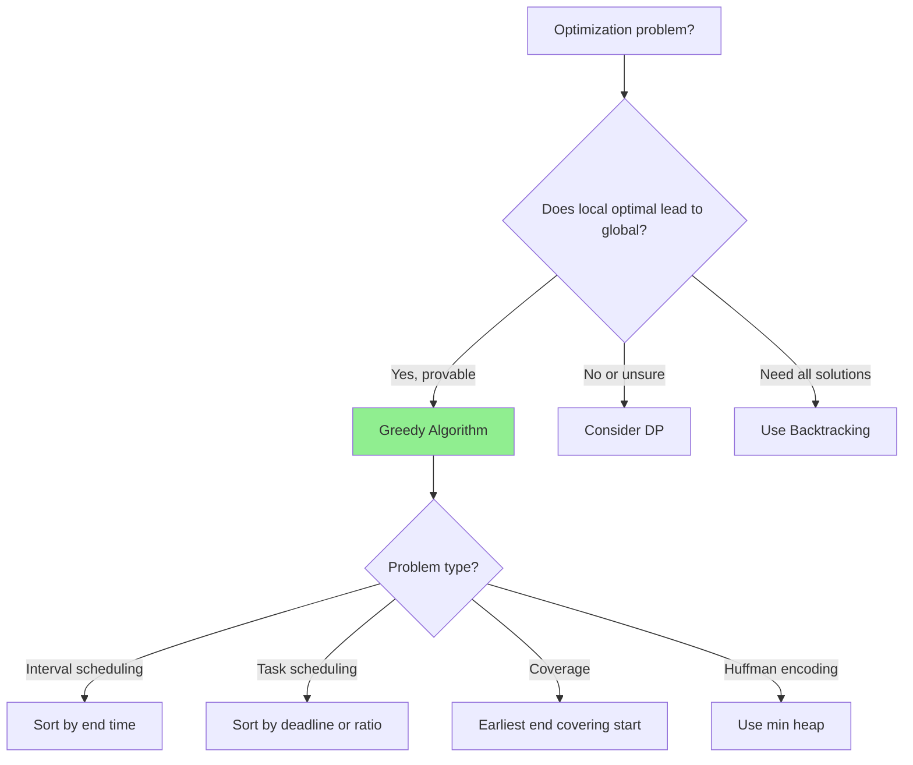
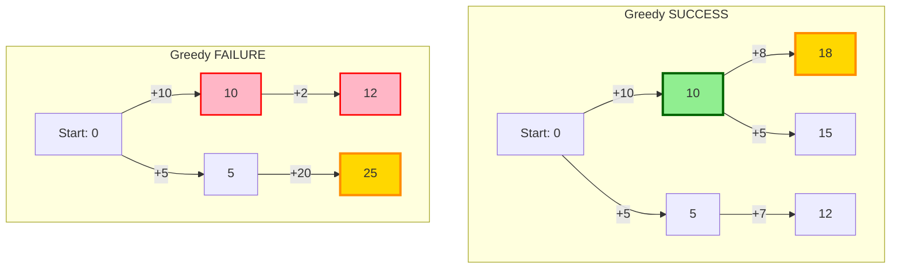
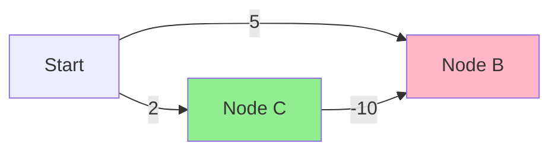

# Greedy Algorithms: Making Locally Optimal Choices

## Quick Reference Card

| Aspect | Details |
|--------|---------|
| **Key Signal** | Local optimal choice leads to global optimal, interval scheduling |
| **Time Complexity** | Often O(n log n) due to sorting, O(n) for iteration |
| **Space Complexity** | O(1) to O(n) depending on problem |
| **Common Variants** | Interval scheduling, activity selection, Huffman, fractional knapsack |

## Mental Model

**Analogy:** Making change with fewest coins. For standard denominations, always pick the largest coin that fits. This local greedy choice (largest ≤ remaining) happens to give the global minimum coins. But beware: greedy doesn't always work!

**First Principle:** Greedy works when the problem has the "greedy choice property": a locally optimal choice is part of some globally optimal solution. Unlike DP, you don't need to explore all options - one choice leads forward.

## Pattern Decision Tree



## What is a Greedy Algorithm?

A greedy algorithm builds a solution by making the **locally optimal choice** at each step, hoping this leads to a globally optimal solution.

**Key principle**: Make the best choice **right now** without worrying about future consequences.

**Analogy**: Imagine climbing a mountain by always taking the steepest path upward at each step. This works if there's only one peak, but fails if there are multiple peaks (you might get stuck on a smaller peak).

## When Greedy Works

Greedy algorithms work when the problem exhibits two properties:

### 1. Greedy Choice Property

A globally optimal solution can be arrived at by making **locally optimal (greedy) choices**.

In other words: Making the best immediate choice will **not** prevent you from reaching the optimal final solution.

### 2. Optimal Substructure

An optimal solution contains **optimal solutions to subproblems**.

This is the same property required for Dynamic Programming, but greedy is simpler because we don't need to consider all choices—just the greedy one.

## Greedy vs Optimal Path

Here's a visual showing when greedy works and when it fails:



**Top graph**: Greedy choice (+10) leads to optimal solution (18).
**Bottom graph**: Greedy choice (+10) leads to suboptimal solution (12). Optimal path (+5 → +20) gives 25.

## Classic Examples

### Example 1: Activity Selection

**Problem**: Given activities with start and end times, select the maximum number of non-overlapping activities.

**Greedy strategy**: Always pick the activity that **ends earliest**.

**Why it works**: Picking the earliest-ending activity leaves the most room for future activities.

```python
def activitySelection(activities):
    # activities = [(start, end), ...]
    # Sort by end time
    activities.sort(key=lambda x: x[1])

    result = [activities[0]]
    last_end = activities[0][1]

    for start, end in activities[1:]:
        # If activity doesn't overlap, select it
        if start >= last_end:
            result.append((start, end))
            last_end = end

    return result

# Example
activities = [(1, 3), (2, 5), (4, 6), (6, 7), (5, 9), (8, 9)]
print(activitySelection(activities))
# Output: [(1, 3), (4, 6), (6, 7), (8, 9)]
```

**Time complexity**: O(n log n) for sorting, O(n) for selection.

### Example 2: Fractional Knapsack

**Problem**: Given items with weights and values, fill a knapsack of capacity W to maximize value. You can take **fractions** of items.

**Greedy strategy**: Take items with the **highest value-to-weight ratio** first.

```python
def fractionalKnapsack(items, capacity):
    # items = [(value, weight), ...]
    # Sort by value per unit weight (descending)
    items.sort(key=lambda x: x[0] / x[1], reverse=True)

    total_value = 0

    for value, weight in items:
        if capacity >= weight:
            # Take the whole item
            total_value += value
            capacity -= weight
        else:
            # Take fraction of the item
            total_value += value * (capacity / weight)
            break

    return total_value

# Example
items = [(60, 10), (100, 20), (120, 30)]  # (value, weight)
capacity = 50
print(fractionalKnapsack(items, capacity))
# Output: 240.0 (all of item 1, all of item 2, 2/3 of item 3)
```

### Example 3: Coin Change (When Greedy Works)

**Problem**: Make change for amount N using the fewest coins.

**Greedy strategy**: Use the largest coin possible at each step.

**When it works**: With standard coin systems (1, 5, 10, 25 cents), greedy is optimal.

```python
def coinChangeGreedy(coins, amount):
    # coins must be sorted in descending order
    coins.sort(reverse=True)

    count = 0

    for coin in coins:
        if amount == 0:
            break
        count += amount // coin
        amount %= coin

    return count if amount == 0 else -1

# Example (US coins)
coins = [25, 10, 5, 1]
print(coinChangeGreedy(coins, 63))
# Output: 6 (25+25+10+1+1+1)
```

## Proving Greedy Correctness

To prove a greedy algorithm is correct, use one of these techniques:

### 1. Exchange Argument

Show that if you have an optimal solution that differs from the greedy solution, you can **exchange** choices to make it more like the greedy solution without making it worse.

**Example (Activity Selection)**: If an optimal solution picks activity X instead of the greedy choice (earliest ending activity Y), you can replace X with Y without losing any future activities.

### 2. Induction

Prove that after each greedy choice, the remaining problem has an optimal solution that includes that choice.

### 3. "Staying Ahead"

Show that the greedy solution is always **at least as good** as any other solution at each step.

## When Greedy FAILS

Greedy algorithms fail when local choices prevent reaching the global optimum.

### Counterexample 1: 0/1 Knapsack

**Problem**: Same as fractional knapsack, but you **cannot take fractions**.

**Why greedy fails**: Taking the highest value-per-weight item might fill the knapsack, preventing you from taking a better combination.

```python
# Greedy FAILS here
items = [(60, 10), (100, 20), (120, 30)]  # (value, weight)
capacity = 50

# Greedy chooses: (60,10) and (100,20), total value = 160
# Optimal: (100,20) and (120,30), total value = 220
```

**Solution**: Use Dynamic Programming instead.

### Counterexample 2: Coin Change (Arbitrary Coins)

**Problem**: Make change with arbitrary coin denominations.

**Why greedy fails**: The largest coin might not lead to the optimal solution.

```python
# Greedy FAILS here
coins = [1, 3, 4]
amount = 6

# Greedy: 4 + 1 + 1 = 3 coins
# Optimal: 3 + 3 = 2 coins
```

**Solution**: Use Dynamic Programming.

### Counterexample 3: Shortest Path (Dijkstra's Caveat)

Greedy works for shortest paths with **non-negative weights** (Dijkstra's algorithm), but fails with **negative weights**.



**Greedy picks**: A → B (cost 5)
**Optimal path**: A → C → B (cost 2 + (-10) = -8)

**Solution**: Use Bellman-Ford algorithm for graphs with negative weights.

## When to Use Greedy

Use greedy when:

- ✅ The problem exhibits **greedy choice property** and **optimal substructure**
- ✅ You can **prove** greedy correctness (exchange argument, induction)
- ✅ Local optimal choices **don't block** future optimal choices

Common greedy problem types:
- Activity/interval scheduling
- Huffman encoding
- Minimum spanning tree (Kruskal's, Prim's)
- Shortest path (Dijkstra's - non-negative weights)
- Fractional knapsack
- Job sequencing

## When NOT to Use Greedy

Avoid greedy when:

- ❌ Local choices can **prevent** reaching the global optimum
- ❌ You need to consider **multiple possibilities** (use DP or backtracking)
- ❌ The problem is a known greedy failure case (0/1 knapsack, arbitrary coin change)

## Greedy vs Dynamic Programming

| Aspect | Greedy | Dynamic Programming |
|--------|--------|---------------------|
| **Decision making** | Make best choice now | Consider all choices |
| **Future consideration** | Ignore future | Consider all futures |
| **Optimality** | Not always optimal | Always optimal (if applicable) |
| **Efficiency** | Usually faster | Usually slower |
| **Use case** | When local optimum = global | When need to try all options |

**Example**:
- Fractional Knapsack → Greedy works
- 0/1 Knapsack → Need DP

## Time Complexity

Greedy algorithms are typically **very efficient**:

| Operation | Complexity |
|-----------|------------|
| **Sorting** | O(n log n) |
| **Selection** | O(n) |
| **Overall** | Usually O(n log n) |

Compare to DP which is often O(n²) or O(n³).

## Practice Progression (Spaced Repetition)

**Day 1 (Learn):**
- Understand when greedy works vs fails
- Solve: Assign Cookies, Lemonade Change

**Day 3 (Reinforce):**
- Solve: Jump Game, Gas Station
- Practice proving greedy correctness

**Day 7 (Master):**
- Solve: Non-overlapping Intervals, Minimum Arrows to Burst Balloons
- Solve: Task Scheduler

**Day 14 (Maintain):**
- Solve: Jump Game II (greedy vs DP)
- Practice counterexample thinking

## Related Patterns

| Pattern | When to Use Instead |
|---------|---------------------|
| **Dynamic Programming** | Greedy doesn't give optimal |
| **Backtracking** | Need all solutions |
| **Merge Intervals** | Interval problems with merging |
| **Heap** | Need repeated max/min selection |

## Summary

| Aspect | Description |
|--------|-------------|
| **Core Idea** | Make locally optimal choice at each step |
| **Requirements** | Greedy choice property + optimal substructure |
| **Proof techniques** | Exchange argument, induction, staying ahead |
| **Advantages** | Simple, fast, efficient |
| **Disadvantages** | Doesn't always work, hard to prove correctness |
| **Time Complexity** | Usually O(n log n) due to sorting |
| **Common patterns** | Activity selection, fractional knapsack, MST, Dijkstra |

Greedy algorithms are powerful when they work, but **proving correctness** is essential. When in doubt, verify with small examples or use DP for guaranteed optimal solutions.
