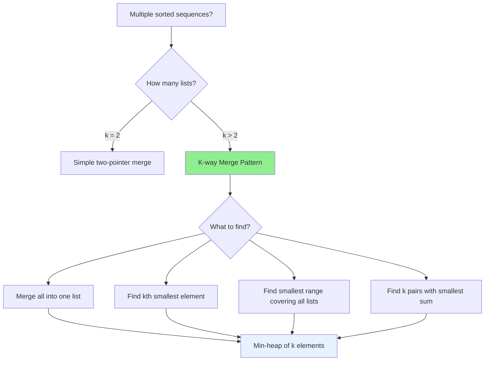

# K-way Merge Pattern

## Quick Reference Card

| Aspect | Details |
|--------|---------|
| **Key Signal** | Multiple sorted lists/arrays to merge into one |
| **Time Complexity** | O(N log k) where N = total elements, k = number of lists |
| **Space Complexity** | O(k) for the heap |
| **Common Variants** | Merge lists, kth smallest, smallest range |

## Mental Model

**Analogy:** Imagine k lanes of cars at a toll booth, each lane sorted by arrival time. To process cars in global arrival order, you only need to compare the front car from each lane. A min-heap of k "front cars" tells you which one to process next.

**First Principle:** When merging k sorted sequences, the next smallest element must be at the front of one of the k sequences. By maintaining a min-heap of size k (one element per sequence), we always know the global minimum in O(log k) time.

## Pattern Decision Tree



## Overview

The K-way Merge pattern efficiently combines k sorted sequences into a single sorted sequence. Instead of comparing all k front elements (O(k) per element), we use a min-heap to find the minimum in O(log k).

**Core Insight:** At any point, the next element in the merged output must be the minimum of all k "front" elements. A min-heap of size k maintains these front elements, giving O(log k) extraction and insertion.

**Why not merge pairs?**
- Merging pairs iteratively: O(N × k) time
- K-way merge with heap: O(N log k) time
- For k = 1000 lists, heap is ~100x faster

## When to Use

Look for these signals:

1. **Multiple sorted inputs**: "k sorted lists", "k sorted arrays"
2. **Merge operation**: "merge into one sorted list"
3. **Kth smallest globally**: "find kth smallest element from k lists"
4. **Range covering**: "smallest range containing element from each list"

**Key phrases:**
- "Merge k sorted..."
- "k sorted arrays"
- "kth smallest element in sorted matrix"
- "smallest sum pairs from two arrays"

## Template Code

### Basic K-way Merge

```python
import heapq

def merge_k_sorted_lists(lists):
    """
    Merge k sorted lists into one sorted list.
    Time: O(N log k), Space: O(k)
    """
    # Min-heap: (value, list_index, element_index)
    heap = []
    result = []

    # Initialize heap with first element of each list
    for i, lst in enumerate(lists):
        if lst:  # Skip empty lists
            heapq.heappush(heap, (lst[0], i, 0))

    while heap:
        val, list_idx, elem_idx = heapq.heappop(heap)
        result.append(val)

        # If this list has more elements, add next one
        if elem_idx + 1 < len(lists[list_idx]):
            next_val = lists[list_idx][elem_idx + 1]
            heapq.heappush(heap, (next_val, list_idx, elem_idx + 1))

    return result

# Example: [[1,4,7], [2,5,8], [3,6,9]]
# Heap initially: [(1,0,0), (2,1,0), (3,2,0)]
# Pop 1, push 4: [(2,1,0), (3,2,0), (4,0,1)]
# Pop 2, push 5: [(3,2,0), (4,0,1), (5,1,1)]
# ... continues until all elements processed
# Result: [1,2,3,4,5,6,7,8,9]
```

### K-way Merge for Linked Lists

```python
import heapq

class ListNode:
    def __init__(self, val=0, next=None):
        self.val = val
        self.next = next

    # Enable comparison for heap
    def __lt__(self, other):
        return self.val < other.val

def merge_k_linked_lists(lists):
    """
    Merge k sorted linked lists.
    Time: O(N log k), Space: O(k)
    """
    # Min-heap of nodes
    heap = []

    # Add head of each non-empty list
    for head in lists:
        if head:
            heapq.heappush(heap, head)

    dummy = ListNode(0)
    current = dummy

    while heap:
        node = heapq.heappop(heap)
        current.next = node
        current = current.next

        if node.next:
            heapq.heappush(heap, node.next)

    return dummy.next
```

## Worked Example

### Problem: Merge K Sorted Lists

**Given:** `lists = [[1,4,5], [1,3,4], [2,6]]`
**Find:** Single merged sorted list

```
Step 1: Initialize heap with first elements
        Heap: [(1,0,0), (1,1,0), (2,2,0)]
        (value, list_index, element_index)

Step 2: Pop minimum (1,0,0) from list 0
        Result: [1]
        Push next from list 0: (4,0,1)
        Heap: [(1,1,0), (2,2,0), (4,0,1)]

Step 3: Pop (1,1,0) from list 1
        Result: [1,1]
        Push next from list 1: (3,1,1)
        Heap: [(2,2,0), (4,0,1), (3,1,1)]

Step 4: Pop (2,2,0) from list 2
        Result: [1,1,2]
        Push next from list 2: (6,2,1)
        Heap: [(3,1,1), (4,0,1), (6,2,1)]

Step 5: Pop (3,1,1) from list 1
        Result: [1,1,2,3]
        Push next from list 1: (4,1,2)
        Heap: [(4,0,1), (4,1,2), (6,2,1)]

Step 6: Pop (4,0,1) from list 0
        Result: [1,1,2,3,4]
        Push next from list 0: (5,0,2)
        Heap: [(4,1,2), (6,2,1), (5,0,2)]

Step 7: Pop (4,1,2) from list 1
        Result: [1,1,2,3,4,4]
        List 1 exhausted, no push
        Heap: [(5,0,2), (6,2,1)]

Step 8: Pop (5,0,2) from list 0
        Result: [1,1,2,3,4,4,5]
        List 0 exhausted
        Heap: [(6,2,1)]

Step 9: Pop (6,2,1) from list 2
        Result: [1,1,2,3,4,4,5,6]
        List 2 exhausted
        Heap: []

Final Result: [1,1,2,3,4,4,5,6]
```

## Example Problems with Approaches

### Problem 1: Merge K Sorted Lists
**Problem:** Merge k sorted linked lists into one sorted list.

```python
import heapq

def merge_k_lists(lists):
    """
    Time: O(N log k), Space: O(k)
    """
    # Handle comparison in heap
    heap = []
    for i, node in enumerate(lists):
        if node:
            heapq.heappush(heap, (node.val, i, node))

    dummy = ListNode(0)
    current = dummy

    while heap:
        val, idx, node = heapq.heappop(heap)
        current.next = node
        current = current.next

        if node.next:
            heapq.heappush(heap, (node.next.val, idx, node.next))

    return dummy.next
```

**Key insight:** Include list index in heap tuple to break ties and avoid comparing nodes directly.

### Problem 2: Kth Smallest Element in Sorted Matrix
**Problem:** Find kth smallest element in n×n matrix where rows and columns are sorted.

```python
import heapq

def kth_smallest(matrix, k):
    """
    Find kth smallest in sorted matrix.
    Time: O(k log n), Space: O(n)
    """
    n = len(matrix)
    # Heap: (value, row, col)
    heap = [(matrix[0][0], 0, 0)]
    visited = {(0, 0)}

    for _ in range(k - 1):
        val, row, col = heapq.heappop(heap)

        # Add right neighbor
        if col + 1 < n and (row, col + 1) not in visited:
            heapq.heappush(heap, (matrix[row][col + 1], row, col + 1))
            visited.add((row, col + 1))

        # Add bottom neighbor
        if row + 1 < n and (row + 1, col) not in visited:
            heapq.heappush(heap, (matrix[row + 1][col], row + 1, col))
            visited.add((row + 1, col))

    return heap[0][0]
```

**Alternative approach:** Use first column as k lists, merge k-way.

```python
def kth_smallest_kway(matrix, k):
    """
    Treat each row as a sorted list.
    Time: O(k log n), Space: O(n)
    """
    n = len(matrix)
    # Heap: (value, row, col)
    heap = [(matrix[i][0], i, 0) for i in range(n)]
    heapq.heapify(heap)

    for _ in range(k - 1):
        val, row, col = heapq.heappop(heap)
        if col + 1 < n:
            heapq.heappush(heap, (matrix[row][col + 1], row, col + 1))

    return heap[0][0]
```

**Key insight:** Each row is a sorted list; use k-way merge pattern.

### Problem 3: Find K Pairs with Smallest Sums
**Problem:** Given two sorted arrays, find k pairs with smallest sums.

```python
import heapq

def k_smallest_pairs(nums1, nums2, k):
    """
    Find k pairs with smallest sums from two sorted arrays.
    Time: O(k log k), Space: O(k)
    """
    if not nums1 or not nums2:
        return []

    # Heap: (sum, i, j) where i indexes nums1, j indexes nums2
    heap = [(nums1[0] + nums2[0], 0, 0)]
    visited = {(0, 0)}
    result = []

    while heap and len(result) < k:
        _, i, j = heapq.heappop(heap)
        result.append([nums1[i], nums2[j]])

        # Add (i+1, j) if valid
        if i + 1 < len(nums1) and (i + 1, j) not in visited:
            heapq.heappush(heap, (nums1[i + 1] + nums2[j], i + 1, j))
            visited.add((i + 1, j))

        # Add (i, j+1) if valid
        if j + 1 < len(nums2) and (i, j + 1) not in visited:
            heapq.heappush(heap, (nums1[i] + nums2[j + 1], i, j + 1))
            visited.add((i, j + 1))

    return result
```

**Key insight:** Think of it as a 2D matrix where cell (i,j) = nums1[i] + nums2[j]. Apply sorted matrix kth smallest approach.

### Problem 4: Smallest Range Covering Elements from K Lists
**Problem:** Find smallest range [a, b] such that at least one number from each list is in [a, b].

```python
import heapq

def smallest_range(lists):
    """
    Find smallest range covering all k lists.
    Time: O(N log k), Space: O(k)
    """
    # Heap: (value, list_index, element_index)
    heap = []
    max_val = float('-inf')

    # Initialize with first element of each list
    for i, lst in enumerate(lists):
        if lst:
            heapq.heappush(heap, (lst[0], i, 0))
            max_val = max(max_val, lst[0])

    result = [float('-inf'), float('inf')]

    while len(heap) == len(lists):  # Must have one from each
        min_val, list_idx, elem_idx = heapq.heappop(heap)

        # Update result if current range is smaller
        if max_val - min_val < result[1] - result[0]:
            result = [min_val, max_val]

        # Add next element from the same list
        if elem_idx + 1 < len(lists[list_idx]):
            next_val = lists[list_idx][elem_idx + 1]
            heapq.heappush(heap, (next_val, list_idx, elem_idx + 1))
            max_val = max(max_val, next_val)
        else:
            break  # One list exhausted, can't cover all

    return result
```

**Key insight:** Track both min (via heap) and max (via variable). When one list is exhausted, we can't do better.

### Problem 5: Merge K Sorted Arrays
**Problem:** Merge k sorted arrays into one sorted array.

```python
import heapq

def merge_k_sorted_arrays(arrays):
    """
    Merge k sorted arrays.
    Time: O(N log k), Space: O(N) for result
    """
    heap = []
    result = []

    # Initialize heap
    for i, arr in enumerate(arrays):
        if arr:
            heapq.heappush(heap, (arr[0], i, 0))

    while heap:
        val, arr_idx, elem_idx = heapq.heappop(heap)
        result.append(val)

        if elem_idx + 1 < len(arrays[arr_idx]):
            next_val = arrays[arr_idx][elem_idx + 1]
            heapq.heappush(heap, (next_val, arr_idx, elem_idx + 1))

    return result
```

**Key insight:** Same as linked lists, just with array indexing.

## Two-Way Merge (k=2) Comparison

For k=2, both approaches work:

```python
# Two-pointer merge (O(n+m) time, O(1) space excluding output)
def merge_two(arr1, arr2):
    i = j = 0
    result = []
    while i < len(arr1) and j < len(arr2):
        if arr1[i] <= arr2[j]:
            result.append(arr1[i])
            i += 1
        else:
            result.append(arr2[j])
            j += 1
    result.extend(arr1[i:])
    result.extend(arr2[j:])
    return result

# K-way merge (O(n+m) log 2) - slightly slower for k=2
# Use two-pointer for k=2, heap for k>2
```

## Common Pitfalls

### 1. Not Handling Empty Lists

```python
# WRONG: Assumes all lists have elements
for i, lst in enumerate(lists):
    heapq.heappush(heap, (lst[0], i, 0))  # IndexError!

# CORRECT: Check for empty
for i, lst in enumerate(lists):
    if lst:
        heapq.heappush(heap, (lst[0], i, 0))
```

### 2. Heap Comparison Failures

```python
# WRONG: Comparing nodes directly (undefined behavior)
heapq.heappush(heap, node)

# CORRECT: Use (value, index, node) tuple
# Index breaks ties when values are equal
heapq.heappush(heap, (node.val, i, node))
```

### 3. Forgetting to Push Next Element

```python
# WRONG: Only pop, never push next
while heap:
    val, idx, elem_idx = heapq.heappop(heap)
    result.append(val)
    # Forgot to add next element from this list!

# CORRECT: Push next element if exists
while heap:
    val, idx, elem_idx = heapq.heappop(heap)
    result.append(val)
    if elem_idx + 1 < len(lists[idx]):
        heapq.heappush(heap, (lists[idx][elem_idx + 1], idx, elem_idx + 1))
```

### 4. Wrong Index in Heap Tuple

```python
# WRONG: Confusing list index and element index
heapq.heappush(heap, (val, elem_idx, list_idx))  # Swapped!

# CORRECT: Consistent ordering
heapq.heappush(heap, (val, list_idx, elem_idx))
```

### 5. O(N*k) Instead of O(N log k)

```python
# WRONG: Merging pairs iteratively
result = lists[0]
for i in range(1, k):
    result = merge_two(result, lists[i])  # O(N*k)

# CORRECT: Use heap for O(N log k)
```

## Complexity Analysis

| Aspect | Complexity | Notes |
|--------|------------|-------|
| **Time** | O(N log k) | N = total elements, k = number of lists |
| **Space** | O(k) | Heap holds at most k elements |
| **Per element** | O(log k) | Pop + push operations |

**Why O(N log k)?**
- Each of N elements is pushed and popped exactly once
- Each heap operation is O(log k)
- Total: N × O(log k) = O(N log k)

## Practice Progression (Spaced Repetition)

**Day 1 (Learn):**
- Read this guide thoroughly
- Solve: Merge K Sorted Lists

**Day 3 (Reinforce):**
- Implement without looking at template
- Solve: Kth Smallest Element in Sorted Matrix

**Day 7 (Master):**
- Solve: Find K Pairs with Smallest Sums
- Solve: Smallest Range Covering Elements from K Lists

**Day 14 (Maintain):**
- Can you explain why heap is better than iterative pair merging?
- Solve a variant problem

## Related Patterns

| Pattern | When to Use Instead |
|---------|---------------------|
| **Two Pointers** | Only 2 sorted lists (k=2) |
| **Divide and Conquer** | When merge itself needs optimization |
| **Top K Elements** | Finding k largest/smallest from single list |
| **Binary Search** | When count queries are faster than element access |

## Practice Problems

| Problem | Difficulty | Key Insight |
|---------|------------|-------------|
| Merge K Sorted Lists | Hard | Classic k-way merge |
| Kth Smallest in Sorted Matrix | Medium | Rows as k sorted lists |
| Find K Pairs with Smallest Sums | Medium | 2D matrix traversal |
| Smallest Range Covering K Lists | Hard | Track min and max simultaneously |
| Merge Sorted Array | Easy | Two-pointer (k=2) |
| Ugly Number II | Medium | Generate using 3 "lists" |

## Summary

The K-way Merge pattern efficiently combines multiple sorted sequences:

- **Structure:** Min-heap holding one element from each sequence
- **Invariant:** Heap always has at most k elements
- **Per-element cost:** O(log k) for pop + push

**When to recognize:**
- "Merge k sorted..."
- "Kth smallest from multiple sorted sources"
- "Smallest range covering k lists"

**Key insight:** Instead of comparing all k front elements (O(k)), use a min-heap for O(log k) comparison. This transforms O(N×k) into O(N log k).

**Remember:**
- For k=2, two pointers is simpler
- For k>2, heap-based k-way merge is optimal
- Always track (value, list_index, element_index) in heap

Master this pattern to efficiently handle any "merge sorted sources" problem!
