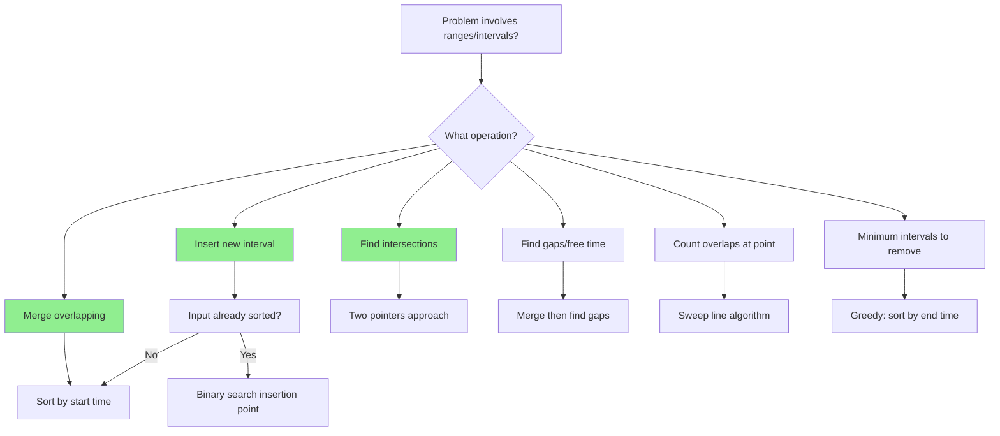

# Merge Intervals Pattern

## Quick Reference Card

| Aspect | Details |
|--------|---------|
| **Key Signal** | Problems involving ranges, schedules, or overlapping periods |
| **Time Complexity** | O(n log n) due to sorting, O(n) for merging |
| **Space Complexity** | O(n) for storing merged result |
| **Common Variants** | Merge, insert, intersect, find gaps, count overlaps |

## Mental Model

**Analogy:** Imagine painting walls with different colors where each paint job covers a range of wall. Some jobs overlap. To know the final painted sections, you need to combine overlapping jobs into single continuous sections.

**First Principle:** Two intervals overlap if and only if the start of one is less than or equal to the end of the other. By sorting intervals by start time, we only need to check if each new interval overlaps with the last merged interval.

## Pattern Decision Tree



## Overview

The Merge Intervals pattern deals with problems involving a collection of intervals (ranges). The core operations are:

1. **Merge**: Combine overlapping intervals into one
2. **Insert**: Add a new interval and merge if needed
3. **Intersect**: Find common overlap between two interval lists
4. **Gaps**: Find free slots between intervals

**Core Insight:** Two intervals `[a, b]` and `[c, d]` overlap if `max(a, c) <= min(b, d)`. The merged interval is `[min(a, c), max(b, d)]`.

## When to Use

Look for these signals:

1. **Overlapping ranges**: Merge, consolidate, or combine intervals
2. **Scheduling problems**: Meeting rooms, calendar conflicts
3. **Range coverage**: Does a set of ranges cover a point or range?
4. **Free time**: Find gaps between busy periods
5. **Keywords**: "intervals", "ranges", "overlapping", "merge", "schedule"

**Common problem types:**
- Merge overlapping intervals
- Insert interval into sorted list
- Find intersection of two interval lists
- Minimum meeting rooms needed
- Employee free time

## Template Code

### Merge Overlapping Intervals

```python
def merge_intervals(intervals):
    """
    Merge all overlapping intervals.
    Time: O(n log n), Space: O(n)
    """
    if not intervals:
        return []

    # Sort by start time
    intervals.sort(key=lambda x: x[0])

    merged = [intervals[0]]

    for current in intervals[1:]:
        last = merged[-1]

        # Check if current overlaps with last merged
        if current[0] <= last[1]:
            # Merge: extend the end of last interval
            last[1] = max(last[1], current[1])
        else:
            # No overlap: add current as new interval
            merged.append(current)

    return merged

# Example: [[1,3],[2,6],[8,10],[15,18]]
# After sort: [[1,3],[2,6],[8,10],[15,18]] (already sorted)
# [1,3] + [2,6] → [1,6] (2 <= 3, merge)
# [1,6] + [8,10] → no overlap (8 > 6), add [8,10]
# [8,10] + [15,18] → no overlap, add [15,18]
# Result: [[1,6],[8,10],[15,18]]
```

### Insert Interval

```python
def insert_interval(intervals, new_interval):
    """
    Insert interval into sorted list, merging if necessary.
    Time: O(n), Space: O(n)
    """
    result = []
    i = 0
    n = len(intervals)

    # 1. Add all intervals that end before new_interval starts
    while i < n and intervals[i][1] < new_interval[0]:
        result.append(intervals[i])
        i += 1

    # 2. Merge all overlapping intervals
    while i < n and intervals[i][0] <= new_interval[1]:
        new_interval[0] = min(new_interval[0], intervals[i][0])
        new_interval[1] = max(new_interval[1], intervals[i][1])
        i += 1

    result.append(new_interval)

    # 3. Add remaining intervals
    while i < n:
        result.append(intervals[i])
        i += 1

    return result
```

### Interval Intersection

```python
def interval_intersection(list1, list2):
    """
    Find intersection of two sorted interval lists.
    Time: O(n + m), Space: O(min(n, m))
    """
    result = []
    i, j = 0, 0

    while i < len(list1) and j < len(list2):
        # Find overlap bounds
        start = max(list1[i][0], list2[j][0])
        end = min(list1[i][1], list2[j][1])

        # If valid intersection, add it
        if start <= end:
            result.append([start, end])

        # Move pointer with smaller end
        if list1[i][1] < list2[j][1]:
            i += 1
        else:
            j += 1

    return result
```

## Worked Example

### Problem: Merge Intervals

**Given:** `[[1,4],[2,5],[7,9]]`
**Find:** Merged intervals

```
Step 1: Sort by start time
        [[1,4],[2,5],[7,9]] (already sorted)

Step 2: Initialize merged = [[1,4]]

Step 3: Process [2,5]
        Last merged: [1,4]
        Does [2,5] overlap with [1,4]?
        Check: 2 <= 4? YES (2 is start of current, 4 is end of last)
        Merge: [1, max(4,5)] = [1,5]
        merged = [[1,5]]

Step 4: Process [7,9]
        Last merged: [1,5]
        Does [7,9] overlap with [1,5]?
        Check: 7 <= 5? NO
        No overlap: add [7,9]
        merged = [[1,5],[7,9]]

Result: [[1,5],[7,9]]
```

**Visual representation:**

```
Input intervals:
[1,4]:    |-----|
[2,5]:      |-----|
[7,9]:                 |--|

After merge:
[1,5]:    |-------|
[7,9]:                 |--|
```

## Example Problems with Approaches

### Problem 1: Merge Intervals
**Problem:** Given list of intervals, merge all overlapping ones.

```python
def merge(intervals):
    intervals.sort(key=lambda x: x[0])
    merged = []

    for interval in intervals:
        # If merged is empty or no overlap
        if not merged or merged[-1][1] < interval[0]:
            merged.append(interval)
        else:
            # Overlap - extend the last interval
            merged[-1][1] = max(merged[-1][1], interval[1])

    return merged
```

**Key insight:** After sorting, only need to check overlap with the last merged interval.

### Problem 2: Insert Interval
**Problem:** Insert new interval into sorted non-overlapping intervals.

```python
def insert(intervals, new_interval):
    result = []

    for i, interval in enumerate(intervals):
        # New interval is before current
        if new_interval[1] < interval[0]:
            result.append(new_interval)
            return result + intervals[i:]

        # New interval is after current
        elif new_interval[0] > interval[1]:
            result.append(interval)

        # Overlap - merge
        else:
            new_interval = [
                min(new_interval[0], interval[0]),
                max(new_interval[1], interval[1])
            ]

    result.append(new_interval)
    return result
```

**Key insight:** Three cases - before, after, or overlapping. Keep merging while overlapping.

### Problem 3: Meeting Rooms (Can Attend All)
**Problem:** Given meeting times, determine if person can attend all meetings.

```python
def can_attend_meetings(intervals):
    """
    Check if any meetings overlap.
    Time: O(n log n), Space: O(1)
    """
    intervals.sort(key=lambda x: x[0])

    for i in range(1, len(intervals)):
        # If current meeting starts before previous ends
        if intervals[i][0] < intervals[i-1][1]:
            return False

    return True
```

**Key insight:** After sorting, just check if any adjacent meetings overlap.

### Problem 4: Meeting Rooms II (Minimum Rooms)
**Problem:** Find minimum number of meeting rooms needed.

```python
def min_meeting_rooms(intervals):
    """
    Minimum meeting rooms needed.
    Time: O(n log n), Space: O(n)
    """
    if not intervals:
        return 0

    # Separate start and end times
    starts = sorted(i[0] for i in intervals)
    ends = sorted(i[1] for i in intervals)

    rooms = 0
    end_ptr = 0

    for start in starts:
        if start < ends[end_ptr]:
            # Need new room
            rooms += 1
        else:
            # Can reuse a room
            end_ptr += 1

    return rooms

# Alternative: Using min-heap
import heapq

def min_meeting_rooms_heap(intervals):
    if not intervals:
        return 0

    intervals.sort(key=lambda x: x[0])
    heap = []  # Track end times of ongoing meetings

    for interval in intervals:
        # If earliest ending meeting has ended
        if heap and heap[0] <= interval[0]:
            heapq.heappop(heap)

        heapq.heappush(heap, interval[1])

    return len(heap)
```

**Key insight:** Track room release times. When new meeting starts, check if any room is free.

### Problem 5: Non-overlapping Intervals (Minimum Removals)
**Problem:** Remove minimum intervals to make rest non-overlapping.

```python
def erase_overlap_intervals(intervals):
    """
    Minimum intervals to remove.
    Time: O(n log n), Space: O(1)
    """
    if not intervals:
        return 0

    # Sort by end time (greedy choice)
    intervals.sort(key=lambda x: x[1])

    removals = 0
    prev_end = float('-inf')

    for start, end in intervals:
        if start >= prev_end:
            # No overlap, keep this interval
            prev_end = end
        else:
            # Overlap, remove current (implicitly)
            removals += 1

    return removals
```

**Key insight:** Greedy approach - always keep the interval that ends earliest to maximize remaining space.

### Problem 6: Interval List Intersections
**Problem:** Find intersection of two sorted interval lists.

```python
def interval_intersection(first_list, second_list):
    result = []
    i = j = 0

    while i < len(first_list) and j < len(second_list):
        # Find the overlap
        lo = max(first_list[i][0], second_list[j][0])
        hi = min(first_list[i][1], second_list[j][1])

        if lo <= hi:
            result.append([lo, hi])

        # Move the pointer that ends first
        if first_list[i][1] < second_list[j][1]:
            i += 1
        else:
            j += 1

    return result
```

**Key insight:** Two pointers, advance the one with smaller end time.

## Overlap Detection Formulas

### Two Intervals Overlap

```python
def overlaps(a, b):
    """Check if intervals [a[0], a[1]] and [b[0], b[1]] overlap."""
    return a[0] <= b[1] and b[0] <= a[1]

# Equivalent: max(a[0], b[0]) <= min(a[1], b[1])
```

### Merge Two Overlapping Intervals

```python
def merge_two(a, b):
    """Merge two overlapping intervals."""
    return [min(a[0], b[0]), max(a[1], b[1])]
```

### Get Intersection

```python
def intersection(a, b):
    """Get intersection of two intervals (empty if no overlap)."""
    start = max(a[0], b[0])
    end = min(a[1], b[1])
    return [start, end] if start <= end else None
```

## Common Pitfalls

### 1. Forgetting to Sort

```python
# WRONG: Assumes input is sorted
def merge(intervals):
    merged = [intervals[0]]
    for interval in intervals[1:]:
        # This only works if sorted!

# CORRECT: Always sort first
def merge(intervals):
    intervals.sort(key=lambda x: x[0])
```

### 2. Incorrect Overlap Condition

```python
# WRONG: Using < instead of <=
if current[0] < last[1]:  # Misses touching intervals

# CORRECT: <= for touching intervals
if current[0] <= last[1]:  # [1,3] and [3,5] overlap at 3
```

### 3. Not Extending End Properly

```python
# WRONG: Just using current end
last[1] = current[1]  # What if current is inside last?

# CORRECT: Take maximum
last[1] = max(last[1], current[1])
```

### 4. Modifying Input While Iterating

```python
# WRONG: Modifying intervals list
for interval in intervals:
    intervals.something()  # Dangerous!

# CORRECT: Build new list
merged = []
for interval in intervals:
    merged.append(...)
```

### 5. Off-by-One with Inclusive/Exclusive Bounds

```python
# Know your bounds:
# [1, 3] inclusive means 1, 2, 3
# [1, 3) exclusive end means 1, 2 only

# Adjust overlap check accordingly
```

## Complexity Analysis

| Operation | Time | Space | Notes |
|-----------|------|-------|-------|
| **Merge Intervals** | O(n log n) | O(n) | Sorting dominates |
| **Insert Interval** | O(n) | O(n) | Single pass |
| **Interval Intersection** | O(n + m) | O(min(n,m)) | Two pointers |
| **Meeting Rooms II** | O(n log n) | O(n) | Sort + heap |
| **Non-overlapping** | O(n log n) | O(1) | Greedy after sort |

## Practice Progression (Spaced Repetition)

**Day 1 (Learn):**
- Read this guide thoroughly
- Solve: Merge Intervals, Meeting Rooms

**Day 3 (Reinforce):**
- Review overlap detection formula
- Solve: Insert Interval

**Day 7 (Master):**
- Solve: Meeting Rooms II, Non-overlapping Intervals
- Can you explain when to sort by start vs end?

**Day 14 (Maintain):**
- Solve: Interval List Intersections, Employee Free Time

## Related Patterns

| Pattern | When to Use Instead |
|---------|---------------------|
| **Sweep Line** | Count events at each point (max overlaps) |
| **Greedy** | Optimization (min removals, max non-overlapping) |
| **Two Pointers** | Comparing two sorted interval lists |
| **Binary Search** | Finding specific interval in sorted list |

## Practice Problems

| Problem | Difficulty | Key Insight |
|---------|------------|-------------|
| Merge Intervals | Medium | Sort by start, extend end |
| Insert Interval | Medium | Three regions: before, overlapping, after |
| Meeting Rooms | Easy | Check for any overlap |
| Meeting Rooms II | Medium | Track room end times with heap |
| Non-overlapping Intervals | Medium | Greedy: keep earliest ending |
| Interval List Intersections | Medium | Two pointers |
| Employee Free Time | Hard | Merge all, find gaps |

## Summary

The Merge Intervals pattern handles problems involving ranges and schedules:

- **Core technique:** Sort by start (or end for greedy), then process linearly
- **Overlap check:** `a.start <= b.end AND b.start <= a.end`
- **Key insight:** After sorting, only compare with previous/last interval

**When to recognize:**
- "Intervals", "ranges", "schedules", "meetings"
- Finding overlaps, merging, or gaps

**Common variations:**
1. Merge overlapping → Sort by start, extend ends
2. Count max overlaps → Sweep line or min-heap
3. Minimize removals → Greedy, sort by end time

Master this pattern to handle calendar, scheduling, and range problems efficiently!
