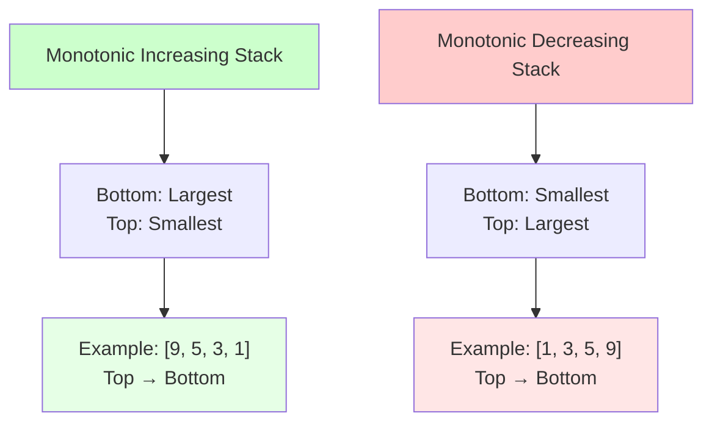
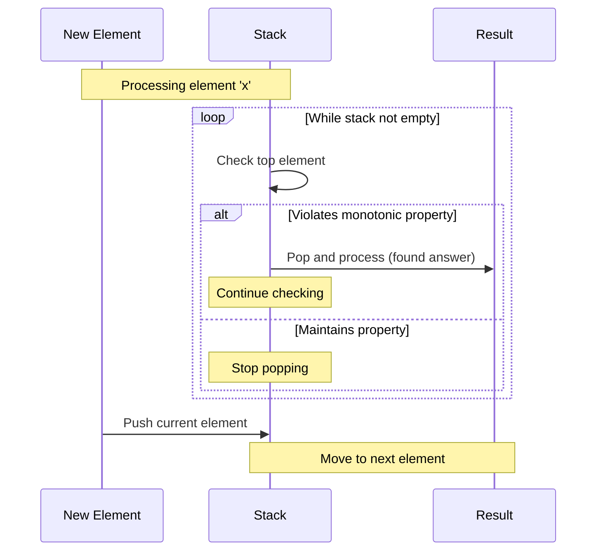
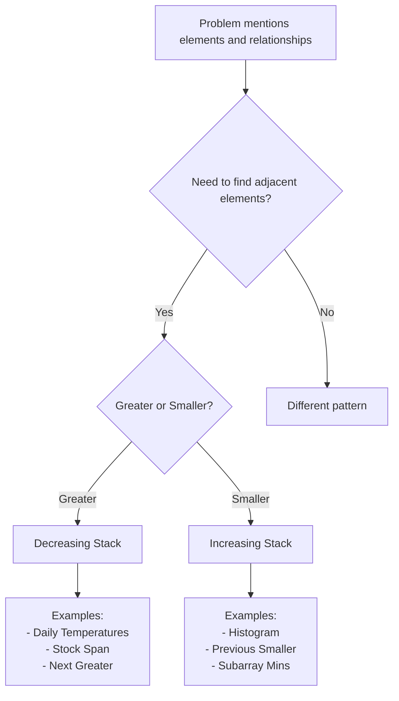

# Monotonic Stack Pattern

## Quick Reference Card

| Aspect | Details |
|--------|---------|
| **Key Signal** | Next greater/smaller element, span problems, histogram |
| **Time Complexity** | O(n) - each element pushed and popped at most once |
| **Space Complexity** | O(n) for the stack |
| **Common Variants** | Increasing stack, decreasing stack, next/previous greater/smaller |

## Mental Model

**Analogy:** You're in a queue of people of different heights. To see "next taller person to my right," everyone shorter than you is blocked from being the answer for anyone behind. A decreasing stack maintains this "line of sight" - only potentially useful candidates remain.

**First Principle:** Monotonic stacks maintain order invariants. When a new element violates the invariant, we've found a relationship (e.g., "next greater"). The violated elements are popped and processed, ensuring each element is handled exactly once for O(n) total.

## Overview

A monotonic stack maintains elements in a specific order (increasing or decreasing). As you process elements, you pop items that violate the monotonic property. This pattern elegantly solves "next greater/smaller element" problems in O(n) time.

**Core Insight**: Each element is pushed and popped at most once, giving linear time complexity.

## What Makes a Stack "Monotonic"?

A monotonic stack maintains a strict ordering:

- **Monotonic Increasing**: Elements increase from bottom to top
- **Monotonic Decreasing**: Elements decrease from bottom to top



## When to Use Monotonic Stack

Look for these signals:

### Direct Indicators
- **"Next greater element"**: Find next larger element to the right
- **"Next smaller element"**: Find next smaller element to the right
- **"Previous greater/smaller"**: Same but looking left
- **"Span/range problems"**: How far an element extends its influence

### Hidden Indicators
- **Histogram problems**: Largest rectangle in histogram
- **Temperature/stock problems**: Days until warmer/higher price
- **Building visibility**: Which buildings are visible

**Key Question**: Do I need to know the nearest element that's larger/smaller?

## Stack Operations Flow



## Template Code

### Monotonic Increasing Stack

```python
def monotonic_increasing_stack(arr):
    """
    Maintain increasing order (bottom to top)
    Use for: Next smaller element, previous smaller

    Time: O(n), Space: O(n)
    """
    stack = []
    result = [-1] * len(arr)  # Or appropriate default

    for i in range(len(arr)):
        # Pop elements larger than current (violate increasing property)
        while stack and arr[stack[-1]] > arr[i]:
            idx = stack.pop()
            result[idx] = arr[i]  # Current is next smaller for popped

        # Push current index
        stack.append(i)

    return result
```

### Monotonic Decreasing Stack

```python
def monotonic_decreasing_stack(arr):
    """
    Maintain decreasing order (bottom to top)
    Use for: Next greater element, previous greater

    Time: O(n), Space: O(n)
    """
    stack = []
    result = [-1] * len(arr)  # Or appropriate default

    for i in range(len(arr)):
        # Pop elements smaller than current (violate decreasing property)
        while stack and arr[stack[-1]] < arr[i]:
            idx = stack.pop()
            result[idx] = arr[i]  # Current is next greater for popped

        # Push current index
        stack.append(i)

    return result
```

## Example Problems with Approaches

### Problem 1: Next Greater Element I
**Problem**: For each element, find the next greater element to its right.

**Approach**: Monotonic decreasing stack (traverse right to left)
```python
def next_greater_element(nums):
    """
    Find next greater element for each element
    Time: O(n), Space: O(n)
    """
    n = len(nums)
    result = [-1] * n
    stack = []  # Stores indices

    # Traverse from right to left
    for i in range(n - 1, -1, -1):
        # Pop smaller elements (they can't be answer for future elements)
        while stack and stack[-1] <= nums[i]:
            stack.pop()

        # Top of stack is next greater (if exists)
        if stack:
            result[i] = stack[-1]

        # Push current element
        stack.append(nums[i])

    return result

# Example: [4, 3, 2, 5, 1]
# i=4: stack=[], result[-1,-1,-1,-1,-1], push 1, stack=[1]
# i=3: pop 1, stack=[], result[-1,-1,-1,-1,-1], push 5, stack=[5]
# i=2: stack=[5], result[-1,-1,5,-1,-1], push 2, stack=[5,2]
# i=1: stack=[5,2], result[-1,-1,5,-1,-1], push 3, stack=[5,3]
# i=0: pop 3, stack=[5], result[5,-1,5,-1,-1], push 4, stack=[5,4]
# Final: [5, 5, 5, -1, -1]
```

**Key insight**: Traverse right to left. Stack maintains potential answers for future elements.

Alternative (left to right):
```python
def next_greater_element_v2(nums):
    """
    Same problem, traverse left to right
    """
    result = [-1] * len(nums)
    stack = []  # Stores indices

    for i in range(len(nums)):
        # Current element is answer for smaller elements in stack
        while stack and nums[stack[-1]] < nums[i]:
            idx = stack.pop()
            result[idx] = nums[i]

        stack.append(i)

    return result
```

### Problem 2: Daily Temperatures
**Problem**: Return array where answer[i] is days until warmer temperature.

**Approach**: Monotonic decreasing stack with indices
```python
def daily_temperatures(temperatures):
    """
    Find next warmer temperature
    Time: O(n), Space: O(n)
    """
    n = len(temperatures)
    result = [0] * n  # Default: 0 days (no warmer day)
    stack = []  # Stores indices

    for i in range(n):
        # While current temp is warmer than stack top
        while stack and temperatures[stack[-1]] < temperatures[i]:
            prev_idx = stack.pop()
            result[prev_idx] = i - prev_idx  # Days until warmer

        stack.append(i)

    return result

# Example: [73, 74, 75, 71, 69, 72, 76, 73]
# i=0: stack=[], push 0, stack=[0]
# i=1: 74>73, pop 0, result[0]=1, push 1, stack=[1]
# i=2: 75>74, pop 1, result[1]=1, push 2, stack=[2]
# i=3: 71<75, push 3, stack=[2,3]
# i=4: 69<71, push 4, stack=[2,3,4]
# i=5: 72>69, pop 4, result[4]=1, 72>71, pop 3, result[3]=2, push 5, stack=[2,5]
# i=6: 76>72, pop 5, result[5]=1, 76>75, pop 2, result[2]=4, push 6, stack=[6]
# i=7: 73<76, push 7, stack=[6,7]
# Result: [1, 1, 4, 2, 1, 1, 0, 0]
```

**Key insight**: Stack stores indices. When we find warmer temp, calculate distance.

### Problem 3: Largest Rectangle in Histogram
**Problem**: Find largest rectangle area in histogram.

**Approach**: Monotonic increasing stack
```python
def largest_rectangle_area(heights):
    """
    Find largest rectangle in histogram
    Time: O(n), Space: O(n)
    """
    stack = []  # Stores indices
    max_area = 0

    for i in range(len(heights)):
        # When current bar is shorter, previous taller bars can't extend further
        while stack and heights[stack[-1]] > heights[i]:
            h_idx = stack.pop()
            height = heights[h_idx]

            # Width: from element after previous stack top to current-1
            width = i if not stack else i - stack[-1] - 1
            max_area = max(max_area, height * width)

        stack.append(i)

    # Process remaining bars
    while stack:
        h_idx = stack.pop()
        height = heights[h_idx]
        width = len(heights) if not stack else len(heights) - stack[-1] - 1
        max_area = max(max_area, height * width)

    return max_area

# Example: [2, 1, 5, 6, 2, 3]
# i=0: push 0, stack=[0]
# i=1: 1<2, pop 0, height=2, width=1, area=2, push 1, stack=[1]
# i=2: 5>1, push 2, stack=[1,2]
# i=3: 6>5, push 3, stack=[1,2,3]
# i=4: 2<6, pop 3, height=6, width=1, area=6
#      2<5, pop 2, height=5, width=2, area=10
#      2>1, push 4, stack=[1,4]
# i=5: 3>2, push 5, stack=[1,4,5]
# Remaining: pop 5, height=3, width=2, area=6
#            pop 4, height=2, width=4, area=8
#            pop 1, height=1, width=6, area=6
# Max area: 10
```

**Key insight**: When we find shorter bar, calculate area of all taller bars using them as height.

### Problem 4: Trapping Rain Water
**Problem**: Calculate trapped rainwater between bars.

**Approach**: Monotonic decreasing stack
```python
def trap(height):
    """
    Calculate trapped rainwater
    Time: O(n), Space: O(n)
    """
    stack = []
    water = 0

    for i in range(len(height)):
        # Found a taller bar - water can be trapped
        while stack and height[stack[-1]] < height[i]:
            bottom = stack.pop()

            if not stack:
                break

            # Calculate trapped water
            distance = i - stack[-1] - 1
            bounded_height = min(height[i], height[stack[-1]]) - height[bottom]
            water += distance * bounded_height

        stack.append(i)

    return water

# Example: [0,1,0,2,1,0,1,3,2,1,2,1]
# Calculates water trapped between bars
# Answer: 6 units
```

**Key insight**: Stack maintains potential left boundaries. When right boundary found, calculate trapped water.

### Problem 5: Sum of Subarray Minimums
**Problem**: Sum of minimum element in every subarray.

**Approach**: Monotonic increasing stack with contribution counting
```python
def sum_subarray_mins(arr):
    """
    Sum of minimums of all subarrays
    Time: O(n), Space: O(n)
    """
    MOD = 10**9 + 7
    n = len(arr)

    # Find previous less element and next less element
    left = [0] * n   # Distance to previous less element
    right = [0] * n  # Distance to next less element

    # Previous less element (increasing stack)
    stack = []
    for i in range(n):
        while stack and arr[stack[-1]] > arr[i]:
            stack.pop()
        left[i] = i + 1 if not stack else i - stack[-1]
        stack.append(i)

    # Next less element (increasing stack)
    stack = []
    for i in range(n - 1, -1, -1):
        while stack and arr[stack[-1]] >= arr[i]:
            stack.pop()
        right[i] = n - i if not stack else stack[-1] - i
        stack.append(i)

    # Calculate contribution of each element
    result = 0
    for i in range(n):
        result = (result + arr[i] * left[i] * right[i]) % MOD

    return result
```

**Key insight**: Each element is minimum for all subarrays it can extend to. Count contributions.

## Monotonic Increasing vs Decreasing

| Aspect | Increasing Stack | Decreasing Stack |
|--------|------------------|------------------|
| **Order** | Bottom → Top: Large → Small | Bottom → Top: Small → Large |
| **Pop when** | Current > Stack top | Current < Stack top |
| **Find** | Next/Previous smaller | Next/Previous greater |
| **Examples** | Histogram, Previous smaller | Daily temps, Next greater |

**Memory trick**:
- **Increasing stack** → pop when going **UP** → finds **smaller** elements
- **Decreasing stack** → pop when going **DOWN** → finds **greater** elements

## Traversal Direction

### Right to Left (Building result)
```python
# Looking for next greater to the right
for i in range(n - 1, -1, -1):
    while stack and stack[-1] <= arr[i]:
        stack.pop()
    result[i] = stack[-1] if stack else -1
    stack.append(arr[i])
```

### Left to Right (Processing as we go)
```python
# Finding answer for previous elements
for i in range(n):
    while stack and arr[stack[-1]] < arr[i]:
        idx = stack.pop()
        result[idx] = arr[i]
    stack.append(i)
```

## Common Pitfalls

### 1. Storing Values Instead of Indices
```python
# WRONG: Can't calculate distances
stack.append(arr[i])

# CORRECT: Store indices to calculate positions/distances
stack.append(i)
```

### 2. Wrong Comparison for Stack Type
```python
# For monotonic increasing (next smaller):
while stack and arr[stack[-1]] > arr[i]:  # CORRECT

while stack and arr[stack[-1]] < arr[i]:  # WRONG - this is decreasing
```

### 3. Forgetting to Process Remaining Stack
```python
# After main loop, stack may have remaining elements
while stack:
    process_remaining(stack.pop())
```

### 4. Incorrect Width Calculation (Histogram)
```python
# WRONG: Doesn't account for previous boundary
width = i - h_idx

# CORRECT: Distance from previous boundary to current
width = i if not stack else i - stack[-1] - 1
```

### 5. Not Handling Edge Cases
```python
# Empty array
if not arr:
    return []

# Single element
if len(arr) == 1:
    return [-1]  # or appropriate default
```

## Complexity Analysis

- **Time Complexity**: O(n)
  - Each element pushed once: O(n)
  - Each element popped once: O(n)
  - Total: O(2n) = O(n)

- **Space Complexity**: O(n)
  - Stack can hold all elements in worst case
  - Example: Increasing array for increasing stack

**Amortized Analysis**: Though inner while loop exists, each element is processed constant time overall.

## Pattern Recognition Guide



## Practice Problems

1. **Easy**:
   - Next Greater Element I
   - Remove All Adjacent Duplicates In String

2. **Medium**:
   - Daily Temperatures
   - Online Stock Span
   - Largest Rectangle in Histogram
   - Sum of Subarray Minimums

3. **Hard**:
   - Trapping Rain Water
   - Maximal Rectangle
   - Maximum Score of a Good Subarray

## Practice Progression (Spaced Repetition)

**Day 1 (Learn):**
- Understand increasing vs decreasing stacks
- Solve: Next Greater Element I, Daily Temperatures

**Day 3 (Reinforce):**
- Solve: Stock Span Problem
- Practice visualizing stack state

**Day 7 (Master):**
- Solve: Largest Rectangle in Histogram
- Solve: Trapping Rain Water (stack approach)

**Day 14 (Maintain):**
- Solve: Sum of Subarray Minimums
- Practice identifying monotonic stack opportunities

## Related Patterns

| Pattern | When to Use Instead |
|---------|---------------------|
| **Two Pointers** | Finding pairs in sorted array |
| **Sliding Window** | Contiguous subarray with constraints |
| **Monotonic Deque** | Need both min/max in sliding window |
| **Stack** | Basic balanced parentheses, no monotonic property |

## Summary

Monotonic stack is a powerful technique for "next greater/smaller" problems:
- **Two types**: Increasing (finds smaller) and Decreasing (finds greater)
- **Linear time**: Each element processed once
- **Key skill**: Recognizing when to pop and what information to extract
- **Common uses**: Temperature problems, histograms, visibility, spans

Master this pattern by practicing problems in increasing difficulty. Once you recognize the pattern, implementation becomes straightforward!
