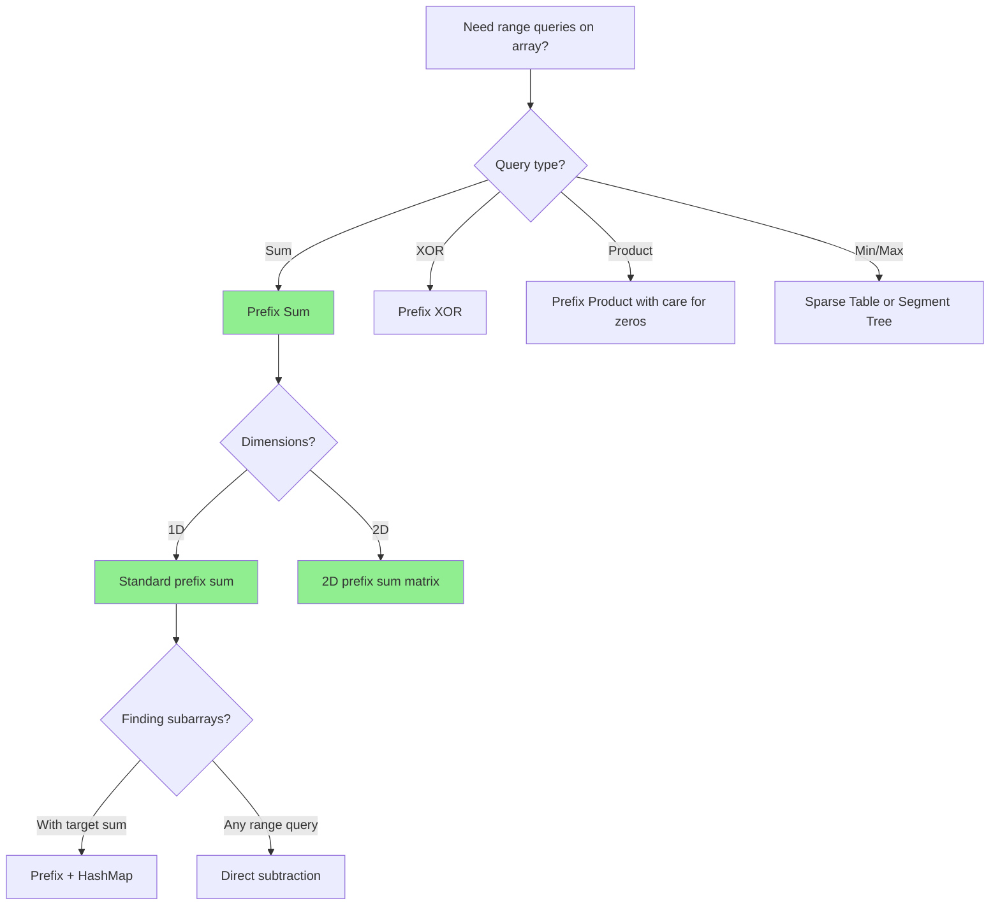
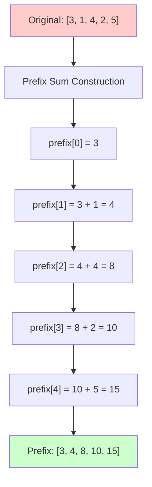
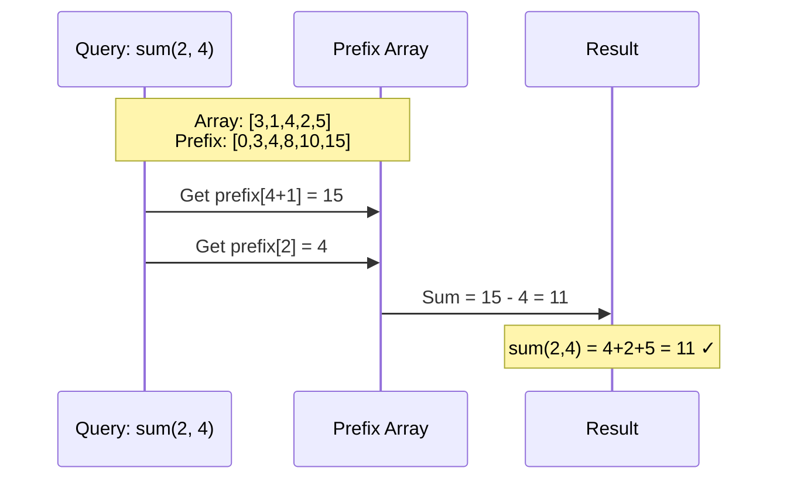
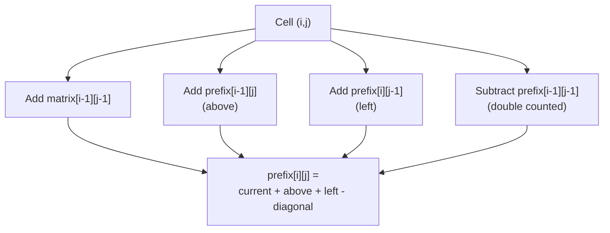

# Prefix Sum Pattern

## Quick Reference Card

| Aspect | Details |
|--------|---------|
| **Key Signal** | Range sum queries, subarray sums, cumulative calculations |
| **Time Complexity** | O(n) preprocessing, O(1) per query |
| **Space Complexity** | O(n) for prefix array |
| **Common Variants** | 1D prefix sum, 2D prefix sum, prefix XOR, prefix product |

## Mental Model

**Analogy:** Tracking your bank balance. Instead of adding all transactions from the start each time you want to know your balance at a date, you record running totals. To find spending between two dates: balance_at_end - balance_at_start.

**First Principle:** The sum of elements from index i to j equals prefix[j] - prefix[i-1]. By precomputing cumulative sums, any range query becomes a simple subtraction, turning O(n) queries into O(1).

## Overview

The prefix sum pattern preprocesses an array to enable O(1) range sum queries. Instead of summing elements repeatedly, we build an auxiliary array where each element stores the cumulative sum up to that index.

**Core Insight**: `sum(i, j) = prefix[j] - prefix[i-1]`

This transforms O(n) range queries into O(1) lookups, at the cost of O(n) preprocessing and space.

## Pattern Decision Tree



## The Prefix Sum Concept



**Reading the prefix array**:
- `prefix[i]` = sum of elements from index 0 to i
- To get sum from index i to j: `prefix[j] - prefix[i-1]`

## When to Use Prefix Sum

Look for these signals:
- **Multiple range sum queries**: Computing sum of subarray [i, j] repeatedly
- **Subarray sum problems**: Finding subarrays with specific sum
- **Count subarrays**: Number of subarrays meeting criteria
- **2D matrix queries**: Sum of rectangular regions
- **Running totals**: Cumulative statistics needed

**Key requirement**: Need to query sums of contiguous elements efficiently.

## Building a Prefix Sum Array

```python
def build_prefix_sum(arr):
    """
    Build prefix sum array
    Time: O(n), Space: O(n)

    prefix[i] = sum of arr[0] to arr[i]
    """
    n = len(arr)
    prefix = [0] * n

    prefix[0] = arr[0]
    for i in range(1, n):
        prefix[i] = prefix[i - 1] + arr[i]

    return prefix

# Alternative: Include 0 at beginning for easier calculation
def build_prefix_sum_with_zero(arr):
    """
    Build prefix sum with 0 prepended
    Makes range sum calculation easier (no special case for i=0)
    """
    n = len(arr)
    prefix = [0] * (n + 1)

    for i in range(n):
        prefix[i + 1] = prefix[i] + arr[i]

    return prefix
```

## Range Sum Query



```python
class RangeSumQuery:
    """
    Immutable range sum query with O(1) query time
    """
    def __init__(self, nums):
        """
        Preprocess: O(n)
        Space: O(n)
        """
        n = len(nums)
        self.prefix = [0] * (n + 1)

        for i in range(n):
            self.prefix[i + 1] = self.prefix[i] + nums[i]

    def sum_range(self, left, right):
        """
        Query: O(1)
        Returns sum of elements from left to right inclusive
        """
        return self.prefix[right + 1] - self.prefix[left]

# Usage
rsq = RangeSumQuery([3, 1, 4, 2, 5])
print(rsq.sum_range(0, 2))  # 3+1+4 = 8
print(rsq.sum_range(2, 4))  # 4+2+5 = 11
print(rsq.sum_range(1, 3))  # 1+4+2 = 7
```

## Template Code

### Basic Prefix Sum

```python
def prefix_sum_template(arr):
    """
    Standard prefix sum template
    Time: O(n), Space: O(n)
    """
    n = len(arr)
    prefix = [0] * (n + 1)  # Extra 0 at start

    # Build prefix sum
    for i in range(n):
        prefix[i + 1] = prefix[i] + arr[i]

    # Query range sum [left, right]
    def range_sum(left, right):
        return prefix[right + 1] - prefix[left]

    return prefix, range_sum
```

### Prefix Sum with Hash Map

```python
def prefix_sum_with_map(arr, target):
    """
    Count subarrays with sum equal to target
    Uses hash map to track prefix sums
    Time: O(n), Space: O(n)
    """
    prefix_sum = 0
    count = 0
    prefix_map = {0: 1}  # Handle subarrays starting from index 0

    for num in arr:
        prefix_sum += num

        # Check if (prefix_sum - target) exists
        # If yes, there's a subarray ending here with sum = target
        if prefix_sum - target in prefix_map:
            count += prefix_map[prefix_sum - target]

        # Record current prefix sum
        prefix_map[prefix_sum] = prefix_map.get(prefix_sum, 0) + 1

    return count
```

## Example Problems with Approaches

### Problem 1: Subarray Sum Equals K
**Problem**: Count number of continuous subarrays whose sum equals k.

**Approach**: Prefix sum with hash map
```python
def subarray_sum(nums, k):
    """
    Key insight: If prefix[j] - prefix[i] = k
    Then subarray from i+1 to j has sum k

    Time: O(n), Space: O(n)
    """
    count = 0
    prefix_sum = 0
    sum_count = {0: 1}  # Empty prefix has sum 0

    for num in nums:
        prefix_sum += num

        # How many prefix sums equal (prefix_sum - k)?
        # Each represents a subarray ending here with sum k
        if prefix_sum - k in sum_count:
            count += sum_count[prefix_sum - k]

        # Track this prefix sum
        sum_count[prefix_sum] = sum_count.get(prefix_sum, 0) + 1

    return count

# Example: nums = [1, 2, 3], k = 3
# prefix_sum progression: 1, 3, 6
# sum_count: {0:1} -> {0:1, 1:1} -> {0:1, 1:1, 3:1} -> {0:1, 1:1, 3:1, 6:1}
# At prefix_sum=3: found sum_count[3-3=0]=1, count=1 (subarray [1,2])
# At prefix_sum=6: found sum_count[6-3=3]=1, count=2 (subarray [3])
# Answer: 2 subarrays
```

**Key insight**: Use hash map to track prefix sums. If `prefix[j] - k` was seen before, we found a valid subarray.

### Problem 2: Contiguous Array
**Problem**: Find longest subarray with equal number of 0s and 1s.

**Approach**: Prefix sum with hash map (treat 0 as -1)
```python
def find_max_length(nums):
    """
    Treat 0 as -1, then problem becomes: find longest subarray with sum 0
    Time: O(n), Space: O(n)
    """
    max_length = 0
    prefix_sum = 0
    sum_index = {0: -1}  # Sum 0 at index -1 (before array)

    for i, num in enumerate(nums):
        # Convert: 0 -> -1, 1 -> 1
        prefix_sum += 1 if num == 1 else -1

        if prefix_sum in sum_index:
            # Found same prefix sum before
            # Subarray between has sum 0 (equal 0s and 1s)
            length = i - sum_index[prefix_sum]
            max_length = max(max_length, length)
        else:
            # First time seeing this prefix sum
            sum_index[prefix_sum] = i

    return max_length

# Example: [0,1,0]
# Converted: [-1,1,-1]
# prefix_sum: -1, 0, -1
# sum_index: {0:-1, -1:0} -> {0:-1, -1:0} -> {0:-1, -1:0}
# At index 1: prefix_sum=0 seen at -1, length=1-(-1)=2
# Answer: 2 (subarray [0,1])
```

**Key insight**: Transform problem by treating 0 as -1. Equal 0s and 1s means sum is 0.

### Problem 3: Product of Array Except Self
**Problem**: Return array where output[i] is product of all elements except nums[i].

**Approach**: Prefix and suffix products
```python
def product_except_self(nums):
    """
    Use prefix product and suffix product
    Time: O(n), Space: O(1) excluding output
    """
    n = len(nums)
    result = [1] * n

    # Build prefix products in result array
    prefix = 1
    for i in range(n):
        result[i] = prefix
        prefix *= nums[i]

    # Multiply by suffix products
    suffix = 1
    for i in range(n - 1, -1, -1):
        result[i] *= suffix
        suffix *= nums[i]

    return result

# Example: [1,2,3,4]
# After prefix: [1, 1, 2, 6]
#   result[0] = 1 (no elements before)
#   result[1] = 1 (product of [1])
#   result[2] = 2 (product of [1,2])
#   result[3] = 6 (product of [1,2,3])
# After suffix: [24, 12, 8, 6]
#   result[3] *= 1 = 6 (6 * no elements after)
#   result[2] *= 4 = 8 (2 * product of [4])
#   result[1] *= 12 = 12 (1 * product of [3,4])
#   result[0] *= 24 = 24 (1 * product of [2,3,4])
```

**Key insight**: Product except self = prefix product * suffix product.

### Problem 4: Range Sum Query 2D
**Problem**: Calculate sum of rectangular region in 2D matrix.

**Approach**: 2D prefix sum
```python
class NumMatrix:
    """
    2D prefix sum for rectangle sum queries
    """
    def __init__(self, matrix):
        """
        Preprocess: O(m*n)
        Space: O(m*n)
        """
        if not matrix or not matrix[0]:
            return

        m, n = len(matrix), len(matrix[0])
        # prefix[i][j] = sum of rectangle from (0,0) to (i-1,j-1)
        self.prefix = [[0] * (n + 1) for _ in range(m + 1)]

        for i in range(1, m + 1):
            for j in range(1, n + 1):
                self.prefix[i][j] = (
                    matrix[i-1][j-1] +           # Current cell
                    self.prefix[i-1][j] +         # Above
                    self.prefix[i][j-1] -         # Left
                    self.prefix[i-1][j-1]         # Remove double-counted
                )

    def sum_region(self, row1, col1, row2, col2):
        """
        Query: O(1)
        Sum of rectangle from (row1,col1) to (row2,col2)
        """
        # Shift indices for 1-indexed prefix array
        r1, c1, r2, c2 = row1 + 1, col1 + 1, row2 + 1, col2 + 1

        return (
            self.prefix[r2][c2] -           # Total up to bottom-right
            self.prefix[r1-1][c2] -         # Remove top
            self.prefix[r2][c1-1] +         # Remove left
            self.prefix[r1-1][c1-1]         # Add back double-removed corner
        )
```

**Visualization**:
```
Query sum of rectangle (r1,c1) to (r2,c2):

  ┌─────┬─────┐
  │  A  │  B  │
  ├─────┼─────┤
  │  C  │  D  │
  └─────┴─────┘

prefix[r2][c2] = A + B + C + D
prefix[r1-1][c2] = A + B
prefix[r2][c1-1] = A + C
prefix[r1-1][c1-1] = A

Sum of D = (A+B+C+D) - (A+B) - (A+C) + A = D
```

**Key insight**: Use inclusion-exclusion principle. Add/subtract overlapping regions correctly.

## 2D Prefix Sum Construction



## Common Pitfalls

### 1. Off-by-One in Range Queries
```python
# WRONG: Doesn't handle left boundary correctly
def range_sum(left, right):
    return prefix[right] - prefix[left]  # Missing left element

# CORRECT: With 0-prepended prefix array
def range_sum(left, right):
    return prefix[right + 1] - prefix[left]
```

### 2. Forgetting Initial State in Hash Map
```python
# WRONG: Misses subarrays starting from index 0
prefix_map = {}

# CORRECT: Include base case
prefix_map = {0: 1}  # or {0: -1} for index problems
```

### 3. Not Handling Negative Numbers
```python
# Works with negative numbers too!
# Prefix sum doesn't require non-negative values
nums = [1, -1, 2, -2]
prefix = [0, 1, 0, 2, 0]  # Valid
```

### 4. Confusing 2D Inclusion-Exclusion
```python
# WRONG: Forgetting to add back corner
sum = prefix[r2][c2] - prefix[r1-1][c2] - prefix[r2][c1-1]

# CORRECT: Add back double-subtracted corner
sum = prefix[r2][c2] - prefix[r1-1][c2] - prefix[r2][c1-1] + prefix[r1-1][c1-1]
```

### 5. Modifying Original Array
```python
# WRONG: Don't modify input
for i in range(1, len(nums)):
    nums[i] += nums[i-1]

# CORRECT: Create separate prefix array
prefix = [0] * (len(nums) + 1)
for i in range(len(nums)):
    prefix[i+1] = prefix[i] + nums[i]
```

## Complexity Analysis

### 1D Prefix Sum
- **Preprocessing**: O(n) time, O(n) space
- **Range Query**: O(1) time
- **Trade-off**: Fast queries at cost of extra space

### 2D Prefix Sum
- **Preprocessing**: O(m × n) time, O(m × n) space
- **Range Query**: O(1) time
- **Alternative**: Without prefix sum, each query takes O(m × n)

## Variations

### Prefix XOR
For XOR operations: `XOR(i, j) = prefix_xor[j] ^ prefix_xor[i-1]`

```python
def build_prefix_xor(arr):
    n = len(arr)
    prefix_xor = [0] * (n + 1)

    for i in range(n):
        prefix_xor[i + 1] = prefix_xor[i] ^ arr[i]

    return prefix_xor
```

### Prefix Maximum/Minimum
Track running max/min instead of sum.

```python
def build_prefix_max(arr):
    n = len(arr)
    prefix_max = [float('-inf')] * n

    prefix_max[0] = arr[0]
    for i in range(1, n):
        prefix_max[i] = max(prefix_max[i-1], arr[i])

    return prefix_max
```

## Practice Problems

1. **Easy**:
   - Range Sum Query - Immutable
   - Running Sum of 1D Array
   - Find Pivot Index

2. **Medium**:
   - Subarray Sum Equals K
   - Contiguous Array
   - Range Sum Query 2D - Immutable
   - Product of Array Except Self

3. **Hard**:
   - Maximum Sum of 3 Non-Overlapping Subarrays
   - Substring with Concatenation of All Words

## Practice Progression (Spaced Repetition)

**Day 1 (Learn):**
- Build prefix sum array manually
- Solve: Range Sum Query, Running Sum of 1D Array

**Day 3 (Reinforce):**
- Solve: Subarray Sum Equals K (prefix + hashmap)
- Practice the formula: sum(i,j) = prefix[j] - prefix[i-1]

**Day 7 (Master):**
- Solve: 2D Range Sum Query
- Solve: Contiguous Array (prefix with trick)

**Day 14 (Maintain):**
- Solve: Maximum Size Subarray Sum Equals K
- Practice identifying prefix sum opportunities

## Related Patterns

| Pattern | When to Use Instead |
|---------|---------------------|
| **Sliding Window** | Contiguous subarray with size constraint |
| **Segment Tree** | Range queries with updates |
| **Difference Array** | Range updates, point queries |
| **Kadane's Algorithm** | Maximum subarray sum |

## Summary

Prefix sum is a preprocessing technique that:
- Enables O(1) range sum queries after O(n) preprocessing
- Extends to 2D matrices for rectangle sum queries
- Combines with hash maps to solve subarray sum problems
- Works with other operations (XOR, max, min, product)
- Trades space for query speed - classic time-space tradeoff

The pattern is essential for efficiently answering multiple queries on the same array. Master it for interview success!
