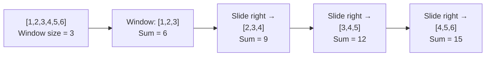
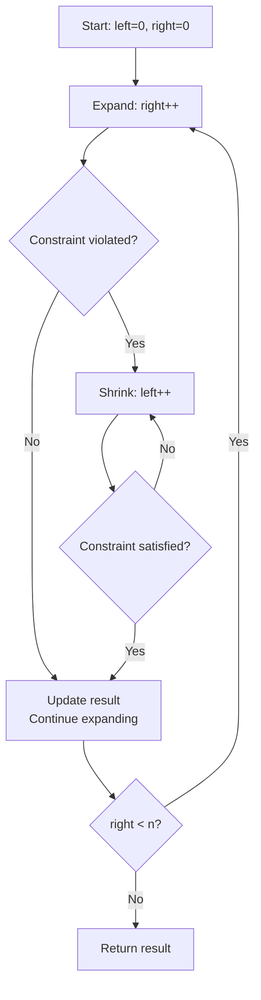
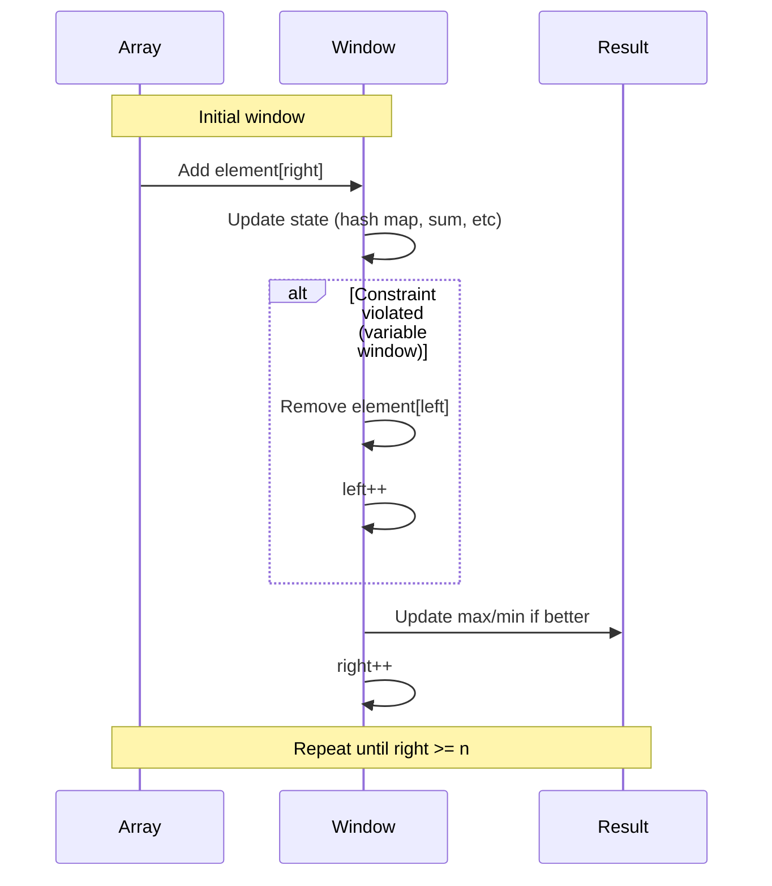

# Sliding Window Pattern

## Quick Reference Card

| Aspect | Details |
|--------|---------|
| **Key Signal** | Contiguous subarray/substring, window size constraint |
| **Time Complexity** | O(n) - each element visited at most twice |
| **Space Complexity** | O(1) or O(k) for window state |
| **Common Variants** | Fixed size, variable size, with constraints |

## Overview

The sliding window pattern maintains a subset of elements (a "window") as you traverse a sequence. The window slides by adding elements on one end and removing from the other, enabling efficient computation over subarrays or substrings.

This pattern transforms O(n²) or O(n³) brute force solutions into O(n) solutions.

## Mental Model

**Analogy:** Imagine looking through a window on a moving train. As the train moves, new scenery enters from one side while old scenery leaves from the other. You maintain what you see in the window without re-examining the entire landscape.

**First Principle:** When computing aggregate properties (sum, max, count) of contiguous subarrays, adding one element and removing another is O(1), avoiding O(k) recomputation. The window "slides" by adjusting boundaries, not rebuilding.

## When to Use Sliding Window

Look for these signals:
- Problems involving **contiguous sequences** (subarrays, substrings)
- Keywords like "maximum/minimum sum/length of subarray"
- "Longest substring with at most K distinct characters"
- "Find all anagrams in string"
- "Maximum average subarray"

**Key requirement**: The problem must work with a contiguous sequence.

## Pattern Decision Tree

```mermaid
flowchart TD
    START[Contiguous subarray/substring?] --> SIZE{Window size?}

    SIZE -->|Fixed size k| FIXED[Fixed Sliding Window]
    SIZE -->|Variable| CONSTRAINT{What constraint?}

    CONSTRAINT -->|Max/min length| VARIABLE[Variable Sliding Window]
    CONSTRAINT -->|At most K distinct| ATMOST[Shrink when > K]
    CONSTRAINT -->|Exactly K| EXACTLY[AtMost(K) - AtMost(K-1)]

    FIXED --> IMPL1[Add right, remove left<br/>each step]
    VARIABLE --> IMPL2[Expand right, shrink left<br/>when invalid]
    ATMOST --> IMPL2
    EXACTLY --> IMPL3[Use subtraction trick]

    style FIXED fill:#90EE90
    style VARIABLE fill:#90EE90
```

## Types of Sliding Windows

### 1. Fixed-Size Window

Window size is predetermined and constant.



**Use cases**: Maximum sum of K consecutive elements, average of subarrays

### 2. Variable-Size Window

Window expands and contracts based on conditions.



**Use cases**: Longest substring without repeating characters, minimum window substring

## Window Mechanics



## Template Code

### Fixed-Size Window

```python
def fixed_window_template(arr, k):
    """
    Template for fixed-size sliding window
    Time: O(n), Space: O(1)

    Args:
        arr: Input array
        k: Window size
    """
    n = len(arr)
    if n < k:
        return None  # Invalid case

    # Initialize window for first k elements
    window_sum = sum(arr[:k])
    max_sum = window_sum

    # Slide window from index k to n
    for right in range(k, n):
        # Add new element, remove leftmost element
        window_sum += arr[right] - arr[right - k]
        max_sum = max(max_sum, window_sum)

    return max_sum

# Example: Maximum sum of k consecutive elements
def max_sum_subarray(nums, k):
    """
    Find maximum sum of any contiguous subarray of size k
    """
    n = len(nums)
    if n < k:
        return 0

    # Initialize first window
    window_sum = sum(nums[:k])
    max_sum = window_sum

    # Slide window
    for i in range(k, n):
        # Remove leftmost, add rightmost
        window_sum = window_sum - nums[i - k] + nums[i]
        max_sum = max(max_sum, window_sum)

    return max_sum
```

### Variable-Size Window

```python
def variable_window_template(arr):
    """
    Template for variable-size sliding window
    Time: O(n), Space: O(k) where k is window size
    """
    left = 0
    max_length = 0
    window_state = {}  # Track window contents

    for right in range(len(arr)):
        # Expand window: add arr[right]
        window_state[arr[right]] = window_state.get(arr[right], 0) + 1

        # Shrink window while constraint violated
        while constraint_violated(window_state):
            window_state[arr[left]] -= 1
            if window_state[arr[left]] == 0:
                del window_state[arr[left]]
            left += 1

        # Update result with current valid window
        max_length = max(max_length, right - left + 1)

    return max_length

# Example: Longest substring without repeating characters
def length_of_longest_substring(s):
    """
    Find length of longest substring without repeating characters
    """
    char_index = {}  # Track last seen index of each character
    left = 0
    max_length = 0

    for right in range(len(s)):
        char = s[right]

        # If character seen and in current window, shrink from left
        if char in char_index and char_index[char] >= left:
            left = char_index[char] + 1

        # Update character's last seen index
        char_index[char] = right

        # Update max length
        max_length = max(max_length, right - left + 1)

    return max_length
```

## Example Problems with Approaches

### Problem 1: Maximum Average Subarray
**Problem**: Find contiguous subarray of length k with maximum average.

**Approach**: Fixed-size window
```python
def find_max_average(nums, k):
    """
    Time: O(n), Space: O(1)
    """
    # Initialize first window
    window_sum = sum(nums[:k])
    max_sum = window_sum

    # Slide window across array
    for i in range(k, len(nums)):
        # Update sum: remove left, add right
        window_sum += nums[i] - nums[i - k]
        max_sum = max(max_sum, window_sum)

    # Return average
    return max_sum / k
```

**Key insight**: Track sum instead of recalculating. Update in O(1) by removing left element and adding right.

### Problem 2: Longest Substring with At Most K Distinct Characters
**Problem**: Find length of longest substring containing at most K distinct characters.

**Approach**: Variable-size window with hash map
```python
def length_of_longest_substring_k_distinct(s, k):
    """
    Time: O(n), Space: O(k)
    """
    if k == 0:
        return 0

    char_count = {}
    left = 0
    max_length = 0

    for right in range(len(s)):
        # Expand: add right character
        char = s[right]
        char_count[char] = char_count.get(char, 0) + 1

        # Shrink: while more than k distinct characters
        while len(char_count) > k:
            left_char = s[left]
            char_count[left_char] -= 1
            if char_count[left_char] == 0:
                del char_count[left_char]
            left += 1

        # Update result
        max_length = max(max_length, right - left + 1)

    return max_length
```

**Key insight**: Hash map tracks character frequencies. Shrink window when distinct count exceeds K.

### Problem 3: Minimum Window Substring
**Problem**: Find minimum window in S containing all characters of T.

**Approach**: Variable-size window with character counting
```python
def min_window(s, t):
    """
    Time: O(m + n), Space: O(k) where k is unique chars
    """
    if not s or not t:
        return ""

    # Count characters needed
    target_count = {}
    for char in t:
        target_count[char] = target_count.get(char, 0) + 1

    required = len(target_count)  # Unique chars needed
    formed = 0  # Unique chars in window with desired frequency

    window_counts = {}
    left = 0
    min_len = float('inf')
    min_window = (0, 0)  # (left, right) of minimum window

    for right in range(len(s)):
        # Expand window
        char = s[right]
        window_counts[char] = window_counts.get(char, 0) + 1

        # Check if frequency matches requirement
        if char in target_count and window_counts[char] == target_count[char]:
            formed += 1

        # Shrink window while valid
        while left <= right and formed == required:
            # Update result if smaller
            if right - left + 1 < min_len:
                min_len = right - left + 1
                min_window = (left, right)

            # Remove left character
            char = s[left]
            window_counts[char] -= 1
            if char in target_count and window_counts[char] < target_count[char]:
                formed -= 1
            left += 1

    # Extract result
    left, right = min_window
    return "" if min_len == float('inf') else s[left:right + 1]
```

**Key insight**: Track when window contains all required characters. Shrink to find minimum valid window.

### Problem 4: Find All Anagrams in String
**Problem**: Find all start indices of anagram substrings of p in s.

**Approach**: Fixed-size window with character frequency matching
```python
def find_anagrams(s, p):
    """
    Time: O(n), Space: O(1) - at most 26 lowercase letters
    """
    if len(p) > len(s):
        return []

    # Character frequencies for p
    p_count = {}
    for char in p:
        p_count[char] = p_count.get(char, 0) + 1

    window_count = {}
    result = []
    k = len(p)

    # Initialize first window
    for i in range(k):
        char = s[i]
        window_count[char] = window_count.get(char, 0) + 1

    # Check first window
    if window_count == p_count:
        result.append(0)

    # Slide window
    for i in range(k, len(s)):
        # Add right character
        right_char = s[i]
        window_count[right_char] = window_count.get(right_char, 0) + 1

        # Remove left character
        left_char = s[i - k]
        window_count[left_char] -= 1
        if window_count[left_char] == 0:
            del window_count[left_char]

        # Check if anagram
        if window_count == p_count:
            result.append(i - k + 1)

    return result
```

**Key insight**: Fixed window size equals p's length. Compare frequency maps for anagram detection.

## Common Mistakes

### 1. Not Initializing Window Properly
```python
# WRONG: Forgetting to process first window
for i in range(k, n):
    window_sum += arr[i] - arr[i - k]

# CORRECT: Initialize first window
window_sum = sum(arr[:k])
for i in range(k, n):
    window_sum += arr[i] - arr[i - k]
```

### 2. Incorrect Window Shrinking Logic
```python
# WRONG: Shrinking too much or not enough
while len(char_set) > k:
    char_set.remove(s[left])  # What if character appears multiple times?
    left += 1

# CORRECT: Track frequencies
while len(char_count) > k:
    char_count[s[left]] -= 1
    if char_count[s[left]] == 0:
        del char_count[s[left]]
    left += 1
```

### 3. Off-by-One in Window Size
```python
# WRONG: Current window size
window_size = right - left  # Missing +1

# CORRECT:
window_size = right - left + 1
```

### 4. Forgetting to Update Result
```python
# WRONG: Only updating when constraint violated
while constraint_violated():
    left += 1
    max_length = max(max_length, right - left + 1)  # Wrong place!

# CORRECT: Update after ensuring valid window
while constraint_violated():
    left += 1
max_length = max(max_length, right - left + 1)  # Update with valid window
```

### 5. Modifying Instead of Tracking State
```python
# WRONG: Modifying original array
window_sum = sum(arr[left:right+1])  # Recalculates each time - O(k)

# CORRECT: Maintain running sum
window_sum += arr[right] - arr[left - 1]  # O(1) update
```

## When to Expand vs Shrink

### Expansion (right++)
- **Always** move right pointer forward each iteration
- Add new element to window state
- Continues until right reaches end of array

### Contraction (left++)
- **Only when** constraint is violated
- Remove element from window state
- Continue until window becomes valid again

```python
# General pattern
for right in range(n):
    add_to_window(arr[right])  # Always expand

    while is_invalid():         # Conditionally shrink
        remove_from_window(arr[left])
        left += 1

    update_result()             # Process valid window
```

## Complexity Analysis

- **Time Complexity**: O(n) - each element enters and exits window at most once
- **Space Complexity**:
  - O(1) for fixed window with simple operations
  - O(k) for variable window using hash map, where k is window size
- **Note**: Some problems require O(n) space for result storage

## Practice Problems

1. **Easy**:
   - Maximum Sum Subarray of Size K
   - Contains Duplicate II

2. **Medium**:
   - Longest Substring Without Repeating Characters
   - Longest Repeating Character Replacement
   - Permutation in String
   - Fruit Into Baskets

3. **Hard**:
   - Minimum Window Substring
   - Sliding Window Maximum
   - Substring with Concatenation of All Words

## Practice Progression (Spaced Repetition)

**Day 1 (Learn):**
- Read this guide, understand fixed vs variable window
- Solve: Maximum Average Subarray I (fixed), Longest Substring Without Repeating (variable)

**Day 3 (Reinforce):**
- Implement templates from memory
- Solve: Minimum Size Subarray Sum

**Day 7 (Master):**
- Solve: Longest Repeating Character Replacement
- Solve: Permutation in String

**Day 14 (Maintain):**
- Solve: Minimum Window Substring (hard)
- Can you explain when to shrink vs expand?

## Related Patterns

| Pattern | When to Use Instead |
|---------|---------------------|
| **Two Pointers** | Not contiguous, or sorted array pairs |
| **Prefix Sum** | Need sum of any range, not just contiguous window |
| **Monotonic Deque** | Need min/max in window efficiently |
| **Hash Map** | Track frequencies/counts within window |

## Summary

The sliding window pattern:
- Optimizes subarray/substring problems from O(n²) to O(n)
- Comes in two flavors: fixed-size and variable-size
- Uses two pointers to maintain a window that slides through the data
- Requires maintaining window state efficiently (sums, counts, etc.)
- Key skill: knowing when to expand vs shrink the window

Master recognizing when a problem asks for contiguous sequences, then apply the appropriate window template!
