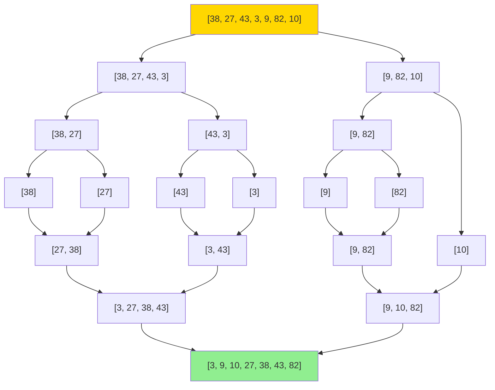

# Sorting Pattern: Organizing Data Efficiently

## Quick Reference Card

| Aspect | Details |
|--------|---------|
| **Key Signal** | Need ordered data, find kth element, group similar items |
| **Time Complexity** | O(n log n) comparison-based, O(n+k) non-comparison |
| **Space Complexity** | O(1) to O(n) depending on algorithm |
| **Common Variants** | Merge sort, quick sort, counting sort, bucket sort |

## Mental Model

**Analogy:** Organizing a deck of cards. You can split the deck repeatedly and merge sorted halves (merge sort), or pick a card and put smaller cards left and larger right (quick sort), or count how many of each card you have and reconstruct (counting sort).

**First Principle:** Sorting transforms unordered data into ordered sequences. Comparison-based sorts have O(n log n) lower bound because they need log n levels of comparisons. Non-comparison sorts can be O(n) by using extra information about the data.

## Pattern Decision Tree

```mermaid
flowchart TD
    START[Need to sort data?] --> KNOW{Know value range?}

    KNOW -->|Yes, small range k| NONCOMP[Non-Comparison Based]
    KNOW -->|No, arbitrary values| COMP[Comparison Based]

    NONCOMP --> TYPE{Data type?}
    TYPE -->|Integers in range k| COUNT[Counting Sort O(n+k)]
    TYPE -->|Uniform distribution| BUCKET[Bucket Sort O(n+k)]
    TYPE -->|Multi-digit numbers| RADIX[Radix Sort O(d×n)]

    COMP --> STABLE{Need stability?}
    STABLE -->|Yes| MERGE[Merge Sort O(n log n)]
    STABLE -->|No| PERF{Optimize for?}

    PERF -->|Average case| QUICK[Quick Sort O(n log n) avg]
    PERF -->|Worst case guaranteed| HEAP[Heap Sort O(n log n)]
    PERF -->|Nearly sorted data| INSERT[Insertion Sort O(n) best]

    style COUNT fill:#90EE90
    style BUCKET fill:#90EE90
    style RADIX fill:#90EE90
    style MERGE fill:#87CEEB
    style QUICK fill:#87CEEB
    style HEAP fill:#87CEEB
```

## Overview

Sorting is one of the most fundamental algorithmic patterns. While many languages provide built-in sorting, understanding sorting algorithms helps you:

- Choose the right algorithm for specific constraints
- Recognize when sorting is a preprocessing step
- Optimize custom comparison logic
- Solve problems that reduce to sorting

**Two main categories:**
1. **Comparison-based**: Use comparisons to determine order (O(n log n) lower bound)
2. **Non-comparison-based**: Use properties of data values (can achieve O(n))

## When to Use Sorting

Look for these signals:

- **Ordering required**: Need elements in sorted order
- **Finding patterns**: Duplicates, frequency, gaps easier to spot when sorted
- **Binary search preparation**: Need sorted array to apply binary search
- **Greedy algorithms**: Many greedy approaches need sorted input
- **Two pointers**: Often requires sorted data
- **Kth element**: Finding median, kth smallest/largest
- **Range queries**: Group elements by value range

## Comparison-Based Sorting Algorithms

### 1. Merge Sort - Stable, Guaranteed O(n log n)

**When to use:**
- Need stable sort (preserves relative order of equal elements)
- Guaranteed O(n log n) performance required
- Sorting linked lists (O(1) merge possible)
- External sorting (large datasets that don't fit in memory)

**Visualization:**



**Template Code:**

```python
def merge_sort(arr):
    """
    Merge Sort: Stable, O(n log n) time, O(n) space
    Use when: Need stability or guaranteed performance
    """
    if len(arr) <= 1:
        return arr

    # Divide: split into two halves
    mid = len(arr) // 2
    left = merge_sort(arr[:mid])
    right = merge_sort(arr[mid:])

    # Conquer: merge sorted halves
    return merge(left, right)

def merge(left, right):
    """Merge two sorted arrays"""
    result = []
    i = j = 0

    # Compare and merge
    while i < len(left) and j < len(right):
        if left[i] <= right[j]:  # <= for stability
            result.append(left[i])
            i += 1
        else:
            result.append(right[j])
            j += 1

    # Append remaining elements
    result.extend(left[i:])
    result.extend(right[j:])

    return result
```

**Complexity:**
- Time: O(n log n) in all cases
- Space: O(n) for temporary arrays
- Stable: Yes

### 2. Quick Sort - Fast Average Case, In-Place

**When to use:**
- Average case performance critical
- Limited memory (in-place sorting)
- No stability requirement
- Data is randomly distributed

**How it works:**
1. Choose pivot element
2. Partition: elements < pivot on left, > pivot on right
3. Recursively sort left and right partitions

**Partition strategies:**
- **Lomuto**: Simple, pivot at end
- **Hoare**: More efficient, fewer swaps
- **Random**: Avoid worst case on sorted data

**Template Code:**

```python
def quick_sort(arr, low, high):
    """
    Quick Sort: O(n log n) average, O(n²) worst
    Use when: Average performance critical, in-place needed
    """
    if low < high:
        # Partition and get pivot index
        pivot_idx = partition(arr, low, high)

        # Recursively sort left and right
        quick_sort(arr, low, pivot_idx - 1)
        quick_sort(arr, pivot_idx + 1, high)

def partition(arr, low, high):
    """Lomuto partition scheme"""
    # Choose last element as pivot
    pivot = arr[high]
    i = low - 1  # Index of smaller element

    for j in range(low, high):
        if arr[j] <= pivot:
            i += 1
            arr[i], arr[j] = arr[j], arr[i]

    # Place pivot in correct position
    arr[i + 1], arr[high] = arr[high], arr[i + 1]
    return i + 1

# Randomized version to avoid worst case
import random

def randomized_quick_sort(arr, low, high):
    if low < high:
        # Random pivot selection
        pivot_idx = random.randint(low, high)
        arr[pivot_idx], arr[high] = arr[high], arr[pivot_idx]

        pivot_idx = partition(arr, low, high)
        randomized_quick_sort(arr, low, pivot_idx - 1)
        randomized_quick_sort(arr, pivot_idx + 1, high)

# Three-way partition for many duplicates
def three_way_partition(arr, low, high):
    """Dutch National Flag partition for duplicates"""
    if low >= high:
        return

    pivot = arr[high]
    i = low  # Next position for < pivot
    j = low  # Current element
    k = high  # Next position for > pivot

    while j <= k:
        if arr[j] < pivot:
            arr[i], arr[j] = arr[j], arr[i]
            i += 1
            j += 1
        elif arr[j] > pivot:
            arr[j], arr[k] = arr[k], arr[j]
            k -= 1
        else:
            j += 1

    three_way_partition(arr, low, i - 1)
    three_way_partition(arr, k + 1, high)
```

**Complexity:**
- Time: O(n log n) average, O(n²) worst case (already sorted)
- Space: O(log n) recursion stack
- Stable: No

**Optimization tips:**
- Use randomized pivot to avoid worst case
- Switch to insertion sort for small subarrays (< 10 elements)
- Use three-way partition when many duplicates

### 3. Heap Sort - Guaranteed O(n log n), In-Place

**When to use:**
- Need guaranteed O(n log n) with O(1) space
- Finding kth largest/smallest element
- Priority queue based problems

**Template Code:**

```python
def heap_sort(arr):
    """
    Heap Sort: O(n log n) time, O(1) space
    Use when: Guaranteed performance + in-place needed
    """
    n = len(arr)

    # Build max heap
    for i in range(n // 2 - 1, -1, -1):
        heapify(arr, n, i)

    # Extract elements from heap
    for i in range(n - 1, 0, -1):
        arr[0], arr[i] = arr[i], arr[0]  # Swap root with last
        heapify(arr, i, 0)  # Heapify reduced heap

def heapify(arr, n, i):
    """Maintain max heap property"""
    largest = i
    left = 2 * i + 1
    right = 2 * i + 2

    if left < n and arr[left] > arr[largest]:
        largest = left

    if right < n and arr[right] > arr[largest]:
        largest = right

    if largest != i:
        arr[i], arr[largest] = arr[largest], arr[i]
        heapify(arr, n, largest)
```

**Complexity:**
- Time: O(n log n) in all cases
- Space: O(1)
- Stable: No

## Non-Comparison-Based Sorting

### 1. Counting Sort - Integer Range Sorting

**When to use:**
- Elements are integers in known small range [0, k]
- k is O(n) - range not too large
- Need stable sort
- Linear time required

**How it works:**
1. Count frequency of each value
2. Calculate cumulative counts (positions)
3. Place elements in output array

**Template Code:**

```python
def counting_sort(arr, max_val=None):
    """
    Counting Sort: O(n+k) time, O(k) space
    Use when: Integers in small range k, need O(n) time

    Args:
        arr: Array of non-negative integers
        max_val: Maximum value in array (optional)
    """
    if not arr:
        return arr

    # Find range
    if max_val is None:
        max_val = max(arr)
    min_val = min(arr)
    range_size = max_val - min_val + 1

    # Count occurrences
    count = [0] * range_size
    for num in arr:
        count[num - min_val] += 1

    # Cumulative count (for stable sort)
    for i in range(1, len(count)):
        count[i] += count[i - 1]

    # Build output array (reverse for stability)
    output = [0] * len(arr)
    for i in range(len(arr) - 1, -1, -1):
        num = arr[i]
        index = count[num - min_val] - 1
        output[index] = num
        count[num - min_val] -= 1

    return output

# Simplified version (not stable, but easier)
def counting_sort_simple(arr):
    """Non-stable version, simpler implementation"""
    if not arr:
        return arr

    max_val = max(arr)
    count = [0] * (max_val + 1)

    # Count occurrences
    for num in arr:
        count[num] += 1

    # Reconstruct array
    result = []
    for num in range(len(count)):
        result.extend([num] * count[num])

    return result
```

**Complexity:**
- Time: O(n + k) where k is range
- Space: O(k)
- Stable: Yes (when implemented correctly)

**When NOT to use:**
- Range k >> n (wastes space)
- Floating point numbers
- Objects (use as subroutine with key function)

### 2. Radix Sort - Multi-Digit Numbers

**When to use:**
- Sorting large integers or strings
- Fixed-length keys
- Range k is very large but digits d is small
- Need stable sort

**How it works:**
1. Sort by least significant digit using stable sort (counting sort)
2. Move to next digit
3. Repeat for all d digits

**Template Code:**

```python
def radix_sort(arr):
    """
    Radix Sort: O(d×(n+k)) time
    Use when: Multi-digit numbers, d is small
    """
    if not arr:
        return arr

    # Find maximum to know number of digits
    max_num = max(arr)

    # Sort by each digit
    exp = 1  # Current digit position (1, 10, 100, ...)
    while max_num // exp > 0:
        counting_sort_by_digit(arr, exp)
        exp *= 10

def counting_sort_by_digit(arr, exp):
    """Stable counting sort by specific digit"""
    n = len(arr)
    output = [0] * n
    count = [0] * 10  # Digits 0-9

    # Count occurrences of each digit
    for num in arr:
        digit = (num // exp) % 10
        count[digit] += 1

    # Cumulative count
    for i in range(1, 10):
        count[i] += count[i - 1]

    # Build output (reverse for stability)
    for i in range(n - 1, -1, -1):
        digit = (arr[i] // exp) % 10
        index = count[digit] - 1
        output[index] = arr[i]
        count[digit] -= 1

    # Copy back to original array
    for i in range(n):
        arr[i] = output[i]
```

**Complexity:**
- Time: O(d × (n + k)) where d = number of digits, k = base (10)
- Space: O(n + k)
- Stable: Yes

### 3. Bucket Sort - Uniformly Distributed Data

**When to use:**
- Elements uniformly distributed over range
- Floating point numbers in [0, 1)
- Can define good hash function to buckets

**Template Code:**

```python
def bucket_sort(arr):
    """
    Bucket Sort: O(n+k) average, O(n²) worst
    Use when: Uniform distribution, floating points
    """
    if not arr:
        return arr

    # Create buckets
    n = len(arr)
    buckets = [[] for _ in range(n)]

    # Distribute elements to buckets
    max_val = max(arr)
    min_val = min(arr)
    range_size = max_val - min_val

    for num in arr:
        if range_size == 0:
            bucket_idx = 0
        else:
            bucket_idx = int((num - min_val) / range_size * (n - 1))
        buckets[bucket_idx].append(num)

    # Sort individual buckets and concatenate
    result = []
    for bucket in buckets:
        result.extend(sorted(bucket))  # Can use any sort

    return result

# For floating points in [0, 1)
def bucket_sort_float(arr):
    """Specialized for floats in [0, 1)"""
    n = len(arr)
    buckets = [[] for _ in range(n)]

    for num in arr:
        bucket_idx = int(num * n)
        if bucket_idx == n:  # Handle 1.0
            bucket_idx = n - 1
        buckets[bucket_idx].append(num)

    result = []
    for bucket in buckets:
        result.extend(sorted(bucket))

    return result
```

**Complexity:**
- Time: O(n + k) average, O(n²) worst case
- Space: O(n + k)
- Stable: Depends on bucket sorting algorithm

## Algorithm Selection Guide

| Scenario | Best Choice | Why |
|----------|-------------|-----|
| General purpose | Quick Sort / Merge Sort | Good average performance |
| Need stability | Merge Sort | Preserves relative order |
| Limited memory | Quick Sort / Heap Sort | In-place sorting |
| Guaranteed O(n log n) | Merge Sort / Heap Sort | No worst case degradation |
| Small range integers | Counting Sort | Linear time O(n+k) |
| Multi-digit numbers | Radix Sort | Better than comparison |
| Nearly sorted | Insertion Sort | O(n) for nearly sorted |
| Many duplicates | Quick Sort (3-way) | Efficient partitioning |
| Linked list | Merge Sort | O(1) merge in linked list |

## Worked Example: Custom Sort Problem

**Problem**: Sort array of strings by length, then alphabetically.

**Approach**:

```python
def custom_string_sort(strings):
    """
    Sort by: 1) length (ascending), 2) alphabetical

    Solution 1: Python's stable sort
    """
    # Sort alphabetically first (stable)
    strings.sort()
    # Then by length (preserves alphabetical for same length)
    strings.sort(key=len)
    return strings

# Solution 2: Single sort with tuple key
def custom_string_sort_v2(strings):
    """More efficient: single pass"""
    return sorted(strings, key=lambda s: (len(s), s))

# Solution 3: Manual merge sort with custom comparator
def merge_sort_custom(arr):
    """Merge sort with custom comparison"""
    if len(arr) <= 1:
        return arr

    mid = len(arr) // 2
    left = merge_sort_custom(arr[:mid])
    right = merge_sort_custom(arr[mid:])

    return merge_custom(left, right)

def merge_custom(left, right):
    """Custom comparator: length first, then lexicographic"""
    result = []
    i = j = 0

    while i < len(left) and j < len(right):
        # Compare by length first
        if len(left[i]) < len(right[j]):
            result.append(left[i])
            i += 1
        elif len(left[i]) > len(right[j]):
            result.append(right[j])
            j += 1
        else:
            # Same length: alphabetical
            if left[i] <= right[j]:
                result.append(left[i])
                i += 1
            else:
                result.append(right[j])
                j += 1

    result.extend(left[i:])
    result.extend(right[j:])
    return result

# Example usage
strings = ["apple", "pie", "a", "zoo", "be", "cat"]
print(custom_string_sort_v2(strings))
# Output: ['a', 'be', 'cat', 'pie', 'zoo', 'apple']
```

**Key insight**: Use tuple keys for multi-criteria sorting, or leverage stability of sorting algorithm.

## Common Patterns Using Sorting

### Pattern 1: Sort as Preprocessing

Many problems become easier after sorting.

```python
# Find pair with closest sum to target
def closest_pair_sum(arr, target):
    """Sort first, then two pointers"""
    arr.sort()
    left, right = 0, len(arr) - 1
    closest = float('inf')
    result = []

    while left < right:
        current_sum = arr[left] + arr[right]
        if abs(current_sum - target) < abs(closest - target):
            closest = current_sum
            result = [arr[left], arr[right]]

        if current_sum < target:
            left += 1
        else:
            right -= 1

    return result
```

### Pattern 2: Sorting with Custom Comparator

```python
# Meeting rooms: can attend all meetings?
def can_attend_meetings(intervals):
    """Sort by start time"""
    intervals.sort(key=lambda x: x[0])

    for i in range(1, len(intervals)):
        if intervals[i][0] < intervals[i-1][1]:
            return False  # Overlap
    return True
```

### Pattern 3: Partial Sorting (Quick Select)

When you only need kth element, not full sort.

```python
def quick_select(arr, k):
    """
    Find kth smallest element in O(n) average
    Partial sorting - don't need full sort
    """
    if not arr:
        return None

    pivot = arr[len(arr) // 2]
    left = [x for x in arr if x < pivot]
    mid = [x for x in arr if x == pivot]
    right = [x for x in arr if x > pivot]

    if k <= len(left):
        return quick_select(left, k)
    elif k <= len(left) + len(mid):
        return pivot
    else:
        return quick_select(right, k - len(left) - len(mid))
```

## Common Mistakes

### 1. Forgetting Stability Requirements

```python
# WRONG: Quick sort loses relative order
students = [("Alice", 85), ("Bob", 85), ("Charlie", 90)]
# If sort by score, Alice should come before Bob (stable)

# CORRECT: Use stable sort (merge sort or Python's sorted)
students.sort(key=lambda x: x[1])  # Python's sort is stable
```

### 2. Using Wrong Sort for Data Type

```python
# WRONG: Comparison sort for small range integers
arr = [1, 4, 2, 3, 1, 2]  # Range 1-4
arr.sort()  # O(n log n)

# CORRECT: Counting sort for small range
def counting_sort_simple(arr):  # O(n)
    count = [0] * 5
    for num in arr:
        count[num] += 1

    result = []
    for i in range(len(count)):
        result.extend([i] * count[i])
    return result
```

### 3. Not Considering Space Constraints

```python
# Merge sort uses O(n) extra space
# If space is critical, use heap sort or in-place quick sort
```

### 4. Inefficient Comparison Functions

```python
# WRONG: Expensive key function called multiple times
arr.sort(key=lambda x: expensive_function(x))

# CORRECT: Precompute keys (Schwartzian transform)
decorated = [(expensive_function(x), x) for x in arr]
decorated.sort()
result = [x for _, x in decorated]
```

### 5. Ignoring Nearly Sorted Data

```python
# For nearly sorted data, insertion sort is O(n)
def insertion_sort(arr):
    """Efficient for nearly sorted arrays"""
    for i in range(1, len(arr)):
        key = arr[i]
        j = i - 1
        while j >= 0 and arr[j] > key:
            arr[j + 1] = arr[j]
            j -= 1
        arr[j + 1] = key
    return arr
```

## Spaced Repetition Practice Progression

**Day 1 (Learn):**
- Read this guide thoroughly
- Implement merge sort from scratch
- Implement quick sort with random pivot
- Solve: Sort an Array, Sort Colors (Dutch National Flag)

**Day 3 (Reinforce):**
- Implement counting sort
- Review when to use each algorithm
- Solve: Largest Number, Kth Largest Element

**Day 7 (Master):**
- Implement radix sort
- Solve: Meeting Rooms, Custom Sort String
- Practice choosing right algorithm for constraints

**Day 14 (Maintain):**
- Solve: Merge K Sorted Lists (heap-based merge)
- Solve: Maximum Gap (bucket sort)
- Explain trade-offs between algorithms

## Related Patterns Comparison

| Pattern | When to Use Instead of Sorting |
|---------|-------------------------------|
| **Heap** | Only need max/min, not full order |
| **Hash Table** | Finding duplicates without order |
| **Binary Search** | Already sorted, just searching |
| **Two Pointers** | After sorting, finding pairs/triplets |
| **Quick Select** | Only need kth element, not full sort |

## Summary

| Algorithm | Time (Avg) | Time (Worst) | Space | Stable | When to Use |
|-----------|------------|--------------|-------|--------|-------------|
| Merge Sort | O(n log n) | O(n log n) | O(n) | Yes | Need stability, guaranteed performance |
| Quick Sort | O(n log n) | O(n²) | O(log n) | No | Average case, in-place |
| Heap Sort | O(n log n) | O(n log n) | O(1) | No | Guaranteed + in-place |
| Counting Sort | O(n+k) | O(n+k) | O(k) | Yes | Small integer range |
| Radix Sort | O(d×n) | O(d×n) | O(n+k) | Yes | Multi-digit integers |
| Bucket Sort | O(n+k) | O(n²) | O(n) | Yes | Uniform distribution |

**Key takeaways:**
- Comparison-based sorts: O(n log n) lower bound
- Non-comparison sorts: Can achieve O(n) with extra info
- Choose algorithm based on: data type, range, stability, space, distribution
- Many problems become simpler after sorting as preprocessing step
- Master the templates, then recognize when to apply them!
